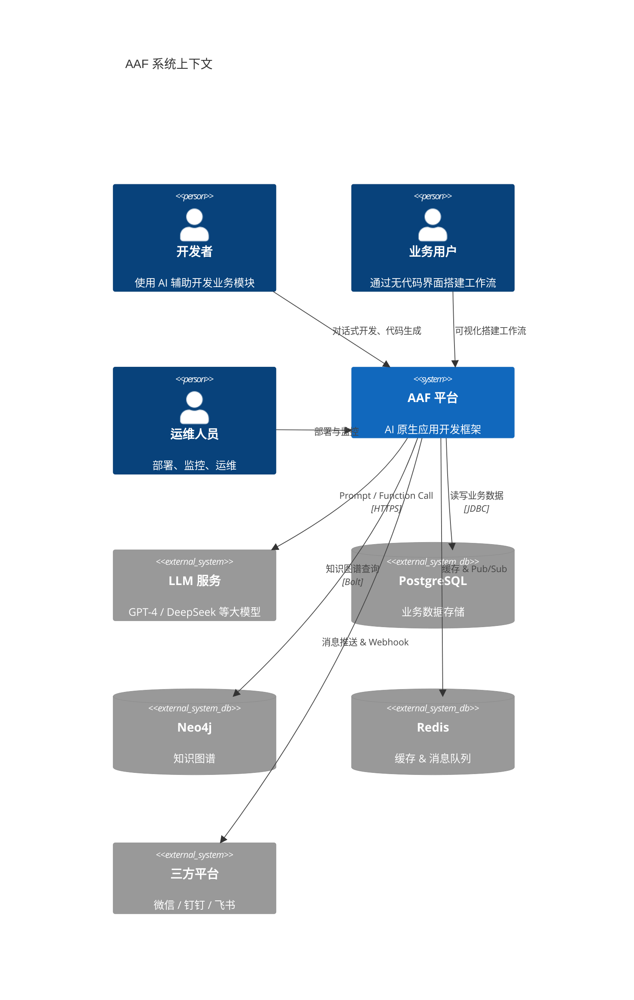
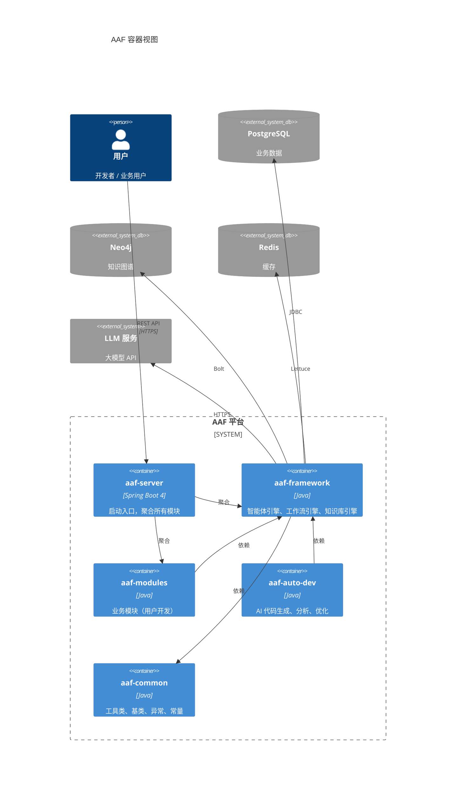
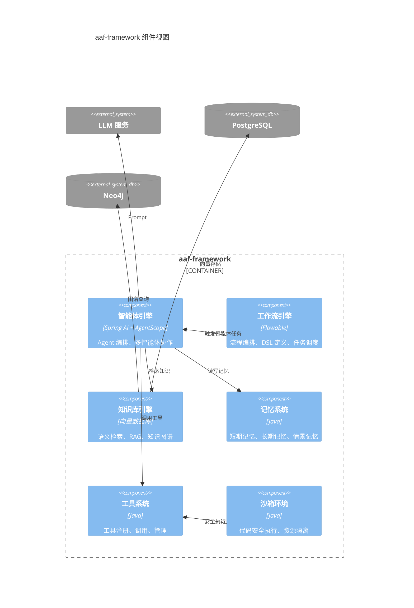
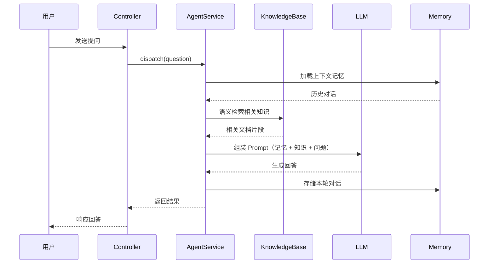
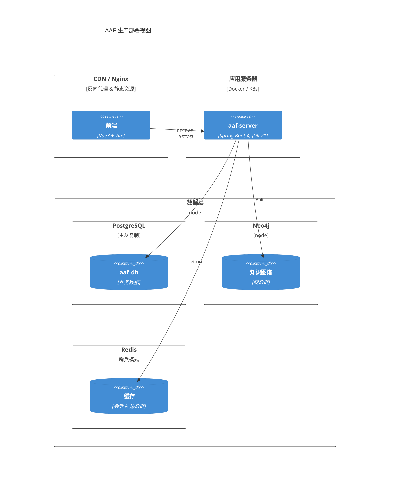
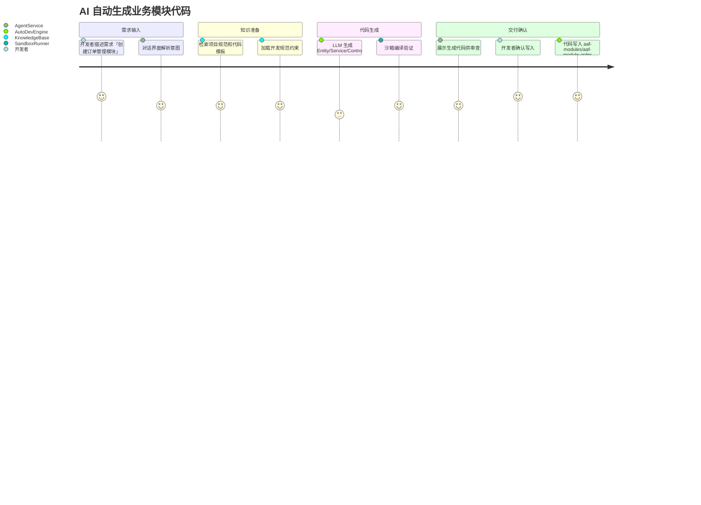

# AAF 架构设计方法论

架构设计要回答两个问题：

1. **怎么设计**（架构方法）→ DDD + Explicit Architecture（简化版）
2. **怎么表达**（架构视图）→ C4 + 4+1 视图模型

方法决定设计决策，视图决定表达方式。二者正交互补。

## 架构落地设计

> **文档是唯一真理**：代码是文档的实现结果，当代码与文档不一致时，以文档为准并修正代码。

**需求文档**（做什么）→ **设计文档**（怎么做）→ **需求规格**（做成什么样）→ **代码**（实现）

- 设计文档的输入是 [需求文档（用户故事）](../prd/Readme.md)，基于业务价值和验收标准进行架构决策
- 设计文档的输出是架构方案、技术选型和功能与交互设计，作为需求规格细化数据模型、接口、约束的依据
- 开发实现时，须同时遵循需求规格和 [开发规范](../reference/dev/development-standard.md)

设计文档存放在 `docs/design/` 目录下，需求文档中通过链接引用：

```markdown
### 相关设计

- [xxx 架构设计](../design/{module-name}/{design-doc}.md)
```

### 设计文档类型与职责

| 类型 | 负责人 | 何时写 | 触发条件 |
|------|--------|--------|---------|
| 迭代级架构设计 | architect | 准备阶段，Epic 审核前 | 首个迭代、新模块引入、重大技术选型；纯功能扩展迭代可跳过 |
| 系统/模块架构设计 | architect | 准备阶段，Epic 审核前 | 新模块、跨模块影响、重大技术选型 |
| 产品设计（功能流程） | product | 执行阶段 2.1，Story 拆分后 | 功能流程复杂、多步骤交互、用户旅程不明确 |
| UI/交互设计 | designer | 执行阶段 2.2 | 涉及前端界面的 Story |
| 技术方案设计（ADR） | architect | 执行阶段 2.1 | 每个 Story 的接口、类结构、模块交互 |

product 不写技术设计，只在需求文档中**链接**相关设计文档。

**单向引用原则**：需求文档是统一查询入口，设计文档不需要反向链接需求文档。创建任何设计文档后，必须在对应需求文档的"相关设计"章节添加链接（由文档创建者负责）。详见 [需求管理规范 — 与设计文档的关系](../reference/dev/requirement-standard.md#与设计文档的关系)。

### 存放路径规范

| 文档类型 | 命名模式 | 存放路径 |
|------|------|------|
| 架构概览（统一入口） | `architecture.md` | `docs/design/`（根目录） |
| 迭代级架构设计 | `v{version}-design.md` | `docs/design/`（根目录，跨模块） |
| 框架通用设计（跨端） | `{topic}.md` | `docs/design/framework/`（五层架构、元引擎、DSL、对话式交互等） |
| 后端技术选型 | `tech-stack.md` | `docs/design/service/` |
| 后端模块架构设计 | `{module}-architecture.md` | `docs/design/service/{module}/` |
| 前端技术选型 | `tech-stack.md` | `docs/design/webui/` |
| 前端模块设计 | `{feature}-design.md` | `docs/design/webui/{module}/` |
| 小程序/APP 技术选型 | `tech-stack.md` | `docs/design/uniapp/` |
| 产品设计（功能流程） | `{feature}-product-design.md` | `docs/design/service/{module}/` 或 `docs/design/webui/{module}/` |
| 技术方案（ADR） | `design.md` | `docs/task/{version}/{AAF-XXX}/`（任务目录内） |

## 架构方法：DDD + Explicit Architecture

### Explicit Architecture 是什么

[Explicit Architecture](https://herbertograca.com/2017/11/16/explicit-architecture-01-ddd-hexagonal-onion-clean-cqrs-how-i-put-it-all-together/) 由 Herberto Graca 提出，是三种经典架构思想的统一模型：

| 来源                                  | 核心思想              | 解决什么问题                               |
| ------------------------------------- | --------------------- | ------------------------------------------ |
| 六边形架构（Alistair Cockburn, 2005） | 端口与适配器          | 应用核心与外部世界解耦，外部依赖可替换     |
| 洋葱架构（Jeffrey Palermo, 2008）     | 同心圆分层 + 依赖倒置 | 内层不依赖外层，依赖方向始终向内           |
| DDD（Eric Evans, 2003）               | 领域模型驱动设计      | 用限界上下文划分业务边界，用聚合管理一致性 |

三者关系：

- 六边形架构只区分"内"和"外"，不关心内部怎么分层
- 洋葱架构把"内"细化为 Domain → Application → Infrastructure 多层
- DDD 提供领域层内部的建模方法（实体、值对象、聚合、领域事件等）
- Explicit Architecture = 六边形的内外隔离 + 洋葱的分层纪律 + DDD 的领域建模

### 整体结构：分层 + 组件

Explicit Architecture 是一种"分层约束依赖方向，组件约束业务边界"的二维架构：

```text
    分层（纵向）：控制依赖方向              组件（横向）：控制业务边界

    ┌─────────────────────────┐      ┌────────────┐ ┌────────────┐ ┌───────────┐
    │      Infrastructure     │      │  订单      │ │  支付       │ │  库存     │
    │  ┌───────────────────┐  │      │ domain/    │ │ domain/    │ │ domain/    │
    │  │     Application   │  │      │ app/       │ │ app/       │ │ app/       │
    │  │  ┌─────────────┐  │  │      │ controller/│ │ controller/│ │ controller/│
    │  │  │   Domain    │  │  │      └────────────┘ └────────────┘  └───────────┘
    │  │  └─────────────┘  │  │
    │  └───────────────────┘  │      每个组件内部都遵守同样的分层规则：
    └─────────────────────────┘      controller/ → application/ → domain/
    依赖方向：外层 → 内层              组件间通过端口/事件通信
```

各层职责：

| 层             | 职责                                                     | 依赖规则               |
| -------------- | -------------------------------------------------------- | ---------------------- |
| Domain         | 实体、值对象、聚合、仓储接口（端口）、领域服务、领域事件 | 零外部依赖             |
| Application    | 用例编排、事务管理、DTO 转换、调用领域服务               | 仅依赖 Domain          |
| Infrastructure | 仓储实现（适配器）、外部服务集成、框架配置               | 实现 Domain 定义的接口 |

Maven 多模块中的分层映射：

```text
project-root/
├── xxx-common/                      # 共享内核（工具类、基类、异常、常量）
├── xxx-framework/                   # 框架层（安全、缓存、MQ 等基础设施封装）
├── xxx-modules/                     # 业务模块（每个模块内部自含分层）
│   ├── xxx-module-order/
│   ├── xxx-module-payment/
│   └── xxx-module-stock/
└── xxx-server/                      # 启动入口（聚合模块、配置文件）
```

全局模块与业务模块的分层关系：

```text
┌───────────────────────────────────────────────────────────────┐
│  xxx-server（启动聚合）                                        │
│                                                               │
│  ┌─────────────────────────────────────────────────────────┐  │
│  │  xxx-modules（业务模块）                                 │  │
│  │                                                         │  │
│  │  ┌───────────────┐ ┌───────────────┐ ┌───────────────┐  │  │
│  │  │  controller/  │ │  controller/  │ │  controller/  │  │  │
│  │  │  application/ │ │  application/ │ │  application/ │  │  │
│  │  │  domain/      │ │  domain/      │ │  domain/      │  │  │
│  │  │  gateway/     │ │  gateway/     │ │  gateway/     │  │  │
│  │  │   order       │ │   payment     │ │   stock       │  │  │
│  │  └───────────────┘ └───────────────┘ └───────────────┘  │  │
│  └─────────────────────────────────────────────────────────┘  │
│                                                               │
│  ┌───────────────────────────┐ ┌───────────────────────────┐  │
│  │  xxx-framework            │ │  xxx-common               │  │
│  │  基础设施封装（安全|缓存MQ）│ │  共享内核（工具、基类、异常）│  │
│  └───────────────────────────┘ └───────────────────────────┘  │
└───────────────────────────────────────────────────────────────┘

依赖方向：
  xxx-server → xxx-modules → xxx-framework → xxx-common
  模块内部：  controller/ → application/ → domain/
```

> 小型项目可以不拆 Maven 子模块，用包结构代替模块边界，分层规则不变。

单个业务模块内部的包结构（以「订单」模块为例）：

```text
com.example.module.order/
│
├── domain/                          # 领域层（最内圈）
│   ├── model/
│   │   ├── Order.java               #   聚合根
│   │   ├── OrderItem.java           #   实体
│   │   └── Money.java               #   值对象
│   ├── repository/
│   │   └── OrderRepository.java     #   仓储（单存储，直接用，无需分离接口/实现）
│   ├── service/
│   │   └── OrderDomainService.java  #   领域服务（纯业务规则）
│   └── event/
│       └── OrderCreatedEvent.java   #   领域事件
│
├── application/                     # 应用层
│   ├── OrderAppService.java         #   应用服务（编排 domain，不含业务规则）
│   └── dto/
│       ├── OrderCreateDTO.java
│       └── OrderVO.java
│
├── controller/                      # 对外接口（REST + GraphQL 共存）
│   ├── OrderController.java         #   REST API
│   └── OrderGraphQL.java            #   GraphQL API
│
└── gateway/                         # 外部集成（调用外部 API）
    └── PaymentClient.java           #   封装支付平台 HTTP 调用
```

### 对外接口与外部集成

对应六边形架构的「端口与适配器」，本项目简化为两个方向：

```text
    对外接口（谁调我）                     外部集成（我调谁）
    ┌──────────────┐                      ┌──────────────┐
    │ REST API     │                      │ 数据库        │
    │ GraphQL      │──→ 应用核心 ──→       │ 外部 API      │
    │ WebSocket    │                      │ 消息队列      │
    │ MQ Consumer  │                      │ 文件存储      │
    └──────────────┘                      └──────────────┘
```

### DDD 核心概念速查

| 概念       | 说明                                     |
| ---------- | ---------------------------------------- |
| 限界上下文 | 一个领域模型的适用边界，对应一个模块     |
| 聚合       | 一组相关对象的一致性边界，通过聚合根访问 |
| 实体       | 有唯一标识、有生命周期的对象             |
| 值对象     | 无标识、不可变、通过属性相等判断的对象   |
| 仓储       | 聚合的持久化接口（出站端口）             |
| 领域服务   | 不属于任何实体的业务逻辑                 |
| 领域事件   | 领域中发生的有意义的事情，用于跨聚合通信 |
| 应用服务   | 编排领域对象完成用例，不包含业务规则     |

## 架构视图

参考4+1视图 + C4

- **C4** 擅长静态结构的层层分解（由外到内）
- **4+1** 擅长多角度描述（静态 + 动态 + 部署 + 场景）
- C4 缺进程视图和场景视图，4+1 正好补上

### 视图清单

| 视图      | 来源  | 关注点                                       |
| --------- | ----- | -------------------------------------------- |
| Context   | C4 L1 | 系统边界、外部用户和系统                     |
| Container | C4 L2 | 容器划分、技术选型、通信方式                 |
| Component | C4 L3 | 模块职责、模块间交互                         |
| Code      | C4 L4 | 类和接口级别（由代码承载，通常不单独写文档） |
| 进程视图  | 4+1   | 运行时行为、并发、消息流                     |
| 部署视图  | 4+1   | 部署拓扑、节点分布                           |
| 场景视图  | 4+1   | 关键用例的端到端流程                         |

### 视图与架构方法的映射

```text
  C4 视图                    4+1 视图
┌──────────┐
│ Context  │ ←── 系统边界
└────┬─────┘
     ↓
┌──────────┐
│Container │ ←── 容器划分（洋葱的各层 + 基础设施）
└────┬─────┘
     ↓
┌──────────┐
│Component │ ←── 领域模块（DDD 限界上下文）
└──────────┘
    ┌──────────┐
    │ 进程视图  │ ←── 运行时协作（DDD 领域事件）
    └──────────┘
    ┌──────────┐
    │ 部署视图  │ ←── 物理部署（基础设施层的运行态）
    └──────────┘
    ┌──────────┐
    │ 场景视图  │ ←── 用例驱动（DDD 应用服务编排）
    └──────────┘
```

### 视图示例

#### 系统边界视图

回答"系统和谁交互"——画出 AAF 的外部用户、外部系统。



#### 容器视图

回答"系统由哪些可部署单元组成"——对应 Maven 模块和技术选型。



#### 组件视图

回答"某个容器内部有哪些模块"——以 aaf-framework 为例。



#### 进程视图

回答"运行时消息怎么流转"——以"用户提问 → 智能体回答"为例。



#### 部署视图

回答"软件跑在哪些节点上"。



#### 场景视图

场景视图关注用户视角的阶段体验，用 journey 图表达。回答"关键用例端到端怎么走"——以"AI 自动生成业务模块代码"为例。



## 设计文档

- AAF 具体架构设计 [architecture.md](architecture.md)
- 需求管理 [spec/README.md](../prd/Readme.md)
- 开发规范 [development-standard.md](../reference/dev/development-standard.md)
