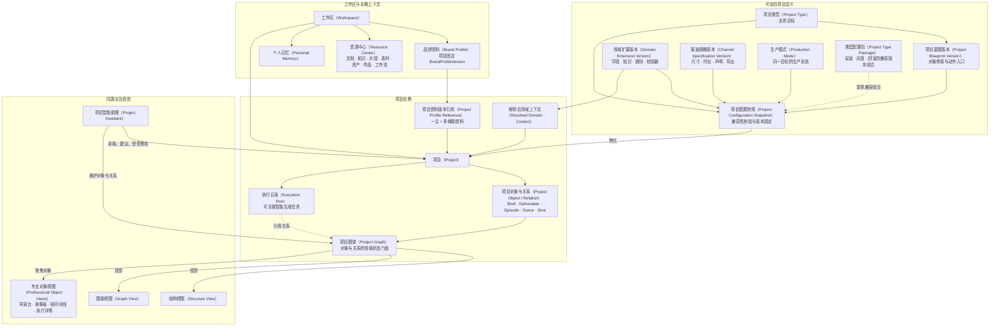
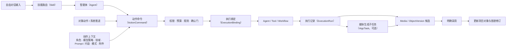
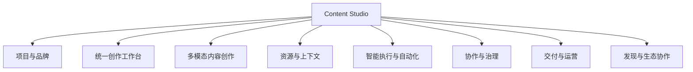
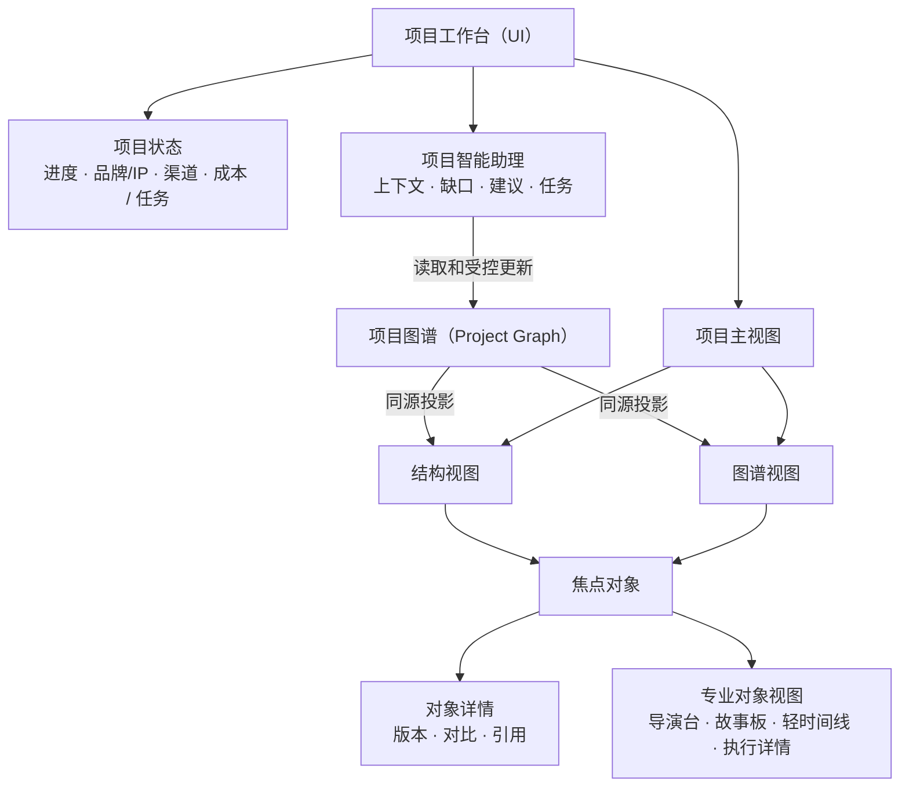
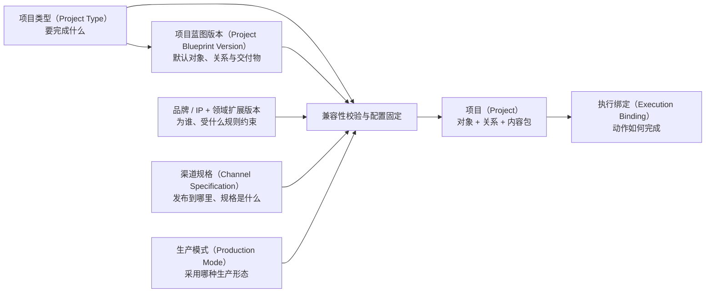
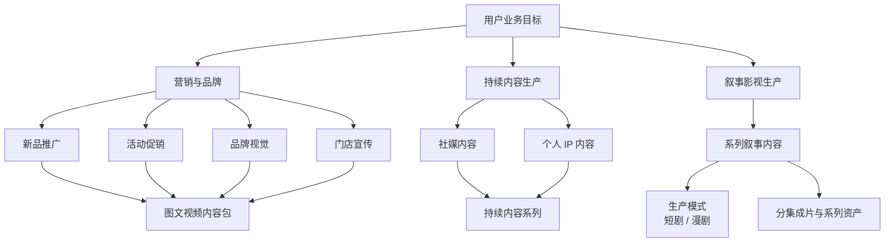

# Content Studio 能力与概念地图

> 本文是 Content Studio 的目标态产品导航地图，回答“有哪些核心概念、完整产品包含哪些功能、产品入口如何组织、不同场景如何落到同一套项目内核”。
>
> **命名契约**：Content Studio 是面向用户的产品与创作工作台名称，不是独立后端业务模块。内容生产相关能力在工程上只归属 **AIGC** 领域；不得新建或保留平行的 `content` 领域、项目体系或 API。本文正文优先使用用户语义，代码、包与接口统一采用 `Aigc*` 命名。

核心概念地图 → 产品功能地图 → 信息架构图 → 业务场景地图

## 核心概念地图

### 产品概念与代码命名

| 用户语义 | 代码命名 | 边界 |
|---|---|---|
| 项目 `Project` | `AigcProject` | 一次内容目标的聚合根和生命周期载体 |
| 项目图谱 `ProjectGraph` | `AigcProjectObject` + 关系能力 | 项目对象与关系的领域门面；不建立第二份图节点状态 |
| 素材 `Media` | `AigcMedia` | 上传或生成的持久媒体身份，可有不可变文件版本 |
| 资产 `Asset` | `AigcAsset` | 用户确认可跨项目复用后的媒体登记，不复制文件 |
| 作品 `Work` | `AigcWork` | 对已采用并经审核的项目成果的收录，不复制媒体或正文 |

`ProjectGraph` 是用户可理解的产品概念；工程中由 `AigcProjectObject` 及其语义关系共同承载，不要求存在同名持久实体。产品文案、需求和验收仍使用 Project、ProjectGraph、Media、Asset、Work，避免将工程前缀暴露给普通用户。

### AIGC 核心领域与专业能力边界

AIGC 是唯一工程领域，业务内核按八个稳定职责拆分为核心领域子模块，不按产品页面或媒体模态复制：

- `configuration`：项目类型、蓝图、领域扩展、渠道规格、配置包与片段；发布版本不可原地改写。
- `brand`：品牌/IP 资料、不可变版本及媒体/文档引用。
- `project`：唯一项目聚合、项目对象、语义关系、候选采用、审核与图谱修订。
- `media`：上传/生成素材、不可变媒体版本，以及可复用 Asset 的登记、分类、标签与集合。
- `execution`：ActionCommand、ExecutionBinding、ExecutionRun、执行路由、重试取消与候选协调。
- `work`：审核成果的 Work 收录、Publication 与发布结果。
- `timeline`：时间线组合、轨道、片段与故事板导出。
- `task`：媒体生成、处理、转码与合成子任务及供应商终态同步。

`asset` 不构成第九个核心领域子模块；`AigcAsset` 归 `media` 所有。`image`、`video`、`voice`、`model3d`、`copywriting` 等按专业模态封装模型、工具和供应商接入，是服务八个核心领域的能力适配器，不拥有平行的项目、媒体、执行、作品或文件业务内核。

本文只说明产品概念归属。包结构、接口、数据表、配置版本映射、BaseCrud 管理根与聚合内部记录边界均以 [Content Studio 技术设计](./content-studio-tech.md) 为唯一工程真理源，本文不复制其技术清单。

### 业务对象总览



核心关系：

- 用户先选项目类型，系统从类型配置包提供的兼容组合中选择蓝图、领域扩展、渠道规格和生产模式版本，校验后固化项目配置快照并物化项目。
- 类型配置包是安装、灰度和回滚清单，不保存项目状态；项目配置快照才是单个项目采用版本的不可变记录。
- 项目通过项目资料引用固定一个主 BrandProfileVersion 和零到多个辅助资料版本，不嵌套在某个品牌资料下。
- 领域扩展版本是定义来源，解析后领域上下文是它与品牌、类型、渠道和项目事实组合后的运行时结果；升级不能静默修改既有项目。
- 项目图谱是项目对象与关系的领域状态门面；结构、图谱和专业对象视图投影同一状态，不建立第二真理源。
- React Flow 只是图谱渲染引擎；节点和连线数组不是业务数据源。
- 项目智能助理位于项目内，通过确定性权限、预算、规则与确认门发起动作，不替代业务对象。

### 项目端到端生命周期

```mermaid
flowchart LR
    START["项目类型 / 品牌 / Brief"] --> BLUEPRINT["蓝图物化<br/>Project Configuration Snapshot"]
    BLUEPRINT --> GRAPH["项目图谱<br/>AigcProjectObject + Relation"]
    GRAPH --> CMD["动作命令<br/>ActionCommand"]
    CMD --> RUN["执行记录<br/>ExecutionRun"]
    RUN -.-> TASK["媒体生成子任务<br/>AigcTask（可选）"]
    RUN --> CANDIDATE["候选产物<br/>Media / ObjectVersion"]
    TASK --> CANDIDATE
    CANDIDATE --> ADOPT["明确采用"]
    ADOPT --> REVIEW["质检 / 审核"]
    REVIEW --> WORK["作品收录<br/>AigcWork"]
    WORK -.->|可选| PUBLICATION["渠道发布<br/>Publication 0..N"]
    WORK -->|明确无需发布 / 仅收录| DONE["项目完成"]
    PUBLICATION -->|发布成功| DONE
    DONE --> ARCHIVED["完成后归档"]
    GRAPH -.->|创作中放弃| ARCHIVED
```



生命周期规则：

- 创建入口收集项目类型、品牌/IP 版本和 Brief；系统选择兼容蓝图并物化 `AigcProject`、配置快照和初始 `AigcProjectObject` 图谱。
- 用户、Assistant 或系统推进均以 `ActionCommand` 表达确定动作，并先经过权限、预算、规则与确认门。
- 每次动作统一产生 `ExecutionRun`；仅涉及图像、视频、音频、3D、转码或合成时，才关联一个或多个可选 `AigcTask`。
- 输出先成为 `Media` 或对象版本候选，生成成功不等于采用，更不等于资产或作品。
- “采用”只移动项目对象的采用指针；随后按蓝图进入质检、人工/规则审核和交付完成判断。
- 通过审核且计入成功交付的成果必须收录为 `Work`；随后可形成零到多个 `Publication`。无需外部发布的成果在收录 Work 后也可完成。
- 成功完成要求至少一个 Work 且交付契约满足；创作中放弃的项目可直接归档，但不得标记为完成。
- 项目完成后保持可追溯；归档只改变活跃状态，不删除图谱、执行记录、作品引用或底层文件。

### 创作上下文与执行链



核心边界：

- Skill 只处理自由输入的意图路由；对象动作直接产生 ActionCommand。
- ExecutionBinding 根据动作和项目上下文选择 Agent、Tool 或 Workflow；Agent 可按需通过 WorkflowTool 调用工作流。
- 所有执行统一形成 ExecutionRun，AigcTask 只承载媒体生成子任务。
- 执行输出先成为 Media 或 ObjectVersion 候选，明确采用后才更新项目状态；资产登记、作品收录与发布属于采用后的不同业务动作。

### 易混淆概念边界

| 概念 | 核心职责 | 不是什么 |
|---|---|---|
| 项目类型（Project Type） | 表达用户要完成的业务目标，限定可用蓝图 | 行业分类、渠道、生产模式、技能或工作流 |
| 项目蓝图版本（Project Blueprint Version） | 创建默认对象槽位、关系、交付物、动作和检查点 | 用户编辑模板、行业规则全集、执行节点图 |
| 领域扩展版本（Domain Extension Version） | 版本化声明领域对象、知识要求、规则、校验器与动作约束 | 客户事实、项目类型、运行时上下文 |
| 解析后领域上下文（Resolved Domain Context） | 将领域扩展、品牌资料、类型、渠道与项目事实解析为当前约束 | 领域定义的第二份副本、跨项目隐式记忆 |
| 生产模式（Production Mode） | 表达同一业务目标下的生产形态，选择兼容蓝图和执行策略 | 新项目类型、独立工作台 |
| 类型配置包（Project Type Package） | 发布兼容的类型、蓝图、领域、渠道、模式，以及由 execution 提供的执行绑定版本组合 | 项目实例、领域真理源 |
| 项目配置快照（Project Configuration Snapshot） | 固定单个项目实际采用的配置版本与兼容性结果 | 可随最新配置自动漂移的引用 |
| 项目（Project） | 承载一次业务目标的长期创作与交付状态 | 单次生成任务、营销活动专用对象 |
| 项目图谱（Project Graph） | 作为项目对象和领域关系的服务端状态门面 | React Flow 节点/连线、纯工作流图、第二对象存储 |
| 结构视图 / 图谱视图（Structure View / Graph View） | 同一项目图谱的两种项目级投影 | 两份独立数据、两个独立工作台 |
| 导演台 / 故事板 / 轻时间线 / 执行详情 | Scene、Shot、VideoDeliverable 等特定对象的创作、编辑或诊断视图 | 与结构、图谱并列的项目级主视图、独立状态源 |
| 故事板视图（Storyboard View） | 投影 Shot、ShotKeyframe、资产引用、顺序与采用版本 | 与 Shot 并列的持久业务对象 |
| 镜头关键帧（ShotKeyframe） | 以 START、END 或 ANCHOR 角色引用 Shot 的不可变 MediaVersion | 任意参考图、时间线片段 |
| 项目智能助理（Project Assistant） | 在项目内补齐信息、维护图谱、发起任务与解释结果 | 项目状态真理源、首页自由对话入口 |
| AI 角色配置（Role Profile） | AI 的专业视角和行为约束 | 人类创作者或服务商 |
| 技能定义（Skill Definition） | 将自由输入的意图路由给适合的 Agent | 每个对象动作的必经层、项目类型、完整执行流程 |
| 执行绑定（Execution Binding） | 归 `execution` 核心领域，将 ActionCommand 解析到 Agent、Tool 或 Workflow | 项目骨架、领域状态 |
| 执行记录（Execution Run） | 统一记录执行目标、状态、成本、重试、输入输出与采用结果 | 仅媒体生成任务 |
| 智能生成任务（AigcTask） | 承载图像、视频、音频、3D、转码与合成等媒体子任务 | 所有 Tool、Agent 和 Workflow 执行的上位概念 |
| 工作流定义版本（Workflow Definition Version） | 编排节点、变量、分支、确认点和重试 | 普通用户的默认项目画布 |
| 素材（Media / `AigcMedia`） | 表达上传或生成媒体的持久身份、来源与版本集合 | 可复用资产、最终作品、物理文件记录 |
| 资产（Asset / `AigcAsset`） | 对用户确认可跨项目复用的 Media 做资产库登记 | 新媒体副本、已采用或发布的最终作品 |
| 交付物（Deliverable） | 项目内需要比较、采用、审核和完成的内容对象 | 媒体文件、资产库分类、作品库登记 |
| 作品（Work / `AigcWork`） | 收录已采用并经审核的交付成果，引用对象版本与媒体 | 媒体或正文副本、上传即自动产生的记录 |
| 发布（Publication） | 记录 Work 在具体渠道的计划、结果和外部标识 | Work 本体、项目完成状态的唯一依据 |
| 物理文件（`sys_file`） | 登记存储 key、哈希、大小、存储状态与物理删除生命周期 | Media、Asset、Work 或业务语义；不由产品页面直接管理 |
| 文档 / 知识 / 记忆（Document / Knowledge / Memory） | 分别保存正文、可检索索引、经确认经验与项目决策 | 可互相替代的一份“上下文库” |
| 人才 / AI 角色配置（Talent / Role Profile） | 人才是人类创作者或服务商；AI 角色配置是智能体行为设定 | 同一人才库中的两类账号 |

## 产品功能地图

产品功能按用户完成内容业务所需的稳定功能域组织，不与版本计划或建设顺序绑定。



### 功能域说明

| 功能域 | 用户价值 | 核心对象或能力 |
|---|---|---|
| 项目与品牌 | 从业务目标建立可持续演进的创作项目 | 项目类型、项目蓝图、项目、品牌资料、创作简报、创意概念、交付物集合 |
| 统一创作工作台 | 在同一项目状态上组织、查看和编辑复杂内容 | 项目图谱、结构视图、图谱视图、导演台、故事板、对象级视图、项目智能助理 |
| 多模态内容创作 | 完成文案、图像、视频和音频的生成与编辑 | 执行记录、Media 候选、可复用 Asset、镜头、镜头关键帧、镜头媒体版本、时间线合成、规格变体 |
| 资源与上下文 | 复用可信资料、经验、素材和创作方法 | 文档、知识、记忆、片段、资产、作品、AI 角色、技能、工作流 |
| 智能执行与自动化 | 将项目动作稳定路由到模型、工具和工作流 | ActionCommand、执行绑定、执行记录、智能体、模型、工具、检查点、重试、诊断 |
| 协作与治理 | 支持个人、团队和企业安全协同生产内容 | 成员、角色、权限、评论、评审、审批、质检、审计、合规 |
| 交付与运营 | 管理从内容采用到交付、成本与追踪的闭环 | 内容包、渠道规格、导出、预算、成本、积分、来源、版权、影响追踪 |
| 发现与生态协作 | 发现并复用创意、方法和专业服务 | 灵感、作品、重混、制作过程、人才、服务协作 |

## 信息架构图

### 全局产品信息架构

```mermaid
flowchart TB
    APP["Content Studio"]

    APP --> HOME["首页"]
    APP --> PROJECTS["项目"]
    APP --> PROFILES["品牌 / IP"]
    APP --> RESOURCES["资源中心"]
    APP --> DISCOVER["发现与协作"]
    APP --> SETTINGS["设置与支持"]

    HOME --> H1["选择项目类型"]
    HOME --> H2["最近项目"]
    HOME --> H3["不确定类型<br/>智能助理推荐后确认"]

    PROJECTS --> P1["全部项目"]
    PROJECTS --> P2["新建项目"]
    PROJECTS --> P3["项目工作台"]

    PROFILES --> B1["品牌资料（Brand Profile）"]
    PROFILES --> B2["品牌规则 / 核准事实"]
    PROFILES --> B3["Logo / 产品 / 角色 / 音色资产"]

    RESOURCES --> R1["文档库 / 知识库"]
    RESOURCES --> R2["资产库 / 作品库"]
    RESOURCES --> R3["片段库 / AI 角色库"]
    RESOURCES --> R4["工作流库<br/>专家 / 内部"]

    DISCOVER --> D1["灵感广场"]
    DISCOVER --> D2["制作过程 / 项目重混（Remix）"]
    DISCOVER --> D3["人才与服务"]

    SETTINGS --> S1["偏好"]
    SETTINGS --> S2["积分 / 成本 / 预算"]
    SETTINGS --> S3["安全 / 隐私 / 权限"]
    SETTINGS --> S4["教程 / 帮助"]
```



### 项目工作台信息架构



工作台只保留“结构”和“图谱”两个项目级主视图；专业视图按焦点对象打开：导演台聚焦 Scene/Shot，故事板聚焦镜头与画面，轻时间线聚焦 VideoDeliverable/Episode，执行详情聚焦相关 ExecutionRun。切换主视图时保留焦点、筛选、展开状态和视口。

### 视图层级

| 层级 | 展示内容 | 主要操作 |
|---|---|---|
| L0 项目总览 | 项目主脉络和领域组 | 品牌/IP、创作简报、创意、内容包、审核 |
| L1 领域对象 | 主要交付物与当前状态 | 主视觉、图文、视频、文案、渠道变体 |
| L2 产物结构 | 单个交付物的组成 | 脚本、分集/场次、镜头、素材、字幕、音频 |
| L3 详细对象 | 可直接编辑的细节与局部关系 | 镜头关键帧、素材引用、候选版本、时间线片段 |
| 专家执行层 | 执行节点、参数和数据依赖 | 工作流、模型调用、重试、检查点 |

显式展开/折叠控制对象层级，语义缩放只调整信息密度，不能自动改变业务拓扑。

## 业务场景地图

### 场景组合模型

Content Studio 不为每个行业或内容形态复制一套产品。一个实际项目由稳定内核和六个可组合维度形成：



例如“餐饮新品推广”和“美妆新品推广”共享“新品推广”项目类型和基础蓝图，但加载不同品牌资料、领域规则、禁用项、资产和质量标准；短剧与漫剧共享“系列叙事内容”项目类型和 Episode/Scene/Shot 层级，通过生产模式、兼容蓝图、资产形态和执行绑定区分。模型、技能和工作流只影响动作执行，不创建新的项目类型。

### 项目类型地图



| 项目类型 | 核心输入 | 默认领域对象 | 典型交付物 |
|---|---|---|---|
| 新品推广 | 产品、卖点、证据、价格、受众、渠道 | 创作简报、产品/卖点、创意方向 | 标题与正文、主视觉/海报、社媒图、短视频草案 |
| 活动促销 | 时间、优惠、门店/渠道、目标人群、限制 | 创作简报、活动信息、优惠、创意方向 | 促销文案、海报、渠道尺寸、短视频草案 |
| 社媒内容 | 主题、受众、平台、行动号召、发布节奏 | 主题、内容支柱、创意方向 | 帖子正文、封面/配图、口播或短视频草案 |
| 品牌视觉 | 品牌规则、保留项、视觉目标、应用场景 | 品牌资料、视觉方向、关键视觉 | 情绪板、主视觉、海报、尺寸变体 |
| 门店宣传 | 门店、主推产品/服务、位置、到店理由 | 门店信息、卖点、活动/渠道 | 门店海报、社媒图文、导航信息、短视频 |
| 个人 IP 内容 | 人设、观点/故事、内容支柱、平台 | IP 资料、选题、脚本、内容系列 | 图文、封面、口播稿、短视频 |
| 系列叙事内容 | 小说、故事梗概或剧本，题材、生产模式、画风、集数、单集时长、渠道 | 世界观、角色、场景、道具、分集、场次、镜头、镜头关键帧、镜头媒体版本、时间线合成 | 结构化剧本、镜头描述稿、角色/场景资产、故事板导出快照、逐镜视频、配音字幕、分集成片 |

AI 博客是对象扩展样例，不是独立模块：可由“社媒内容”或后续“长文内容”项目类型的蓝图物化 `objectType = blog_content` 的 `AigcProjectObject`。标题、摘要、正文引用、封面 Media、审核和渠道变体都沿用统一项目生命周期；长正文的权威内容可由 DocumentVersion 承载，`blog_content` 保存业务结构与引用。采用后可收录为 `AigcWork` 并形成 Publication，不新建 `content` 项目、资产或文件体系。

项目类型决定可用蓝图和默认交付结构，但不是固定模板。创建后的项目图谱可独立演进；蓝图与领域扩展升级只能通过差异预览和受控迁移进入已有项目。系列叙事内容是目标态扩展类型，短剧与漫剧只是两个生产模式和快捷入口，其实际可用阶段以产品设计为准。

### 代表性端到端场景

#### 中小企业新品推广

```text
选择“新品推广”
→ 绑定品牌/IP并上传产品资料
→ 项目蓝图建立创作简报、卖点、创意和内容包骨架
→ 项目智能助理补齐缺口并给出两个创意方向
→ 采用方向，生成文案、主视觉、社媒图和短视频草案
→ 对对象级内容修改、比较和采用版本
→ 质检并导出内容包
```

#### 品牌服务团队多客户交付

```text
进入客户工作区
→ 项目显式绑定客户主品牌资料与辅助产品资料
→ 在结构/图谱视图管理创意、资产引用和尺寸变体
→ 通过版本、评论、审核和影响提示处理修改
→ 采用并审核的结果进入作品库；媒体版本引用 `sys_file`，资产库只登记可跨项目复用的 Media
```

不同客户资料必须按工作区与项目绑定隔离，项目智能助理不得隐式读取其他客户的知识、记忆或资产。

#### OPC 持续社媒创作

```text
选择“社媒内容”或复制既有项目
→ 载入个人 IP、内容支柱、个人偏好和已确认经验
→ 生成选题、图文、封面和口播/短视频草案
→ 按平台生成规格变体
→ 采用并归档作品，将明确反馈沉淀到个人或项目记忆
```

复制项目可以复用稳定骨架，但项目记忆是否带入必须由用户确认。

#### 系列叙事内容生产

系列叙事内容共享“项目 → 分集（Episode）→ 场次（Scene）→ 镜头（Shot）→ 镜头关键帧（ShotKeyframe）”层级。短剧与漫剧是 `SHORT_DRAMA`、`MOTION_COMIC` 两种生产模式。参考 [WorkRally](./content-studio-competitor-analysis.md#workrally) 的批量生产结构和 [LibTV](./content-studio-competitor-analysis.md#libtv) 的镜头确认、资产准备与导演级动作，目标态生产流程为：


流程边界：

- “短剧”“漫剧”是快捷入口，创建同一系列叙事内容项目并固定 productionMode。
- 故事板先规划镜头与占位，关键帧生成后再回到故事板比较和采用；逐镜结果形成 ShotMediaVersion。
- 导演台写回 Scene/Shot，轻时间线编辑 TimelineComposition，执行详情管理 ExecutionRun；均不建立第二套状态。

### 视频生产对象与专业视图

系列叙事内容是验证项目图谱、多对象视图和内部工作流分层的复杂视频样板，但不等于建立独立于 Content Studio 的视频产品。

| 关注点 | 对应视图或能力 |
|---|---|
| 剧本、分集、场次、镜头与镜头表 | 结构视图 |
| 对象归属、素材引用、镜头顺序和影响关系 | 项目图谱 |
| 角色、场景、道具、音色资产与 ShotKeyframe 版本 | 结构视图 + 对象详情 |
| Scene/Shot 的调度、构图、景别、运镜、光影与提示计划 | 导演台 |
| 镜头画面、叙事顺序、资产引用和采用版本 | 故事板视图 / 镜头表双投影 |
| TimelineClip、字幕、配音、音乐和转场的时间关系 | 轻时间线 |
| 模型调用、批量生成、转码、合成、重试和检查点 | 内部工作流 / 执行详情（执行依赖仅专家层） |
| 角色、场景、画风、动作和音色连续性 | 领域上下文 + 资产引用 + Validator / RuleSet |

### 领域扩展地图

领域扩展版本可以增加领域对象与字段、知识要求、规则、校验器、角色建议、动作约束、命名空间化渠道覆盖、评估样例和迁移声明，但不能复制或取代通用 ChannelSpecificationVersion，也不分叉 Project、ProjectGraph、Assistant、任务、资产、版本或工作台。项目固定采用的扩展版本，并将其与品牌资料、项目类型、渠道和项目事实解析为当前领域上下文；升级必须差异预览和受控迁移。

| 领域扩展版本 / 解析后领域上下文 | 典型对象与规则 | 常用项目类型 |
|---|---|---|
| 品牌与营销 | 品牌定位、受众、语气、视觉规范、声明、禁用项 | 新品推广、活动促销、品牌视觉、门店宣传 |
| 电商广告 | SPU/SKU、卖点证据、价格优惠、平台规格、广告合规 | 新品推广、活动促销、社媒内容 |
| 企业宣传 | 解决方案、案例、数据来源、对外口径、保密和多角色审核 | 品牌视觉、社媒内容；只有交付结构显著不同时才新增 ProjectType |
| 影视叙事 | 世界观、角色、场景、Episode/Scene/Shot、连续性、音画同步 | 系列叙事内容（短剧 / 漫剧 productionMode） |
| 内容与 OPC | 人设、内容支柱、选题、开场钩子（Hook）、发布节奏、多平台改写 | 社媒内容、个人 IP 内容 |

单点素材探索、补镜头、九宫格、截图和格式转换属于项目对象动作或工具（Tool），不应膨胀为独立项目类型。

## 文档关系与维护规则

- [Content Studio 产品设计](./content-studio-design.md)：产品决策、对象规则、端到端生命周期、交互、范围和验收的唯一真理源。
- [Content Studio 技术设计](./content-studio-tech.md)：AIGC 唯一工程领域的包、接口、数据与迁移结果；本文不复制其技术表细节。
- [Content Studio 竞品分析](./content-studio-competitor-analysis.md)：竞品事实、证据和可借鉴模式。
- [用户工作室 MVP](../webui/user-studio-mvp.md)：现有 WebUI Studio 的实现设计。
- [Flow Editor](../webui/flow-editor.md)：内部工作流编辑与执行能力，不等同于项目图谱。

当产品设计发生变化时，本地图只同步目标态概念关系、完整功能结构、入口层级和场景归类，不复制分期与详细规则；当前阶段能力、范围和验收始终以产品设计为准。新增场景优先回答五个问题：

1. 它是否是新的用户业务目标，值得成为项目类型（Project Type）？
2. 它是否只是已有项目类型的新蓝图、生产模式、领域扩展或渠道规格？
3. 它是否只是对象级专业视图或 ActionCommand？
4. 它应由技能路由、工具、智能体还是工作流执行？
5. 它能否复用项目、项目图谱、项目智能助理、执行记录、任务、资产和版本内核？
