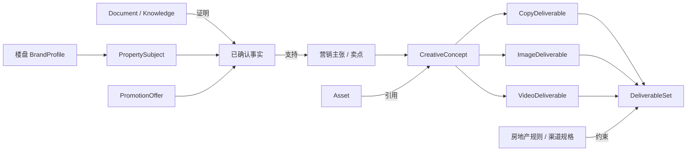

# Content Studio 产品设计

> **一句话定位**：面向中小企业、品牌服务团队与 OPC 的基于 Agent 的多场景营销内容生产平台；用户以业务项目为载体，将品牌资料与创作目标转化为可编辑、可审核、可复用、可多渠道交付的图文、视频与系列叙事内容。

## 设计结论

### 核心决策

| 议题 | 决策 | 原因 |
|---|---|---|
| 产品入口 | **项目类型优先**，而非首页自由对话优先 | 目标用户知道业务目标但不擅写 Prompt；类型可立即装载稳定项目骨架 |
| 对话位置 | 创建项目后，Assistant 在项目内补充、修改与推进 | 避免 Agent 从零猜意图，也不让项目状态只存在聊天记录中 |
| 场景组合 | 业务目标选 `ProjectType`；蓝图、领域扩展、渠道、生产模式与执行绑定按职责组合 | 避免按行业 × 渠道 × 模型复制项目类型或工作台 |
| 稳定内核 | 所有场景共享 **Project、ProjectGraph、对象关系、资产引用、版本、审核与执行记录** | 营销、持续内容和系列叙事只有对象结构与执行策略不同，不应分叉产品内核 |
| 默认工作台 | **项目图谱 + 结构视图**，共享同一份项目数据 | 图谱适合看关系和影响，结构适合确认、批量编辑和阶段推进 |
| 专业视图 | 导演台、故事板、轻时间线和执行详情按焦点对象打开 | 专业能力服务 Scene、Shot、Video 等对象，不争夺项目级主界面 |
| 图谱性质 | 领域概念图谱，不是默认工作流图 | 用户应看到对象、约束、内容、素材与影响关系，而非模型调用节点 |
| 工作流定位 | 内部执行机制；仅在专家层显示数据依赖和编排 | 复用 LibTV 的控制力，但不把节点复杂度转嫁给普通用户 |
| 核心对象 | 统一使用 **Project**；营销活动和系列叙事只是不同 `ProjectType` | 平台覆盖品牌营销、持续内容和叙事生产，不能被单一场景限制 |

### 为什么不采用首页对话优先

Flova、LibTV、Miora 的首页虽然展示 Skill、领域和案例，但居中大输入框仍是主 CTA；用户需要先写 Prompt，再由 Agent 理解需求、创建项目。这适合通用创作探索，但会把三个负担交给营销新手：组织需求、选择信息重点、判断 Agent 是否理解正确。

当前产品的目标用户通常有明确业务目的，例如新品推广、持续社媒运营或系列内容生产，却不一定知道应产出什么内容、如何组织 Prompt。因此主路径改为：

```text
选择“我要完成的内容任务”
  → 补充一句业务说明和素材
    → 立即建立项目骨架
      → 在项目内由 Assistant 补齐、生成、修改和推进
```

自由对话保留为低权重兜底入口“我不确定要做什么，让助手帮我选择”，而不是首页主路径。

## 用户、边界与价值

### 目标用户

| 用户 | 高频任务 | 主要障碍 | 本方案如何降低门槛 |
|---|---|---|---|
| 中小企业经营者 | 新品、促销、门店和社媒宣传 | 没有专业策划与设计人员 | 用项目类型直接给出内容包骨架与默认渠道规格 |
| 品牌服务团队 | 多客户、多版本、多渠道内容策划与交付 | 资料与资产分散、修改影响难追踪 | 品牌/IP 资料、项目图谱、版本、协作与审核统一管理 |
| OPC / 个人 IP | 持续选题、图文、口播与短视频 | 人设一致性和低成本高频生产 | 个人 IP 资料、项目复制和跨渠道内容包 |

三类用户共享“目标 → 创意 → 内容包 → 修改 → 审核/导出”的主线；企业级权限、审批和审计以能力开关叠加，不建立第二套创作系统。

### 产品边界

Content Studio 交付的是围绕一个业务目标的一组可编辑内容，不是单点模型工具，也不是专业剪辑软件。

```text
用户目标
  → 项目
    → 创意或叙事结构
      → 内容包（图片 + 视频 + 文案 + 系列内容）
        → 版本、审核与导出
```

完整产品支持营销宣传、持续内容和系列叙事等场景，但所有场景必须复用 Project、ProjectGraph、Assistant、任务、资产、版本和审核内核。差异只能通过项目类型、项目蓝图、领域扩展、渠道规格、生产模式和执行绑定组合表达，不为单一行业或内容形态复制工作台。

首期不做真正无限画布、完整专业 NLE、3D/UI 设计、开放模型/方法市场、实时多人创作和自动投放。用户可在项目中复制、Remix 或分支已有成果；不把“模板”或“配方”建设为独立的新手对象。

## 产品能力体系

### 统一创作上下文

项目创建后，Assistant 的每次创作请求由一组可组合上下文共同决定。用户只需输入目标，系统默认自动解析；高级用户可以在兼容和授权范围内固定角色、模型或技能。

| 组成 | 产品职责 | 默认策略 | 用户控制 |
|---|---|---|---|
| Assistant | 统一面向用户，维护项目上下文、任务与结果解释 | 每个项目一个主 Assistant | 不切换多 Agent，只切换其当前任务角色 |
| 角色 `RoleProfile` | 提供策划、导演、文案、视觉、合规等专业视角与行为约束 | 按项目阶段和动作自动选择 | 可指定允许的角色；不等同于人类人才 |
| 模型策略 / 模型 `ModelPolicy / ModelVersion` | 策略约束候选模型与质量、成本、权限路由；模型版本执行具体任务 | 默认按 ModelPolicy 路由 | 高级设置可固定兼容范围；ExecutionRun 同时记录 policyVersion 与 selectedModelVersion |
| 解析后领域上下文 `ResolvedDomainContext` | 提供当前项目适用的行业术语、字段、规则和质量标准 | 由 DomainExtensionVersion、品牌/IP、项目类型、渠道和项目事实解析 | 可受控刷新；不逐次重复选择领域定义 |
| 技能 `Skill` | 将自由输入的意图路由到任务能力与 Agent | 依据用户意图、焦点对象和允许动作匹配，并产生或建议 `actionKey` | 高级用户可固定允许的 Skill；对象按钮已有 actionKey，不重复经过 Skill |
| 提示词 `Prompt` | 表达本次目标、修改或例外要求 | 结合当前焦点对象自动补上下文 | 用户可输入、编辑、优化和保存为片段 |
| 片段库 `SnippetLibrary` | 保存可复用的文本 + 参考图 + 变量槽位组合 | 按项目类型、品牌和当前对象推荐 | 可插入输入框或拖到图谱对象；不是项目模板/Workflow |
| 生成模式 `GenerationMode` | 控制系统自动推进的范围 | 默认手动确认高成本与高影响动作 | 手动 / 自动；自动仍受预算、合规和强制确认点约束 |
| 附件 `Attachment` | 为请求提供文档、图片、视频、音频和其他文件 | 自动识别为文档、资产或临时参考 | 支持全部允许类型；上传后进入统一解析与安全检查 |
| 工具 `Tool` | 执行确定性辅助动作 | Assistant 按需调用 | 用户可直接调用提示词优化、截图、九宫格、格式转换、合规检查等 |

项目工作台输入区可以用可折叠 chips 表达当前上下文，而不是让用户填写复杂表单：

```text
[角色：自动] [领域：餐饮] [技能：自动] [模型：自动] [模式：手动]

描述要生成或修改的内容……
[片段库] [附件] [工具]                                      [执行]
```

项目类型优先原则不变：这些选项出现在项目内，用于执行和修改已有项目，不退回为首页开放对话主入口。系统必须在 ExecutionRun 中保存最终采用的角色、领域上下文、执行绑定、Agent/Tool/Workflow、模型、Prompt、片段引用、附件和工具调用；经 Skill 路由时记录对应 Skill 版本，以支持复现、成本分析与审计。

#### 手动与自动生成

| 模式 | 行为 | 仍需确认的动作 |
|---|---|---|
| 手动 | Assistant 提议下一步，用户确认后创建高成本任务 | 批量生成、采用创意、覆盖/删除、超预算、送审、发布 |
| 自动 | 在蓝图允许范围、预算和质量门内连续执行，并在检查点暂停 | 品牌事实变更、硬规则冲突、超预算、不可逆操作、发布 |

自动模式不是“无人监管”，而是 `ProjectBlueprint` 的动作策略、`ExecutionBinding`、预算和确认门共同约束的受控自动化。

### 资源、知识与记忆体系

不同资源必须有明确真理源和复用边界，避免把文件、知识、记忆和最终作品混为同一资产列表。

| 能力 | 保存内容 | 与相邻概念的边界 | 阶段 |
|---|---|---|---|
| 文档库 | Brief、方案、脚本、调研、合同、品牌手册等可编辑文档 | 文件可进入知识库索引，但文档正文仍是来源 | 验证版/MVP |
| 个人记忆 | 用户跨项目偏好、习惯和已确认经验 | 不保存品牌法务事实，不自动进入其他用户项目 | MVP |
| 项目记忆 | 当前项目决策、修正、采用理由和有效上下文 | 只在项目内生效，复制项目时由用户决定是否带入 | 验证版/MVP |
| 知识库 | 对文档、产品资料、案例和规则建立可检索索引 | 提供有来源的 RAG，不保存项目执行状态 | MVP |
| 工作流库 | 版本化 WorkflowDefinition 与执行策略 | 专家/系统能力，不作为新手项目模板市场 | MVP 后/企业增强 |
| 资产库 | 上传或生成的图片、视频、音频、字体及其版本、来源与权限 | 保存媒体和引用，不等于已交付作品 | 验证版 |
| 作品库 | 已采用、发布或归档的最终 Deliverable | 通过引用关联资产与项目，不复制底层媒体文件 | MVP |
| 片段库 | 文本、参考图和变量槽位组成的轻量复用单元 | 服务单次输入与对象操作，不承载完整项目结构 | MVP |

推荐工作区结构：

```text
Workspace
├─ BrandProfiles[]
├─ Projects[]
├─ DocumentLibrary
├─ KnowledgeBases[]
├─ PersonalMemory
├─ SnippetLibrary
├─ WorkflowLibrary（专家/内部）
├─ AssetLibrary
├─ WorkLibrary
└─ Settings
```

一个工作区支持多个品牌/IP；项目不嵌套在某个 BrandProfile 内，而是通过 `ProjectProfileRef` 显式引用一个主品牌/IP和零到多个辅助资料。Assistant 只读取项目显式绑定的资料、知识和记忆，禁止跨客户或跨品牌隐式串用上下文。

### 内容生态与发现

灵感和人才生态不进入首期核心闭环，但领域模型应预留来源、授权、Remix 和归属信息。

| 能力 | 核心体验 | 关键边界 | 阶段 |
|---|---|---|---|
| 灵感广场 | 浏览公开可复用的项目示例：作品、公开 Prompt 摘要、使用的技能与创作方式、脱敏制作过程；可从项目类型或公开快照 Remix 成新项目 | 不展示系统 Prompt、私有素材、客户资料和未授权模型参数；与画布节点无关 | MVP 后 |
| 制作过程查看 | 以项目图谱/阶段摘要回放从 Brief 到作品的主要决策与产物 | 展示业务过程，不暴露内部推理链；发布者选择可见范围 | MVP 后 |
| 人才库 | 展示人类创作者/服务商的领域、作品、可用状态和合作方式 | 与 AI `RoleProfile` 分离；需要身份、授权、评价与交易治理 | 生态阶段 |
| 角色库 | 提供可复用的 AI 专业角色和创作视角 | 属于创作上下文，不代表真实人才或服务承诺 | MVP |

### 业务场景扩展

业务场景由项目类型、蓝图、领域扩展、渠道、生产模式和执行绑定组合形成，共享 Project、ProjectGraph、Assistant、任务、资产、版本和审核内核，不为每个行业或内容形态建设独立工作台。

| 维度 | 回答的问题 | 不负责 |
|---|---|---|
| 项目类型（ProjectType） | 用户这次要完成什么业务目标 | 行业规则、渠道规格、模型和工作流 |
| 项目蓝图版本（ProjectBlueprintVersion） | 默认有哪些对象、关系、交付物、动作和确认点 | 行业规则全集和执行实现 |
| 领域扩展版本（DomainExtensionVersion） | 受哪些行业对象、知识、规则和校验器约束 | 客户事实、项目内容和工作流正文 |
| 渠道规格 | 发布到哪里，尺寸、时长、声明和导出格式是什么 | 项目阶段和领域事实 |
| 生产模式（productionMode） | 同一业务目标采用哪种内容生产形态 | 新建项目内核或复制业务状态 |
| 执行绑定（ExecutionBinding） | 当前动作由 Tool、Agent 还是 Workflow 完成 | 创建项目骨架和保存领域内容 |

视频创作是首个复杂场景样板：

```text
项目目标
→ 剧本或内容计划
→ 镜头（Shot）与镜头描述稿
→ 关键元素/资产准备（角色、场景、道具、产品图、音色）
→ 在故事板视图规划镜头顺序、描述、资产引用和画面占位
→ 生成镜头关键帧（ShotKeyframe）候选
→ 回到故事板视图比较并采用关键帧版本
→ 逐镜图像/视频生成
→ 视频合成
→ 轻时间线剪辑（排序、裁剪、字幕、配音、音乐）
→ 质检、审核、导出
```

其中结构视图负责剧本、镜头表和资产准备；项目图谱负责对象归属、素材引用、镜头顺序和影响关系；故事板投影镜头、关键帧与采用版本；轻时间线负责已采用媒体的时间关系；内部 Workflow 负责模型调用和合成依赖。

系列叙事内容（NarrativeSeries）是目标态扩展项目类型，短剧与漫剧是同一业务目标下的生产模式：

```text
Project（NarrativeSeries）
→ 分集（Episode）
→ 场次（Scene）
→ 镜头（Shot）
→ 镜头关键帧（ShotKeyframe）
```

`productionMode = SHORT_DRAMA | MOTION_COMIC` 决定兼容蓝图、资产形态和执行绑定，不分叉 Project、Asset、Task 或工作台。首页可展示“短剧”“漫剧”两个快捷入口，但二者创建同一系列叙事项目类型并固定生产模式。

### 设置与支持

| 分区 | 主要内容 | 阶段 |
|---|---|---|
| 偏好 | 默认语言、主题、渠道、角色、模型策略、通知、自动模式和无障碍选项 | 验证版/MVP |
| 积分与成本 | 余额、套餐、预算上限、费用预估、用量明细、失败退还和成本告警 | 验证版 |
| 安全与隐私 | 账号安全、工作区成员、品牌/项目权限、数据保留、模型数据策略和内容安全 | 全阶段 |
| 教程与帮助 | 新手引导、项目类型教程、示例项目、上下文帮助、问题反馈和更新公告 | 验证版/MVP |

教程属于支持体系而非创作设置本身，但入口可与设置、帮助和反馈统一组织。

## 统一术语与业务对象

### 术语分工

| 概念 | 用户理解 | 产品职责 | 不是什么 |
|---|---|---|---|
| 工作区 `Workspace` | 团队或个人的内容空间 | 隔离成员、品牌/IP、项目和资产 | 单个项目 |
| 品牌/IP 资料 `BrandProfile` | 可长期使用的品牌或个人 IP 资料 | 保存规则、已核准事实和关联资产 | 普通素材分类或聊天记忆 |
| 行业扩展版本 `DomainExtensionVersion` | 当前项目采用的行业能力版本 | 版本化声明行业字段、规则、校验器与动作约束 | 项目类型、客户数据或运行时上下文 |
| 项目 `Project` | 为一个业务目标创建和管理的内容工作单元 | 承载简报、图谱、内容包、任务、版本和审核 | 仅一次生成任务 |
| 项目类型 `ProjectType` | “这次我要做什么” | 决定可用蓝图、默认交付结构和输入要求 | 行业、渠道、生产模式或底层工作流 |
| 项目蓝图 `ProjectBlueprint` | 系统为该类型准备的项目骨架 | 创建领域对象槽位、默认关系、检查点和动作入口 | 用户必须编辑的模板、行业规则全集或执行实现 |
| 生产模式 `productionMode` | 同一业务目标采用哪种生产形态 | 选择兼容蓝图、资产形态和执行策略 | 新项目类型或第二套项目内核 |
| 创作方式 | 可选的表达/制作方法 | 高级用户选择或系统自动推荐 | AAF 路由 Skill 的同义词 |
| 项目图谱 `ProjectGraph` | 项目里各业务对象的关系全貌 | 作为 Project 对象与关系的领域状态门面，支持约束、派生、引用、组成、顺序与影响 | 独立对象副本、默认执行节点图 |
| 结构视图 | 清单、卡片、表格与阶段导航 | 高效确认、批量编辑、审核和推进 | 独立于图谱的第二份数据 |
| 专业对象视图 | 聚焦当前 Scene、Shot、Video 等对象的工作面 | 按需提供导演台、故事板、轻时间线和执行详情 | 项目级第三主视图或独立真理源 |
| 故事板视图 `Storyboard View` | 镜头与画面版本的顺序化阅读和确认 | 投影 Shot、ShotKeyframe、资产引用与采用版本 | 与 Shot 并列的第二份业务对象 |
| 故事板导出 `StoryboardExport` | 将当前故事板投影导出为可交付快照 | 保存来源 Project revision，只读且可重新生成 | 可反向编辑镜头的真理源 |
| 画布节点 `CanvasBoard` | 项目里一块可自由排列参考图与手绘的板子 | 作为 ProjectObject 保存 tldraw 快照与导出的资产引用 | 项目图谱本身、工作流画布或灵感发现入口 |
| 参考图标注 | 对图像对象圈选、涂抹、标记局部重绘意图 | 对象级 tldraw 工具会话，产出参考输入或新 AssetVersion | 独立对象或持久画布 |
| 灵感 | 别人公开的、可复用的项目示例 | 公开提示词摘要、技能、创作方式与脱敏制作过程，可 Remix 成新项目 | 画布、Moodboard 或项目内对象 |
| Assistant | 项目内创作助理 | 补齐信息、维护图谱、调度任务、解释结果 | 项目、资产、规则的真理源 |

### 业务对象

```text
Workspace
├─ BrandProfiles[]（企业品牌 / OPC 个人 IP）
│  ├─ rules：定位、受众、语气、视觉、声明、禁用项
│  ├─ profileAssets：Logo、产品图、角色图、音色、参考素材
│  ├─ profileKnowledge
│  └─ versions
├─ Projects[]
│  └─ Project
│     ├─ ProjectProfileRefs（一主品牌/IP + 零到多个辅助资料）
│     ├─ ProjectConfigurationSnapshot（不可变项目配置快照）
│     │  ├─ ProjectType + ProjectBlueprintVersion
│     │  ├─ DomainExtensionVersion + ResolvedDomainContext revision
│     │  ├─ ChannelSpecificationVersionRefs[]
│     │  └─ productionMode + 兼容性校验结果
│     ├─ ProjectObject[]（类型化对象，共享标识、父级、顺序、状态与 Schema 版本）
│     │  ├─ Brief / CreativeConcept（基础内容项目的标准对象）
│     │  ├─ DeliverableSet（交付完成契约）
│     │  │  ├─ ImageDeliverable（KV、海报、封面、尺寸变体）
│     │  │  ├─ VideoDeliverable（剧本、Shot、采用媒体、轻时间线、成片）
│     │  │  └─ CopyDeliverable（标题、正文、CTA、字幕）
│     │  ├─ Episode → Scene → Shot（系列叙事对象）
│     │  ├─ Shot → ShotKeyframe（视频对象，可用于单条视频或系列叙事）
│     │  ├─ CanvasBoard（画布节点，保存 tldraw 快照与导出的资产引用）
│     │  └─ Review（审核、意见、结论）
│     ├─ ProjectDocument[]
│     ├─ ProjectAssetRef[]
│     ├─ ProjectMemory
│     ├─ ProjectGraph（ProjectObject + ProjectRelation 的领域状态；布局为视图状态）
│     └─ ExecutionRun[]（统一执行记录；可关联 AIGC Task）
├─ DocumentLibrary
├─ KnowledgeBases[]
├─ PersonalMemory
├─ SnippetLibrary
├─ WorkflowLibrary
├─ AssetLibrary
├─ WorkLibrary
└─ Settings
```

视频与系列叙事对象遵循以下不变量：

| 对象 | 归属与职责 | 不变量 |
|---|---|---|
| 分集 `Episode` | 系列叙事项目中的单集，保存集序、目标时长、脚本引用、审核状态和最终交付引用 | 只属于一个 Project |
| 场次 `Scene` | 保存时空、出场角色/场景/道具引用、场次文本与连续性状态 | 只属于一个 Episode |
| 镜头 `Shot` | 保存顺序、目标时长、景别、构图、调度、运镜、光影、对白/音效和资产引用 | 系列叙事中属于一个 Scene；单条视频中直接属于 VideoDeliverable |
| 镜头关键帧 `ShotKeyframe` | 以 START、END 或 ANCHOR 角色引用不可变 AssetVersion | 只属于一个 Shot；参考图不能伪装为关键帧 |
| 镜头媒体版本 `ShotMediaVersion` | 保存逐镜生成或上传的视频候选与采用状态 | 时间线只引用已采用版本，不复制媒体 |
| 时间线合成 `TimelineComposition` | 保存轨道、片段、入出点、转场、字幕、配音、音乐和音量 | 轻时间线是其编辑视图，不改写剧本或镜头计划 |

故事板不另存一份镜头状态，而是 Shot、ShotKeyframe、顺序关系、资产引用和采用版本的专业投影；审核结论写入 Review 或对象状态。

### 权威所有权

同一事实、规则和状态只能有一个权威所有者；项目图谱只建立引用和影响关系，不复制外部正文或执行状态：

| 信息或状态 | 权威所有者 | 项目图谱中的表达 |
|---|---|---|
| 长期核准品牌事实、品牌规则和禁用项 | BrandProfileVersion | 固定版本引用和约束关系 |
| 合同、手册、许可、价格表等证据正文 | DocumentVersion | 来源引用；Knowledge 只保存检索索引 |
| 行业规则、Validator 和动作约束定义 | DomainExtensionVersion | 固定版本引用和规则结论 |
| 渠道尺寸、时长、必要声明和导出规格 | ChannelSpecificationVersion | 固定版本引用和渠道变体关系 |
| 当前项目事实、主张、卖点和采用决策 | ProjectObject / ClaimEvidence | 项目内对象，必须引用证据来源 |
| 媒体文件、版权、来源和不可变版本 | AssetVersion | ProjectAssetRef 与采用指针，不复制文件 |
| 项目对象父级、顺序、状态和语义关系 | ProjectObject / ProjectRelation | ProjectGraph 自身领域状态 |
| 执行状态、成本、重试、输入输出和终态 | ExecutionRun | 只以 entityRef 建立产出、来源和影响关系 |

一个工作区可创建多个品牌/IP。项目通过 `ProjectProfileRef` 选择一个主资料，并按作用范围引用零到多个子品牌、产品线、角色 IP 或联名资料；辅助资料不自动约束整个项目。品牌/IP 资料是独立对象，其中图片、Logo、角色图、音色和参考视频仍由资产库承载。项目可以添加临时覆盖，但不得把品牌规则只保存在 Assistant 记忆或聊天摘要中。

项目引用指定的 BrandProfileVersion；资料更新后提示查看影响并由用户决定同步，不能静默改变已审核内容。Assistant 只加载项目显式绑定的品牌/IP、文档、知识和记忆，防止跨品牌、跨客户上下文泄漏。

### 项目类型、行业与创作方式

项目类型是创建入口的第一层，行业不是每次创建都必须选择的第一层。

| 层级 | 主要来源 | 决定什么 | 示例 |
|---|---|---|---|
| 品牌/IP 上下文 | 已选 BrandProfile，首次可补充 | 行业、品牌规则、资产、合规要求 | 餐饮品牌、教育机构、个人 IP |
| 项目类型 | 用户首选 | 可用蓝图、默认交付结构和输入要求 | 新品推广、社媒内容、系列叙事内容 |
| 项目蓝图版本 | 项目类型下的兼容配置 | 对象槽位、关系、交付物、动作和确认点 | 新品图文包、漫剧系列生产 |
| 生产模式 | 类型要求或用户选择 | 兼容蓝图、资产形态和执行策略 | SHORT_DRAMA、MOTION_COMIC |
| 渠道 | 用户选择或默认 | 尺寸、时长、文案结构、发布规格 | 小红书、抖音、视频号、公众号、线下海报 |
| 创作方式 | 系统推荐或高级用户选择 | 提示词框架与可选执行策略 | 产品卖点快剪、品牌故事短片、清爽视觉风格 |

例如“餐饮新品推广”与“美妆新品推广”共享项目类型和内容包骨架，但由品牌/IP 资料及领域扩展附加不同的卖点字段、禁用项、行业规则和视觉约束。“短剧”与“漫剧”共享系列叙事内容项目类型和 Episode/Scene/Shot 层级，通过 productionMode、兼容蓝图、资产形态和 ExecutionBinding 区分。

## 行业扩展机制

行业扩展的目标是在不分叉 Project、ProjectGraph、Assistant、任务、资产、版本和工作台的前提下，增加一个行业所需的术语、字段、事实来源、规则、校验器和执行策略。行业不是新的产品孤岛，也不默认产生新的项目类型。

### 扩展分层与边界

| 层级 | 负责什么 | 何时新增 | 不应包含 |
|---|---|---|---|
| `DomainExtensionVersion` | 版本化声明行业字段、对象、知识要求、硬/软规则、校验器、推荐角色和动作约束 | 接入房地产、汽车、教育等新行业时 | 客户私有数据、模型密钥、WorkflowDefinition 正文 |
| `ResolvedDomainContext` | 将行业扩展、品牌/IP、项目类型、渠道和当前项目事实解析为运行时上下文 | 每个项目创建或受控刷新时 | 行业定义的第二份副本、跨项目隐式记忆 |
| `ProjectType` | 表达用户要完成的业务目标 | 新目标具有不同交付结构和阶段时 | 仅因行业、渠道或模型不同而新增 |
| `ProjectBlueprintVersion` | 定义该业务目标的基础对象、关系、交付物、动作和确认点 | 项目骨架发生版本化变化时 | 行业规则全集、Skill 或 Workflow 实现 |
| `ExecutionBinding` | 将 Blueprint 的 `actionKey` 映射到 Agent、Tool 或 Workflow 目标 | 行业需要不同执行能力或策略时 | Skill、项目领域状态和用户内容 |
| 渠道规格 | 约束尺寸、时长、文案结构、必要声明和导出格式 | 新增发布渠道或格式时 | 新项目类型、行业事实 |
| `ProjectTypePackage` | 发布时固定可兼容的类型、蓝图、领域扩展、渠道规格、生产模式和执行绑定版本组合 | 需要安装、灰度或回滚一组配置时 | 新的领域真理源 |

`DomainExtensionVersion` 是行业定义来源，`ResolvedDomainContext` 是其在具体项目中的解析结果。Project 记录采用的行业扩展版本；已有项目不会因行业包升级被静默修改。

### 行业扩展包内容

```text
DomainExtensionVersion
├─ metadata：id、version、status、地区、语言、适用范围
├─ profileSchemaExtensions：品牌/IP 需要补充的行业字段
├─ projectObjectDefinitions：项目内可出现的行业对象和字段
├─ knowledgeRequirements：必需文档、来源等级、有效期与引用规则
├─ ruleSets：硬规则、软规则、冲突优先级和提示文案
├─ validators：事实、品牌、内容安全和渠道校验器引用
├─ roleRecommendations：建议 RoleProfile 与适用阶段
├─ actionConstraints：允许动作、确认门和 ExecutionBinding 选择条件
├─ channelOverrides：行业特有渠道约束，不复制通用渠道规格
├─ examplesAndEvaluations：样例输入、期望对象、回归与红线用例
└─ migrations：兼容范围、差异说明与受控迁移声明
```

行业扩展包只保存定义和引用：客户文档进入文档库，检索索引进入知识库，媒体进入资产库，项目事实进入 ProjectGraph；Skill、Workflow 和模型由独立定义及 ExecutionBinding 引用，不能内嵌复制。

规则分为两类：

- **硬规则**：法律、权限、客户已确认禁用项、关键事实缺失和不可逆操作，违反时阻断生成、采用或导出。
- **软规则**：语气、风格、内容建议和质量偏好，允许用户在记录理由后覆盖。

冲突时按以下优先级解析：

```text
安全与法律硬规则
→ 工作区/租户策略
→ 行业硬规则
→ 品牌/IP 硬规则
→ Blueprint 约束
→ 项目覆盖
→ 当前 Prompt
```

低优先级输入不能绕过高优先级硬规则。

### 接入与生命周期

```text
定义行业边界
→ 建立 DomainExtensionVersion 草稿
→ 配置字段、知识要求、规则、校验器和动作约束
→ 用样例与红线集验证
→ 发布并加入兼容的 ProjectTypePackage
→ 项目创建时解析并固定版本
→ 运行监控与问题回流
→ 发布新版本、差异预览和受控迁移
→ 停用旧版本
```

| 状态 | 允许行为 | 质量门 |
|---|---|---|
| 草稿 | 编辑、沙箱预览，不用于正式项目 | Schema、引用和规则静态检查通过 |
| 验证 | 仅测试工作区可选 | 样例、红线、权限和成本回归通过 |
| 已发布 | 新项目可固定使用 | 负责人、适用地区、有效期和变更说明完整 |
| 已弃用 | 已有项目继续固定，新项目不可选 | 提供替代版本和迁移说明 |
| 已撤回 | 阻止相关新执行；已有数据只读保留 | 仅用于严重安全、合规或错误配置事件并记录审计 |

行业版本升级遵循与 Blueprint 相同的非静默原则。普通字段和规则升级必须由用户查看差异后迁移；紧急安全或法律硬规则可以立即阻断新执行，但不得无记录地改写既有内容。

### 扩展决策

新增需求时先判断它属于哪一层，避免项目类型和行业包无限膨胀：

| 变化 | 扩展位置 | 示例 |
|---|---|---|
| 同一业务目标，不同行业字段和规则 | `DomainExtensionVersion` | 餐饮新品推广 → 房地产楼盘推广 |
| 新业务目标具有不同对象、阶段和交付结构 | `ProjectType` + `ProjectBlueprintVersion` | 从新品推广扩展到系列短剧生产 |
| 同一内容适配不同平台和格式 | 渠道规格 | 抖音竖屏、公众号长图文、线下大屏 |
| 同一动作采用不同专业方法 | `ExecutionBinding` | 通用卖点提取 → 房地产证据约束卖点提取 |
| 确定性的单步处理 | Tool / Validator | 面积单位归一、必要声明检查 |
| 多步骤执行依赖 | Workflow | 逐镜生成、合成、字幕和导出 |
| 客户事实、文档或媒体 | BrandProfile、Document、Knowledge、Asset | 预售许可、价格表、户型图和项目实景 |

### 房地产企业完整样例

本样例验证“接入新行业但不新建独立产品”的完整路径。它属于企业试点参考，不代表验证版必须交付房地产能力；实际合规规则须由适用地区的企业法务或合规负责人审核。

#### 企业与资源结构

以某房地产企业的楼盘首次开盘推广为例：

```text
Workspace：某房地产企业
├─ BrandProfiles
│  ├─ 某楼盘品牌（主资料）
│  └─ 某开发商品牌（辅助资料）
├─ DomainExtensionVersion：real-estate-cn@1.0.0
├─ DocumentLibrary
│  ├─ 预售许可与核准文件
│  ├─ 项目说明、价格表、优惠规则与有效期
│  ├─ 户型、交付、物业和配套资料
│  └─ 经确认的销售口径与必要声明
├─ KnowledgeBases
│  └─ 对上述文档建立可引用索引
├─ AssetLibrary
│  ├─ Logo、效果图、户型图、区位图
│  ├─ 实景、样板间、航拍和配套素材
│  └─ 音乐、配音与历史内容
└─ Project：楼盘首次开盘推广
   ├─ ProjectType：新品推广
   ├─ ProjectProfileRefs：楼盘主资料 + 开发商辅助资料
   ├─ ResolvedDomainContext：房地产（固定 real-estate-cn@1.0.0）
   └─ Channels：短视频、社媒图文、公众号、线下海报
```

楼盘是本次营销的创作主体，可以使用楼盘品牌作为主 `BrandProfile`；开发商品牌、物业品牌或联名资料作为辅助引用。Content Studio 的 `Project` 表示一次内容创作目标，不等同于房地产开发项目。

#### 行业对象与事实来源

| 行业对象 | 关键字段 | 主要来源与约束 |
|---|---|---|
| 楼盘资料 `PropertySubject` | 项目名称、地址、开发主体、物业类型、许可信息、开盘/交付信息 | 以核准文件和企业确认资料为准；缺失字段不得推断 |
| 户型 `UnitType` | 户型、建筑面积、格局、朝向、状态 | 引用户型表和户型图版本；图像理解结果须人工确认 |
| 区位配套 `LocationFacility` | 类型、名称、距离、当前/规划状态、来源日期 | “已开通”和“规划中”必须分开表达，距离和时间需有来源 |
| 价格优惠 `PromotionOffer` | 价格口径、优惠条件、库存/适用范围、起止时间 | 过期后自动失效；不得把条件性优惠表述为普遍价格 |
| 主张证据 `ClaimEvidence` | 营销主张、来源文档、证据片段、有效期、确认人 | 核心卖点、数字和比较性表述必须可追溯 |
| 售楼处 `SalesOffice` | 地址、开放时间、联系方式、预约方式 | 作为门店宣传和 CTA 的确定性来源 |

个人记忆只保存用户偏好，不保存价格、许可、交付日期等房地产事实；项目记忆可以记录已采用方向和修改理由，但不能替代来源文档。

#### Blueprint 解析结果

本场景优先复用 `新品推广`，而不是创建“房地产新品推广”类型。房地产扩展在解析 Blueprint 时增加行业对象、必填事实、合规检查点和专用动作，形成以下项目阶段：

```text
资料与事实核验
→ 客群、定位与证据化卖点
→ 创意方向选择
→ 图文视频内容包生成
→ 房地产规则与渠道质检
→ 人工审核
→ 导出
```

默认内容包包括：

- 楼盘定位、目标客群、卖点与证据矩阵。
- 两个可比较的创意方向及其适用渠道。
- 主 KV、开盘海报和社媒尺寸变体。
- 社媒标题、正文、CTA 和公众号内容提纲。
- 15 秒短视频脚本、故事板导出和草案。
- 来源清单、必要声明和质检报告。

若未来“楼盘全周期营销”需要长期内容日历、多个销售节点、线索协作和不同交付阶段，再评估新增独立 ProjectType；不能仅因行业名称不同就新增类型。

#### 项目图谱关系



结构视图负责展示资料缺口、对象字段、内容包和审核状态；图谱视图负责展示事实—证据—卖点—创意—交付物的来源与影响关系；故事板和轻时间线只在视频对象内打开。

#### 行业执行绑定

| `actionKey` | 推荐实现 | 关键确认门 |
|---|---|---|
| `property.fact.extract` | 文档解析 Agent + 确定性字段归一 Tool | 多来源冲突、许可/价格/日期须人工确认 |
| `selling-point.generate` | 房地产卖点 Skill + Creative Planner Agent | 无证据主张不能采用 |
| `floor-plan.explain` | 户型图理解 Tool + 文案 Agent | 不可推断图中不存在的尺寸、朝向或功能 |
| `location.visualize` | 区位资料 Tool + 信息图 Workflow | 规划/在建/已开通状态必须显式标注 |
| `concept.generate` | 通用创意 Skill + 房地产 RoleProfile | 创意不能覆盖事实与行业硬规则 |
| `claim.validate` | 房地产 RuleSet + Validator | 硬规则失败时阻止采用与导出 |
| `video.draft.generate` | 脚本、故事板、逐镜生成与合成 Workflow | 费用确认、素材授权和最终人工审核 |

这些绑定复用稳定 `actionKey`；房地产 Skill、Validator 或 Workflow 可以独立升级，Blueprint 不保存其实现正文。

#### 项目执行流程

```text
选择“新品推广”并绑定楼盘主资料
→ 系统识别并由用户确认房地产 DomainExtensionVersion
→ 解析文档和资产，建立 PropertySubject 与事实节点
→ 展示必填缺口、冲突和过期信息
→ 用户确认关键事实
→ Assistant 生成两个有证据的创意方向
→ 用户采用方向并生成图文与视频草案
→ Validator 检查事实、行业硬规则、品牌和渠道规格
→ 企业负责人/法务审核
→ 导出内容包与来源/质检报告
```

自动模式可以解析资料、提示缺口、生成候选和修复软规则问题，但不得自动确认许可、价格、优惠、规划状态和交付承诺，不得绕过硬规则、人工审核或直接发布。

#### 房地产样例验收

- 不修改 Project、ProjectGraph、工作台和任务核心模型即可安装房地产行业扩展；专用能力仅通过字段定义、规则、Validator、Skill、Tool 和 ExecutionBinding 增加。
- 同一房地产扩展至少可复用于新品推广、活动促销和社媒内容三个现有 ProjectType，不为每种组合复制行业规则。
- Project 固定记录 `domainExtensionVersionId`；升级不静默修改已有领域对象、规则结论和内容。
- 楼盘名称、主体、许可、价格、优惠、面积、距离、日期和规划状态等关键主张必须关联来源及版本；无来源时标记缺失，不由模型补全。
- 行业硬规则失败时，手动和自动模式都不能采用或导出；覆盖软规则必须记录操作者与理由。
- 结构与图谱视图共享同一 PropertySubject、ClaimEvidence、CreativeConcept 和 Deliverable 数据，任一处修改后另一处同步。
- 楼盘、开发商、客户与项目资料仅在显式 ProjectProfileRefs、KnowledgeBase 和权限范围内加载；跨工作区访问拒绝率 100%。
- 至少用 5 个历史或脱敏真实项目回放资料解析、卖点生成、图文视频内容包和红线用例；企业法务/合规负责人确认规则集后才进入正式项目。

## 创建项目

### 主入口

首页是“新建项目”页，不是开放聊天页。用户先选择可理解的营销任务，再按需补充信息。

```text
新建项目

当前品牌/IP  [格子咖啡 ▼]                         [从已有项目复制]

这次想做什么？
[新品推广] [活动促销] [品牌视觉]
[门店宣传] [社媒内容] [个人 IP 内容]
[不确定，让助手帮我选择]

补充说明（可选）
[为夏季新品冷萃做小红书和抖音推广，主打低糖与果香……]

投放渠道（可选）
[小红书] [抖音] [视频号] [线下海报]

[创建项目]
```

以上六类是营销与持续内容的基础入口。目标态安装“系列叙事内容（NarrativeSeries）”扩展后，首页可增加 `[短剧] [漫剧]` 两个快捷入口；两者创建同一项目类型，并分别固定 `productionMode=SHORT_DRAMA` 或 `MOTION_COMIC`。该入口是否可用以“范围、分期与决策门”为准。

输入框不是要求用户完成 Prompt 工程，而是项目类型的补充字段；占位说明随类型变化。

| 项目类型 | 补充说明提示 |
|---|---|
| 新品推广 | 产品是什么？核心卖点、价格或活动信息是什么？ |
| 活动促销 | 活动时间、优惠、门店/渠道和目标人群是什么？ |
| 品牌视觉 | 希望更新哪些视觉元素？哪些必须保持不变？ |
| 门店宣传 | 门店位置、主推服务、到店理由和活动信息是什么？ |
| 社媒内容 | 本周想传播什么主题？面向谁？希望用户做什么？ |
| 个人 IP 内容 | 这期想表达什么观点或故事？发布到哪里？ |

### 创建与确认流程

```text
选品牌/IP + 项目类型 + 可选渠道/素材/说明
  → 系统立即创建 Project 和 ProjectGraph 骨架
    → Assistant 提取已知信息，标记关键缺口与假设
      → 生成低成本文本规划：Brief 摘要 + 2 个创意方向
        → 用户确认方向、补充关键事实或修改范围
          → 按当前范围生成交付物：验证版为图片与文案，MVP 起增加视频草案
            → 对象级修改、审核、导出或复制项目
```

系统创建骨架后不立即批量生成高成本图像或视频。Assistant 可以自动完成低成本信息整理与创意建议；涉及已采用创意方向、批量生成、超预算、删除版本、送审和发布时必须等待用户确认。

### 对话兜底与项目内职责

当用户选择“不确定，让助手帮我选择”时，Assistant 才在创建前推荐项目类型：

```text
用户：我们新开了一家宠物友好咖啡店，想积累同城客流。

Assistant：推荐“门店宣传”项目：
- 默认渠道：小红书、抖音、门店海报
- 默认内容：开业 KV、探店短视频、团购文案、到店 CTA

[按此创建] [换一个类型] [继续描述]
```

创建后 Assistant 的职责是围绕已有项目工作，而不是替代项目本身：

- 补齐关键输入、列明假设和缺口。
- 创建、更新或关联 Brief、创意方向、内容包、资产和版本。
- 提醒关系变更的影响范围，但不在未确认时自动重跑全部下游。
- 汇报任务、费用、失败原因和下一步，不把结果只留在对话记录里。
- 将底层模型、Skill、工具和执行链路隐藏为受控实现细节。

## 项目工作台

### 双视图同源

项目工作台的唯一数据来源是 `ProjectGraph` 及其领域对象。图谱与结构视图只是同一数据的不同投影，任何一边的编辑都实时反映到另一边；禁止两套视图分别保存对象状态。

| 视图 | 优先解决的问题 | 最适合的操作 | 默认策略 |
|---|---|---|---|
| 结构视图 | 现在缺什么、下一步是什么、哪些需要确认 | 清单确认、表格编辑、批量操作、审核、阶段推进 | 新建项目和移动端默认打开 |
| 项目图谱 | 为什么有关、改动影响什么、内容包如何组成 | 选择对象、理解关系、局部生成、探索与排障 | 桌面端可一键切换；复杂项目作为主要概览 |
| 故事板/轻时间线 | 视频内镜头和时间关系 | 排序、裁剪、字幕、音量与局部替换 | 仅 VideoDeliverable 进入后打开 |
| 执行详情 | 底层如何运行、哪里失败 | 查看任务、参数、重试与专家调试 | 默认折叠；工作流专家层按权限进入 |

桌面端可在左侧保留精简结构导航、中央显示当前焦点视图、右侧常驻 Assistant；但同一时刻只允许一个主编辑面，避免图谱、表格、故事板和时间线争夺注意力。

```text
┌ 品牌/IP · 项目名称 · [结构] [图谱] [审核/导出] ─────────────────────┐
├──────────────┬──────────────────────────────┬──────────────────┤
│ 项目结构       │ 当前主视图                    │ Assistant        │
│ · 简报         │ 结构卡片 或 项目图谱           │ · 当前计划       │
│ · 创意方向     │ 选中 / 对比 / 引用 / 生成      │ · 缺口与假设      │
│ · 内容包       │                                │ · 任务与费用      │
│ · 素材         │                                │ · 对话与修改      │
│ · 审核         │                                │                  │
├──────────────┴──────────────────────────────┴──────────────────┤
│ 正在执行任务 · 版本 · 影响提示 · 费用与状态                       │
└─────────────────────────────────────────────────────────────────┘
```

#### 项目级与对象级视图

项目级只保留 `[结构] [图谱]` 两个主视图；导演台、故事板、轻时间线和执行详情属于具体对象的专业视图，不与项目级视图并列。

```text
项目级
├─ 结构视图
└─ 图谱视图

选中 Scene / Shot
├─ 详情
├─ 导演台
├─ 故事板
└─ 执行详情

选中 VideoDeliverable / Episode
├─ 详情
├─ 故事板
├─ 轻时间线
└─ 执行详情（专家）
```

导演台聚焦 Scene 或 Shot：场次焦点用于批量检查镜头调度、视觉连续性和资产缺口，镜头焦点用于编辑构图、景别、调度、运镜、光影、动作、提示计划和参考资产。导演台只写回 Scene/Shot 字段、资产引用和版本，或触发 `actionKey`；不保存独立流程状态，不负责镜头排序、剪辑轨道或 Workflow 节点。业务对象上的“执行详情”入口先列出与该 Scene、Shot、VideoDeliverable 或 Episode 关联的 ExecutionRun，用户选定具体 Run 后才进入诊断视图。

结构视图使用传统 React 卡片、表格、树和表单，承担 Brief 编辑、交付清单、镜头确认表、资产准备、批量操作、版本对比与审核；禁止在 React Flow 节点中模拟完整表格和复杂表单。图谱视图负责全局关系、影响范围、对象导航、局部生成和探索。

#### 视图切换与状态保持

两种渲染器在同一路由、同一工作台中央区域切换，项目导航、Assistant 和任务状态保持不变。切换时必须保留当前焦点对象、筛选条件、结构视图滚动位置、图谱 viewport 和展开状态，可通过 URL 表达可分享状态：

```text
/projects/{id}?view=structure&focus=video-01
/projects/{id}?view=graph&focus=video-01
```

结构视图和图谱视图不得分别保存对象状态；任何编辑均写回同一领域对象与 `ProjectGraph`，再由投影刷新另一视图。

#### 默认视图策略

- 新用户、新项目和移动端默认打开结构视图，优先回答“缺什么、下一步是什么”。
- 桌面端记住用户上次视图偏好；复杂项目可将图谱设为个人默认。
- 首次进入图谱默认显示项目总览和领域对象两层，只自动展开当前阶段、待确认和异常对象。
- 执行依赖始终默认关闭；移动端首期只提供结构视图，图谱以只读概览或后续能力提供。

### 项目图谱：领域关系而非节点编排

图谱展示内容生产领域逻辑，不默认展示模型调用、Prompt、变量或执行节点。节点按领域组组织并可折叠：

```text
Project
├─ 上下文：品牌/IP、产品/服务、受众、渠道、限制
├─ 策划：Brief、卖点、内容主题、创意方向、活动信息
├─ 内容包：KV、海报、图文、脚本、故事板导出、视频、文案
├─ 素材：产品图、角色、场景、音色、参考素材、画布节点、生成版本
└─ 治理：审核、意见、版本、费用、导出
```

关系必须有语义，不能以同一种箭头混合表达：

| 关系 | 含义 | 示例 | 默认呈现 |
|---|---|---|---|
| 包含 | 对象层级或内容包归属 | 内容包包含 KV、视频、文案 | 分组容器，可折叠 |
| 约束 | 上游规则限制下游内容 | 品牌/IP 约束全部交付物 | 汇总规则徽标；需要时展开 |
| 派生 | 业务决策形成后续对象 | Brief 派生创意；创意派生 KV | 有向关系 |
| 引用 | 对象使用某个素材或资料 | 镜头引用产品图、音色 | 引用徽标，悬停显示来源 |
| 组成 | 一个产物由子对象构成 | 视频由脚本、故事板、镜头组成 | 层级展开 |
| 顺序 | 叙事或发布时间的顺序 | 镜头 1 → 镜头 2；内容日历 | 仅局部故事板/时间线显示 |
| 变体 | 同一对象的候选版本或方向 | KV A / KV B | 并列分支 |
| 执行依赖 | 一个任务输出是另一任务输入 | 编译 Prompt 后调用模型 | 仅执行详情/专家层显示 |

只有最后一种关系属于 LibTV 式工作流依赖。主图谱可借鉴 Flova 的“对象归属 + 叙事顺序”和 Miora 的“自由探索 + 对象就地操作”，但不要求普通用户理解节点输入输出。

#### 关系图层

同一对对象可能同时具有领域、引用、顺序和执行关系，图谱按图层过滤，禁止默认同时绘制所有连线：

| 图层 | 包含关系 | 默认策略 |
|---|---|---|
| 领域关系 | 包含、约束、派生、组成、变体 | 默认开启，构成项目主脉络 |
| 引用关系 | 素材、角色、产品、音色引用 | 聚焦对象或用户主动开启时显示 |
| 故事顺序 | 镜头、段落和发布顺序 | 展开故事板/内容日历时显示 |
| 执行依赖 | Workflow 输入输出、任务依赖 | 默认关闭，仅执行详情/专家层开启 |

折叠分组时，跨组关系聚合并重定向到分组节点；展开后恢复到真实目标节点。关系图层只改变当前投影，不修改服务端领域关系。

### 图谱折叠与语义缩放

图谱采用“显式展开/折叠 + 语义缩放”两套机制：展开/折叠决定当前投影包含哪些节点，语义缩放只改变同一节点的信息密度，不因缩放自动增删节点，避免拓扑跳变。

| 层级 | 展示内容 | 典型节点 |
|---|---|---|
| L0 项目总览 | 项目主脉络和领域组 | 品牌/IP、Brief、创意、内容包、审核 |
| L1 领域对象 | 主要交付物与当前状态 | KV、图文、视频、文案、渠道变体 |
| L2 产物结构 | 单个交付物的组成 | 脚本、Episode/Scene、Shot、素材、字幕、音频 |
| L3 详细对象 | 可直接编辑的细节与局部关系 | ShotKeyframe、素材引用、候选版本、TimelineClip |
| 专家层 | 执行节点、参数和数据依赖 | Workflow、模型调用、重试、检查点 |

项目图谱默认显示 L0/L1，只展开当前阶段、已采用、待确认和异常对象。点击“15 秒视频”才展开脚本、故事板、镜头、版本、字幕和音频；生成参数、Prompt、模型调用与重试记录继续收纳到对象详情和执行详情。

折叠后的节点必须保留结构化摘要，而不是退化为只有标题的空卡片：

```text
[15 秒视频]
8 镜头 · 3 版本 · 缺 2 个素材 · 1 项待确认
```

不同内容类型使用各自摘要；只有视频对象折叠后呈现故事板摘要，品牌视觉、图文和社媒项目应呈现其自身内容结构。

语义缩放建议分为三档：

| 缩放档位 | 节点内容 |
|---|---|
| 全局 | 领域组名称、对象数量、状态和异常 |
| 概览 | 对象名称、缩略图、进度、缺口和采用状态 |
| 详情 | 完整卡片、引用、版本与就地操作 |

用户可在同一分区内调整顺序和少量位置偏移；跨分区移动必须对应真实业务操作。提供“恢复自动布局”和“聚焦所选分支”，避免自由拖动破坏领域结构。

### 故事板、轻时间线与执行详情

故事板视图与镜头表投影同一组 Shot、ShotKeyframe、资产引用、采用版本和顺序关系，不建立 Storyboard 第二状态：

```text
StoryboardProjection → 镜头顺序、关键帧、素材引用、采用画面与审核状态
ShotTableProjection  → 时长、景别、对白、运镜、提示计划和素材状态
```

三类专业视图严格分工：

| 专业视图 | 回答的问题 | 可修改 | 不承担 |
|---|---|---|---|
| 故事板 | 讲什么、镜头如何排列、画面采用哪一版 | Shot 顺序、镜头描述、资产引用、采用的 ShotKeyframe/ShotMediaVersion、审核状态 | 轨道混音、剪辑参数、模型节点依赖 |
| 轻时间线 | 已采用媒体如何在时间上合成 | TimelineComposition 的轨道、片段、入出点、时长、转场、字幕、配音、音乐和音量 | 改写剧本、镜头计划或生成资产 |
| 执行详情 | 动作如何执行、为何失败、如何恢复 | ExecutionRun 的取消、重试、检查点恢复及输出版本查看和采用 | 直接编辑叙事顺序或媒体时间关系 |

任一故事板或镜头表修改均写回同一组 Shot、ShotKeyframe 和 ProjectRelation；时间编辑写回 TimelineComposition；执行操作写回 ExecutionRun。三者不复制彼此状态。

### 画布内直接生成与局部修改

图谱中的每个可生成对象或空位都提供就地操作：

```text
选中 KV / 视频 / 文案 / 素材 / 空位
  → 显示：引用、修改、重生成、添加变体、查看关系
    → Assistant 带入对象上下文与引用素材
      → 生成新版本或创建新对象
        → 图谱与结构视图同步更新
```

用户说“产品更突出，Logo 不变”时，Assistant 必须先展示修改范围：当前 KV、新版本候选，以及可能受影响的视频镜头/渠道变体。用户采用后，下游对象显示“建议更新”，而非系统静默重做全部内容。

### 技术选型与实现边界

项目图谱采用 **React Flow（`@xyflow/react`）作为视口与交互渲染引擎**，自研 `ProjectGraph` 领域模型、双视图投影、关系语义、折叠聚合和布局策略；结构视图使用普通 React 组件。tldraw 承担画布节点与参考图标注两个受限入口，不承担项目图谱；不自研底层画布引擎。

| 方案 | 适用能力 | 本方案结论 |
|---|---|---|
| React Flow | 类型化业务节点、自定义卡片、语义边、选择、拖拽、缩放、小地图 | **项目图谱主引擎** |
| tldraw | 参考图自由编排、手绘、圈选标注、局部重绘意图标记 | 画布节点与参考图标注工具 |
| 自研 Canvas/WebGL | 上千节点、特殊 GPU 渲染或画图/时间线/图谱深度融合 | 当前不采用，只保留未来性能升级可能 |

当前 WebUI 已在 FlowEditor、知识图谱和文档关系图中使用 React Flow，并具备自定义节点/边、拖放、连接、选择、缩放、小地图和撤销/重做基础；Studio 与实体画板已使用 tldraw，但主要面向自由绘图、导出和协作，自定义领域 Shape 尚未形成成熟基线。因此优先复用 React Flow 技术基础，不再引入第三套画布引擎。

#### 领域模型与渲染引擎解耦

React Flow 的 `Node[]` / `Edge[]` 不能成为项目业务数据或服务端契约。服务端唯一真理源是 `ProjectGraph` 及其领域对象，前端通过投影适配器生成不同视图：

```text
ProjectGraph（服务端领域数据）
├─ GraphProjectionAdapter     → React Flow nodes / edges
├─ StructureProjection       → React 卡片 / 清单 / 表格 / 树
├─ StoryboardProjection      → Shot / ShotKeyframe 故事板视图
├─ TimelineProjection        → TimelineComposition 轻时间线
└─ WorkflowProjection        → ExecutionRun 专家执行详情 / FlowEditor
```

建议的最小关系模型只有一份对象信封：

```text
ProjectObject（同时是 ProjectGraph 的持久节点，不再另建 ProjectGraphNode）
├─ id / type / schemaVersion
├─ parentId / order / status
├─ entityRef（可选，仅引用外部所有者对象）
└─ 不包含 React Flow position、handle 等引擎字段

ProjectRelation
├─ id / type
├─ sourceId / targetId
└─ relationMeta
```

`ProjectObject` 唯一持有项目内父级、顺序和状态；ProjectGraph 是 ProjectObject + ProjectRelation 的领域门面，不复制这些字段。节点位置、缩放、折叠和选择属于视图状态；外部实体正文、对象版本和执行记录仍由各自所有者管理。结构视图与图谱视图必须从同一 ProjectGraph 投影，不能分别保存业务状态。

#### 与现有 FlowEditor 的边界

不直接把现有 `FlowEditor` 嵌入项目图谱，也不复用其 `FlowDefinition` 和工作流状态作为项目数据。现有画布与 `useFlowState` 面向“节点输入输出 + 用户连线 + 工作流校验”，项目图谱面向“领域对象 + 语义关系 + 系统维护”，两者职责不同。

应从现有 FlowEditor 抽取低层 `GraphCanvasShell`，复用视口、缩放、选择、小地图、节点/边基础渲染等能力：

```text
GraphCanvasShell
├─ FlowEditor       + WorkflowDefinition + 可连接端口
└─ ProjectGraphView + ProjectGraphProjection + 领域节点/关系
```

普通项目图谱默认禁止任意拉线，关系由项目蓝图、Assistant 和明确的业务操作维护；只有执行详情/专家模式才开放 LibTV 式数据依赖连线。

#### 布局、折叠与性能

首期采用确定性的**领域分区分层布局**，按上下文、策划、创意、内容包和治理稳定排列节点，而不是随机力导向布局；分区表达业务结构，不表达 Workflow 执行步骤：

```text
上下文 → 策划 → 创意 → 内容包 → 素材/版本 → 审核/导出
```

同一项目每次打开保持稳定位置。折叠只改变图谱投影，不修改或删除领域对象：隐藏组内子节点，将跨组关系聚合到组节点，并显示数量、状态和异常摘要。

PoC 先用规则布局验证交互；当嵌套分组、局部重排和连线路由明显复杂后，再评估引入 ELK 等 compound/layered graph 布局引擎。默认通过分组、折叠、按需展开和缩略图控制可见节点数量；只有 React DOM 经过优化后仍无法满足大图性能指标，才评估 Canvas/WebGL 渲染。

#### 状态管理与任务更新

遵循服务端状态与客户端 UI 状态分离：

| 状态 | 管理方式 |
|---|---|
| ProjectGraph、领域对象、关系、版本、任务状态 | TanStack Query + 服务端接口 / 事件流 |
| 选中、悬停、缩放、viewport、折叠、关系筛选、临时拖拽布局 | Zustand 或组件本地状态 |

禁止把完整服务端 `ProjectGraph` 复制到 Zustand。节点发起生成后，前端创建 AIGC Task，服务端通过事件流更新任务和领域对象，Query 缓存刷新后由投影适配器同步更新图谱与结构视图。

#### 画布节点与参考图标注

tldraw 有且只有两个入口，都不承担项目图谱，也不承担灵感发现：

| 入口 | 形态 | 打开方式 | 写回什么 |
|---|---|---|---|
| 画布节点 `CanvasBoard` | 项目内的一种 ProjectObject，出现在图谱「素材」分区 | 图谱或结构视图中选中该节点 | 画布快照与选区导出的 ProjectAsset |
| 参考图标注 | 对象级工具，不产生新对象 | 选中 ImageDeliverable、ShotKeyframe 或 ProjectAssetRef 后打开「标注」 | 标注结果作为新 AssetVersion 或参考图引用 |

```text
画布节点（持久对象）
项目图谱「素材」分区的 CanvasBoard 节点
  → 打开 tldraw
    → 自由排列参考图、手绘和批注
      → 选区导出并关联为 ProjectAsset

参考图标注（临时工具）
选中图像类对象
  → 打开 tldraw 标注
    → 圈选、涂抹、局部重绘意图标记
      → 作为 AI 编辑的参考输入或新 AssetVersion
```

`CanvasBoard` 是项目对象，因此拥有 id、父级、顺序和状态，可被关系引用；参考图标注只是打开工具的一次会话，不注册对象。两者的 tldraw Shape/Store 都不能成为 `ProjectGraph` 真理源——画布节点保存的是快照与导出的资产引用，业务关系仍由 `ProjectRelation` 表达。

React Flow 与 tldraw 不在同一主工作面同时加载；tldraw 按需懒加载。

灵感不属于画布。灵感指**公开可复用的项目示例**——公开的提示词摘要、技能、创作方式与脱敏制作过程，可被 Remix 成新项目，定义见[内容生态与发现](#内容生态与发现)，属于 MVP 后阶段，与本节无关。

## 蓝图、创作方式与底层工作流

### 项目蓝图的职责与物化

`ProjectBlueprint` 是项目类型下版本化的默认骨架，由 `ProjectType + productionMode` 选择兼容版本；品牌/IP、领域扩展和渠道在组合阶段提供事实、约束与变体，不复制或静默改写蓝图。蓝图定义项目创建后“有什么”，不包含 `WorkflowDefinition`，至少声明：

- 初始领域对象、分组、稳定节点 key 和图谱关系。
- 默认 DeliverableSet、规格、阶段与确认点。
- 必填/可选的 Brief 字段与缺口追问顺序。
- 可用业务动作 `actionKey`，例如 `concept.generate`、`brand.validate`。
- 允许自动推进的低成本动作与必须确认的高影响动作。

创建项目时，系统按固定顺序组合并物化：

```text
ProjectType + productionMode
→ 选择兼容 ProjectBlueprintVersion
+ ProjectProfileRefs
+ DomainExtensionVersion
+ ChannelSpecificationVersionRefs[]
→ 校验版本兼容性
→ 解析 ResolvedDomainContext
→ 应用命名空间化领域扩展与渠道约束
→ 固化 ProjectConfigurationSnapshot
→ 物化 ProjectObject / ProjectRelation / Deliverable
→ Project + ProjectGraph revision 1
```

组合规则必须确定：蓝图稳定对象 key 与领域扩展对象 key 使用命名空间；同名字段、对象 key、actionKey、确认门或渠道约束出现不兼容冲突时，必须在配置发布或项目创建时拒绝，禁止隐式覆盖；领域扩展只能按声明增加字段、对象和约束，渠道覆盖只能影响渠道契约。

`ProjectGraph` 是蓝图版本在具体项目中的物化实例，也是项目持续演进的领域状态图。一个蓝图版本可创建多个项目，一个项目只有一个逻辑 ProjectGraph；项目固定保存不可变 ProjectConfigurationSnapshot。蓝图、领域扩展或渠道规格升级都不静默修改已有项目，只能通过差异预览和受控 Graph Migration 应用。

并非所有图谱节点都来自蓝图。节点应记录 `BLUEPRINT / USER / ASSISTANT / WORKFLOW / IMPORT` 来源；从蓝图物化的节点额外记录稳定 `blueprintNodeKey`。创建后用户和 Assistant 可增删可选交付物、切换渠道、增加素材和生成版本，图谱不再实时按蓝图重新计算。自定义项目也使用最小 `BlankProjectBlueprint`，保持统一生命周期。

### 创作方式、Skill、ExecutionBinding 与 Workflow

这些概念严格分层，不作为并列用户概念：

| 层级 | 可见性 | 作用 |
|---|---|---|
| 项目类型 | 用户首选 | 选择业务目标与可用蓝图 |
| ProjectBlueprint | 系统内部 | 定义项目结构、关系、动作与确认点 |
| 创作方式 | 可选高级项 | 选择表现/制作方法，如产品卖点快剪、品牌故事短片 |
| AAF Skill | 默认内部，高级可指定 | 仅负责自由输入的意图路由和任务级指引，路由到 Agent |
| ActionCommand | 系统内部 | 用稳定 actionKey 表达一次已确定的对象动作 |
| ExecutionBinding | 系统内部 | 按 actionKey、类型、领域、渠道和生产模式选择 Agent、Tool 或 Workflow 执行目标 |
| Workflow | 内部与专家层 | 执行节点、变量、分支、重试、确认点和数据依赖 |

蓝图只声明稳定业务动作，不硬编码具体 Skill、Agent、Tool 或 Workflow。自由对话和确定性对象动作先汇聚成 ActionCommand，再统一经过权限、预算、硬规则和确认门：

```text
自由对话输入
→ SkillDefinition（意图路由）
→ Agent
→ ActionCommand(actionKey)

对象按钮 / 系统推进
→ ActionCommand(actionKey)

ActionCommand
→ 权限 / 预算 / 硬规则 / 确认门
→ ExecutionBindingResolver
→ 三种执行分支之一
  ├─ ToolExecutor → Tool
  ├─ AgentExecutor → Agent → Tool / Model
  │                         └→ WorkflowTool → WorkflowRuntime（按需）
  └─ WorkflowExecutor → WorkflowRuntime → Agent / Tool / Model 节点
→ ExecutionRun
→ 可选 AIGC Task（仅媒体生成）
→ 新 ObjectVersion / AssetVersion
→ 用户或规则明确采用后更新 adoptedVersionRef
```

`ExecutionBinding` 的目标类型为 `AGENT | TOOL | WORKFLOW`。WorkflowTool 只是 Agent 调用 WorkflowRuntime 的适配器，不是直接 Workflow 分支的必经层；所有分支统一产生 ExecutionRun，AIGC Task 只是其中一种媒体生成子任务。成功执行先产生候选 ObjectVersion/AssetVersion，只有通过明确采用门才更新所属 ProjectObject.adoptedVersionRef，并提交 Project revision / domain event；失败、取消和重试不得移动采用指针，费用结算与终态保留在 ExecutionRun。同一蓝图可切换快速/专业执行策略，同一 Workflow 也可服务多个项目类型。配置发布时，`ProjectTypePackage` 只固定兼容的 ProjectType、ProjectBlueprintVersion、DomainExtensionVersion、ChannelSpecificationVersion、productionMode 约束与 ExecutionBinding 版本，用于安装、灰度和回滚，不成为新的领域真理源。

首期不建设独立的 Template/Recipe CRUD。稳定做法优先通过“复制项目 / Remix / 从成功项目创建相似项目”复用；只有同类项目高频重复且步骤稳定时，才将运行轨迹沉淀为内部 Workflow 或面向高级用户的创作方式。

## 参考产品的取舍

竞品证据详见 [Content Studio 竞品分析](./content-studio-competitor-analysis.md)。本方案只保留已采纳的设计结论：

| 产品 | 借鉴 | 不照搬 |
|---|---|---|
| Flova | 项目连续性、对象归属、媒体空间双视图、局部重生成、后台任务通知 | 首页 Prompt 作为唯一主入口；完整视频工作台默认常驻 |
| LibTV | 类型/Skill 绑定专业方法、阶段条、镜头表、资产缺口计数、工作流/故事板同源视图 | 把数据依赖节点图作为普通用户主界面 |
| Miora | 品牌/IP 记忆的可编辑性、领域入口、对象旁生成、图谱内参考素材 | 无限自由画布、黑盒记忆和强制用户从 Prompt 开始 |
| ChatCut | 可核对执行摘要、单一“打开精修”入口、对话与可编辑成果共享 | 将专业时间线作为所有内容类型的主界面 |
| WorkRally | Project → Episode → Scene → Shot 的系列生产层级、资产贯穿与批量生成 | 为漫剧另建平行项目/资产/任务体系，或让多个工作面各存一份状态 |

## Assistant 与治理边界

### Assistant 产品形态

产品层只暴露一个“项目 Assistant”。它可以调用 Brief Planner、Creative Planner、文案/图像/视频能力、品牌检查和完成校验等内部能力，但不要求用户配置多 Agent。

```text
Project Assistant
├─ 解析项目类型的补充信息与附件
├─ 维护 Brief、ProjectGraph、内容包与任务状态
├─ 提出创意方向、生成和局部修改
├─ 调用 Brand Guard 与 Completion Validator
└─ 汇总下一步、费用、风险、异常与人工确认点
```

| 决策 | 责任主体 |
|---|---|
| 项目类型推荐、创意方向、脚本草案、镜头描述 | Assistant 建议，用户确认关键选择 |
| 项目骨架、任务幂等、积分、文件存储、版本关系 | 系统确定性执行 |
| 品牌事实和品牌禁用项 | BrandProfileVersion；项目级卖点必须引用 ProjectObject / ClaimEvidence 与证据来源 |
| 行业硬规则与校验器 | DomainExtensionVersion |
| 渠道必要声明与导出规格 | ChannelSpecificationVersion |
| 覆盖、删除、超预算、批量高成本生成、送审、发布 | 人工确认或企业审批 |
| 内容包完成判断 | Completion Validator 对照 DeliverableSet |

### 版本、影响与审核

- 所有生成产生不可变版本；“采用”只移动当前采用指针。
- 项目图谱关系用于影响提示、局部重跑和来源追踪，不用于替代文件存储。
- 项目复制、Remix 和分支应让用户选择复制范围：Brief、创意、素材引用、项目记忆与已采用版本可选；任务状态、费用、成员权限和审核记录默认不复制。
- 企业增强时，品牌/IP 资料、项目、审核和导出须有工作区隔离、权限和审计；Assistant 不得绕过这些确定性规则。

## AAF 能力基线与工程重点

现有 AAF 已有 AIGC 任务、模型路由、OSS、素材、项目、故事板、时间线、FlowEditor 与 Assistant/Agent 等实现载体，但其成熟度不一。本方案优先在现有 `AigcProject`、`MediaAsset`、任务服务和前端创作组件上演进，不建立平行项目和任务体系。

| 能力 | 当前处理 | 本方案新增重点 |
|---|---|---|
| AIGC 任务与模型 | 复用并加固 | 幂等、取消、超时、恢复、费用与素材写入一致性 |
| 项目与资产 | 优先扩展现有对象 | ProjectType、ProjectBlueprint、BrandProfile 关联、版本与影响关系 |
| 创作界面 | 重组现有 Generation/Preview/Copywriting/Storyboard/Timeline | 结构/图谱同源投影、统一任务卡、对象就地生成 |
| FlowEditor | 仅专家层复用 | 验证工作流运行时与项目图谱/任务事件的映射 |
| Assistant/Agent | 单项目 Assistant 受控编排 | 类型补全、图谱维护、确认门与完成校验 |
| 媒体工程 | 补强 | 视频合成、字幕/音频对齐、转码、缩略图和导出 |
| 企业治理 | 按阶段叠加 | 工作区隔离、资料权限、审核、审计和预算 |

进入开发前必须用真实模型验证：模型契约、任务一致性、跨用户权限、项目图谱更新和端到端内容包五类链路。

## 范围、分期与决策门

### 范围分层

| 层级 | 必须交付 | 暂不纳入 |
|---|---|---|
| 验证版 | 单品牌/IP；3 个项目类型；项目骨架；结构视图 + 简化图谱；项目 Assistant；角色/领域/Skill/模型自动选择；Prompt、全类型附件、核心工具；手动生成模式；基础文档与资产库；2 个创意方向和图文内容包 | 视频精修、片段库、个人长期记忆、自动模式、专家工作流、审核、多品牌治理 |
| MVP | 工作区多品牌/IP；6 个基础项目类型；模型/Skill 高级指定；片段库；受控自动模式；个人/项目记忆、知识库、作品库；图片 + 视频 + 文案内容包；Shot/ShotKeyframe、故事板、轻时间线、版本、影响提示、导出与基础质检；角色库和完整设置 | 自动投放、完整 NLE、开放方法市场、复杂实时协同、人才交易 |
| 叙事内容扩展 | 系列叙事内容 ProjectType；短剧/漫剧 productionMode 与兼容蓝图；Episode/Scene；导演台；批量逐镜生成；分集导出；角色、场景、画风和音色连续性校验 | 专业 NLE、影视制片管理、实时协同审片 |
| 企业增强 | 版本化行业扩展包及迁移、团队角色/权限、评论审批、审计、预算、品牌/法务检查、数据策略、受控工作流专家层 | 全渠道自动发布与投放优化 |
| 生态扩展 | 灵感广场、脱敏制作过程、项目 Remix、人才库与服务协作 | 未具备授权、评价、交易和内容治理前不开放 |

### 验收指标

- 用户从选择项目类型到看见项目骨架不超过 **2 个主动步骤**，不等待 Agent 生成后才出现项目结构。
- 创建后 Assistant 的平均关键追问不超过 **1 轮**；其余缺口以默认值和明确假设展示。
- 首次用户在 3 个主动步骤内产生首组可比较创意。
- 验证版简报到首个可用图片稿 ≤5 分钟；自 MVP 起，15 秒视频草案 ≤10 分钟，不含供应商排队异常。
- 图谱与结构视图任一处修改后，另一处同步反映；不存在双真理源。
- 在结构/图谱之间切换时，当前焦点对象、筛选条件和各自视图状态保持不变。
- 图谱首次打开只展示 L0/L1，当前阶段、待确认和异常对象自动展开；执行依赖默认关闭。
- 展开/折叠只改变投影拓扑，语义缩放只改变节点内容密度；缩放不导致节点无提示增删。
- 故事板与镜头表修改同一组 Shot、ShotKeyframe 和 ProjectRelation，任一投影修改后另一投影同步。
- 导演台只修改 Scene/Shot 字段、资产引用和版本；不得保存独立镜头顺序、时间线或执行状态。
- 轻时间线只编辑 TimelineComposition，并仅引用已采用的 ShotMediaVersion。
- 系列叙事项目保持 Project → Episode → Scene → Shot → ShotKeyframe 的单父级结构；短剧与漫剧不分叉项目、资产和任务内核。
- 项目固定记录 `blueprintVersionId` 和 `domainExtensionVersionId`；蓝图或行业扩展升级不静默改变已有 ProjectGraph。
- 每次执行记录最终领域上下文、ExecutionBinding、Agent/Tool/Workflow、模型、Prompt/片段、附件、工具和生成模式；经 Skill 路由时额外记录 skillDefinitionVersionId，支持复现与审计。
- 自动模式不得绕过预算、品牌/合规硬规则和不可逆操作确认门。
- 项目只加载显式绑定的品牌/IP、知识与记忆；跨工作区、跨客户上下文访问拒绝率 100%。
- 行业硬规则不能被 Prompt、手动或自动模式绕过；软规则覆盖必须记录操作者与理由。
- 项目图谱由 React Flow 渲染，tldraw 只出现在画布节点与参考图标注两个入口；两者不在同一主工作面同时加载，画布内容不成为 `ProjectGraph` 真理源。
- 作品库引用已采用 Deliverable 和资产版本，不复制媒体文件形成第二真理源。
- 关键异步任务终态率 ≥99%，重复提交不重复扣费，断线恢复不丢结果。
- 20 个真实项目中内容包完成率低于 50% 时，暂停扩展项目类型，优先修复蓝图、Assistant 补全与对象编辑。

### 分期建议

| 阶段 | 范围 | 退出条件 |
|---|---|---|
| 基线与架构评审 | 真实模型契约、任务一致性、权限、项目对象复用、图谱与工作流映射 | 五类验证有结论，技术设计/ADR 通过 |
| PoC | 单品牌；新品推广/活动促销/社媒内容；结构视图 + 简化图谱；图文内容包 | 5 个真实项目跑通，能完成对象级修改且无 blocker |
| MVP | 品牌/IP 资料；6 个基础类型；单条视频 Shot/ShotKeyframe、故事板和轻时间线；版本、影响、导出和质检 | 首次可用稿、完成率与任务终态率达到验收指标 |
| 叙事内容扩展 | NarrativeSeries；短剧/漫剧蓝图；Episode/Scene；导演台；批量逐镜生成；分集导出和连续性校验 | 至少 5 个脱敏系列项目跑通，单一对象/关系真理源、连续性和批量任务指标达标 |
| 企业试点 | 版本化行业扩展、房地产样例、审核、权限、审计、预算、专家执行详情 | 房地产扩展通过 5 个脱敏真实项目与红线回归；跨用户访问全部拒绝，品牌/行业检查与审核闭环可用 |

## 参考资料

- [Content Studio 竞品分析](./content-studio-competitor-analysis.md) — Flova、LibTV、Miora 与 ChatCut 的术语、流程、界面证据和取舍。
- [Content Studio 能力与概念地图](./content-studio-capability-concept-map.md) — 核心概念、产品能力、信息架构与业务场景的导航地图。
