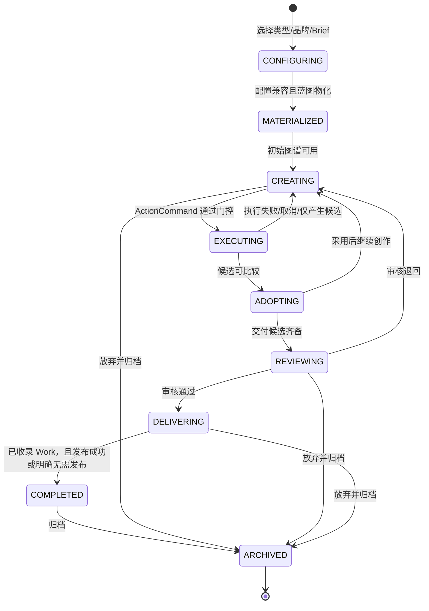

# Content Studio 技术设计

> 本文是 [Content Studio 产品设计](./content-studio-design.md) 的工程落地真理源。Content Studio 只作为面向用户的产品与工作台名称；内容生产能力在后端、数据库、REST 和前端领域类型中统一属于 **AIGC**。产品设计定义业务语义，本文定义代码、接口、数据、迁移与质量门。两者冲突时先修正文档，再修改代码，禁止用兼容层保留两套真理源。

## 当前实现状态

截至 2026-08-05，`module.content` 到唯一 AIGC 工程领域的一次性迁移与全流程重构已完成：

| 状态 | 结论 |
|---|---|
| ✅ 核心领域迁移 | `configuration`、`brand`、`project`、`media`、`execution`、`work`、`timeline`、`task` 八个核心领域子模块已落地；`module.content`、`Content*` 平行业务类型与 `/api/content/**` 已完成一次性迁移和删除 |
| ✅ 执行归属 | `AigcExecutionBinding`、绑定发布/解析、`AigcExecutionRun` 与 Agent/Tool/Workflow 三类执行器统一归 `execution`；`configuration` 不持有执行绑定 |
| ✅ 配置包 | `AigcProjectTypePackage` 的 Entity、Repository、Service、Controller、Resource 与 Provider 注册已落地；配置包固定 ProjectType、Blueprint、可选 DomainExtension、ChannelSpec、ExecutionBinding 与 productionMode，并在发布和解析时校验兼容性 |
| ✅ 资产分类体系 | `AigcAssetCategory`、`AigcAssetTag`、`AigcAssetCollection` 及 CollectionItem 已归 `media` 落地；Category、Tag、Collection 均已具备管理根所需的 Service、Controller、Resource 与 Provider 注册，TagRef/CollectionItem 保持内部关系记录 |
| ✅ Runtime adapters | `AigcRuntimeExecution` 与 Agent/Workflow 执行端口、取消端口已落地；`FrameworkAigcAgentExecutionAdapter` 已接入 framework `AgentExecutionPort`，`FrameworkAigcRuntimeCancellationAdapter` 已接入 Agent 与 Flowable/BPMN 取消。Workflow 动作经 `AigcWorkflowExecutionPort` 隔离，当前代码中没有独立的 `FrameworkAigcWorkflowExecutionAdapter` |
| ✅ 完成证据 | `CompletionEvidencePort` 已作为 `project` 的稳定出站边界，`AigcWorkCompletionEvidenceAdapter` 从 `work` 只读提供未归档 Work 与 Publication 计数；Project 只有在至少存在一个未归档 Work，且已有 Publication 全部发布成功时才可从 `delivering` 进入 `completed`，零 Publication 允许完成 |
| ✅ 数据与命名 | `AigcProject`、`AigcMedia`、`AigcAsset`、`AigcWork` 等统一命名以及 `/api/aigc/**`、`aigc_*` 基线已落地，文件继续通过 `FileRecordApi` 与 `sys_file_reference` 管理 |
| ✅ 专业能力边界 | `image`、`video`、`voice`、`model3d`、`copywriting` 等保留为专业能力适配器，向核心领域提供 Tool/API/供应商接入，不拥有平行的 Project、Media、Execution、Work 或文件真理源 |

“迁移已完成”表示核心业务状态、接口与持久化已收敛到唯一 AIGC 领域；专业能力适配器可继续独立演进，但不得升级为与八个核心领域子模块平行的业务内核。后续只在当前 AIGC 结构上演进，禁止恢复旧领域或兼容迁移路径。数据库 rebaseline 固定使用 `v1`、`v7`、`v10`、`v11`、`v12`、`v17`，禁止恢复 `cs_*`、旧媒体表、旧 API 或兼容迁移。

## 架构决策

- Content Studio 是产品组件名，不是后端业务模块；不得建立或保留平行 `content` 工程领域。
- 后端根包固定为 `com.xuejiai.aaf.module.ai.aigc`，业务内核由八个核心领域子模块组成：`configuration`、`brand`、`project`、`media`、`execution`、`work`、`timeline`、`task`。
- `image`、`video`、`voice`、`model3d`、`copywriting` 等专业包只作为模型、Tool 和供应商能力适配器，可被核心领域编排，但不得持有平行 Project、Media、Execution、Work 或文件真理源。
- 八个核心领域子模块中的业务实体、DTO、VO、命令、事件和前端领域类型统一使用 `Aigc*` 前缀；禁止 `ContentProject`、`ContentMedia`、`ContentWork` 等平行命名。专业能力适配器可使用图像、视频、语音、3D、文案等能力语义命名，但不得定义核心领域对象的别名或副本。
- `ContentStudioShell`、`ContentStudioWorkbench`、`ContentStudioProjectPage` 等纯产品 UI 组件可保留 Content Studio 名称；它们不得成为 API、表或后端领域类型。
- 系统只有一个项目聚合 `AigcProject`、一个项目 ID 空间、一个 `/api/aigc/projects` 入口和一个前端 `AigcProject` 类型。
- `AigcProjectObject + AigcProjectRelation` 承载 ProjectGraph；不保存 React Flow Node/Edge，也不建立 Storyboard 或 Content 第二状态。
- 所有可独立管理的根资源必须接入 AAF `BaseCrudService`、`CrudResourceDefinition` 与统一资源目录；创建、状态迁移等特殊动作可由命令接口补充。
- 聚合内部不可变快照、版本、引用、关系和执行关联记录不暴露独立 CRUD；只能通过所属根资源的命令或只读嵌套查询访问。
- `AigcExecutionRun` 记录所有 Agent、Tool、Workflow 动作；`AigcTask` 只承载媒体生成、处理、转码与合成子任务。
- `AigcMedia` 是持久素材身份，`AigcAsset` 是跨项目复用登记，`AigcWork` 是审核成果收录；Asset 和 Work 不复制 MediaVersion 或 `sys_file`。
- 本次重构一次性切换，不增加 fallback、旧路径转发、旧新类型别名、双写、双读或临时 shim。

## 目标包与职责

```text
com.xuejiai.aaf.module.ai.aigc
├─ configuration  项目类型、蓝图、领域扩展、渠道规格、配置包、片段
├─ brand          品牌/IP 稳定身份、不可变版本及其媒体/文档引用
├─ project        唯一 AigcProject 聚合、对象图谱、候选采用、审核、修订与外部资源引用
├─ media          AigcMedia、不可变媒体版本、AigcAsset、分类、标签、集合与文件引用
├─ execution      ActionCommand、AigcExecutionBinding、AigcExecutionRun、执行路由、重试取消与候选结果协调
├─ work           AigcWork、作品收录、渠道 Publication 与发布结果
├─ timeline       AigcTimelineComposition、Track、Clip 与 StoryboardExport
└─ task           AigcTask 媒体子任务、供应商执行、轮询同步与终态事件
```

`asset` 不单独成为第九个核心领域子模块：`AigcAsset` 是 `AigcMedia` 的可复用登记，与 Media 共享所有权校验、分类标签和文件引用边界，统一归入 `media`。`image`、`video`、`voice`、`model3d`、`copywriting` 等专业能力适配器可以保留独立包以隔离模型、Tool 和供应商协议；它们只向 `execution`/`task` 提供能力并把结果交回 `project`/`media`/`work`，不得形成新的领域根或平行业务状态。

每个子模块内部按需采用以下结构：

```text
{submodule}/
├─ api/          对其他子模块公开的 Java 接口、命令和只读视图
├─ event/        本子模块发布的领域事件
├─ controller/   REST 与 BaseCrud Controller
├─ service/      应用编排、事务和 BaseCrud Service
├─ domain/       Aigc* 业务实体和值对象
├─ repository/   仅本子模块可访问
├─ vo/           REST DTO/VO
└─ resource/     CrudResourceDefinition；仅可管理根资源需要
```

禁止跨子模块 import 对方的 `domain`、`repository`、`service`、`controller` 或 `vo`；同步调用只依赖对方 `api`，异步通知只依赖事件契约。

## 依赖方向

目标同步依赖图如下，箭头固定表示“调用方 → 被依赖子模块的 `.api`”：

```text
brand     → media
project   → configuration / brand / media
task      → media
execution → configuration / project / task
timeline  → project / media
work      → configuration / project / media
```

`configuration` 不依赖其他 AIGC 业务子模块；`media` 只依赖 system file API。上图只展示 AIGC 子模块间的编译依赖，外部 Document、Knowledge、Assistant、Agent、Tool、Workflow、模型、文件与渠道运行时依赖在下表说明。

| 调用方 | 可同步依赖 | 原因 |
|---|---|---|
| `configuration` | 无 AIGC 业务子模块 | 配置定义是稳定基础，不读取项目运行态 |
| `media` | 无 AIGC 业务子模块；只依赖 system file API | 素材身份与文件生命周期独立 |
| `brand` | `media.api`、document API | 校验品牌版本引用的媒体/文档，不直接访问其表 |
| `project` | `configuration.api`、`brand.api`、`media.api`、外部 Document/Knowledge/Assistant API | 物化并维护唯一项目聚合，只保存稳定引用 |
| `task` | `media.api`、模型/工具/文件 API | 子任务落地生成媒体；只携带 execution/project ID，不反调 execution Repository |
| `execution` | `configuration.api`、`project.api`、`task.api`、Agent/Tool/Workflow API | 校验动作、创建 Run、分派媒体子任务并登记候选 |
| `timeline` | `project.api`、`media.api` | 只引用项目对象与已采用媒体版本，不改写项目图谱 |
| `work` | `configuration.api`、`project.api`、`media.api`、外部渠道发布 API | 校验固定的渠道规格版本，收录已审核对象版本并发布，不复制正文和文件 |

反向状态传播使用事件，不为事件消费建立反向 Service 依赖。禁止 `project → execution`、`task → execution`、`media → project`、`configuration → project` 的同步反向调用。

## 跨子模块 API

配置类命名采用“版本承载根”模型：`AigcProjectBlueprint`、`AigcProjectTypePackage`、`AigcDomainExtension` 与 `AigcChannelSpec` 归 `configuration`；`AigcExecutionBinding` 归 `execution`。这些记录都携带语义版本和发布状态；产品文档中的 `ProjectBlueprintVersion`、`ProjectTypePackage` 的发布版本、`DomainExtensionVersion`、`ChannelSpecificationVersion`、`ExecutionBindingVersion` 分别映射到对应核心领域根资源的一条已发布记录，不另建平行 `*Version` 表。草稿可通过 BaseCrud 编辑；一经发布即不可原地修改，升级必须创建新记录并使用专用发布命令。所有项目快照与跨模块契约使用 `*VersionId` 字段名，明确固定的是已发布版本。

以下签名是子模块协作契约。REST DTO 可以按展示需要扩展，但不得绕过这些语义直接访问其他子模块 Repository。

### Configuration API

```java
package com.xuejiai.aaf.module.ai.aigc.configuration.api;

public interface AigcConfigurationApi {
    AigcResolvedConfiguration resolve(AigcConfigurationResolveCommand command);
}

public record AigcConfigurationResolveCommand(
        String projectTypeCode,
        Long blueprintVersionId,
        Long domainExtensionVersionId,
        java.util.List<Long> channelSpecVersionIds,
        String productionMode) {}

public record AigcResolvedConfiguration(
        Long projectTypeId,
        Long blueprintVersionId,
        Long domainExtensionVersionId,
        java.util.List<Long> channelSpecVersionIds,
        String productionMode,
        String snapshotJson,
        java.util.List<AigcBlueprintObjectSpec> objects,
        java.util.List<AigcBlueprintRelationSpec> relations) {}

public record AigcBlueprintObjectSpec(
        String stableKey, String objectType, String parentKey, Integer orderNo, String schemaJson) {}

public record AigcBlueprintRelationSpec(
        String sourceKey, String targetKey, String relationType, String metadataJson) {}
```

### Brand API

```java
package com.xuejiai.aaf.module.ai.aigc.brand.api;

public interface AigcBrandApi {
    AigcBrandProfileVersionView requireVersion(Long brandProfileVersionId, Long workspaceId);
    java.util.List<AigcBrandProfileVersionView> requireVersions(
            java.util.Collection<Long> versionIds, Long workspaceId);
}

public record AigcBrandProfileVersionView(
        Long profileId,
        Long versionId,
        Integer versionNo,
        String profileType,
        String rulesJson,
        java.util.List<Long> mediaVersionIds,
        java.util.List<Long> documentVersionIds) {}
```

### Project API

```java
package com.xuejiai.aaf.module.ai.aigc.project.api;

public interface AigcProjectApi {
    AigcProjectView materialize(AigcProjectMaterializeCommand command);
    AigcProjectView requireProject(Long projectId);
    AigcProjectGraphView getGraph(Long projectId);
    AigcProjectObjectView appendObject(AigcProjectObjectCommand command);
    AigcProjectMediaRefView attachMedia(AigcProjectMediaRefCommand command);
    void detachMedia(Long projectId, Long projectMediaRefId, Integer expectedProjectVersion);
    AigcObjectVersionView appendCandidate(AigcObjectVersionCandidateCommand command);
    AigcObjectVersionView adoptVersion(AigcObjectVersionAdoptCommand command);
    AigcProjectView submitReview(Long projectId, Integer expectedVersion);
    AigcProjectView approveReview(AigcReviewApproveCommand command);
    AigcProjectView complete(Long projectId, Integer expectedVersion);
    AigcProjectView archive(Long projectId, Integer expectedVersion);
}

public record AigcProjectMaterializeCommand(
        Long workspaceId,
        String name,
        String projectTypeCode,
        Long blueprintVersionId,
        Long domainExtensionVersionId,
        java.util.List<Long> brandProfileVersionIds,
        java.util.List<Long> channelSpecVersionIds,
        String productionMode,
        String briefJson) {}

public record AigcProjectObjectCommand(
        Long projectId,
        Long parentObjectId,
        String stableKey,
        String objectType,
        Integer orderNo,
        String schemaVersion,
        String payloadJson,
        Integer expectedProjectVersion) {}

public record AigcProjectMediaRefCommand(
        Long projectId,
        Long projectObjectId,
        Long mediaVersionId,
        String role,
        Integer orderNo,
        String adoptionStatus,
        Integer expectedProjectVersion) {}

public record AigcObjectVersionCandidateCommand(
        Long projectId,
        Long objectId,
        Long executionRunId,
        String contentJson,
        Long documentVersionId,
        java.util.List<Long> mediaVersionIds) {}

public record AigcObjectVersionAdoptCommand(
        Long projectId,
        Long objectId,
        Long objectVersionId,
        Integer expectedProjectVersion,
        String reason) {}

public record AigcReviewApproveCommand(
        Long projectId, Long reviewObjectId, Integer expectedProjectVersion, String conclusion) {}

public record AigcProjectView(
        Long id, String name, String lifecycleStage, Integer version, Long configurationSnapshotId) {}

public record AigcProjectObjectView(
        Long id, Long projectId, String objectType, String status, Long adoptedVersionId) {}

public record AigcProjectMediaRefView(
        Long id, Long projectId, Long projectObjectId, Long mediaVersionId,
        String role, Integer orderNo, String adoptionStatus) {}

public record AigcObjectVersionView(
        Long id, Long objectId, Integer versionNo, String status, Long executionRunId) {}

public record AigcProjectGraphView(
        AigcProjectView project,
        java.util.List<AigcProjectObjectView> objects,
        java.util.List<AigcProjectRelationView> relations,
        Long revisionNo) {}

public record AigcProjectRelationView(
        Long id, Long sourceObjectId, Long targetObjectId, String relationType, String metadataJson) {}
```

### Media API

```java
package com.xuejiai.aaf.module.ai.aigc.media.api;

public interface AigcMediaApi {
    AigcMediaView createFromStoredFile(AigcMediaCreateCommand command);
    AigcMediaVersionView requireVersion(Long mediaVersionId, Long workspaceId);
    java.util.List<AigcMediaVersionView> requireVersions(
            java.util.Collection<Long> mediaVersionIds, Long workspaceId);
}

public record AigcMediaCreateCommand(
        Long workspaceId,
        Long ownerId,
        String name,
        String mediaType,
        String sourceType,
        Long sourceExecutionRunId,
        Long sourceTaskId,
        Long originalProjectId,
        com.xuejiai.aaf.module.system.file.api.StoredFile file,
        com.xuejiai.aaf.module.system.file.api.StoredFile thumbnailFile,
        String generationInfo) {}

public record AigcMediaView(
        Long id, String name, String mediaType, String sourceType, Long currentVersionId) {}

public record AigcMediaVersionView(
        Long id, Long mediaId, Integer versionNo, Long fileId, Long thumbnailFileId,
        String mimeType, Long size, String checksum) {}
```

### Task API

```java
package com.xuejiai.aaf.module.ai.aigc.task.api;

public interface AigcTaskApi {
    AigcTaskView submit(AigcTaskSubmitCommand command);
    AigcTaskView cancel(Long taskId, String reason);
    AigcTaskView requireTask(Long taskId);
}

public record AigcTaskSubmitCommand(
        Long executionRunId,
        Long projectId,
        Long projectObjectId,
        String taskType,
        String modelId,
        String prompt,
        String parametersJson,
        String idempotencyKey) {}

public record AigcTaskView(
        Long id, Long executionRunId, String taskType, String status,
        Long outputMediaVersionId, String failureCode) {}
```

### Execution API

```java
package com.xuejiai.aaf.module.ai.aigc.execution.api;

public interface AigcExecutionApi {
    AigcExecutionRunView submit(AigcActionCommand command);
    AigcExecutionRunView cancel(Long executionRunId, String reason);
    AigcExecutionRunView retry(Long executionRunId, String idempotencyKey);
    AigcExecutionRunView requireRun(Long executionRunId);
}

public record AigcActionCommand(
        Long projectId,
        Long projectObjectId,
        String actionKey,
        String prompt,
        java.util.List<Long> attachmentMediaVersionIds,
        boolean confirmed,
        String idempotencyKey) {}

public record AigcExecutionRunView(
        Long id,
        Long projectId,
        Long projectObjectId,
        String actionKey,
        String targetType,
        Long targetDefinitionId,
        String status,
        java.util.List<Long> taskIds,
        java.util.List<Long> candidateObjectVersionIds,
        java.util.List<Long> candidateMediaVersionIds,
        Long creditCost) {}
```

### Timeline API

```java
package com.xuejiai.aaf.module.ai.aigc.timeline.api;

public interface AigcTimelineApi {
    AigcTimelineView create(AigcTimelineCreateCommand command);
    AigcTimelineView replaceComposition(AigcTimelineReplaceCommand command);
    AigcTimelineView requireTimeline(Long timelineId);
    AigcStoryboardExportView exportStoryboard(Long timelineId, String format);
}

public record AigcTimelineCreateCommand(
        Long projectId, Long deliverableObjectId, String name,
        java.math.BigDecimal duration, java.math.BigDecimal frameRate,
        Integer width, Integer height) {}

public record AigcTimelineReplaceCommand(
        Long timelineId, Integer expectedVersion,
        java.util.List<AigcTimelineTrackInput> tracks) {}

public record AigcTimelineTrackInput(
        String trackType, Integer orderNo, java.util.List<AigcTimelineClipInput> clips) {}

public record AigcTimelineClipInput(
        Long mediaVersionId, Long sourceObjectId,
        java.math.BigDecimal startAt, java.math.BigDecimal endAt, String propertiesJson) {}

public record AigcTimelineView(
        Long id, Long projectId, Long deliverableObjectId, String status, Integer version) {}

public record AigcStoryboardExportView(
        Long id, Long projectId, Long sourceRevisionNo, Long outputMediaVersionId, String format) {}
```

### Work API

```java
package com.xuejiai.aaf.module.ai.aigc.work.api;

public interface AigcWorkApi {
    AigcWorkView collect(AigcWorkCollectCommand command);
    AigcPublicationView publish(AigcWorkPublishCommand command);
    AigcPublicationView markPublicationResult(AigcPublicationResultCommand command);
    AigcWorkView archive(Long workId, Integer expectedVersion);
}

public record AigcWorkCollectCommand(
        Long projectId,
        Long deliverableObjectId,
        Long adoptedObjectVersionId,
        Long coverMediaVersionId,
        String visibility) {}

public record AigcWorkPublishCommand(
        Long workId, Long channelSpecVersionId, java.time.Instant scheduledAt, String idempotencyKey) {}

public record AigcPublicationResultCommand(
        Long publicationId, String status, String externalId, String externalUrl, String responseJson) {}

public record AigcWorkView(
        Long id, Long projectId, Long deliverableObjectId,
        Long adoptedObjectVersionId, String status, Integer version) {}

public record AigcPublicationView(
        Long id, Long workId, Long channelSpecVersionId, String status,
        String externalId, String externalUrl) {}
```

## 跨子模块事件

事件只携带稳定 ID、终态和必要审计字段，不携带 JPA Entity 或可变 DTO。监听器必须幂等；同一 `eventId` 重放不得重复创建候选、作品、Publication 或扣费。

| 事件 | 发布者 | 消费者 | 用途 |
|---|---|---|---|
| `AigcTaskTerminalEvent` | `task` | `execution` | 汇总媒体子任务终态，将输出登记到 ExecutionRun；task 不反调 execution |
| `AigcExecutionCandidateProducedEvent` | `execution` | `project` | 携带候选载荷与 MediaVersion 引用，由 project 创建 ObjectVersion；事件不得预先携带尚未创建的 ObjectVersion ID |
| `AigcProjectCandidateRegisteredEvent` | `project` | `execution` | 将已创建的 ObjectVersion ID 幂等回填到 ExecutionRun，闭合执行输出追踪 |
| `AigcObjectVersionAdoptedEvent` | `project` | `execution`、`timeline`、`work` | 记录采用结果并使依赖方刷新可用输入；只做提示或显式动作，不自动发布 |
| `AigcProjectReviewApprovedEvent` | `project` | `work` | 允许收录作品；是否收录仍由命令或蓝图确定规则触发 |
| `AigcWorkCollectedEvent` | `work` | `project` | 在 `AigcProjectResourceRef` 记录 Work 稳定引用，使 Project 可验证完成条件；不复制 Work 内容 |
| `AigcWorkPublicationChangedEvent` | `work` | `project` | 更新交付追踪；发布成功不自动归档项目 |
| `AigcProjectArchivedEvent` | `project` | `execution`、`timeline` | 阻止新执行并将运行中任务交给取消策略；不删除媒体和文件 |

```java
public record AigcTaskTerminalEvent(
        java.util.UUID eventId, Long taskId, Long executionRunId,
        String status, Long outputMediaVersionId, String failureCode,
        java.time.Instant occurredAt) {}

public record AigcExecutionCandidateProducedEvent(
        java.util.UUID eventId, Long executionRunId, Long projectId, Long projectObjectId,
        java.util.List<AigcObjectCandidatePayload> objectCandidates,
        java.util.List<Long> mediaVersionIds,
        java.time.Instant occurredAt) {}

public record AigcObjectCandidatePayload(
        String contentJson, Long documentVersionId, java.util.List<Long> mediaVersionIds) {}

public record AigcProjectCandidateRegisteredEvent(
        java.util.UUID eventId, Long executionRunId, Long projectId,
        java.util.List<Long> objectVersionIds, java.time.Instant occurredAt) {}

public record AigcObjectVersionAdoptedEvent(
        java.util.UUID eventId, Long projectId, Long projectObjectId,
        Long objectVersionId, Long projectRevisionNo, java.time.Instant occurredAt) {}

public record AigcProjectReviewApprovedEvent(
        java.util.UUID eventId, Long projectId, Long reviewObjectId,
        java.util.List<Long> approvedDeliverableObjectIds, java.time.Instant occurredAt) {}

public record AigcWorkCollectedEvent(
        java.util.UUID eventId, Long workId, Long projectId, Long deliverableObjectId,
        Long adoptedObjectVersionId, java.time.Instant occurredAt) {}

public record AigcWorkPublicationChangedEvent(
        java.util.UUID eventId, Long workId, Long projectId, Long publicationId,
        String status, java.time.Instant occurredAt) {}

public record AigcProjectArchivedEvent(
        java.util.UUID eventId, Long projectId, java.time.Instant occurredAt) {}
```

## 统一命名契约

### 命名规则

- 八个核心领域中的 Java 业务实体、根资源、命令、VO、事件：`Aigc*`。
- 专业能力适配器的本地协议、请求响应和供应商模型可使用能力语义命名，但不得定义 Project、Media、Asset、Execution、Work、Timeline 或 Task 的平行领域类型。
- PostgreSQL 表：`aigc_*`；外部基础设施表保留其所属领域名，如 `sys_file`、`sys_file_reference`。
- REST：统一 `/api/aigc/**`；集合路径使用 kebab-case 复数，不可数名词 `media` 保持 `/api/aigc/media`。
- 前端领域类型、API 客户端、Query Key：`Aigc*` 与 `aigc.*`；不得定义 `ContentProject` 等别名。
- 产品 UI 组件可用 `ContentStudio*`，因为它表达产品壳而非业务实体；例如 `ContentStudioShell` 可以接收 `AigcProject`。
- 数据库 JSON 中的业务 `objectType` 使用 snake_case 语义值，如 `blog_content`、`video_deliverable`；它不是 Java 类名。

### 概念到实现命名矩阵

`—` 表示没有独立根 REST，只能通过所属根资源的嵌套命令或只读查询访问。

| 产品概念 | Java 类 | 数据库表 | REST 路径 | 前端领域类型 | BaseCrud |
|---|---|---|---|---|---|
| Project Type | `AigcProjectType` | `aigc_project_type` | `/api/aigc/project-types` | `AigcProjectType` | 是，完整管理 |
| Project Blueprint Version | `AigcProjectBlueprint`（版本承载根） | `aigc_project_blueprint` | `/api/aigc/project-blueprints` | `AigcProjectBlueprint` | 是；草稿可管理，发布后不可变 |
| Project Type Package | `AigcProjectTypePackage` | `aigc_project_type_package` | `/api/aigc/project-type-packages` | `AigcProjectTypePackage` | 是；草稿可管理，发布后不可变 |
| Domain Extension Version | `AigcDomainExtension`（版本承载根） | `aigc_domain_extension` | `/api/aigc/domain-extensions` | `AigcDomainExtension` | 是；草稿可管理，发布后不可变 |
| Channel Specification Version | `AigcChannelSpec`（版本承载根） | `aigc_channel_spec` | `/api/aigc/channel-specs` | `AigcChannelSpec` | 是；草稿可管理，发布后不可变 |
| Execution Binding Version | `AigcExecutionBinding`（版本承载根） | `aigc_execution_binding` | `/api/aigc/execution-bindings` | `AigcExecutionBinding` | 是；草稿可管理，发布后不可变 |
| Snippet | `AigcSnippet` | `aigc_snippet` | `/api/aigc/snippets` | `AigcSnippet` | 是，完整管理 |
| Brand Profile | `AigcBrandProfile` | `aigc_brand_profile` | `/api/aigc/brand-profiles` | `AigcBrandProfile` | 是，完整管理 |
| Brand Profile Version | `AigcBrandProfileVersion` | `aigc_brand_profile_version` | `/api/aigc/brand-profiles/{id}/versions` | `AigcBrandProfileVersion` | 否，不可变子记录 |
| Project | `AigcProject` | `aigc_project` | `/api/aigc/projects` | `AigcProject` | 是，管理根；创建/状态用命令 |
| Project Configuration Snapshot | `AigcProjectConfigSnapshot` | `aigc_project_config_snapshot` | `/api/aigc/projects/{id}/configuration` | `AigcProjectConfigSnapshot` | 否，不可变快照 |
| Project Profile Reference | `AigcProjectProfileRef` | `aigc_project_profile_ref` | `/api/aigc/projects/{id}/profile-refs` | `AigcProjectProfileRef` | 否，聚合内部引用 |
| Project Channel Reference | `AigcProjectChannelRef` | `aigc_project_channel_ref` | `/api/aigc/projects/{id}/channel-refs` | `AigcProjectChannelRef` | 否，聚合内部引用 |
| Resolved Domain Context | `AigcResolvedDomainContext` | `aigc_resolved_domain_context` | `/api/aigc/projects/{id}/domain-context` | `AigcResolvedDomainContext` | 否，不可变修订 |
| Project Object | `AigcProjectObject` | `aigc_project_object` | `/api/aigc/projects/{id}/objects` | `AigcProjectObject` | 否，项目聚合成员 |
| Project Relation | `AigcProjectRelation` | `aigc_project_relation` | `/api/aigc/projects/{id}/relations` | `AigcProjectRelation` | 否，项目聚合成员 |
| Object Version | `AigcObjectVersion` | `aigc_object_version` | `/api/aigc/projects/{id}/objects/{objectId}/versions` | `AigcObjectVersion` | 否，不可变候选/采用记录 |
| Project Revision | `AigcProjectRevision` | `aigc_project_revision` | `/api/aigc/projects/{id}/revisions` | `AigcProjectRevision` | 否，不可变审计记录 |
| Project Document Reference | `AigcProjectDocumentRef` | `aigc_project_document_ref` | `/api/aigc/projects/{id}/document-refs` | `AigcProjectDocumentRef` | 否，聚合内部引用 |
| Project Resource Reference | `AigcProjectResourceRef` | `aigc_project_resource_ref` | `/api/aigc/projects/{id}/resource-refs` | `AigcProjectResourceRef` | 否，聚合内部引用 |
| Project Media Reference | `AigcProjectMediaRef` | `aigc_project_media_ref` | `/api/aigc/projects/{id}/media-refs` | `AigcProjectMediaRef` | 否，聚合内部引用 |
| Media | `AigcMedia` | `aigc_media` | `/api/aigc/media` | `AigcMedia` | 是；标准创建关闭，上传/生成命令创建 |
| Media Version | `AigcMediaVersion` | `aigc_media_version` | `/api/aigc/media/{id}/versions` | `AigcMediaVersion` | 否，不可变子记录 |
| Asset | `AigcAsset` | `aigc_asset` | `/api/aigc/assets` | `AigcAsset` | 是，完整管理 |
| Asset Category | `AigcAssetCategory` | `aigc_asset_category` | `/api/aigc/asset-categories` | `AigcAssetCategory` | 是，完整管理 |
| Asset Tag | `AigcAssetTag` | `aigc_asset_tag` | `/api/aigc/asset-tags` | `AigcAssetTag` | 是，完整管理 |
| Asset Tag Reference | `AigcAssetTagRef` | `aigc_asset_tag_ref` | — | `AigcAssetTagRef` | 否，关系记录 |
| Asset Relation | `AigcAssetRelation` | `aigc_asset_relation` | `/api/aigc/assets/{id}/relations` | `AigcAssetRelation` | 否，关系记录 |
| Asset Collection | `AigcAssetCollection` | `aigc_asset_collection` | `/api/aigc/asset-collections` | `AigcAssetCollection` | 是，完整管理 |
| Asset Collection Item | `AigcAssetCollectionItem` | `aigc_asset_collection_item` | `/api/aigc/asset-collections/{id}/items` | `AigcAssetCollectionItem` | 否，集合成员 |
| Action Command | `AigcActionCommand` | 不单独建表；输入固化于 Run | `/api/aigc/projects/{id}/actions` | `AigcActionCommand` | 否，命令 |
| Execution Run | `AigcExecutionRun` | `aigc_execution_run` | `/api/aigc/execution-runs` | `AigcExecutionRun` | 是，PAGE/GET；状态用命令 |
| Execution Task Reference | `AigcExecutionTaskRef` | `aigc_execution_task_ref` | `/api/aigc/execution-runs/{id}/tasks` | `AigcExecutionTaskRef` | 否，关联记录 |
| AIGC Task | `AigcTask` | `aigc_task` | `/api/aigc/tasks` | `AigcTask` | 是，PAGE/GET；提交/取消用命令 |
| Work | `AigcWork` | `aigc_work` | `/api/aigc/works` | `AigcWork` | 是；收录/归档用命令 |
| Publication | `AigcWorkPublication` | `aigc_work_publication` | `/api/aigc/works/{id}/publications` | `AigcWorkPublication` | 否，Work 子记录 |
| Timeline Composition | `AigcTimelineComposition` | `aigc_timeline_composition` | `/api/aigc/timelines` | `AigcTimelineComposition` | 是；组合替换用命令 |
| Timeline Track | `AigcTimelineTrack` | `aigc_timeline_track` | `/api/aigc/timelines/{id}/tracks` | `AigcTimelineTrack` | 否，聚合内部记录 |
| Timeline Clip | `AigcTimelineClip` | `aigc_timeline_clip` | `/api/aigc/timelines/{id}/clips` | `AigcTimelineClip` | 否，聚合内部记录 |
| Storyboard Export | `AigcStoryboardExport` | `aigc_storyboard_export` | `/api/aigc/timelines/{id}/storyboard-exports` | `AigcStoryboardExport` | 否，只读导出记录 |

禁止出现以下平行命名：

```text
ContentProject / ContentProjectVO / ContentProjectResource
ContentProjectObject / ContentObjectVersion / ContentExecutionRun
ContentBrandProfile / ContentChannelSpec / ContentSnippet
/api/content/**
cs_*
前端 ContentProject、ContentObject、ContentExecutionRun 领域类型或 query key
```

允许的产品组件命名示例：

```tsx
function ContentStudioShell(props: { project: AigcProject }) {}
function ContentStudioProjectWorkbench(props: { graph: AigcProjectGraph }) {}
function ContentStudioAssetLibrary(props: { assets: AigcAsset[] }) {}
```

## BaseCrud 边界

### 必须接入 BaseCrud 的资源

“可管理根资源”满足任一条件：有独立列表/详情入口；可被用户或管理员创建、编辑、删除/归档；可被通用 Entity UI、关系选择器、权限系统或智能动作引用。此类资源必须同时具备：

1. `Aigc*` Entity 与 `CrudEntityRepository`。
2. `BaseCrudService<E, V, C, U, P>` 子类。
3. `BaseCrudController` 子类或等价统一 CRUD Controller。
4. `CrudResourceDefinition`，声明资源 key、路径、权限前缀、能力、查询、租户与个人范围。
5. `CrudResourceProviderConfiguration` 注册。

最小结构：

```java
public final class AigcProjectResource {
    public static final ResourceKey KEY = ResourceKey.of("aigc.project");
    public static final String BASE_PATH = "/api/aigc/projects";
}

public final class AigcProjectCrudService
        extends BaseCrudService<
                AigcProject,
                AigcProjectVO,
                Void,
                AigcProjectUpdateDTO,
                AigcProjectPageDTO> {

    @Override
    protected CrudEntityRepository<AigcProject> getRepository();

    @Override
    protected AigcProjectVO toVO(AigcProject entity);

    @Override
    protected AigcProject toEntity(Void ignored) {
        throw new UnsupportedOperationException("项目只能通过 materialize 创建");
    }

    @Override
    protected void updateEntity(AigcProject entity, AigcProjectUpdateDTO command);
}
```

BaseCrud 统一承担 PAGE/GET/CREATE/UPDATE/DELETE 中资源声明允许的部分、租户/工作区/owner 范围、字段策略、授权与 Query Token。业务命令不能重写一套通用 page/get/update/delete。对 Media、ExecutionRun、Task、Work 等受状态机约束的根资源，仍须接入 BaseCrud，但关闭不允许的标准能力：

- `AigcMedia`：PAGE/GET/UPDATE/DELETE；CREATE 只允许上传/生成命令。
- `AigcExecutionRun`：PAGE/GET；提交、取消、重试走 `AigcExecutionApi`。
- `AigcTask`：PAGE/GET；提交、取消走 `AigcTaskApi`。
- `AigcWork`：PAGE/GET/UPDATE；收录、发布、归档走 `AigcWorkApi`。
- `AigcTimelineComposition`：PAGE/GET/DELETE；创建与整体替换走 `AigcTimelineApi`。

### 禁止暴露独立 CRUD 的记录

以下记录由聚合命令创建，创建后不可原地改写，或只是内部关系；不得建立独立 BaseCrud Resource、顶级 Controller 或通用 CREATE/UPDATE/DELETE：

- 所有 `*Version`：`AigcBrandProfileVersion`、`AigcObjectVersion`、`AigcMediaVersion`。
- 所有 `*Snapshot`、`*Revision`：项目配置快照、解析后领域上下文修订、项目修订。
- 项目内部对象、关系和引用：`AigcProjectObject`、`AigcProjectRelation`、`AigcProject*Ref`。
- 媒体/资产内部关系：TagRef、AssetRelation、CollectionItem。
- 执行关联：`AigcExecutionTaskRef`。
- Work/Timeline 子记录：Publication、Track、Clip、StoryboardExport。

它们可有本子模块私有 Repository，也可提供嵌套只读查询，但生命周期只能由所属根资源 Service 控制。禁止为了通用后台方便而给不可变记录增加 UPDATE。

## 唯一 AigcProject 聚合

### 聚合边界

```text
AigcProject（唯一项目聚合根）
├─ AigcProjectConfigSnapshot[]       不可变，当前指针由 Project 持有
├─ AigcProjectProfileRef[]           固定 BrandProfileVersion
├─ AigcProjectChannelRef[]           固定 ChannelSpec
├─ AigcResolvedDomainContext[]       不可变修订
├─ AigcProjectObject[]               项目内对象和状态
│  └─ AigcObjectVersion[]            不可变候选；Object 持 adoptedVersionId
├─ AigcProjectRelation[]             语义关系
├─ AigcProjectDocumentRef[]          外部 DocumentVersion 引用
├─ AigcProjectResourceRef[]          外部 Assistant/Knowledge/Workflow/Work/Publication 稳定引用
├─ AigcProjectMediaRef[]             外部 AigcMediaVersion 引用
└─ AigcProjectRevision[]             每次领域变更的不可变审计修订
```

`AigcExecutionRun`、`AigcTask`、`AigcMedia`、`AigcTimelineComposition` 和 `AigcWork` 是独立生命周期根，只保存 `projectId/objectId/versionId` 稳定引用，不进入 Project JPA 级联。这里的“唯一 AigcProject 聚合”指系统只存在这一套**项目**聚合，不表示所有 AIGC 数据都由一个事务聚合持有。

聚合不变量：

- `AigcProjectObject.projectId`、关系两端对象、对象版本必须属于同一 Project。
- 一个 ProjectObject 同时最多一个 `adoptedVersionId`；候选成功不自动采用。
- ProjectGraph 是 Object + Relation + Revision 的门面，不建立 `AigcProjectGraphNode` 表。
- Storyboard、Brief、CreativeConcept、Deliverable、Episode、Scene、Shot、ShotKeyframe、Review 和 `blog_content` 都是 `objectType`，不建立平行状态主表。
- 所有写命令携带 `expectedProjectVersion`，以乐观锁拒绝丢失更新。
- 归档不删除对象、版本、ExecutionRun、Media、Work 或文件引用。
- Project 删除只允许进入回收/归档策略；物理删除必须证明所有跨聚合引用已解除。

### 生命周期



阶段与事实：

| 阶段 | 必须存在的事实 | 允许进入下一阶段的条件 |
|---|---|---|
| `CONFIGURING` | ProjectType、品牌版本、Brief、渠道/生产模式选择 | `AigcConfigurationApi.resolve` 成功，无兼容冲突 |
| `MATERIALIZED` | 唯一 `AigcProject`、配置快照、初始 Object/Relation、revision 1 | 聚合不变量校验通过，工作台可读取图谱 |
| `CREATING` | 用户/Assistant 编辑图谱并选择稳定 `actionKey` | 权限、预算、规则、确认门通过 |
| `EXECUTING` | 每个动作有 `AigcExecutionRun`；媒体动作可有零到多个 `AigcTask` | Run 终态明确，输出来源可追溯 |
| `ADOPTING` | 候选 `AigcObjectVersion` 或 `AigcMediaVersion` 可比较 | 显式采用并提交 ProjectRevision；失败/取消不移动指针 |
| `REVIEWING` | 品牌、领域、渠道质检与 Review 对象 | 阻断项为零，人工/规则审核通过 |
| `DELIVERING` | 审核通过且计入成功交付的成果已收录为 `AigcWork`，可创建零到多个 Publication | Publication 发布成功、明确无需发布，或明确仅收录作品 |
| `COMPLETED` | 至少一个 Work、交付契约满足、无运行中阻断任务 | 当前只允许归档；未提供重新打开命令 |
| `ARCHIVED` | 图谱、版本、执行、审核、作品与引用保留；可由任一非归档状态进入 | 只读；不得触发文件物理删除 |

成功完成必须经过 Work 收录，Publication 是可选的渠道记录而非完成的必要数量条件。当前 `archive` 命令允许任一非归档项目归档；`completed` 项目可归档但不能重新打开。归档不能代替完成，创作中放弃的项目不得标记为 `COMPLETED`。

以下事实必须分别持久化，不能用一个 status 替代：执行成功、候选产生、采用、审核通过、作品收录、发布成功、项目完成、项目归档。

### 代表性 AI 博客链

```text
ProjectType + Brief
→ 物化 AigcProject 与 blog_content/cover/channel_variant 对象
→ AigcActionCommand
→ AigcExecutionRun
→ 正文 AigcObjectVersion candidate
→ 封面 AigcTask → AigcMediaVersion candidate
→ 分别采用
→ 事实/品牌/渠道审核
→ AigcWork
→ AigcWorkPublication（官网/公众号）
→ Project COMPLETED
→ 可选 ARCHIVED
```

长正文权威来源是 DocumentVersion；`blog_content` 保存结构与引用。不得创建 `ContentBlog`、`aigc_content` 或第二套文件表。

## 数据所有权与目标表

### 权威所有权

| 信息 | 权威所有者 | 禁止做法 |
|---|---|---|
| 物理文件 key、配置、大小、哈希和删除状态 | `sys_file` | 业务表保存 URL 或从 URL 反解 key |
| 素材身份、来源和当前版本 | `aigc_media` | 用 Asset/Work 代替素材身份 |
| 不可变媒体文件版本 | `aigc_media_version` | 在多个业务表重复保存 URL/文件元数据 |
| 跨项目可复用登记 | `aigc_asset` | 标记资产时复制媒体文件 |
| 项目内媒体用途 | `aigc_project_media_ref` | 在 Media 上固定 COVER/BGM 等项目用途 |
| 项目对象、父级、顺序、状态和采用版本 | `aigc_project_object` | Storyboard、结构视图和图谱各存一份 |
| 执行状态、成本、重试、输入输出 | `aigc_execution_run` | 用 AigcTask 表示全部执行 |
| 已审核成果收录 | `aigc_work` | 把生成成功或 `aiGenerated=true` 当作品 |
| 长文本正文 | `DocumentVersion` | 将正文复制到 Media、Asset 或 Work |

### 目标表按子模块

| 子模块 | 管理根表 | 内部表 |
|---|---|---|
| configuration | `aigc_project_type`、`aigc_project_blueprint`、`aigc_project_type_package`、`aigc_domain_extension`、`aigc_channel_spec`、`aigc_snippet` | 配置包成员如需要可用内部关系表 |
| brand | `aigc_brand_profile` | `aigc_brand_profile_version`、`aigc_brand_profile_media_ref`、`aigc_brand_profile_document_ref` |
| project | `aigc_project` | `aigc_project_config_snapshot`、`aigc_project_profile_ref`、`aigc_project_channel_ref`、`aigc_resolved_domain_context`、`aigc_project_object`、`aigc_project_relation`、`aigc_object_version`、`aigc_project_revision`、`aigc_project_document_ref`、`aigc_project_resource_ref`、`aigc_project_media_ref` |
| media | `aigc_media`、`aigc_asset`、`aigc_asset_category`、`aigc_asset_tag`、`aigc_asset_collection` | `aigc_media_version`、`aigc_asset_tag_ref`、`aigc_asset_relation`、`aigc_asset_collection_item` |
| execution | `aigc_execution_binding`、`aigc_execution_run` | `aigc_execution_task_ref` |
| work | `aigc_work` | `aigc_work_publication` |
| timeline | `aigc_timeline_composition` | `aigc_timeline_track`、`aigc_timeline_clip`、`aigc_storyboard_export` |
| task | `aigc_task` | 供应商回调/尝试记录按需作为内部表，不另建业务根 |

所有项目相关外键最终只指向 `aigc_project.id`。`AigcTask.projectId`、Media `originalProjectId`、ExecutionRun、Timeline、Work 和 Publication 不得引用任何 `ContentProject` 或 `cs_project` ID。

## 文件生命周期

`sys_file` 是物理文件唯一登记；`AigcMediaVersion` 是媒体文件版本唯一所有者。业务表不保存 URL、OSS 路径或 CDN 域名。

```text
供应商临时结果/用户上传
→ FileRecordApi.store 创建 sys_file
→ AigcMediaApi.createFromStoredFile
→ AigcMedia + AigcMediaVersion(fileId)
→ FileRecordApi.retain(sys_file_reference)
→ 关联 AigcTask/AigcExecutionRun/AigcProjectMediaRef
```

生成结果默认只形成 Media，不自动形成 Asset 或 Work。用户执行“保存到资产库”只创建 `AigcAsset(mediaId)`；审核成果收录只创建 `AigcWork` 及稳定版本引用。

一致性约束：

- 物理上传成功但 `sys_file` 创建失败：补偿删除对象存储文件，命令失败。
- `sys_file` 成功但 MediaVersion 创建或引用登记失败：文件进入 `ORPHAN/PENDING_DELETE`，由 GC 清理。
- 禁止文件登记失败后只记录 warning 并继续创建业务记录。
- 删除 ProjectMediaRef、Asset、Work 或 Publication 只解除业务引用，不删除 MediaVersion 或文件。
- 只有引用为零、超过保留期且进入 `PENDING_DELETE` 的 `sys_file` 可由异步 GC 物理删除。
- 业务 HTTP 事务不得直接调用存储实现的 `delete`；数据库外键对 `sys_file` 使用 `ON DELETE RESTRICT`。

## 一次性迁移与删除清单

### module.content 迁移

| 当前 `module.content` 概念 | 目标子模块与名称 | 处理 |
|---|---|---|
| `ContentProjectType` | `configuration.domain.AigcProjectType` | 移动并重命名；接入 BaseCrud |
| `ContentProjectBlueprint` | `configuration.domain.AigcProjectBlueprint` | 移动并重命名；接入 BaseCrud |
| `ContentDomainExtension` | `configuration.domain.AigcDomainExtension` | 移动并重命名；接入 BaseCrud |
| `ContentChannelSpec` | `configuration.domain.AigcChannelSpec` | 移动并重命名；接入 BaseCrud |
| `ContentExecutionBinding` | `execution.domain.AigcExecutionBinding` | 移动并重命名；接入 BaseCrud，由 execution 负责发布与解析 |
| `ContentSnippet` | `configuration.domain.AigcSnippet` | 移动并重命名；接入 BaseCrud |
| `ContentBrandProfile` | `brand.domain.AigcBrandProfile` + `AigcBrandProfileVersion` | 拆分稳定根与不可变版本；根接 BaseCrud |
| `ContentProject` | `project.domain.AigcProject` | 与旧 AigcProject 合并为唯一聚合根，不保留两个 Service/Controller |
| `ContentProjectObject` | `project.domain.AigcProjectObject` | 项目聚合成员，不暴露独立 BaseCrud |
| `ContentProjectRelation` | `project.domain.AigcProjectRelation` | 项目聚合成员，不暴露独立 BaseCrud |
| `ContentObjectVersion` | `project.domain.AigcObjectVersion` | 不可变候选记录，不暴露独立 BaseCrud |
| `ContentProjectProfileRef` | `project.domain.AigcProjectProfileRef` | 项目内部引用 |
| `ContentProjectMaterializer` | `project.service.AigcProjectMaterializer` | 只通过 configuration/brand API 解析并物化 |
| `ContentActionCommandService` | `execution.service.AigcActionCommandService` | 统一创建 AigcExecutionRun |
| `ContentExecutionRun` | `execution.domain.AigcExecutionRun` | 移动并重命名；BaseCrud 仅 PAGE/GET |
| `Content*ActionExecutor` | `execution.service` 内 Aigc* executor | 统一 AGENT/TOOL/WORKFLOW 三分支 |
| `ContentAigcTaskTerminalListener` | `execution.event.AigcTaskTerminalListener` | 消费 `AigcTaskTerminalEvent`，幂等更新 Run |
| `Content*Resource/Controller/VO/DTO/Mapper/Repository` | 对应 Aigc* 子模块 | 全链路重命名，不建立旧类型 alias |

迁移结果已删除：

```text
com.xuejiai.aaf.module.content
/api/content/**
content:* 权限编码
Content* 业务 ResourceKey、Query Key、API client、DTO/VO/TS 类型
```

### 旧 AIGC 项目模型收敛

| 当前实现 | 目标 | 最终处理 |
|---|---|---|
| 旧 `AigcProject` 简化 Entity/API | 唯一 `project.domain.AigcProject` | 合并字段和行为后删除简化 DTO/API |
| `AigcContent*` | `AigcProjectObject(objectType=deliverable/blog_content/...)` + `AigcObjectVersion` | 删除 Entity、Repository、Service、Controller、VO |
| `AigcStoryboard*` | Shot/ShotKeyframe Object + Relation + MediaRef 投影 | 删除持久 Storyboard CRUD |
| `AigcShot*`、`AigcShotAsset*` | ProjectObject + ProjectMediaRef | 删除平行 Shot 状态表与 CRUD |
| `AigcTimeline`、Track、Clip | `timeline.AigcTimelineComposition/Track/Clip` | 移出 project，统一引用已采用媒体版本 |
| `AigcProjectDoc` | `AigcProjectDocumentRef` | 改名并只依赖 Document API |
| `UserProjectResource` | `AigcProjectResourceRef` | 改名并并入 Project 聚合 |
| `UserProjectTemplate` | Blueprint、复制项目、Remix | 删除；不建兼容模板层 |
| `Media/MediaVersion/Asset` | `AigcMedia/AigcMediaVersion/AigcAsset` | 保留第一阶段能力并完成 Aigc* 命名 |
| `MediaAssetGroup` | ExecutionRun + ExecutionTaskRef | 删除 |
| `MediaElement` | ProjectObject + ProjectMediaRef | 删除 |

### 数据库删除与禁止恢复

数据库 rebaseline 已完成，目标基线固定：

```text
db/migration/v1__system_schema.sql
db/migration/v7__aigc_schema.sql
db/migration/v10__stats_views.sql
db/seed/v11__init_dict_data.sql
db/seed/v12__init_seed_data.sql
db/seed/v17__aigc_content_studio_seed.sql
```

禁止恢复或新增以下遗留结构：

```text
cs_*
media_asset / media_element / media_asset_group
aigc_content / aigc_content_asset
aigc_storyboard / aigc_shot / aigc_shot_asset
user_project_template / user_project_resource
v200__content_studio_schema.sql / v201__content_studio_seed.sql
```

本次 rebaseline 不支持在已执行旧历史脚本的数据库上增量升级。开发、测试和 CI 数据库必须清空 `flyway_schema_history` 后完整重建；如发现不可清空环境，暂停并另行设计正式前向迁移，不得恢复双写、双读、旧 API 或兼容表。

### 前端迁移

- `/studio`、Content Studio 产品标题和 `ContentStudio*` UI 组件保留。
- 所有领域类型改为矩阵中的 `Aigc*`；删除 `ContentProject`、`ContentObjectVersion`、`ContentExecutionRun` 等类型。
- API client 只请求 `/api/aigc/**`；删除 `/api/content/**` fallback。
- Query Key 统一 `aigc.project.*`、`aigc.media.*`、`aigc.asset.*`、`aigc.execution.*`、`aigc.work.*`。
- TanStack Query 管理 ProjectGraph、对象、关系、版本和执行等服务端状态；Zustand 只保存焦点、viewport、折叠、筛选等 UI 状态。
- 素材页查询 `AigcMedia`，资产页查询 `AigcAsset`，作品页查询 `AigcWork`；不得用同一个 AssetLibrary 数据源伪装三种业务概念。
- 项目任务历史查询 `AigcExecutionRun`，媒体执行详情按需展开 `AigcTask`。

## 已完成迁移顺序

本次一次性重构已按以下依赖顺序完成；该顺序保留为后续静态审查与回归定位依据：

| 顺序 | 实现范围 | 完成条件 |
|---|---|---|
| 基线冻结 | 冻结 `module.content` 新功能、`/api/content/**` 与 `Content*` 新类型 | 变更清单和删除清单确认，不再扩大旧实现 |
| configuration | 迁移 ProjectType、Blueprint、DomainExtension、ChannelSpec、Snippet | Aigc* 命名、BaseCrud 注册、无 project 反向依赖 |
| brand | 迁移 BrandProfile，拆不可变 Version 和引用 | 根接 BaseCrud；Version 无独立 CRUD |
| project | 合并唯一 AigcProject，迁移 Object/Relation/ObjectVersion/Refs/Materializer | 只有一个 Project Entity/Repository/Service/API/ID 空间；Graph 同源 |
| execution | 迁移 ExecutionBinding、ActionCommand、ExecutionRun、三类 executor 与 task listener | 绑定发布/解析归 execution；非媒体 Run 不建 Task；媒体 Run 可关联多个 Task |
| media 命名收敛 | 在第一阶段能力上完成 AigcMedia/AigcMediaVersion/AigcAsset 命名及项目引用 | FileRecordApi 边界不退化，无 URL 文件身份 |
| task 协作收敛 | AigcTask 接口化、发布终态事件、移除对旧 content 的直接依赖 | task 只依赖 media API，不反向访问 execution/project Repository |
| work | 实现 AigcWork 与 Publication | 只引用审核通过的对象/媒体版本，不复制内容和文件 |
| timeline | 迁移 Composition/Track/Clip，Storyboard 改投影和导出 | 不存在持久 Storyboard 第二状态；只用已采用媒体版本 |
| 前端切换 | Aigc* 类型、`/api/aigc/**` client、Query Key、Studio 页面 | 无 Content* 领域类型和旧 API 请求 |
| 遗留删除 | 删除 `module.content` 与旧 AIGC Content/Storyboard/Shot/Template/Resource 实现 | 静态最终门全部通过 |
| 完整验证 | 运行开发验证、迁移、验收与 E2E | 最终测试门全部通过后才能交付 |

`module.content` 一次性迁移与遗留删除均已完成；后续变更直接维护八个核心领域子模块或专业能力适配器，不得恢复旧领域、兼容层或第九个业务内核。

## 质量门

### 规范先行静态门

迁移完成后，每次静态审查与后续变更都必须用静态搜索/ArchUnit/编译规则确认：

- 业务内核只能是八个核心领域子模块；`image`、`video`、`voice`、`model3d`、`copywriting` 等专业能力适配器不得定义平行 Project、Media、Execution、Work 或文件真理源。
- 八个核心领域中的 Entity、DTO、VO、Command、Event 和 TS 领域类型使用 `Aigc*`；仅 `ContentStudio*` 产品 UI 组件和不承载核心业务状态的专业适配器本地类型例外。
- 不存在 `com.xuejiai.aaf.module.content` import、`/api/content/**`、`content:*`、`cs_*` 或旧 Query Key。
- 子模块同步依赖只指向对方 `.api`；不存在跨包 Entity/Repository/Service import。
- 所有可管理根资源均有 BaseCrud Service、ResourceDefinition、Controller 和 Provider 注册。
- 所有内部不可变版本/快照/修订/引用均无独立通用 CREATE/UPDATE/DELETE。
- 全项目只有一个 `AigcProject` Entity、一个 Repository、一个项目 BaseCrud Resource 和一个 REST 根路径。
- 不存在持久 Storyboard/Content/Shot 第二状态；React Flow Node/Edge 不进入服务端契约。
- Asset/Work/Publication 不保存 MediaVersion 或文件副本；AIGC 业务表不以 URL 作为文件身份。

建议加入 ArchUnit 规则：

```java
noClasses().that().resideOutsideOfPackage("..aigc.configuration.api..")
        .should().dependOnClassesThat().resideInAnyPackage(
                "..aigc.configuration.domain..",
                "..aigc.configuration.repository..",
                "..aigc.configuration.service..");

noClasses().that().resideInAnyPackage("..aigc..")
        .should().dependOnClassesThat().resideInAnyPackage("..module.content..");

classes().that().areAnnotatedWith(jakarta.persistence.Entity.class)
        .and().resideInAnyPackage(
                "..aigc.configuration..",
                "..aigc.brand..",
                "..aigc.project..",
                "..aigc.media..",
                "..aigc.execution..",
                "..aigc.work..",
                "..aigc.timeline..",
                "..aigc.task..")
        .should().haveSimpleNameStartingWith("Aigc");
```

实际规则应为八个子模块生成对称约束，而不是只校验 configuration。

### 开发验证门

每个实现批次由 developer 完成后：

- 后端编译、格式、ArchUnit、BaseCrud 资源目录启动审计通过。
- 变更业务分支有对应 `*Test.java`；聚合状态机、乐观锁、幂等和权限为必测项。
- `pnpm nx test service` 通过。
- `pnpm check:affected` 全绿后才能进入代码审查。
- architect 对照本设计审查命名矩阵、接口签名、依赖方向、聚合边界和删除清单。

### 数据库与集成门

- 从空库按 Flyway 全序列建库成功，seed 成功。
- schema 中不存在 `cs_*` 和删除清单中的遗留表/外键。
- 每个目标 Entity 与表、列、唯一约束、外键一致。
- `AigcTask.project_id`、ExecutionRun、Media 来源项目、Timeline、Work 全部指向同一 `aigc_project.id`。
- `aigc_media_version.file_id → sys_file.id` 使用 RESTRICT，引用登记与 GC 补偿链通过。
- API 契约测试确认没有 `/api/content/**`，OpenAPI 只发布 `/api/aigc/**`。

### 最终测试门

最终交付前必须覆盖：

- **聚合生命周期**：蓝图物化、编辑、执行、候选、采用、审核、作品、Publication、完成、归档和审核退回循环。
- **执行链**：Agent/Tool/Workflow 都产生 ExecutionRun；非媒体动作零 Task；媒体动作一对多 Task；取消/失败/重试不移动采用指针且不重复扣费。
- **BaseCrud**：每个管理根的 PAGE/GET 与允许的 mutation、租户/工作区/owner、字段权限和 Query Token。
- **不可变记录**：Version/Snapshot/Revision 无更新入口，历史读取可追溯。
- **媒体文件**：上传/生成补偿、FileReference、Asset/Work 解除引用、零引用 GC、删除失败重试。
- **权限**：项目只读取显式绑定的品牌、文档、知识和媒体；跨工作区访问全部拒绝。
- **前端 E2E**：创建项目、图谱/结构同源、发起执行、比较候选、采用、审核、收录作品、发布、归档。
- **AI 博客样例**：`blog_content` + DocumentVersion + cover Media 完整跑通，不出现 Content 模块或第二文件体系。
- `pnpm check` 与 `pnpm acceptance` 全绿；质量门满足 blocker=0 且 major≤2。

## 验收结论

只有同时满足以下条件，项目全流程重构才可判定完成：

- Content Studio 只作为产品名称存在，AIGC 是唯一工程领域。
- 八个核心领域子模块及依赖方向稳定，专业能力适配器不持有平行业务内核，跨模块只通过 API/event 协作。
- Java、数据库、REST、前端类型符合统一命名矩阵，业务对象无 `Content*` 平行命名。
- 所有可管理根资源接入 BaseCrud，所有内部不可变记录无独立 CRUD。
- 全系统只有一个 `AigcProject` 聚合和项目 ID 空间，完整生命周期可追溯。
- Media、Asset、Work、Publication 与 `sys_file` 所有权无复制和双真理源。
- `module.content`、旧 API、旧权限、旧前端类型和旧 AIGC 第二状态均已删除。
- 静态门、开发验证门、数据库集成门和最终测试门全部通过。
