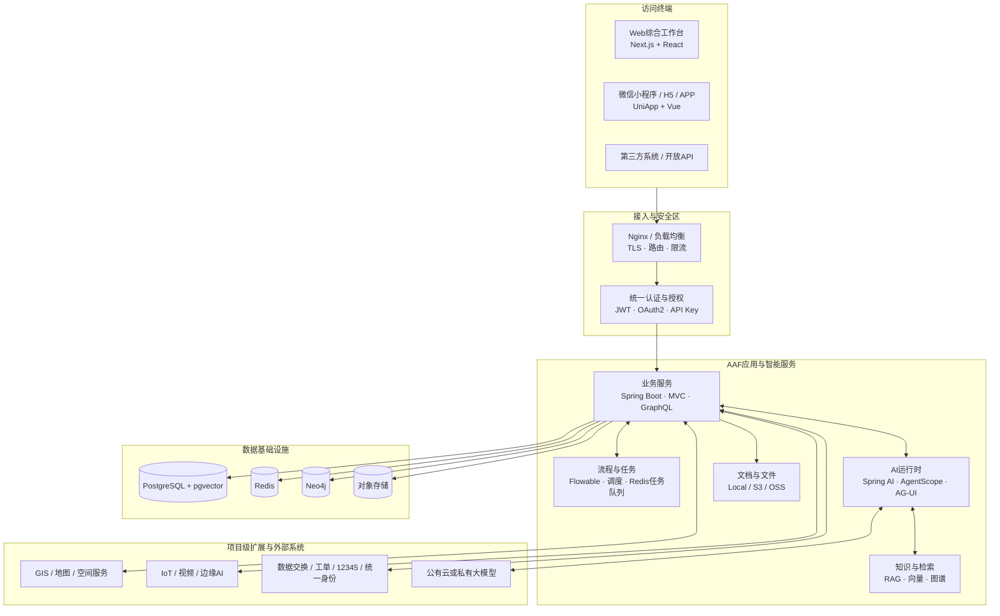

# 政府AI产品平台技术说明

> **适用产品**：市政“智慧管家”、“小切口”民生服务需求挖掘、城市运行“智能报告”、“开店宝”商业决策工具。
>
> **技术基线说明**：本文依据截至2026-08-01的仓库依赖清单、`pnpm-lock.yaml`、Maven BOM、应用配置、Dockerfile和Docker Compose编写。Java侧采用BOM版本，前端表格优先采用锁文件解析版本并在必要处同时标注`package.json`声明范围；正式交付时将形成锁定版软件物料清单（SBOM），并在兼容性、安全扫描和验收通过后确定生产版本。

## 1. 客户摘要

本方案基于 **AAF（Agentic Application Framework）AI原生应用框架**建设。平台采用前后端分离、多端接入、模块化单体起步、数据与AI能力分层的架构，既能以传统业务系统方式稳定承载账户、权限、数据、工单、审批和报表，又能通过Agent、知识库、工作流和人工审批门提供受控的AI能力。

### 1.1 核心技术结论

| 关注点 | 方案结论 |
|---|---|
| 后端 | Java 25 + Spring Boot 4.0.6，采用Spring MVC与虚拟线程，兼顾同步编程可维护性和高并发I/O处理 |
| AI底座 | Spring AI 2.0.0-M6 + AgentScope 2.0.0，支持模型适配、Agent执行、RAG、工具调用、人工审批和执行追踪 |
| Web端 | Next.js 16.2.6 + React 19.2.6 + TypeScript 6.0.3 + Tailwind CSS 4.3（锁文件解析版本），支持服务端渲染、流式界面和复杂数据工作台 |
| 移动端 | UniApp 3 + Vue 3.4.38 + TypeScript 6.0.3（工作区锁文件覆盖版本），具备一套代码构建微信小程序、H5及Android/iOS应用的工程基础 |
| 数据底座 | PostgreSQL 18 + pgvector 0.8.2、Redis 8.6、Neo4j 2026.05，分别承担业务/向量、缓存/任务、图关系数据 |
| 流程协同 | Flowable 8 BPMN工作流，承载派单、审核、会签、签发和人在回路等长流程 |
| 实时交互 | REST/GraphQL用于业务数据，SSE用于AI流式输出，WebSocket用于双向实时协作，AG-UI承载Agent事件 |
| 部署 | 当前仓库提供Docker Compose全栈部署；可扩展到云主机、托管数据库或Kubernetes高可用架构 |
| AI算力 | 使用外部或政务云模型API时，业务平台本身不要求GPU；私有大模型和视频AI需独立GPU/边缘算力规划 |
| 场景扩展 | GIS、PostGIS、IoT/MQTT、视频协议和边缘视觉模型按客户现网定制接入，不宣称为当前基础镜像内置能力 |

### 1.2 方案特色

1. **业务与AI双内核**：传统业务事务、权限和工作流由确定性系统负责，AI只在授权范围内理解、推荐、生成和调用工具。
2. **模型可替换**：通过Spring AI、AgentScope和OpenAI兼容接口接入不同模型，降低对单一厂商绑定。
3. **人在回路**：高风险、低置信度或不可逆操作进入人工审批，不允许模型直接替代行政和专业决策。
4. **知识可溯源**：PostgreSQL全文/向量检索与Neo4j图关系结合，回答可关联知识来源、模型版本和执行记录。
5. **多端一致体验**：Web提供综合工作台和驾驶舱基础，移动端提供巡查、处置、审核和便民服务的多端承载基础；各产品领域页面、终端能力与业务接口按项目实现并验收。
6. **渐进式部署**：可从单机试点起步，再把数据库、缓存、对象存储、应用节点和AI推理逐步拆分为高可用服务。
7. **开放集成**：通过REST、OpenAPI、GraphQL、Webhook、SSE、WebSocket和MCP连接现有政务系统、工具和模型。

## 2. 总体技术架构



### 2.1 分层职责

| 层次 | 主要职责 | 技术实现 |
|---|---|---|
| 终端表现层 | 工作台、驾驶舱、移动业务承载基础、便民服务入口和AI对话 | Next.js/React、UniApp/Vue、ECharts、响应式组件 |
| 接入安全层 | HTTPS、反向代理、认证、鉴权、限流、跨域和审计 | Nginx、Spring Security、JWT/OAuth2、API Key |
| 业务服务层 | 用户组织、数据管理、工单、报告、项目、计量、审批 | Spring Boot、Spring MVC、JPA、GraphQL、Flowable |
| 智能服务层 | Agent、模型路由、RAG、工具、记忆、人工确认、溯源 | Spring AI、AgentScope、AG-UI、MCP、向量与图检索 |
| 数据基础层 | 事务、向量、缓存、任务、图谱、文件和审计数据 | PostgreSQL/pgvector、Redis、Neo4j、S3/OSS/本地文件 |
| 场景接入层 | GIS、物联、视频、热线、政务数据和第三方模型 | 项目适配器、标准API、Webhook及客户现有交换平台 |

### 2.2 架构形态

当前后端采用**模块化单体**：一个Spring Boot启动服务内部按框架、智能、系统和业务模块分包，统一事务和部署，降低项目初期的分布式复杂度。Web、移动端和后端独立构建。随着数据量或组织规模增长，可以优先横向扩展无状态应用节点，并将数据库、Redis、Neo4j、对象存储和模型推理解耦为独立高可用服务；只有出现明确的团队、容量或故障隔离需求时再拆分业务微服务。

这种方式适合政府项目从试点到规模化的演进：首期交付组件少、故障定位直接，后期仍保留标准接口和独立数据服务的扩展空间。

## 3. 技术栈基线

### 3.1 后端与AI

| 分类 | 当前选型 | 版本基线 | 主要用途 |
|---|---|---:|---|
| 编程语言 | Java | 25 | 后端业务、AI编排、接口和任务处理 |
| 应用框架 | Spring Boot | 4.0.6 | 应用启动、依赖管理、配置和生产能力 |
| Web模型 | Spring MVC + Virtual Threads | 随Boot/JDK | REST、SSE、文件和高并发I/O请求 |
| 安全 | Spring Security + OAuth2 Resource Server | 随Boot | JWT认证、方法级授权和资源保护 |
| ORM | Spring Data JPA + Hibernate | 随Boot | 关系数据访问、事务和乐观锁 |
| 数据迁移 | Flyway | 随Boot | 数据库Schema和种子数据版本管理 |
| API | REST + Spring GraphQL + SpringDoc OpenAPI | SpringDoc 3.0.3 | 内外部接口、灵活查询和接口文档 |
| 工作流 | Flowable | 8.0.0 | BPMN流程、人工任务、会签和状态跟踪 |
| AI抽象 | Spring AI | 2.0.0-M6 | ChatModel、向量存储、结构化输出和工具调用 |
| Agent运行时 | AgentScope Harness | 2.0.0 | Agent执行、模型适配、状态和AG-UI事件 |
| 模型供应商扩展 | OpenAI、DashScope、Anthropic适配 | 随AgentScope | 多模型选择与替换 |
| 协议和工具 | AG-UI、MCP | 当前已接入 | 前后端Agent事件和受控外部工具接入 |
| 跨Agent协议 | A2A | BOM版本预留，运行时未启用 | 需恢复运行时依赖、源码编译并完成兼容与安全验收后按项目启用 |
| 规则与DSL | Easy Rules、ANTLR4 | 4.1.0 / 4.13.2 | 轻量规则和DSL解析 |
| 文档处理 | PDFBox、Apache POI、Fesod、Jsoup、CommonMark | BOM锁定 | PDF/Office/Excel/HTML/Markdown处理 |
| 韧性治理 | Resilience4j、Bucket4j | 2.4.0 / 8.18.0 | 超时、重试、熔断、限流和配额 |

> **版本治理提示**：Spring AI当前为里程碑版本`2.0.0-M6`。生产交付原则上优先采用稳定版本；如因兼容性必须保留M6，须形成风险接受记录，锁定依赖仓库、SBOM和制品，覆盖模型调用、向量检索、工具调用及流式协议回归，准备依赖回退方案并约定升级维护窗口。升级到后续稳定版同样必须先完成兼容性验证，不能在生产环境直接滚动升级依赖。

### 3.2 Web前端

| 分类 | 当前选型 | 版本基线 | 客户价值 |
|---|---|---:|---|
| 应用框架 | Next.js | 锁文件16.2.6（声明`^16.2.4`） | App Router、服务端渲染、流式渲染和独立部署 |
| UI框架 | React | 锁文件19.2.6（声明19.x） | 组件化界面、并发渲染和服务端组件 |
| 语言 | TypeScript | 锁文件6.0.3（根清单原声明5.9.x，工作区override生效） | 严格类型、接口契约和可维护性；交付前需统一声明与锁文件 |
| 样式 | Tailwind CSS | 4.3.x | 统一设计Token、响应式和快速主题定制 |
| 组件体系 | shadcn + Base UI | 当前锁定版本 | 源码可控、无障碍原语和项目级定制 |
| 服务端状态 | TanStack Query | 5.x | 缓存、重取、分页和乐观更新 |
| UI状态 | Zustand | 5.x | 轻量客户端状态，不复制服务端数据 |
| 表单校验 | React Hook Form + Zod | 7.x / 4.x | 类型化表单和前后端输入校验 |
| AI交互 | assistant-ui + AG-UI | 当前锁定版本 | 流式对话、工具结果、Agent状态和人工审批界面 |
| 富文本 | Lexical | 0.45.x | 文档编辑、Markdown和协同扩展 |
| 数据图表 | ECharts/Recharts | 5.6 / 3.x | 驾驶舱、趋势、统计和报告图表 |
| 流程图 | React Flow | 12.x | 流程、任务、Agent拓扑和关系展示 |
| 画布/协同 | tldraw + Yjs | 5.x / 13.x | 专题画布和多人协同扩展 |
| 实时通信 | SSE + WebSocket | 浏览器原生 | AI流式输出、任务进度和双向协作 |
| 工程编排 | Nx + pnpm | 22.7 / 11.1.1 | Monorepo增量构建、测试和依赖治理；Web镜像构建已固定pnpm 11.1.1 |

#### Web端特色

- **综合工作台**：适合事件列表、地图、图表、报告、审批和AI助手并列工作。
- **流式AI体验**：AG-UI事件驱动界面展示生成进度、工具调用结果和人工确认点，而不是只返回一段文字。
- **配置化业务视图**：EntityDef等元数据可驱动列表、表单、看板和仪表盘，减少重复页面开发。
- **复杂可视化能力**：ECharts、React Flow和三维/画布依赖支持城运驾驶舱、流程和关系分析；具体地图仍按项目选择地图引擎。
- **安全渲染**：输入校验、HTML清理、权限组件和服务端路由保护共同降低前端风险。
- **可访问性与响应式**：组件体系支持键盘操作和不同屏幕尺寸，具体适老化及无障碍等级在UI专项中验收。

### 3.3 移动端、小程序和APP

| 分类 | 当前选型 | 版本基线 | 主要用途 |
|---|---|---:|---|
| 跨端框架 | UniApp | 3.0 | 一套代码编译到小程序、H5、Android和iOS |
| UI框架 | Vue | 3.4.x | Composition API和组件化开发 |
| 语言 | TypeScript | 锁文件6.0.3（移动清单原声明5.5.x，工作区override生效） | 多端接口和模型类型约束；交付前需统一声明与锁文件 |
| 构建 | Vite | 5.2.8 | 快速开发和多环境构建 |
| UI组件 | Wot UI | 锁文件2.0.8（声明`^2.0.5`） | 移动端表单、导航、反馈和主题组件 |
| 样式 | UnoCSS | 66.x | 多端兼容原子样式和主题Token |
| 状态管理 | Pinia | 2.3.x | 登录、客户端状态和持久化 |
| 请求层 | Alova + UniApp Adapter | 锁文件3.5.1 / 2.0.16 | 缓存、重试、分页和OpenAPI代码生成 |
| 图表 | ECharts/uni-echarts | 6.0 / 2.2 | 移动态势、统计和轻量驾驶舱 |
| 流式通信 | 分端SSE + WebSocket | 当前实现 | AI回复、任务状态和实时通知 |
| Markdown | marked + mp-html | 14.x / uni_modules | AI内容和知识文档渲染 |

#### 支持终端

- **主要目标**：微信小程序和H5。
- **可构建目标**：Android、iOS、支付宝/百度/抖音/飞书/QQ等小程序平台及鸿蒙相关目标。
- **项目原则**：并非一次交付所有终端。每个终端需分别完成账号资质、SDK许可、隐私政策、真机兼容和应用商店/小程序审核。

#### 移动端特色

- 移动端工程已具备多端构建、流式通信和通用页面基础；导航、签到、现场取证、具体工单反馈和离线草稿属于市政项目功能，需结合终端权限、地图SDK、弱网策略和业务接口实现并验收。
- 领导和审核人员可移动查看摘要、图表、批注和审批。
- 微信小程序通过分块请求适配流式AI输出，H5采用标准SSE，上层交互保持一致。
- 平台差异集中在适配层，业务页面减少条件编译和重复实现。

### 3.4 数据与基础设施

| 组件 | 当前Compose基线 | 主要职责 | 生产注意事项 |
|---|---:|---|---|
| PostgreSQL + pgvector | PostgreSQL 18 / pgvector 0.8.2 | 业务事务、配置、审计、全文与向量数据 | 生产建议托管高可用或主备，启用备份/PITR并评估向量索引内存 |
| Redis | 8.6 | 缓存、会话、权限缓存、分布式租约和轻量任务队列 | 生产建议主从/哨兵或托管版，禁止作为唯一业务真理源 |
| Neo4j | 2026.05 Community | 知识图谱、关系检索和多跳关系 | Community为单实例；高可用需评估Enterprise/托管版或恢复方案 |
| 文件存储 | 本地、S3兼容、阿里云OSS | 附件、报告、图片、视频和AI产物 | 生产优先对象存储，启用生命周期、版本和服务端加密 |
| Nginx | stable-alpine | TLS终止、反向代理和统一入口 | 可替换为政务云负载均衡/WAF/Ingress |
| 应用运行时 | Java 25 / Node 24.16 | 后端和Next.js独立运行 | 使用容器资源限制、非root前端用户和健康探针 |
| Schema管理 | Flyway | 数据库变更版本化 | 多副本生产部署建议使用单独迁移作业或严格发布门控 |

当前平台**没有引入Kafka或RabbitMQ**。异步任务采用PostgreSQL持久化、Redis通知/Streams、重试和死信机制，可满足试点及常规业务。若市级物联事件达到持续高吞吐、需要长期事件回放或多消费方解耦，再通过容量测试决定是否引入专业流式消息平台，避免为“技术完整”提前增加运维复杂度。

## 4. AI技术能力与可信控制

### 4.1 AI能力链

```text
用户/系统请求
  → 身份、权限、配额和输入校验
  → Assistant理解意图和业务上下文
  → Agent规划受限任务
  → RAG检索知识 / 调用授权工具 / 执行工作流
  → 模型生成结构化结果
  → 事实、规则、风险和置信度检查
  → 自动返回 / 等待人工确认 / 转人工处理
  → 保存结果、来源、模型版本、工具记录和反馈
```

### 4.2 可复用能力

| 能力 | 技术实现 | 政府场景价值 |
|---|---|---|
| 多模型适配 | Spring AI、AgentScope模型扩展、OpenAI兼容接口 | 可连接政务云模型、国产模型服务或外部模型，不固化单厂商 |
| Agent编排 | AgentScope Harness + AAF Assistant/Agent分层 | 把复杂任务拆成检索、计算、写作、校验和审批步骤 |
| RAG知识增强 | PostgreSQL FTS/pgvector + Neo4j图关系 | 让回答基于政策、指标、案例和业务数据，保留来源 |
| 工具调用 | 工具注册表、权限校验、MCP连接和执行收据 | AI只调用已登记、已授权的业务能力 |
| 工作流 | Flowable BPMN + Agent节点/人工任务 | AI任务可暂停、等待会签或人工补充后继续 |
| 人在回路 | Human Approval、授权挑战和前端审批UI | 对派单、发布、资源配置等高风险动作设置人工门 |
| 执行追踪 | TraceId、执行事件、模型/Token计量、操作日志 | 支持问题定位、审计、成本分析和结果复现 |
| 模型治理 | 模型配置、路由、灰度/回滚扩展、反馈数据 | 支持按任务选择模型并持续评测，不将模型当黑箱 |
| 韧性与成本 | 超时、重试、熔断、缓存、预算和配额 | 模型不可用时可降级，避免调用失控和费用失控 |

### 4.3 AI部署方式

| 方式 | 说明 | 业务平台GPU要求 | 适用场景 |
|---|---|---|---|
| 公有云/行业云API | 通过HTTPS调用已采购模型服务 | 无 | 非敏感或完成合规审批的数据场景、快速试点 |
| 政务云模型服务 | 连接政务云内OpenAI兼容或厂商接口 | 无，模型平台独立提供GPU | 数据不出政务云、统一模型管理 |
| 客户本地私有模型 | 在客户GPU集群部署推理服务，AAF通过内网API调用 | AAF应用节点无GPU；推理节点单独规划 | 数据不出域、专有模型或离线环境 |
| 边缘视觉模型 | 在摄像头网关/边缘服务器推理，只上传结构化事件 | 中心应用无GPU；边缘节点按路数和模型规划 | 市政视频识别、低时延和隐私最小化 |

私有模型的GPU型号、显存、数量和并发与模型参数规模、量化方式、上下文长度及响应目标直接相关，必须通过候选模型压测确定，本文不提供脱离模型的固定GPU承诺。

### 4.4 可信AI边界

- AI生成内容默认视为建议或草稿，重要数字由确定性计算服务提供。
- 高风险、不可逆、跨部门或低置信度任务必须人工确认。
- RAG回答展示可用来源；来源不足时允许拒答，不要求模型强行补全。
- 不以模型内部思维链作为审计依据；审计保存输入摘要、检索来源、工具结果、模型/规则版本和人工决定。
- 模型调用遵循最小上下文、敏感字段脱敏和用途限制；是否允许外发由部署区域和数据分类决定。
- 模型、提示词、知识库和工具权限变更均应版本化，并在测试环境通过回归评测后发布。

## 5. 四个产品方向的技术映射

### 5.1 能力复用与扩展总览

| 产品 | 直接复用AAF底座 | 项目级新增/适配 | 推荐技术重点 |
|---|---|---|---|
| 市政“智慧管家” | 用户权限、通用事件/工单框架、Flowable流程、移动端工程基础、AI编排、通知审计 | 市政领域模型与页面、GIS/资产平台、IoT协议、视频平台、边缘视觉和设备管理适配 | 边缘推理、事件去重、时空关联、断网补传、设备健康和分级人工门 |
| 民生需求挖掘 | 数据权限、文档/知识库、向量检索、图关系、分析工作台、流程会签 | 12345/政务数据交换、主题模型、去标识加工、统计与评估模型 | 数据血缘、聚合隐私、证据卡、趋势异常、供需和公平性分析 |
| 城市运行智能报告 | 数据接入API、Flowable审核签发、文档版本、图表、AI受约束生成、审计 | GIS专题图、指标语义层、实时事件接入、电子签章/档案接口 | 冻结快照、确定性计算、异常独立预警、事实校验和版本勘误 |
| “开店宝” | 多租户权限、项目/报告、向量/图检索、模型路由、计量/账单基础、审计 | 合法人车流/消费数据、地图与空间计算、选址/预测模型、数据产品治理规则 | 聚合阈值、可解释评分、区间预测、用途控制和授权撤销联动 |

> **复用边界**：“直接复用”表示AAF已存在相应通用框架或模块基础，不表示四个产品的领域实体、业务页面、数据接口、算法模型和PRD验收场景已经交付；这些内容仍需按项目完成开发、配置、集成、评测和验收。

### 5.2 市政“智慧管家”技术落地

```text
摄像头/传感器/巡检终端
  → 客户现有视频与IoT平台或项目适配网关
  → 边缘AI输出结构化告警
  → AAF事件融合与GIS资产关联
  → Flowable派单、项目化移动端处置和复检
  → 结果回流模型评测与设施健康分析
```

AAF当前仓库没有内置MQTT客户端、GB/T 28181视频接入、PostGIS或特定地图SDK。项目实施时优先对接客户既有视频平台、物联网平台和GIS服务；只有现网不具备统一接入能力时，才新增设备网关、视频结构化服务、地图服务或时序数据库。这样可避免重复建设和设备厂商锁定。

### 5.3 民生服务需求挖掘技术落地

数据通过客户数据交换平台以API、数据库视图、消息或受控文件方式进入治理区，经去标识、口径映射和质量检查后，使用规则、向量语义、文本分类/聚类和时序统计形成候选信号。PostgreSQL保存主题、指标和证据，pgvector支持语义相似，Neo4j用于政策、服务、区域和议题关系。生成式AI只组织证据和起草研判材料，试点与资源配置由Flowable会签流程控制。

如涉及敏感原文、健康或困难群体数据，应在客户受控数据区加工；应用层只消费去标识或聚合结果。联邦学习、隐私计算等技术是否引入取决于多方数据是否确实不能汇聚，不作为默认复杂度。

### 5.4 城市运行“智能报告”技术落地

- PostgreSQL保存指标定义、计算快照、报告版本和处置行动。
- Redis承担实时状态、通知、任务协调和短期缓存。
- Web端通过ECharts展示趋势、对比和专题图表；地图由客户GIS服务或项目选定地图引擎提供。
- Flowable承载编制、校验、部门会签、签发、勘误和归档流程。
- AI基于冻结指标快照和证据包成文，不直接计算或修改正式数字。
- 重大异常预警使用独立规则和通知链路，不等待报告或大模型。

当实时数据量超出Redis任务与应用事件机制的适用范围时，可按压测结果增加流式消息平台和流计算引擎；该组件属于规模化扩展，不是当前默认部署前提。

### 5.5 “开店宝”技术落地

选址分析由项目参数、商圈聚合数据、点位特征、模型版本和报告版本共同构成。PostgreSQL/pgvector支持结构化特征和相似案例，Neo4j可表达商圈、业态、交通、政策和设施关系。模型服务输出维度贡献、预测区间和适用性，Web/移动端提供候选比较和情景模拟。

空间分析可优先调用客户现有GIS/地图服务；需要在数据库内进行大量缓冲区、路网或空间相交计算时，可在项目详细设计中增加PostGIS或独立空间服务。当前PostgreSQL镜像仅明确包含pgvector，不应把PostGIS视为已部署组件。

## 6. 系统集成方式

| 集成方式 | 适用场景 | 安全与可靠性要求 |
|---|---|---|
| REST/OpenAPI | 资产、事件、工单、指标、报告和主数据 | HTTPS/mTLS、OAuth2或API Key、幂等键、版本和错误码 |
| GraphQL | Web端复杂聚合查询和自描述数据 | 查询深度/复杂度限制、字段级授权、审计 |
| Webhook | 外部系统事件通知和异步回调 | HMAC签名、时间戳、防重放、重试和死信 |
| SSE | AI文本、任务进度和单向状态推送 | 鉴权、断线重连、事件游标和超时控制 |
| WebSocket | 语音、协同、双向实时消息 | 握手鉴权、心跳、会话隔离和消息上限 |
| MCP | 受控外部工具接入 | 工具白名单、参数Schema、权限、超时和执行收据 |
| 数据库/文件交换 | 遗留政务系统和批量数据 | 只读账号、交换区、校验和、批次血缘、病毒扫描 |
| 对象存储 | 图片、视频、报告和大文件 | STS临时凭证、最小目录权限、服务端加密和生命周期 |

接口详细字段、主数据编码、增量策略、频率、SLA和数据责任方在项目《接口清单与数据字典》中确认。平台不会默认直接写入第三方系统的核心表，业务变更优先通过受控API或工作流完成。

## 7. 部署模式

### 7.1 模式一：试点一体化部署

适用于功能验证、演示或低负载试点。使用一组Docker Compose服务部署Nginx、Web、后端、PostgreSQL、Redis和Neo4j；文件可使用本地持久卷或对象存储。

**优点**：部署快、组件少、成本低。  
**限制**：默认是单实例，主机或数据库故障会中断服务，不作为高可用生产承诺。

仓库配置包含便于本地开发和首次启动的默认参数，不能原样作为安全生产配置。正式部署须使用生产覆盖配置和Secret管理，并通过配置预检阻止弱密码、占位密钥或缺失密钥启动。

### 7.2 模式二：标准生产部署

```text
政务外网/互联网用户
  → WAF/负载均衡/双Nginx
  → Web节点 × 2+
  → 后端节点 × 2+
  → 高可用PostgreSQL + 高可用Redis + Neo4j服务 + 对象存储
  → 监控、日志、备份和安全审计平台
```

应用节点无状态或将共享状态放入Redis/数据库，可横向扩展。数据库和缓存优先使用客户政务云托管服务。Neo4j Community单实例不具备集群能力，正式高可用场景需选择Neo4j Enterprise/托管服务，或明确单实例快速恢复方案和业务降级策略。

### 7.3 模式三：Kubernetes/容器平台部署

适用于客户已有政务云容器平台和统一DevSecOps体系的场景。后端与Web分别使用Deployment/Service，Secret由平台密钥服务管理，通过Ingress/WAF暴露HTTPS，使用HPA扩容并配置存活、就绪探针。

当前仓库提供Docker Compose拓扑和Dockerfile构建基础；后端镜像已精确选择`*-exec.jar`可执行制品，Web镜像已固定pnpm 11.1.1，当前容量受限部署默认仅发布和使用`latest`标签，生产Compose的`IMAGE_TAG`可按环境覆盖为版本号或Git SHA。正式交付前仍须通过完整镜像构建、容器启动、数据库迁移及健康检查验证。仓库已有Kubernetes部署建议，但没有声明一套已验收的生产Helm Chart。因此Kubernetes交付需要结合客户平台补齐工作负载、网络策略、持久卷、迁移Job、PodDisruptionBudget和监控规则，并单独验收。

### 7.4 模式四：离线或数据不出域部署

所有应用、数据库、文件、模型和监控组件部署在客户内网，不访问公共互联网。需要客户提供：

- 内网镜像仓库、Maven/npm依赖代理或离线安装介质；
- 私有模型推理服务及OpenAI兼容/厂商API；
- 内网对象存储、短信/邮件/消息替代通道；
- 离线许可证、补丁和病毒库更新流程；
- 经审批的数据交换和运维审计通道。

## 8. 部署环境要求

### 8.1 服务器与软件环境

| 项目 | 要求/建议 |
|---|---|
| 操作系统 | 生产建议64位Linux；客户标准服务器发行版需支持Docker/容器运行时。开发可使用Windows、Linux或macOS |
| CPU架构 | 当前容器优先按x86_64验证；ARM64或国产CPU需执行JDK、Node原生依赖和镜像兼容测试 |
| 容器环境 | Docker Engine 24+与Docker Compose V2，或客户Kubernetes兼容平台 |
| 后端运行时 | Java 25；容器镜像已包含运行时，宿主机部署时需安装兼容JDK |
| 前端运行时 | Node.js 24；生产镜像基线为24.16.0，仓库`packageManager`与Web Dockerfile均固定pnpm 11.1.1 |
| 构建环境 | Maven Wrapper、Node 24、pnpm 11、Nx 22.7；建议在CI中统一构建而非生产机编译 |
| 时间与区域 | 全节点使用NTP统一时钟；当前应用默认`Asia/Shanghai`和UTF-8 |
| 域名证书 | 正式域名、可信TLS证书及续期机制；生产仅通过HTTPS访问 |
| 存储 | SSD用于数据库；报告、图片、视频优先进入对象存储，不长期堆积在应用容器 |

### 8.2 推荐资源规格

下表是**启动评估值，不是固定最低承诺**。最终规格需依据用户数、接口并发、数据日增量、视频路数、向量规模、报告生成量、模型时延和可用性目标压测确定。

| 场景 | 推荐起步规格 | 说明 |
|---|---|---|
| 开发环境 | 4 vCPU、8 GB内存、100 GB SSD | 可只用Compose启动数据库，前后端本地运行；全部容器同时运行建议增加内存 |
| 单机试点 | 8 vCPU、16 GB内存、200 GB SSD | 外部模型API、低并发、非高可用；文件量大时另配对象存储 |
| 标准生产应用层 | 后端2台×4 vCPU/8 GB；Web 2台×2 vCPU/4 GB | 经负载均衡部署，按压测横向扩容 |
| 标准生产数据库 | PostgreSQL 4 vCPU/16 GB高可用起；Redis 2 vCPU/4 GB高可用起；Neo4j 4 vCPU/8—16 GB起 | 向量/图数据规模对内存敏感，建议独立节点或托管服务 |
| 市级数据分析 | 后端3台以上×8 vCPU/16 GB；PostgreSQL 8 vCPU/32 GB以上起 | 仅为初始估算，需根据指标、事件和向量数据专项压测 |
| 边缘视频AI | 每个边缘节点按摄像头路数、分辨率、帧率和模型实测 | 独立NPU/GPU设备，不计入中心平台规格 |
| 私有大模型 | 独立GPU推理集群 | 显存、并发和量化由具体模型与响应SLA决定 |

### 8.3 容量估算输入

正式容量设计至少需要客户提供：

1. 总用户数、日活用户、峰值在线和角色分布。
2. API平均/峰值QPS、报告并发、AI并发和允许响应时间。
3. 结构化数据存量、日增量、保留年限和历史重算范围。
4. 文档数量、平均大小、向量切片数量和Embedding维度。
5. 图节点/关系规模及典型查询跳数。
6. 摄像头和传感器数量、事件上报频率、视频是否入中心及保留周期。
7. 图片、音视频和报告文件日增量、下载流量及归档周期。
8. 高可用等级、RPO/RTO、同城/异地灾备和安全审计保留期。

容量估算建议：

```text
事务数据容量 = 日增量 × 保留天数 × 索引/版本/膨胀系数
向量容量 ≈ 向量条数 × 维度 × 单元素字节数 × 索引系数
文件容量 = 日文件量 × 平均大小 × 在线保留期 × 副本/版本系数
峰值应用实例数 = 峰值QPS ÷ 单实例压测安全吞吐 × 冗余系数
```

所有估算需保留30%—50%的增长与故障冗余，并以试点真实数据校准。

### 8.4 客户端环境建议

| 客户端 | 建议环境 |
|---|---|
| PC Web | 推荐Chrome或Edge最近两个稳定版本；Safari当前稳定版按需验证；不支持Internet Explorer |
| 屏幕 | 综合工作台推荐1920×1080或更高，最低分辨率和缩放比例在UI验收中确认 |
| 微信小程序 | 使用客户注册并认证的小程序账号；微信基础库版本在发布前按功能和终端覆盖测试确定 |
| Android/iOS | 支持范围由UniApp构建产物和客户终端调查确定，需完成真机、权限和商店审核测试 |
| 网络 | 普通业务建议稳定HTTPS连接；现场移动端应设计弱网重试、断点和离线草稿 |

## 9. 网络与端口要求

### 9.1 生产网络分区

```text
用户访问区 / 政务外网
  → WAF或负载均衡
DMZ接入区
  → Nginx/Ingress，仅开放443
应用区
  → Web和后端容器
数据区
  → PostgreSQL、Redis、Neo4j、对象存储
管理区
  → 堡垒机、监控、日志、备份和镜像仓库
AI区/边缘区
  → 私有模型服务或边缘推理节点
```

数据库、Redis、Neo4j管理端口不得暴露到互联网或普通用户网段。生产Compose覆盖配置已移除这些组件的宿主机端口，只由应用内网访问。

### 9.2 端口清单

| 端口 | 组件 | 暴露范围 | 说明 |
|---:|---|---|---|
| 443 | Nginx/负载均衡 | 用户访问区 | 正式HTTPS入口 |
| 80 | Nginx | 可选 | 仅用于跳转HTTPS或证书验证 |
| 3000 | Next.js Web | 仅接入区到应用区 | 不直接对公网暴露 |
| 8080 | Spring Boot API | 仅接入区/内部系统 | REST、GraphQL、SSE、WebSocket和健康检查 |
| 5432 | PostgreSQL | 仅应用/运维区 | 业务与向量数据 |
| 6379 | Redis | 仅应用/运维区 | 强密码、ACL/网络限制 |
| 7687 | Neo4j Bolt | 仅应用区 | 图数据库访问 |
| 7474 | Neo4j Browser | 仅受控运维区或关闭 | 不对业务用户开放 |
| 9090等 | Prometheus/监控 | 仅管理区 | 以客户监控平台实际端口为准 |
| 443出站 | 模型、OSS、短信等 | 按白名单 | 外部服务域名/IP需客户审批 |

## 10. 安全技术方案

### 10.1 身份与权限

- Spring Security承担统一认证和方法级安全，支持JWT、OAuth2资源服务器和外部API Key。
- 平台具备用户、组织、角色、权限、资源关系和数据范围控制基础，可按项目映射客户统一身份/SSO。
- Web和移动端的按钮/菜单权限只用于体验控制，后端始终进行最终鉴权。
- 高权操作、模型工具调用和临时授权应具有审批、范围、有效期和撤销能力。
- 管理员、审计员、算法运营员和业务人员实行职责分离。

### 10.2 数据安全

- 数据进入系统前完成分类分级、合法用途和责任主体确认。
- 传输使用TLS；数据库、备份和对象存储按客户安全要求启用静态加密。
- 生产敏感配置不得使用源码中的开发默认值或写入镜像；正式交付应清除/覆盖开发默认参数，使用Secret Manager、Vault、KMS或容器Secret注入。启动前必须校验数据库、Redis、Neo4j、JWT、查询令牌、模型和存储密钥，任一必需项缺失、为占位值或不满足强度要求时阻断启动。
- 文件上传执行类型、大小、恶意内容和病毒检查；下载使用短期签名URL或后端授权代理。
- 日志不记录密码、Token、模型密钥、完整个人信息和未脱敏业务原文。
- 训练、评测和生产数据分区，生产数据进入非生产环境须审批和脱敏。

### 10.3 应用与接口安全

- Nginx/WAF控制TLS、请求大小、速率和异常流量；API实施认证、授权、参数校验和配额。
- 重要写操作使用幂等键、乐观锁或分布式锁，防止重复提交和并发覆盖。
- Webhook采用签名、时间戳和防重放；WebSocket握手后仍按消息和资源校验权限。
- AI工具执行使用白名单、参数Schema、授权门、超时、预算和审计，不允许模型任意执行系统命令。
- Actuator、日志级别调整、数据库管理和Neo4j Browser只允许管理网访问；当前生产配置仅通过Web开放`health`和`prometheus`，不开放`loggers`与`info`。
- 依赖和镜像在CI中开展漏洞、许可证和物料清单检查；高危漏洞处置后方可发布。

### 10.4 合规说明

AAF提供落实安全控制的技术基础，但等保定级、密码应用、数据出境、个人信息保护、国产化适配和行业测评需要结合客户部署环境、数据类型及当地制度开展专项设计和第三方测评。本文不替代正式测评结论。

## 11. 高可用、备份与灾备

### 11.1 建议可用性设计

| 组件 | 标准生产建议 | 降级策略 |
|---|---|---|
| Nginx/负载均衡 | 双节点或云负载均衡 | 切换健康节点 |
| Web | 2个以上实例 | 静态降级页或保留核心查询 |
| 后端 | 2个以上实例、就绪/存活探针 | 关闭非核心AI、导出和批处理 |
| PostgreSQL | 托管高可用或主备，定期恢复演练 | 只读模式或停止写入，避免数据分叉 |
| Redis | 主从/哨兵或托管高可用 | 缓存穿透保护；关键状态回源数据库 |
| Neo4j | Enterprise/托管集群或单实例快速恢复 | 暂停图增强，回退关系/向量基础检索 |
| 对象存储 | 多副本、版本和生命周期 | 暂停上传，保留结构化业务处理 |
| AI模型 | 主备模型或规则/人工降级 | 关闭自动生成，不阻断核心业务流程 |

### 11.2 备份建议

- PostgreSQL：每日备份；重要生产建议开启WAL归档/PITR，并定期做恢复验证。
- Neo4j：当前Community版本采用停库dump或经一致性验证的卷快照/快速重建方案，备份与应用版本关联；在线备份和集群能力需使用Enterprise或托管版，并单独核验许可和恢复流程。
- Redis：按其承担的非权威状态配置RDB/AOF；不能以Redis备份替代业务数据库备份。
- 对象存储：启用版本、生命周期和必要的跨区域复制，数据库中的文件元数据与对象同时校验。
- 配置与密钥：备份配置模板和密钥引用，不在普通备份中明文保存密钥。
- 报告、模型卡、规则、模板和审计记录按档案及安全要求保留。

### 11.3 建议恢复目标

| 场景 | 建议RPO | 建议RTO | 备注 |
|---|---:|---:|---|
| 试点/非关键业务 | ≤24小时 | ≤8小时 | 以单机和每日备份为基础 |
| 标准生产核心业务 | ≤15分钟 | ≤2小时 | 需高可用数据库、持续归档和自动化恢复 |
| 城运重大预警链路 | ≤5分钟 | ≤30分钟 | 应与报告等非实时能力资源隔离 |
| 法定更高要求 | 按客户标准 | 按客户标准 | 需专项灾备架构、演练和预算 |

以上是建议目标，最终以客户业务连续性要求、基础设施能力和灾备演练结果为准。

## 12. 监控与运维

### 12.1 可观测性

后端已引入Spring Boot Actuator、Micrometer、Prometheus Registry和Sentry集成基础，可输出健康、信息、Prometheus指标和日志；生产Web端点最小化为`health`与`prometheus`。生产可接入客户现有Prometheus/Grafana、日志平台、APM或政务云监控；Grafana、集中日志平台和Sentry服务不是当前Compose默认必启组件。

| 监控域 | 重点指标 |
|---|---|
| 用户与入口 | 请求量、状态码、P95/P99、限流、登录失败、WAF告警 |
| 应用 | JVM CPU/堆/GC、虚拟线程、连接池、任务队列、定时任务、文件处理 |
| 数据库 | 连接数、慢查询、锁、复制延迟、磁盘、向量索引和备份状态 |
| Redis | 内存、命中率、连接、延迟、Streams积压和故障切换 |
| Neo4j | 堆/页缓存、查询延迟、节点关系增长、备份和可用性 |
| AI | 调用量、时延、Token/费用、错误、重试、模型切换、人工接管和质量指标 |
| 业务 | 事件闭环、报告生成、审核积压、数据新鲜度、授权到期和SLA |
| 安全 | 越权、异常下载、密钥使用、规则/模型发布和审计完整性 |

### 12.2 建议告警阈值

初始可采用CPU持续5分钟超过80%、内存超过85%、磁盘超过80%、API错误率超过1%、数据库连接超过80%、Redis内存超过70%等门槛；上线后按正常业务基线和误报情况调整。AI调用延迟必须按模型和任务类型分别设定，不能使用统一30秒阈值评价所有场景。

### 12.3 发布与回滚

```text
代码/配置变更
  → 静态检查、类型检查、单元测试和构建
  → 依赖/镜像安全扫描
  → 测试环境部署和数据库迁移验证
  → 集成、性能、AI评测和用户验收
  → 生产人工批准
  → 灰度/滚动部署
  → 健康检查与业务冒烟
  → 异常时应用回滚，数据库执行预先设计的兼容/恢复方案
```

数据库迁移默认由Flyway管理。生产变更应优先采用向前兼容的“扩展—迁移—收缩”方式，不能简单依赖回滚镜像解决不可逆数据库变更。

### 12.4 日常运维制度

- 每日检查核心服务、数据接入、备份、任务积压和重大安全告警。
- 每周分析慢查询、容量趋势、AI错误和高频人工修正。
- 每月执行依赖与镜像安全扫描、权限复核、模型质量和成本复盘。
- 每季度开展密钥轮换、恢复抽测、账号清理和容量评估。
- 每半年至少开展数据库恢复、模型降级、网络中断和人工接管演练。

## 13. 研发质量保障

| 范围 | 当前工具/方式 | 质量作用 |
|---|---|---|
| Monorepo | Nx 22.7 + pnpm 11 | 统一任务编排、缓存和受影响项目检查 |
| Web代码质量 | TypeScript、Biome、Vitest、Testing Library | 类型、格式、单元和组件测试 |
| Web端到端 | Playwright项目 | 跨浏览器核心流程测试 |
| 移动端 | vue-tsc、ESLint、UniApp Automator基础 | 类型检查、多端构建和自动化扩展 |
| 后端 | Maven、Spotless、JUnit 5、Mockito | 构建、格式、单元和服务测试 |
| 架构规则 | ArchUnit | 模块边界和依赖方向检查 |
| 集成/验收 | Maven Failsafe `*IT` / `*AcceptanceTest` | 数据库、接口和Gherkin业务验收 |
| 数据库 | Flyway迁移校验 | Schema可重复、可追踪 |
| 发布 | 容器镜像、健康检查、人工生产门 | 环境一致和风险控制 |

政府场景还需增加真实业务样本评测、数据质量测试、接口联调、权限矩阵测试、弱网/断网测试、性能压测、灾备演练和第三方安全测试。

## 14. 当前底座与项目扩展边界

### 14.1 当前仓库已具备

- Java/Spring业务服务、Web管理端和UniApp移动端工程。
- 用户、组织、角色、权限、API Key、审计和数据访问控制基础。
- REST、GraphQL、SSE、WebSocket、Webhook和OpenAPI能力。
- PostgreSQL/pgvector、Redis、Neo4j和本地/S3/OSS文件存储适配。
- Flowable流程、任务队列、通知、文档、知识库和向量/图检索。
- Spring AI、AgentScope、模型管理、工具调用、人工审批和AG-UI交互基础。
- Dockerfile、Compose拓扑、Nginx接入、健康检查和Prometheus指标基础；镜像产物与pnpm工具版本已固定；当前容量受限部署默认使用`latest`标签，需要不可变发布时应覆盖`IMAGE_TAG`并配置镜像保留策略。仍需在目标环境完成完整镜像构建和启动冒烟。

### 14.2 必须结合客户项目补充

| 能力 | 当前状态 | 项目处理方式 |
|---|---|---|
| GIS地图引擎 | Web依赖未固定地图SDK | 根据客户天地图、超图、ArcGIS或既有GIS平台选择适配 |
| PostGIS | 当前PostgreSQL镜像只明确包含pgvector | 只有需要数据库空间计算时才增加并完成迁移/性能验证 |
| IoT/MQTT | 当前依赖未包含MQTT客户端 | 优先接客户IoT平台API；需要直连时新增协议网关 |
| 视频接入 | 未内置GB/T 28181或厂商视频SDK | 对接客户视频平台，边缘服务输出结构化事件 |
| 边缘视觉AI | 不属于中心AAF容器 | 按算法、路数和硬件单独建设与验收 |
| 实时流平台 | 默认无Kafka/RabbitMQ | 达到持续高吞吐和回放需求后按压测引入 |
| 电子签章/档案 | 需接客户平台 | 按客户接口、证书和归档规则开发 |
| 隐私计算 | 非默认组件 | 多方数据确实不可汇聚时专项选型 |
| 国产化环境 | 未在本文声明完成全栈认证 | 按CPU、OS、数据库、中间件和浏览器清单逐项适配测试 |
| 等保/密评 | 技术底座可配合 | 由客户定级并开展专项建设和正式测评 |

这种边界说明不是能力缺失，而是为了避免重复建设和不必要的技术绑定。政府场景中的GIS、视频、物联网和统一身份通常已有存量平台，合理方案应以标准接口复用现网为优先。

## 15. 客户需提供的环境与资料

### 15.1 基础设施

- 部署区域、网络分区、服务器/容器平台和数据库服务。
- 域名、TLS证书、WAF/负载均衡、堡垒机和运维账号流程。
- 对象存储、备份空间、日志/监控平台和镜像仓库。
- 公有/政务云模型账号或私有模型服务地址、模型清单和调用配额。
- SMTP、短信、企业微信/钉钉/飞书等消息通道（按需）。

### 15.2 系统与数据

- 统一身份、组织、GIS、IoT、视频、工单、12345、数据交换、电子签章等系统接口资料。
- 数据目录、字段说明、主数据编码、更新频率、历史规模和质量报告。
- 数据分类分级、授权依据、允许用途、保留期限和脱敏规则。
- 峰值用户、事件量、报告量、文件量、视频路数和增长预测。

### 15.3 管理与验收

- 业务牵头人、数据责任人、安全责任人、运维责任人和接口责任人。
- 可用性、性能、RPO/RTO、日志审计和安全测评要求。
- AI准确性、人工接管、红线错误、评测样本和验收方法。
- 试点范围、基线数据、并发压测场景和推广决策门。

## 16. 建议交付物

| 阶段 | 主要技术交付物 |
|---|---|
| 调研 | 现状架构图、系统接口清单、数据目录、容量输入和风险清单 |
| 总体设计 | 总体架构、网络分区、部署拓扑、技术选型差异和安全方案 |
| 详细设计 | 数据模型、接口规范、权限矩阵、流程、AI链路、模型卡和提示词/规则版本 |
| 实施 | 源代码、迁移脚本、容器镜像、配置模板、接口适配器和部署脚本 |
| 测试 | 单元/集成/验收/性能/安全/AI评测报告和问题闭环 |
| 上线 | SBOM、发布说明、备份恢复、监控告警、应急预案和回滚方案 |
| 运维 | 运维手册、巡检表、容量报告、模型运营报告和培训材料 |

## 17. 技术选型事实依据

本文技术版本主要核对自以下实际工程文件：

- 根目录与Web/移动端的`package.json`、`pnpm-lock.yaml`和`nx.json`；
- `apps/service/pom.xml`、`aaf-dependencies/pom.xml`、`aaf-framework/pom.xml`和`aaf-api/pom.xml`；
- `apps/service/Dockerfile`、`apps/webui/Dockerfile`；
- `docker-compose.yml`、`docker-compose.prod.yml`；
- `application.yaml`和`.env.example`；
- 项目架构、技术栈、部署和运维文档。

当设计文档与构建清单版本不一致时，本文优先采用当前实际构建/部署配置；正式发布以经过CI构建和验收的锁定依赖及镜像摘要为准。

## 18. 相关产品方案

- [市政“智慧管家”完整解决方案](../../../prd/government-ai-governance/municipal-smart-steward.md)
- [“小切口”民生服务需求挖掘完整解决方案](../../../prd/government-ai-governance/public-service-demand-mining.md)
- [城市运行“智能报告”完整解决方案](../../../prd/government-ai-governance/city-operations-intelligent-report.md)
- [“开店宝”商业决策工具完整解决方案](../../../prd/government-ai-governance/store-opening-decision-tool.md)
- [AAF架构概览](../../architecture.md)
- [后端技术选型](../service/tech-stack.md)
- [Web技术选型](../webui/tech-stack.md)
- [移动端技术选型](../uniapp/tech-stack.md)
- [Docker部署指南](../../../guide/deployment/docker-deploy.md)
- [运维手册](../../../guide/deployment/ops-manual.md)

## 19. 变更记录

| 日期 | 版本 | 变更内容 | 原因 | 影响评估 |
|---|---|---|---|---|
| 2026-08-01 | 1.0.0 | 基于实际工程依赖和部署配置形成政府AI产品客户技术说明 | 为四个政府AI产品提供统一技术沟通和部署依据 | 待架构、安全、运维及客户信息化部门联合评审 |
