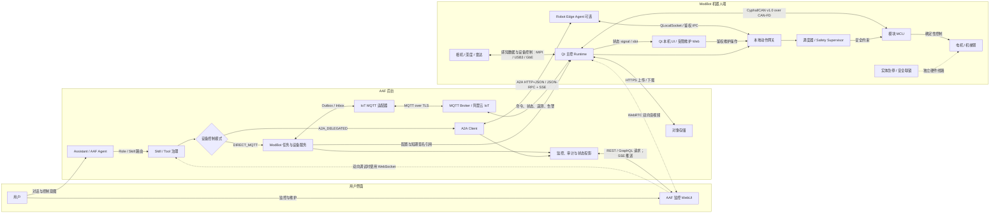
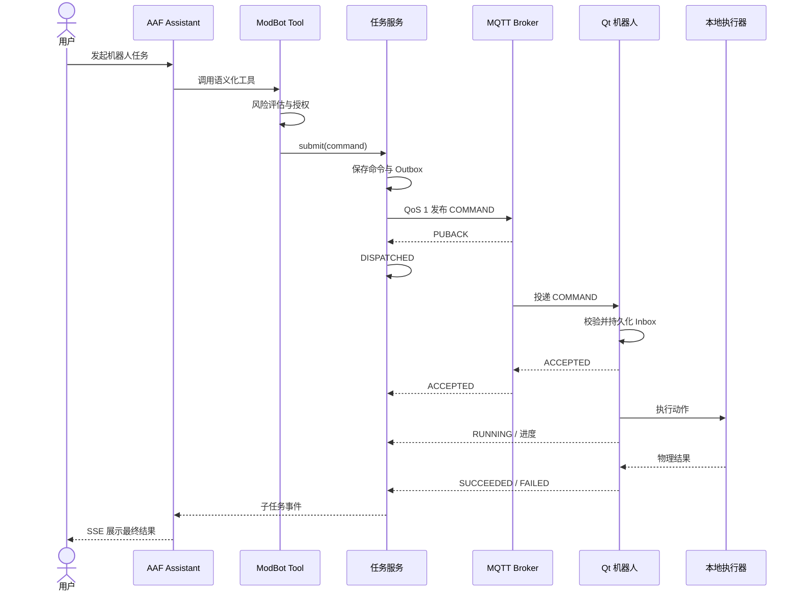
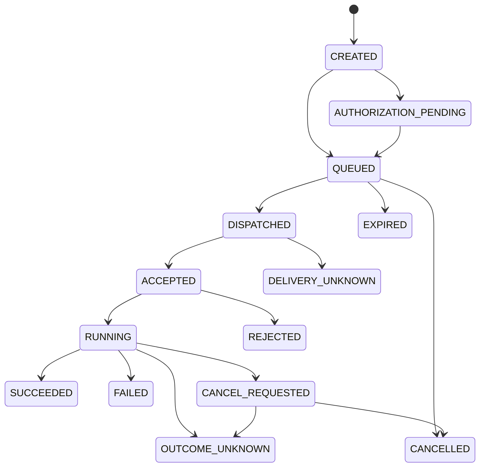

# Qt 机器人通信设计

> 本文是整体通信协议的已采纳规划基线，当前尚未进入实现。MQTT over TLS 是设备到后台的控制与遥测基线；具备自主规划能力的机器人可增加 A2A 高层任务通道和受限 Robot Edge Agent。模块硬实时、监控界面和媒体分别使用适合自身约束的协议，不以 WebSocket 统一全部链路。

## 决策与边界

### 决策状态

| 项目 | 状态 |
|---|---|
| 整体协议矩阵 | **已采纳，作为后续设计与实现基线** |
| MQTT、A2A 与机器人端代码 | **未开始实现**；仓库当前只有依赖预留和设计文档 |
| 具体 Broker、CAN 收发器和边缘硬件 | 待 PoC 与硬件选型后锁定 |
| 高风险设备控制 | 开发前仍需完成人类架构与安全审核 |

“最终决策”表示协议职责和边界不再继续发散，不表示代码已经完成。后续 PoC 只允许补充端口、产品型号、容量参数和 Schema 细节；若改变协议职责，必须重新进行架构评审。

### 目标

用户通过 AAF 助理发起语义任务，例如“回充”“移动到桌边”或“拍摄当前画面”。AAF 完成意图路由、工具授权和任务编排，Qt 机器人完成协议校验、本地安全判断及硬件执行，并持续回传进度和结果；当机器人具备独立感知、规划和多步骤执行能力时，AAF 可通过 A2A 将高层目标委托给机器人 Agent。

方案满足以下约束：

- 模块控制、云端任务、监控和媒体按实时性与可靠性分层，不强行统一协议。
- MQTT 至少一次投递不会导致物理动作重复执行。
- A2A Task 与物理 Device Command 分层建模，不形成两个任务真理源。
- 高风险动作经过白名单、参数级风险判断和人工授权。
- 机器人 Agent 不能绕过本地动作网关、安全监督和资源锁。

### 最终协议矩阵

| 通信范围 | 最终协议 | 主要用途 | 决策说明 |
|---|---|---|---|
| 实体急停与安全联锁 | 独立硬件线路 | 急停、限位、看门狗 | 最高优先级，不依赖 Qt、Agent 或网络 |
| 模块 MCU ↔ 主控 | Cyphal/CAN v1.0 over CAN-FD | 热插拔发现、类型化状态、RPC 控制、心跳、诊断与文件服务 | 使用标准传输和服务；只自定义 ModBot DSDL 能力接口。工业驱动通过 CANopen FD/CiA 402 或 EtherCAT 网关隔离接入 |
| 高带宽感知模块 ↔ 主控 | MIPI CSI / USB3 / Gigabit Ethernet | 视频、深度图、点云 | 不进入 CAN-FD、MQTT 或 A2A 正文 |
| Qt 进程内与本机进程间 | signal/slot + `QLocalSocket` | UI、动作网关、Agent sidecar IPC | 大数据使用共享内存；采用 ROS 2 时，机器人节点可使用 DDS |
| 主控 ↔ AAF 设备服务 | MQTT over TLS | 在线、命令、取消、ACK、状态、遥测、告警 | 设备通信基线；仅在网络限制 8883 时使用 MQTT over WSS/443 |
| AAF Agent ↔ Robot Edge Agent | A2A HTTP+JSON / JSON-RPC + SSE，可选 | 高层目标、Task、Message、Artifact、补充输入 | 只有机器人部署受限 Agent 时启用，不替代 MQTT |
| AAF 服务 ↔ 监控 WebUI | REST/GraphQL + SSE | 历史查询、状态和任务进度 | 双向遥控或交互调试才启用 WebSocket，命令仍经过后台治理 |
| 实时音视频 | WebRTC | 摄像头、麦克风、远程通话 | 与控制面隔离，避免媒体拥塞阻断安全消息 |
| 配置、日志包和大文件 | HTTPS + 对象存储 | 配置、地图、图片、日志和后续 OTA 产物 | MQTT/A2A 只传摘要和短期签名引用 |
| 机器人本地维护入口 | Qt 本机界面；受限本地 Web 可选 | 配网、工厂测试、离线诊断 | 不建设第二套业务后台；本地 Web 默认关闭写操作并禁止原始驱动访问 |

WebSocket 不是统一基础协议：它适合浏览器双向实时交互，也可以承载 MQTT/AMQP 穿过只开放 443 的网络，但不能替代 CAN-FD 的确定性、MQTT 的设备会话语义、A2A 的 Agent Task 语义或 WebRTC 的媒体能力。

### 微软 Agent 技术对照

| 项目 | 实际运行与传输 | 本方案决策 |
|---|---|---|
| [Magentic-One](https://www.microsoft.com/en-us/research/articles/magentic-one-a-generalist-multi-agent-system-for-solving-complex-tasks/) | 微软基于 AutoGen 的多智能体系统，由 Orchestrator 维护 Task/Progress Ledger 并动态选择专业 Agent | 借鉴编排算法和治理机制，不视为设备协议 |
| [Microsoft Agent Framework Magentic orchestration](https://learn.microsoft.com/en-us/agent-framework/workflows/orchestrations/magentic) | 官方示例使用 `InProcessExecution.RunStreamingAsync` 与 `WorkflowEvent`；框架定义工作流事件，不规定 WebSocket | 可用于 AAF 或 Robot Edge Agent 内部编排；宿主可把事件投影到 SSE/WS，但不改变 Agent 通信语义 |
| [AutoGen Distributed Agent Runtime](https://microsoft.github.io/autogen/stable/user-guide/core-user-guide/framework/distributed-agent-runtime.html) | 实验性 host/worker Runtime 使用 `GrpcWorkerAgentRuntimeHost` 和 `GrpcWorkerAgentRuntime`；跨语言消息共享 protobuf | 不作为 ModBot 跨设备合同，避免绑定实验性 Runtime；其 host/worker 思路仅供实现参考 |
| [Microsoft Agent Framework A2A](https://learn.microsoft.com/en-us/agent-framework/user-guide/agents/agent-types/a2a-agent) | 跨系统 Agent 互操作，优先 HTTP+JSON，也支持 JSON-RPC，流式使用 SSE | 采用为 AAF ↔ Robot Edge Agent 的可选高层协议 |
| AutoGen Studio / 监控 UI | 可能使用 WebSocket 转发运行事件和实时日志，但属于宿主或界面实现 | WebSocket 只用于监控/交互层，不作为 Magentic 或机器人可靠投递协议 |

Magentic 值得借鉴的是以下编排机制：

- **双账本**：Task Ledger 保存目标、事实、假设与计划；Progress Ledger 保存当前步骤、Agent 分配和完成证据。
- **动态能力选择**：根据任务和 Agent/机器人能力选择下一执行者，而不是固定顺序广播。
- **停滞治理**：显式配置 `maxRounds`、`maxStalls` 和 `maxResets`，达到阈值后重规划或转人工。
- **人机协同**：高风险计划在执行前审核，执行中需要额外信息时通过请求/响应暂停并恢复。
- **可恢复事件流**：中间事件、checkpoint/恢复响应和最终产物分离，支持监控和断点恢复。

在 ModBot 中映射为：AAF/Fleet Orchestrator 维护高层任务账本，经 A2A 委托给一个或多个 Robot Edge Agent；机器人返回任务进度和 Artifact。MQTT 继续承担在线状态、遥测和 `DIRECT_MQTT` 命令，所有物理动作必须经过控制租约、Tool 治理、本地动作网关和 Safety Supervisor。

禁止照搬以下做法：把 WebSocket 当可靠消息队列；让所有模块都变成 Agent；跨设备共享无界对话上下文；Agent 直接生成 CAN/串口/驱动指令；重规划绕过既有授权、租约或安全状态。

### 整体通信拓扑



图中实线表示常规控制或数据链路，点线表示独立旁路能力。浏览器的 WebSocket 调试请求仍先进入 AAF 工具治理，不能直连 MQTT Topic、Robot Edge Agent 或硬件驱动。Assistant、AAF Agent 和 Tool 输入均不得构造 `topic`、`qos`、`rawCommand`、GPIO、CAN 或串口帧；Topic 只能由可信设备路由器生成。实体急停是独立硬件链路，优先级高于所有软件协议。

## 架构设计

### 模块总线协议

ModBot 主模块总线采用 [Cyphal/CAN v1.0](https://opencyphal.org/) over CAN-FD。选择 Cyphal 是因为它已提供确定性传输、发布订阅、RPC、DSDL 类型系统、Heartbeat、可选 Plug-and-Play 节点分配，以及诊断、配置和文件传输等标准服务；不需要重新发明 CAN ID 分配、分帧、序列化和服务调用。

| 协议层 | 采用内容 | 禁止重复自研 |
|---|---|---|
| 物理与链路 | ISO CAN-FD、收发器、终端电阻和总线时序 | 私有电气层、与 CAN-FD 并行的控制线协议 |
| 传输与寻址 | Cyphal/CAN v1.0、transfer-ID、优先级和 Plug-and-Play node-ID | 私有 CAN ID 位域、私有分片与重组、第二套节点寻址 |
| 通用服务 | 标准 Heartbeat、Register、诊断日志、时间同步和文件服务 | 自定义心跳、配置读写、诊断与固件文件传输协议 |
| 领域接口 | `modbot.*` DSDL 能力、状态、故障和类型化 RPC | `action + any payload` 通用命令、原始 CAN/串口透传 |
| 工具链 | MCU 使用稳定版 libcanard；Nunavut 生成 C/C++ 类型；Yakut/Yukon 用于调试 | 各模块手写不同序列化器或调试协议 |

ModBot 自定义的是能力语义，而不是底层通信协议。建议 DSDL 命名空间按能力拆分，例如 `modbot.module.Descriptor`、`modbot.mobility.State`、`modbot.mobility.NavigateTo`、`modbot.expression.SetExpression` 和 `modbot.sensor.EnvironmentState`。每个执行动作使用有界、强类型 RPC，不定义可携带任意 JSON、脚本或寄存器地址的通用 `Command`。

模块接入与控制遵循以下规则：

- 模块以唯一硬件身份参与 Plug-and-Play node-ID 分配，分配结果可持久化；上线后发布标准 Heartbeat 和 ModBot 描述信息。
- 状态、遥测和故障使用发布订阅；需要结果确认的执行动作使用类型化 RPC。
- 普通模块可以发布事实，但执行命令默认只接受 Qt 主控或独立安全控制器，禁止任意模块相互控制。
- 高带宽图像、点云和音频继续走 MIPI、USB 或 Ethernet，Cyphal 只承载控制、摘要和引用。
- Cyphal/CAN 不提供链路加密与强身份认证；内部总线通过物理隔离、模块身份白名单、签名固件和动作网关限制风险，禁止后台直接桥接原始 CAN 帧。

CANopen FD/CiA 402 和 EtherCAT 不与 Cyphal 主模块总线混跑。必须接入工业伺服、变频器或现成运动控制器时，由专用模块网关管理下游 CANopen FD/EtherCAT 设备；该网关在 ModBot 总线上表现为一个受治理的 Cyphal 节点。这样保留工业设备 profile，同时维持主控侧唯一协议和能力模型。

### 机器人 Agent 分层

| 运行层 | 是否部署 Agent | 职责 |
|---|---|---|
| AAF 云端 | 是 | 全局意图、用户上下文、跨系统编排、风险授权和最终反馈 |
| 机器人核心计算单元或边缘网关 | 按需部署一个 | 本地感知融合、有限规划、多步骤任务和离线受限自治 |
| Qt 确定性控制运行时 | 否 | 协议校验、命令调度、状态机、本地动作网关和硬件适配 |
| 模块 MCU、传感器和执行器 | 否 | 采样、闭环控制、看门狗和安全联锁 |

ModBot 的目标形态可以包含 Robot Edge Agent，但首版默认使用 `DIRECT_MQTT`，先验证设备身份、状态机和安全执行；只有出现“机器人需要自主分解目标、请求补充输入、产出多个 Artifact 或在本地执行受限多步骤任务”时才启用 `A2A_DELEGATED`。

启用 A2A 时遵循以下约束：

- A2A Task 表示“整理桌面并回充”等高层任务，一个 Task 可产生多个本地 Device Command，两者不能共用状态枚举。
- 使用 `contextId / a2aTaskId / planRevision / commandId / traceId` 建立父子关联；Task 终态只能由必要子命令和任务策略归约得出。
- Robot Edge Agent 只调用本地动作网关，不能直接访问驱动、串口、CAN、GPIO 或绕过 Safety Supervisor。
- 每台机器人在同一时间只能有一个控制模式和一个资源租约；不在 A2A 失败时自动降级为 MQTT 重发任务。
- Agent Card 只描述能力，不代表授权；A2A 调用仍需校验设备绑定、Skill、租户、风险策略和短期身份。

A2A Task 按下表自上而下归约，命中第一条即停止；具体协议字段和状态名称在 AAF A2A 规范从 placeholder 转为正式设计时锁定：

| 优先级 | 子执行事实 | A2A Task 投影 |
|---|---|---|
| 1 | 任一必要子命令为 `DELIVERY_UNKNOWN` 或 `OUTCOME_UNKNOWN` | 保持最近非终态并标记 `outcomeUnknown=true`，禁止完成、失败或取消 |
| 2 | 已请求取消，但仍有活动子命令 | `WORKING` 并标记 `cancelRequested=true`，停止生成新命令 |
| 3 | 已请求取消，全部活动子命令确认安全停止且无未知结果 | `CANCELED` |
| 4 | 必要子命令失败/拒绝，或全部成功但任务后置条件不成立 | `FAILED`；后置条件失败使用 `POSTCONDITION_FAILED`，Artifact 保存部分结果 |
| 5 | 全部必要子命令成功且任务后置条件成立 | `COMPLETED` |
| 6 | 需要用户输入时为 `INPUT_REQUIRED`；已有活动子命令时为 `WORKING`；其余为 `SUBMITTED` | 对应非终态 |

取消 A2A Task 时先停止生成新命令，再逐个取消活动子命令；在所有必要资源确认安全前不得进入 `CANCELED`。迟到的设备终态通过带版本的 reconciliation 事件重新执行完整归约，原状态历史不可覆盖。

A2A 幂等以 `(tenantKey, robotAgentId, contextId, a2aTaskId)` 为键并绑定请求 hash。重复请求返回已有 Task；同键不同内容拒绝为 `IDEMPOTENCY_CONFLICT`。本地 Agent 在派发前持久化 `a2aTaskId + planRevision + stableStepKey → commandId + payloadHash`，恢复或重复消息复用映射。重新规划必须增加 `planRevision`；同一资源上的旧步骤未安全终止前，不得生成替代动作。

控制模式的唯一真理源是服务端 `DeviceControlLease`：

```text
DeviceControlLease(deviceKey, mode, holderId, leaseEpoch,
                   fenceToken, expiresAt, stateVersion)
```

模式切换先停止旧模式接单并处理活动任务，再签发递增 `leaseEpoch` 的短期租约；机器人持久化并 ACK 新租约后，新模式才生效。每个 A2A Task 和 MQTT 命令都携带 `fenceToken`，Qt 动作网关拒绝过期或不匹配的 token。租约定期续期，过期后进入安全保持态并拒绝新的高风险动作；存在结果未知的活动任务时，除人工隔离/急停流程外不得切换控制模式。

Robot Edge Agent 建议作为独立受限进程或边缘网关服务，通过本机鉴权 IPC 调用 Qt 动作网关，避免 LLM 推理阻塞 Qt MQTT 与安全线程。本地 IPC 优先使用受文件权限保护的 `QLocalSocket`/Unix domain socket，并校验 OS 对端身份和短期进程凭证；授权精确到 `capability + action`，凭证支持轮换和吊销。每次调用记录 Agent 身份、A2A Task、Device Command、fence token 和策略决策，原始驱动接口不暴露给 Agent。

如果硬件资源充足且团队愿意维护 A2A HTTP/SSE 协议栈，也可在 Qt 进程外的 Qt 服务中实现；A2A 使用 mTLS 或 OAuth2，机器人位于 NAT 后时通过受管边缘网关或零信任网络接入，不直接暴露公网端口。任何部署方式都不能把模型推理放进硬实时控制线程。

### 服务端组件

```text
ModBotTool
  → ToolPermissionGuard（白名单、参数风险、授权、审计）
  → ModBotCommandService
      → DeviceRegistry / CapabilitySnapshot
      → CommandPolicy（所有权、在线状态、遥测新鲜度、资源互斥）
      → CommandRepository + Outbox
  → MqttOutboxRelay
      → TrustedTopicResolver
      → DeviceMessagePublisher

MqttInboundAdapter
  → EnvelopeVerifier
  → InboxDeduplicator
  → DeviceEventService
      → 命令状态机 / 在线状态投影 / 审计
      → Assistant 子任务事件 / SSE 状态投影
```

职责边界：

- `aaf-framework/intelligent` 保持 Assistant、Skill、Agent、Tool 与授权能力，不依赖 ModBot。
- ModBot 业务模块拥有设备注册、能力、任务、状态机、风险规则和审计语义。
- MQTT 适配器只负责连接、编解码和收发，不包含机器人动作语义。
- PostgreSQL 是任务、outbox、inbox 和审计的事实源；Redis 只缓存在线投影、限流信息和通知。
- Broker 只负责传递消息，retained 消息不能作为任务历史或最终状态库。

### Qt 端组件

| 组件 | 职责 |
|---|---|
| `MqttConnectionManager` | TLS 连接、重连、订阅、LWT 与证书切换 |
| `EnvelopeValidator` | 大小、Schema、签名、目标、时效和序列校验 |
| `CommandInbox` | SQLite WAL 持久化、幂等检测和结果回放 |
| `CapabilityRegistry` | 将能力、动作和 Schema 版本映射到预注册 Handler |
| `CommandScheduler` | 资源互斥、优先级、deadline 和取消令牌 |
| `SafetySupervisor` | 速度、区域、碰撞、看门狗和实体急停状态 |
| `HardwareAdapter` | 封装 ROS、串口、CAN、GPIO 或厂商 SDK |
| `TelemetryAggregator` | 采样、限频、聚合、背压和关键告警优先级 |
| `CredentialStore` | 设备私钥、证书和轮换状态 |

Qt 线程模型：主线程只处理 UI；`QMqttClient` 驻留独立 MQTT I/O 线程；命令调度与 SQLite 使用固定归属线程；阻塞硬件适配器使用专用线程或有界线程池；安全监督使用高优先级线程或独立控制器。MQTT 回调只做轻量校验和入队，不等待硬件执行结果。跨线程使用 queued signal/slot 或有界消息队列。

### 端到端执行流程



PUBACK 只允许进入 `DISPATCHED`，不能进入 `ACCEPTED`；只有机器人持久化命令并明确确认后才进入 `ACCEPTED`。

## 通信契约

### Topic

逻辑 Topic 由平台适配器映射为实际 Broker 或阿里云 IoT Topic：

```text
/aaf/v1/{tenantKey}/{deviceKey}/down/command
/aaf/v1/{tenantKey}/{deviceKey}/down/cancel
/aaf/v1/{tenantKey}/{deviceKey}/down/config
/aaf/v1/{tenantKey}/{deviceKey}/up/ack
/aaf/v1/{tenantKey}/{deviceKey}/up/status
/aaf/v1/{tenantKey}/{deviceKey}/up/result
/aaf/v1/{tenantKey}/{deviceKey}/up/telemetry
/aaf/v1/{tenantKey}/{deviceKey}/up/alert
/aaf/v1/{tenantKey}/{deviceKey}/up/presence
/aaf/v1/{tenantKey}/{deviceKey}/up/capabilities
```

`tenantKey` 和 `deviceKey` 是系统生成的不透明稳定键。命令、取消、ACK、状态、结果和告警使用 QoS 1；普通高频遥测使用 QoS 0。命令与取消禁止 retained；在线状态和能力快照可 retained。单条消息默认上限 64 KiB，媒体和文件不得进入 MQTT 正文。

### 命令信封

```json
{
  "specVersion": "1.0",
  "messageId": "msg_01J...",
  "messageType": "COMMAND",
  "commandId": "cmd_01J...",
  "correlationId": "toolcall_01J...",
  "causationId": "task_01J...",
  "traceId": "trace_01J...",
  "targetDeviceKey": "dev_K7X...",
  "controlMode": "DIRECT_MQTT",
  "leaseEpoch": 17,
  "fenceToken": "fence_01J...",
  "issuedAt": "2026-09-09T10:56:36.803Z",
  "expiresAt": "2026-09-09T10:57:06.803Z",
  "sequence": 1842,
  "command": {
    "capability": "mobility",
    "action": "navigateTo",
    "schemaVersion": 1,
    "arguments": {
      "xMm": 1200,
      "yMm": 350,
      "maxSpeedMmPerSec": 250
    }
  },
  "governance": {
    "policyDecisionId": "pd_01J...",
    "riskLevel": "MEDIUM",
    "approvalGrantId": null
  },
  "integrity": {
    "keyId": "aaf-command-2026-09",
    "algorithm": "Ed25519",
    "signature": "base64url..."
  }
}
```

规则：

- JSON Schema 对 `command.arguments` 严格校验；未知动作、版本或危险字段直接拒绝。
- 数值使用带单位的字段名和整数标度，避免单位歧义及浮点签名差异。
- 使用 RFC 8785 规范化 JSON 后签名；除 `integrity.signature` 本身外，`controlMode`、`leaseEpoch`、`fenceToken` 和其余信封字段全部进入签名内容。
- 同一 `commandId` 必须绑定相同 payload hash；不同内容返回 `IDEMPOTENCY_CONFLICT`。
- 上行消息增加 `bootId`、`statusSequence`、`deviceOccurredAt`、`resultCode` 和 `payloadHash`。

### 状态与错误语义



- `DELIVERY_UNKNOWN`：服务端已发布，但没有设备 ACK，不能判断是否送达。
- `OUTCOME_UNKNOWN`：设备开始执行后失联，不能伪装成失败、超时或已取消。
- `CANCEL_REQUESTED`：只表示取消意图；设备确认执行器安全停止后才能进入 `CANCELLED`。
- 迟到终态通过 reconciliation 事件修正投影，不能删除或覆盖历史状态。
- 每次状态变化携带状态版本；旧 `bootId` 或旧 `statusSequence` 不更新当前投影。

## 运行与安全

### 可靠性、超时与并发

- 服务端在同一数据库事务中写命令和 outbox；入站按 `messageId` 写 inbox 去重。
- Qt 在发送 `ACCEPTED` 前将命令写入 SQLite WAL；重复命令返回已有状态或结果，不重复调用执行器。
- 消息有效期、接收确认超时和动作执行 deadline 分别配置；自动重试复用原 `commandId`。
- 按 `mobility`、`arm`、`camera`、`audio` 等物理资源设置互斥组和队列上限。
- `bootId + sequence + resourceFence` 阻止重连后的旧控制权继续驱动硬件。
- 遥测拥塞时优先丢弃或合并普通采样，不得丢失 ACK、终态和安全告警。

### 在线与离线

机器人连接时发布 retained `ONLINE`，LWT 预设 retained `OFFLINE`。在线消息包含 `bootId`、连接 epoch、协议版本、固件版本和能力摘要；服务端投影为 `ONLINE / SUSPECT / OFFLINE / QUARANTINED`。心跳建议 30 秒，连续两个周期缺失进入 `SUSPECT`，三个周期进入 `OFFLINE`，生产值按网络测试调整。

离线策略由管理员和能力定义，Agent 不得自行选择：

| 策略 | 适用范围 | 行为 |
|---|---|---|
| `REJECT_WHEN_OFFLINE` | 移动、机械臂及高风险动作 | 离线立即拒绝 |
| `QUEUE_UNTIL_EXPIRES` | 可延迟、可幂等、低风险任务 | 只在有效期内等待 |
| `LOCAL_POLICY_ONLY` | 已签名本地任务 | 按区域、速度和资源上限执行 |

断网只能保持或收紧安全约束。云端取消不可达时，界面显示“取消请求未送达”或“结果未知”，不得显示“已停止”。硬件急停、本地避障和执行 deadline 由 Safety Supervisor 或独立安全控制器保证。

### 身份与安全

- 每台设备使用唯一身份和凭据，禁止共享车队密钥；优先使用 TLS 1.3，最低 TLS 1.2。
- Broker 支持时采用设备 mTLS；私钥存入 TPM、安全芯片或系统安全存储，不编译进程序。
- 设备仅可订阅自己的 `down/*`，仅可发布自己的 `up/*`；跨租户、跨设备及方向错误访问由 ACL 拒绝。
- 命令端到端签名，同时校验目标设备、有效期、sequence 和本地安全策略。
- 证书采用 active/next 双槽轮换；吊销时同步撤销 ACL、强制断连、标记 `QUARANTINED` 并阻断命令。
- 审计串联 `traceId → toolCallId → commandId → messageId → bootId`，但不记录私钥、证书、完整敏感遥测或长期媒体 URL。

## 验收与演进

### 验收条件

| 维度 | 验收标准 |
|---|---|
| 边界 | Tool Schema 不含 Topic、QoS 和原始硬件字段，未知能力无法执行 |
| 模块发现 | 新模块通过 Cyphal Plug-and-Play 获得唯一 node-ID，重连后恢复身份并发布标准 Heartbeat 与描述信息 |
| 协议唯一性 | Cyphal 主总线上不存在私有 CAN 分帧、第二套寻址、CANopen FD 或 EtherCAT 报文 |
| 模块类型安全 | 未注册 DSDL 类型、越界字段和通用任意 payload 命令均被拒绝，Nunavut 生成类型可跨 MCU/Qt 互操作 |
| 模块控制权 | 普通模块可发布状态但不能命令其他模块；非主控/安全控制器发出的执行 RPC 被拒绝并审计 |
| 工业网关 | CANopen FD/CiA 402 或 EtherCAT 设备仅存在于网关下游，主控只看到网关暴露的 Cyphal 能力 |
| 幂等 | 同一 MQTT 命令重复投递 100 次，物理 Handler 只执行一次 |
| A2A 幂等 | 同一 A2A Task 重复提交返回原任务；同键不同 hash 被拒绝 |
| A2A 重规划 | 恢复时复用 stableStepKey 映射；planRevision 不递增或旧步骤未安全终止时，替代动作被拒绝 |
| A2A 归约 | 按优先级决策表唯一归约；未知结果阻止终态，后置条件失败进入 `FAILED` |
| A2A 取消 | 取消后不再生成命令，逐个取消活动子命令，全部安全停止后才进入 `CANCELED` |
| 控制租约 | 新模式在机器人持久化并 ACK 租约后才生效；双租约和旧 fence token 均被拒绝 |
| 租约失效 | 租约过期后拒绝新高风险动作；存在未知结果时禁止切换模式 |
| 协议隔离 | A2A 失败不会触发 MQTT 自动重发或切换为 `DIRECT_MQTT` |
| Magentic 账本 | Task/Progress Ledger 可从 checkpoint 恢复；恢复后不重复生成已持久化的物理命令 |
| Magentic 停滞 | 达到 maxRounds/maxStalls/maxResets 后按策略重规划、暂停或转人工，不无限循环 |
| Magentic 投影 | 监控 SSE/WebSocket 断开不改变任务事实；重连后从持久事件重建进度，而非依赖连接内状态 |
| Magentic 安全 | 动态选 Agent 和重规划均不能扩大 Tool 权限、替换控制租约或绕过 Safety Supervisor |
| Agent 权限 | capability/action 越权、伪造身份、过期或吊销凭证和原始驱动访问均被拒绝；审计字段完整 |
| 过期 | 设备离线超过有效期再重连，命令被拒绝且不上电执行 |
| 投递 | 只有 PUBACK 时状态停留在 `DISPATCHED`，不显示设备已接收 |
| 取消 | 在线动作安全停止后才显示 `CANCELLED`，断网显示未知 |
| 恢复 | Qt 在 ACK 后崩溃，重启可恢复结果且不重复动作 |
| 在线 | 断电触发 LWT，旧连接消息不能覆盖新 `bootId` 状态 |
| 安全 | 跨设备 Topic、伪造签名、错误目标、过期和重放消息全部拒绝 |
| 背压 | 遥测洪峰不阻塞 MQTT 心跳、取消、ACK、终态和安全告警 |
| 追踪 | `DIRECT_MQTT` 可追踪到设备命令；`A2A_DELEGATED` 还可追踪到 A2A Task；两者均关联策略授权 |

低风险在线命令从服务端 `DISPATCHED` 到设备 `ACCEPTED` 的首版性能目标为 P95 小于 2 秒；动作完成 SLA 按具体 capability 单独定义。

### 渐进部署

```text
契约与模拟器
  → 本地 Broker + Qt 无头模拟器，验证重复、乱序、断网、过期和 ACL
只读接入
  → 单设备只上报 presence、capabilities、telemetry 和 alert
低风险控制
  → 开放低速、短时、可逆动作，启用 outbox/inbox、取消和 SSE
高风险与车队
  → 启用参数级审批、mTLS 轮换、隔离、资源 fencing 和水平扩展
```

生产适配器优先对接现有技术选型中的阿里云 IoT Platform；本地与 CI 使用测试 Broker。生产启动时只能选择一个 MQTT 适配器，不做本地 Broker 与云端 Broker 双写。开发前通过 PoC 固定 MQTT 版本、X.509、离线队列、retained、消息大小和共享订阅能力。

### 非目标与后续决策

首版不实现云端硬实时控制、MQTT 音视频、远程 shell、任意脚本或串口透传、OTA、ROS2 全量桥接，也不在机器人离线时运行不受约束的 LLM Agent。以下主题需独立评审后推进：

- OTA 固件签名、灰度发布和回滚。
- ROS2 与 Capability Handler 的边界和实时性。
- WebRTC 信令、TURN 部署和媒体权限。
- 大规模车队分区、共享订阅与容量模型。
- 本地任务清单的签发、吊销和审计协议。

本设计涉及物理设备控制、权限和证书安全，属于高风险设计；进入开发前必须完成人类架构与安全审核。
