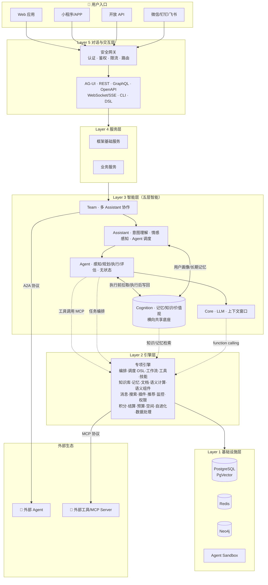

# AAF 架构概览

> 元引擎是这套分层架构的整体，不是某层的子项。整个 AAF 系统就是元引擎——将意图转化为执行，将执行转化为知识。

架构思想见 [架构思想](../explanation/architecture-thought.md)，本文档只做结构性概览和文档导航。

## **AI 原生六大核心能力**

| 能力 | 说明 |
| ------ | ------ |
| **AI 自动开发** | 意图 → 规范 → 代码，AI 参与架构决策、代码生成、审查、测试全生命周期 |
| **自动运维自进化** | 用户行为 → 效果评估 → 规范更新（人工确认）→ 代码重生成 → 沙箱验证 → 热部署，系统越用越强 |
| **元引擎无代码** | DSL 驱动实体/工作流/权限运行时，配置即运行，开发与运行边界消失 |
| **一切皆文档** | 所有制品（界面/工作流/组件/知识/对话）以文档形式存储，以 DSL 描述，规范是人机共同真理源 |
| **语义组件** | 后端输出 DSL，前端动态组装界面，同一套组件多端适配（Web/移动/微信/CLI） |
| **五层智能架构** | Core（LLM）→ Cognition（记忆/知识）→ Agent（任务执行）→ Assistant（会话/情感）→ Team（多智能体协作） |

## 系统全景图

## 五层架构

| 层次 | 名称 | 包含模块  | 职责 |
|------|------|--------|------|
| Layer 5 | 对话与交互层 | 意图理解、任务路由、多层协作可视化、编辑器内联命令、多端适配、REST API、WebSocket/SSE、RPC、CLI、DSL 指令  | 人机交互入口，意图表达与结果呈现，系统对外边界 |
| Layer 4 | 服务层 | 框架内置基础服务（用户、权限、文件、消息、外部集成等）；业务服务（用户在框架上构建的具体业务，可由元引擎自动生成） | 面向用户的具体业务逻辑 |
| Layer 3 | 智能层 | Core → Cognition + Agent → Assistant → Team | AI 推理与协作，五层智能架构，智能层依赖引擎层执行，不直接访问基础设施 |
| Layer 2 | 引擎层 | 调度机制（执行调度器、状态管理器、上下文管理器、置信度门控器、元数据管理器）；专项引擎（详见下方引擎表） | 通用执行能力，无具体业务语义 |
| Layer 1 | 基础设施层 | PostgreSQL + PgVector、Redis、Neo4j、向量库、Agent Sandbox、沙箱运行时     | 存储、通信、计算底座 |

**核心规则：上层可调用任意下层，禁止下层调用上层。**

## Layer 5 对话与交互层

> 人机交互入口，意图表达与结果呈现，系统对外边界。

**安全网关**（前置）：所有请求必须经过认证（JWT/OAuth2/SSO）、鉴权、限流后才能进入系统。

**接口类型**：REST API、GraphQL（灵活查询）、OpenAPI 规范（对外开放）、WebSocket/SSE（流式输出）、CLI、DSL 指令直接驱动。

**多端适配**：桌面 Web 双栏 / 移动端对话优先 / 微信轻量卡片 / CLI 纯指令，统一由 AG-UI 协议驱动。

## Layer 4 服务层

> 面向用户的具体业务逻辑，分框架内置基础服务和业务服务两类。

框架内置基础服务：用户与权限、文件存储、消息通知、外部系统集成（微信/钉钉/飞书等）。

业务服务：用户在 AAF 上构建的具体业务，不限领域。优先通过元引擎无代码层自动生成，复杂逻辑通过 AI 生成代码热加载挂载扩展点。

## Layer 3 智能层

> AI 推理与协作，五层智能架构，依赖引擎层执行，不直接访问基础设施。

Core（LLM 推理）→ Cognition（记忆/知识，横向共享底座）→ Agent（无状态任务执行）→ Assistant（会话/情感/调度）→ Team（多 Assistant 协作）

> 详见 [智能体系统设计](framework/core/agent.md)

## Layer 2 引擎层

> 通用执行能力，无具体业务语义，被上层直接调用。

### 调度机制

| 组件 | 职责 |
|------|------|
| 执行调度器 | DSL 路由、引擎编排、生命周期管理 |
| 状态管理器 | 会话 / 工作区 / 系统 / 元数据四层持久化状态 |
| 上下文管理器 | AI 推理临时上下文，跨会话引用、压缩归档 |
| 置信度门控器 | 自动执行 / 等待确认 / 转人工三档 |
| 元数据管理器 | 模块 / 插件 / 工具 / 组件元数据，语义漂移检测 |

### 专项引擎

| 引擎 | 职责 | 设计文档 |
|------|------|---------|
| 编排引擎 | 执行路径决策、引擎协同、置信度门控、响应式执行管道 | [orchestration.md](framework/engine/orchestration.md) |
| 调度引擎 | 异步任务队列、定时触发、重试策略、分布式锁 | [scheduler.md](framework/engine/scheduler.md) |
| DSL 引擎 | 多范式解析、分层转化、分域路由 | [magic-dsl.md](framework/dsl/magic-dsl.md) |
| 工作流引擎 | Flowable 封装、DSL 驱动、可视化设计 | [workflow.md](framework/engine/workflow.md) |
| 工具引擎 | 工具注册发现、调用封装、沙箱执行 | [tools.md](framework/engine/tools.md) |
| 技能引擎 | 技能定义、匹配路由、内置技能 | [skills.md](framework/engine/skills.md) |
| 文档引擎 | 文档全生命周期、版本、协同、执行文档 | [document-engine.md](framework/engine/document-engine.md) |
| 知识库引擎 | 向量检索、知识图谱、全局共享 | [nexus-knowledge.md](framework/engine/nexus-knowledge.md) |
| 记忆引擎 | 短期/长期/情景记忆、时序+语义双索引 | [atom-memory.md](framework/engine/atom-memory.md) |
| 语义计算引擎 | 语义相似度、漂移检测、横切支撑 | [semantic-compute.md](framework/engine/semantic-compute.md) |
| 语义组件引擎 | DSL 驱动动态 UI 组装、组件注册、多端适配、流式渲染 | [sense-ui.md](framework/engine/sense-ui.md) |
| 消息引擎 | 多渠道消息通知、模板管理、站内/邮件/短信/微信 | [message.md](framework/engine/message.md) |
| 数据处理引擎 | 结构化/半结构化数据批流处理与统计分析 | [data-process.md](framework/engine/data-process.md) |
| 外部数据源 | 外部数据库、API、文件系统对接 | [external-datasource.md](framework/engine/external-datasource.md) |
| 空间引擎 | 世界模型、物理规则、语义引力聚合 | [physics-spacetime.md](framework/engine/physics-spacetime.md) |
| 自进化引擎 | 行为采集、效果评估、规范更新、热部署 | [auto-dev.md](framework/auto-dev.md) |
| 积分引擎 | 贡献量化、积分账户、规则执行 | [credit-settlement.md](framework/engine/credit-settlement.md) |
| 结算引擎 | 支付接口、结算记录、争议仲裁 | [credit-settlement.md](framework/engine/credit-settlement.md) |
| 预算控制 | 执行前预估、超限介入、多维度约束 | [budget-control.md](framework/engine/budget-control.md) |
| 监控引擎 | AI 可观测性、指标系统、Token 统计、审计日志 | [monitor.md](framework/engine/monitor.md) |
| 搜索引擎 | 跨资源统一搜索、语义检索、权限过滤、结果聚合 | [search.md](framework/engine/search.md) |
| 插件引擎 | 插件注册/加载/隔离/版本管理，支撑市场生态 | [plugin.md](framework/engine/plugin.md) |
| 推荐引擎 | 基于使用历史和语义相似度的个性化推荐 | [recommendation.md](framework/engine/recommendation.md) |
| 权限引擎 | 认证、RBAC、数据权限、组织隔离 | [access-control.md](framework/security/access-control.md) |

## Layer 1 基础设施层

> 存储、通信、计算底座，无业务语义，最稳定

- **数据存储**：PostgreSQL（关系数据）、Redis（缓存 / 会话）、Neo4j（知识图谱）、向量库（语义检索）
- **运行时环境**：JVM 沙箱、Agent Sandbox、热加载、进程隔离、智能降级
- **消息与通信**：消息队列、SSE 流式输出

## 文档导航

### 框架设计

| 文档 | 说明 |
|------|------|
| [生态架构](ecosystem.md) | 框架、产品、运营生态三层定位 |
| [元引擎设计](framework/meta-engine.md) | AAF 框架核心设计：DSL、引擎编排、运行时能力、自进化机制 |
| [智能体系统设计](framework/core/agent.md) | 五层智能架构详细设计 |
| [认知层设计](framework/core/cognition.md) | Cognition：记忆/知识/价值观/检索管道 |

### 技术选型

| 文档 | 说明 |
|------|------|
| [后端技术选型](apps/service/tech-stack.md) | Java/Spring Boot 技术栈 |
| [前端技术选型](apps/webui/tech-stack.md) | Next.js/React 技术栈 |
| [小程序技术选型](apps/uniapp/tech-stack.md) | UniApp 多端适配 |
