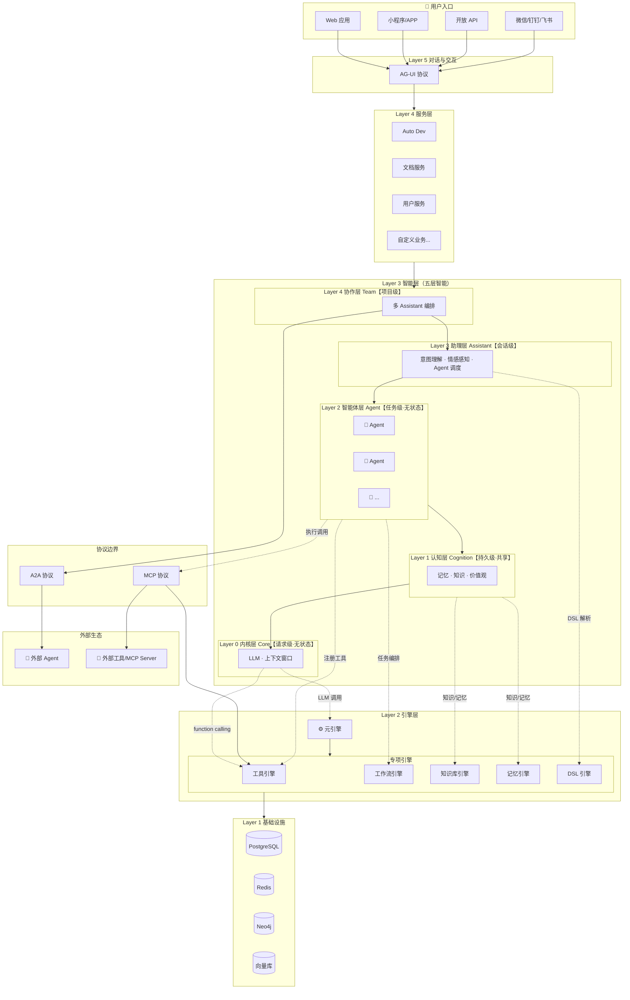

# AAF 架构概览

> 元引擎是这套分层架构的整体，不是某层的子项。整个 AAF 系统就是元引擎——将意图转化为执行，将执行转化为知识。

架构思想见 [架构思想](../explanation/architecture-thought.md)，本文档只做结构性概览和文档导航。

## **AI 原生六大核心能力**：

| 能力 | 说明 |
|------|------|
| **AI 自动开发** | 意图 → 规范 → 代码，AI 参与架构决策、代码生成、审查、测试全生命周期 |
| **自动运维自进化** | 用户行为 → 效果评估 → 规范更新（人工确认）→ 代码重生成 → 沙箱验证 → 热部署，系统越用越强 |
| **元引擎无代码** | DSL 驱动实体/工作流/权限运行时，配置即运行，开发与运行边界消失 |
| **一切皆文档** | 所有制品（界面/工作流/组件/知识/对话）以文档形式存储，以 DSL 描述，规范是人机共同真理源 |
| **语义组件** | 后端输出 DSL，前端动态组装界面，同一套组件多端适配（Web/移动/微信/CLI） |
| **五层智能架构** | Core（LLM）→ Cognition（记忆/知识）→ Agent（任务执行）→ Assistant（会话/情感）→ Team（多智能体协作） |

## 系统全景图



## 五层架构

| 层次 | 名称 | 包含模块                                                                                         | 职责 |
|------|------|----------------------------------------------------------------------------------------------|------|
| Layer 5 | 对话与交互层 | 意图理解、任务路由、多层协作可视化、编辑器内联命令、多端适配、REST API、WebSocket/SSE、RPC、CLI、DSL 指令                         | 人机交互入口，意图表达与结果呈现，系统对外边界 |
| Layer 4 | 服务层 | Auto-Dev、文档、用户、任务、知识、外部整合、众包协作、虚拟空间；《自定义》用户在 AAF 上构建的具体业务                                    | 面向用户的具体业务逻辑 |
| Layer 3 | 智能层 | Core → Cognition → Agent → Assistant → Team                                                          | AI 推理与协作，五层智能架构 |
| Layer 2 | 引擎层 | 调度机制（执行调度器、状态管理器、上下文管理器、置信度门控器、元数据管理器）；专项引擎（DSL、工作流、工具、调度、文档、知识库、记忆、空间、语义组件、自进化、积分、结算、监控、权限） | 通用执行能力，无具体业务语义 |
| Layer 1 | 基础设施层 | PostgreSQL + PgVector、Redis、Neo4j、向量库、Agent Sandbox、沙箱运行时                                    | 存储、通信、计算底座 |

**核心规则：上层可调用任意下层，禁止下层调用上层。**

**零出站遥测**：框架默认不内置任何出站遥测/数据上报。如需观测，由用户在自己基础设施按需接入（Prometheus / OpenTelemetry / Grafana），框架仅提供标准化的指标暴露接口（metrics endpoint），不主动发送数据到外部。

### 五层智能架构

> 详见 [智能体系统设计](./framework/core/agent.md)

| 层级 | 名称 | 状态级别 | 认知循环 | 依赖引擎 |
|------|------|----------|----------|----------|
| Layer 4 | Team 协作层 | 项目级 | 目标对齐 → 任务分发 → 进度同步 → 结果聚合 → 冲突仲裁 | A2A 协议 |
| Layer 3 | Assistant 助理层 | 会话级 | 情感感知 → 意图理解 → 上下文构建 → Agent 调度 → 反馈整合 → 记忆更新 | DSL 引擎 |
| Layer 2 | Agent 智能体层 | 任务级（无状态） | 感知 → 规划 → 执行 → 评估 → 学习 | 工具引擎、工作流引擎 |
| Layer 1 | Cognition 认知层 | 持久级（共享） | 存储 / 检索 / 更新 / 遗忘（被动响应） | 知识库引擎、记忆引擎 |
| Layer 0 | Core 内核层 | 请求级（无状态） | 推理 / 生成 / 上下文窗口管理 | 元引擎（LLM 调度） |

**工具调用流程**：Agent 注册可用工具 → Core(LLM) 通过 function calling 决定调用 → Agent 通过 MCP 协议执行

| 协议 | 方向 | 用途 |
|------|------|------|
| AG-UI | 用户 ↔ Agent | 人机交互界面 |
| MCP | Agent ↔ 工具 | 工具调用与上下文传递 |
| A2A | Agent ↔ Agent | 多智能体协作 |

## 系统组成

```text
apps/service/   → Spring Boot 后端
apps/webui/     → Next.js 前端（主入口，桌面 Web）
apps/uniapp/    → UniApp 小程序/APP（待开发）
packages/       → 共享库（待建设）
```

---

## Layer 5 对话与交互层

> 人机交互入口，意图表达与结果呈现，系统对外边界

- **意图理解**：多模态输入、上下文融合、置信度评估、意图澄清（Assistant 层负责）
- **任务路由**：简单查询 / 单操作 / 工作流 / Agent / 多 Agent 路由决策
- **多层协作可视化**：Team / Assistant / Agent / 工具调用分层展示、主导权标识、置信度指示
- **编辑器内联命令**：`/` 插入块、`@` 引用用户、`#` 添加标签、`[[` 链接文档、`?` 行内提问
- **多端适配**：桌面 Web 双栏 / 移动端对话优先 / 微信轻量卡片 / CLI 纯指令
- **交互接口**：REST API、WebSocket/SSE 流式输出、RPC、CLI、DSL 指令直接驱动

---

## Layer 4 服务层

> 分两类：框架内置服务（框架维护者提供）和自定义业务服务（用户开发，可由元引擎自动生成）

### 框架内置服务

- **Auto Dev**：规范驱动开发、代码生成、自进化闭环（行为采集 → 效果评估 → 规范更新 → 重生成 → 热部署）
- **文档服务**：文档画板、多用户实时协作、会话管理、模板市场
- **用户服务**：用户信息、偏好、角色权限、用户画像、组织管理（公司 / 团队）
- **任务服务**：项目管理、任务规划、GTD、奖励机制
- **知识服务**：知识地图、知识图谱、知识拆解、众包协作、贡献排行
- **外部整合服务**：微信 / 钉钉 / 飞书接入、统一消息收发、身份映射
- **众包协作服务**：任务分发、质量评估、积分结算触发
- **虚拟空间**：世界模型、3D 场景

### 自定义业务服务

- 用户在 AAF 上构建的具体业务，不限领域
- 优先通过元引擎无代码层自动生成（实体运行时 / 工作流运行时 / 权限运行时）
- 复杂逻辑通过 AI 生成代码热加载挂载扩展点
- 与框架内置服务共享同一套引擎层能力，通过接口解耦

---

## Layer 3 智能层

> AI 推理与协作，五层智能架构，依赖引擎层执行

- **Core 内核层**：LLM 接入、上下文窗口管理、无状态池化复用
- **Cognition 认知基础层**：依赖知识库引擎、记忆引擎、上下文管理器，提供知识检索、记忆读写、价值观约束给 Agent
- **Agent 智能体层**：感知 / 规划 / 执行 / 评估认知循环、工具调用、无状态任务执行
- **Assistant 助理层**：意图理解、上下文构建、Agent 调度、角色人格、记忆更新、提示词优化
- **Team 协作层**：多 Assistant 编排、任务分发、进度同步、冲突仲裁

---

## Layer 2 引擎层

> 通用执行能力，无具体业务语义，被上层直接调用

### 调度机制（元引擎核心）

> 协调所有引擎运转，贯穿所有执行路径

- **执行调度器**：DSL 路由、引擎编排、生命周期管理、响应式执行管道（filter / transform / route / parallel / reduce）
- **状态管理器**：持久化状态管理，会话 / 工作区 / 系统 / 元数据四层
- **上下文管理器**：AI 推理临时上下文，会话级 KV 存储、跨会话引用、上下文压缩归档
- **置信度门控器**：自动执行 / 等待确认 / 转人工三档，异常接管（暂停 → 保存现场 → 说明原因 → 等待决策）
- **元数据管理器**：模块 / 插件 / 工具 / 组件元数据，语义漂移检测

### 专项引擎

> 执行具体任务，被调度机制编排

- **DSL 引擎（Magic-DSL）**：多范式解析、L1→L2→L3 分层转化、分域路由（dev / runtime / doc）、版本管理
- **工作流引擎**：Flowable 封装、DSL 驱动执行、可视化设计、节点生命周期、流程监控
- **工具引擎**：工具注册与发现、调用封装、白名单校验、沙箱执行
- **调度引擎**：并行调度、定时触发、任务队列、重试策略
- **文档引擎**：文档全生命周期、版本快照、版本对比（diff）、操作日志（OT/CRDT）、操作回放、回滚、关系管理、全文检索、实时协同、执行文档（Agent 执行链路、工具调用记录、中间状态、可回放）
- **知识库引擎**：领域知识存储、向量检索、知识图谱、全局共享
- **记忆引擎**：短期 / 长期 / 情景记忆、用户私有、时序 + 语义双索引
- **空间引擎**：世界模型（坐标系、空间层级、时间维度）、物质定义（文档 = 物质，有坐标 / 体积 / 质量）、物理规则（运动、碰撞、引力聚合、语义相似度驱动聚合）
- **语义组件引擎（Sense-UI）**：组件注册表、DSL → 组件树、内容注入、插件加载、流式渲染
- **自进化引擎**：行为采集、效果评估、规范更新、代码重生成、沙箱验证、热部署
- **积分引擎**：贡献行为量化、积分规则执行、质量评估、账户管理
- **结算引擎**：智能合约调用、结算记录、争议仲裁工作流
- **监控**：成本估算、Token 预算感知、Token 统计、链路追踪、审计日志
- **权限引擎**：认证（JWT / OAuth2 / SSO）、角色管理（内置角色 + 自定义角色）、操作权限（CRUD + 执行 + 分享 + 管理）、数据权限（DSL 规则引擎、行级 + 字段级过滤）、协作权限（可见性 + 邀请 + 共享规则）、组织隔离（org_id 过滤、多组织支持）、KMS 密钥管理

---

## Layer 1 基础设施层

> 存储、通信、计算底座，无业务语义，最稳定

- **数据存储**：PostgreSQL（关系数据）、Redis（缓存 / 会话）、Neo4j（知识图谱）、向量库（语义检索）
- **运行时环境**：JVM 沙箱、Agent Sandbox、热加载、进程隔离、智能降级
- **消息与通信**：消息队列、SSE 流式输出

---

## 设计文档导航

### 框架通用设计（跨端）

| 文档 | 说明 |
|------|------|
| [元引擎设计](framework/meta-engine.md) | DSL 解释器、引擎编排、自进化机制 |
| [对话式交互设计](apps/webui/tmp/conversational-interaction.md) | 意图→DSL→语义组件动态组装，多端统一模型 |

### 后端（service）

| 文档 | 说明 |
|------|------|
| [技术选型](apps/service/tech-stack.md) | 技术栈选型与决策记录（为什么选这些技术） |

### 前端 Web（webui）

| 文档 | 说明 |
|------|------|
| [技术选型](apps/webui/tech-stack.md) | 技术栈选型与决策记录 |
| [UI 设计规范](ui/Readme.md) | 设计系统、组件规范、交互规范 |

### 小程序/APP（uniapp）

| 文档 | 说明 |
|------|------|
| [技术选型](apps/uniapp/tech-stack.md) | 技术栈选型与多端适配策略 |

### 迭代级设计

| 文档 | 说明 |
|------|------|
| [v0.1.0 迭代计划](../task/aaf-v0.1.0.md) | 当前迭代范围、模块实现范围、不做什么 |

## 其他专项设计

| 文档 | 说明 |
|------|------|
| [访问控制设计](framework/security/access-control.md) | 认证 + 授权（RBAC + ReBAC + 记录规则 + ABAC） |
| [安全架构设计](framework/security/security.md) | 加密、脱敏、审计、AI 安全 |
| [文档引擎设计](framework/engine/document-engine.md) | 块状文档存储与检索 |
| [Auto Dev 设计](framework/engine/auto-dev.md) | AI 驱动代码生成流程 |
