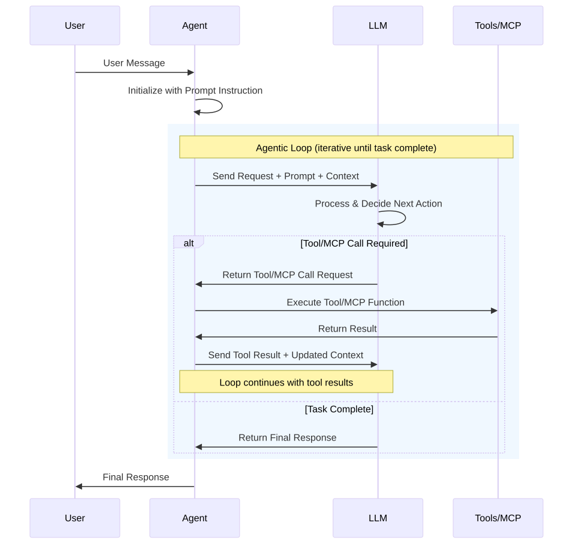
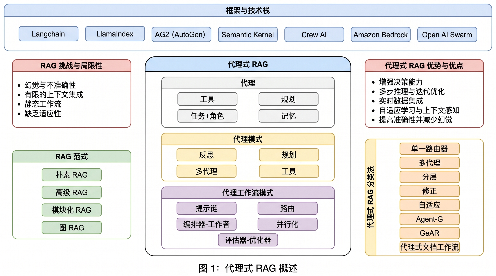

# 智能体系统设计

> 五层智能架构：从内核到协作，分层认知，渐进决策。

## 设计原则

- **分工协作，发挥各自专长**：大模型 + 传统计算 + 人类，各司其职
- **群体智能**：分层多智能体、智能块、智能核
- **智能模块化**：选择合适的模型，专用模型/通用模型专用化
- **复杂环境协同**：多智能体在复杂环境下的协同工作能力
- **自适应多场景**：从易用性、灵活性、扩展性、性能、数据安全、隐私
- **渐进决策**：多模型、分布式存储运算、隐私隔离、加密存储
- **业务与智能融合**：减少具体业务开发，同时保持高效高性能易用

## 五层智能架构

```text
Layer 4  协作层  Team                              【项目级】
         认知循环：目标对齐 → 任务分发 → 进度同步 → 结果聚合 → 冲突仲裁
         多个 Assistant 组成团队，支持 Leader 协调或平等协作
         状态：轻量会话级状态（任务分配表、进度、仲裁结果），不持有数据级状态

Layer 3  助理层  Assistant                         【会话级】
         认知循环：情感感知 → 意图理解 → 上下文构建 → Agent 调度 → 反馈整合 → 记忆更新
         面向人，有人格 / 角色扮演，持有多个 Agent，向上可加入 Team
         状态：用户画像（含情感偏好）、长期记忆引用（实体存于 Cognition），会话上下文

Layer 2  智能体层  Agent                           【任务级·无状态】
         认知循环：感知 → 规划 → 执行 → 评估 → 学习 ↔ 记忆
         无状态任务执行单元，执行前从 Cognition 拉取记忆/知识，执行后写回
         状态：无状态，自身不持久化

Layer 1  认知基础层  Cognition                     【持久级·跨 Agent 共享】
         认知循环：存储 / 检索 / 更新 / 遗忘（被动响应，不主动触发）
         记忆 + 知识 + 价值观，为上层提供认知基础
         状态分区：用户私有区 / 全局共享区 / Agent 工作区

Layer 0  内核层  Core                              【请求级·无状态】
         认知循环：推理 / 生成 / 上下文窗口管理
         LLM + Context，上下文由调用方（Agent）组装后传入
         无状态，可水平扩展、池化复用
```

### 架构特性

| 特性 | 说明 |
|------|------|
| 无状态层可水平扩展 | Core 和 Agent 设计为无状态，支持池化和并发 |
| 状态集中在 Cognition | Team/Assistant 只持有轻量会话级状态，数据级状态统一由 Cognition 管理 |
| 认知循环分层 | 每层有且只有一个认知循环，粒度从项目级到请求级逐层细化 |
| 私有与共享分离 | Agent 内模块私有，记忆/知识/价值观下沉到 Cognition 共享 |
| 决策权跨层流动 | 低置信度上报上层，高置信度本层执行，决策权随置信度动态流动 |

### 层间调用规则

- 上层循环通过调度触发下层循环
- 下层结果通过回调返回上层
- **禁止跨层直接触发**（如 Team 不能直接调用 Core）

---

## Layer 0 内核层 Core

> 无状态·请求级，LLM 推理的最小执行单元

### 职责

- LLM 接入与调用
- 上下文窗口管理
- Token 预算控制
- 多模型路由（按任务类型选择模型）

### 认知循环

```text
接收上下文（由 Agent 组装）
  ↓
推理 / 生成
  ↓
返回结果 + Token 消耗统计
```

### 状态策略

- **完全无状态**：不持有任何上下文，每次调用独立
- **可水平扩展**：支持池化复用，多实例并发

### 设计要点

- 上下文由调用方（Agent）组装后传入，Core 不负责上下文管理
- 支持 function calling，工具调用决策在此层完成
- 模型选择策略：简单任务用轻量模型，复杂任务用强模型

---

## Layer 1 认知基础层 Cognition

> 持久级·跨 Agent 共享，为上层提供记忆、知识、价值观

### 职责

- 记忆管理：短期 / 长期 / 情景 / 情感记忆
- 知识检索：领域知识、向量检索、知识图谱
- 价值观约束：团队级伦理约束，全局一致

### 认知循环

```text
存储 / 检索 / 更新 / 遗忘
（被动响应上层请求，不主动触发）
```

### 状态分区

| 分区 | 说明 | 访问权限 |
|------|------|----------|
| 用户私有区 | 用户记忆、情感偏好、历史模式 | 仅该用户的 Assistant/Agent |
| 全局共享区 | 领域知识、规范文档、价值观 | 所有 Agent |
| Agent 工作区 | 任务执行中的临时数据 | 当前 Agent |

### 核心引擎

- **记忆引擎**：详见 [AtomMemory 原子记忆引擎](../engine/atom-memory-engine.md)
- **知识库引擎**：详见 [NexusKB 连接式知识引擎](../engine/nexus-kb-engine.md)

### 设计要点

- 时序 + 语义双索引，支持按时间和语义检索
- 情感记忆本地存储，不用于训练或外传
- 遗忘机制：低价值记忆定期归档或清理

---

## Layer 2 智能体层 Agent

> 任务级·无状态，感知-规划-执行-评估的认知循环

### 职责

- 任务执行：接收任务，完成后返回结果
- 工具调用：通过 MCP 协议调用工具
- 规划决策：目标分解、任务排序

### 认知循环

```text
感知 → 规划 → 执行 → 评估 → 学习 ↔ 记忆
```

| 模块 | 职责 | 类比 |
|------|------|------|
| 感知模块 | 输入解析、意图识别 | 感觉皮层 |
| 规划模块 | 目标分解、任务排序 | 前额叶 |
| 执行模块 | 工具调用、代码生成 | 小脑 |
| 价值模块 | 优先级判断、伦理约束 | 杏仁核 |

### 状态策略

- **完全无状态**：执行前从 Cognition 拉取记忆/知识，执行后写回
- **多实例并发**：同一 Agent 定义可并发处理多个任务实例
- **失败可重试**：无状态设计使得失败后可直接重新调度

### 何时启用 Agent

| 维度 | 判断 | 结论 |
|------|------|------|
| 任务复杂度 | 低 | 用 Workflow |
| 任务价值 | < $0.1 | 用 Workflow |
| 所有步骤可执行 | 否 | 缩小范围或加人工 |
| 错误成本 | 高 | 加人工审核节点 |

**最适合场景**：编码 Agent（从需求文档到完整 PR），复杂度高、价值高、错误可控。

### 单 Agent 最小闭环

```python
env = Environment()
tools = Tools(env)
system_prompt = "Goals, constraints, and how to act"

while True:
    action = llm.run(system_prompt + env.state)
    env.state = tools.run(action)
```

核心心法：**站在 Agent 视角思考，它只能看到你给的上下文**。

### 核心引擎

- **工具引擎**：详见 [../engine/tools.md](../engine/tools.md)（待创建）
- **沙箱环境**：详见 [../engine/sandbox.md](../engine/sandbox.md)（待创建）

---

## Layer 3 助理层 Assistant

> 会话级，面向人的交互入口，有人格和角色

### 职责

- 意图理解：解析用户输入，识别目标和约束
- 情感感知：识别用户情绪状态，动态调整回应风格
- Agent 调度：根据任务类型选择合适的 Agent
- 记忆更新：会话结束后更新用户画像和长期记忆

### 认知循环

```text
情感感知 → 意图理解 → 上下文构建 → Agent 调度 → 反馈整合 → 记忆更新
```

### 状态策略

| 状态类型 | 生命周期 | 存储位置 |
|----------|----------|----------|
| 会话上下文 | 会话级 | 内存 |
| 用户画像 | 持久 | Cognition 用户私有区 |
| 长期记忆引用 | 持久 | Cognition（实体存储） |

### 情感感知

- **感知**：通过语言语气、操作节奏推断用户情绪状态
- **响应**：AI 回应风格、信息密度随情绪状态自适应
- **记忆**：情感偏好纳入用户画像
- **伦理边界**：不利用情绪弱点，不模拟情感依赖

### 设计要点

- 面向人，有人格 / 角色扮演
- 持有多个 Agent，根据任务类型调度
- 向上可加入 Team 参与多 Assistant 协作

---

## Layer 4 协作层 Team

> 项目级，多 Assistant 编排与协作

### 职责

- 目标对齐：确保所有 Assistant 理解共同目标
- 任务分发：将大任务拆解分配给各 Assistant
- 进度同步：跟踪各 Assistant 执行进度
- 冲突仲裁：处理 Assistant 间的意见分歧

### 认知循环

```text
目标对齐 → 任务分发 → 进度同步 → 结果聚合 → 冲突仲裁
```

### 协作模式

| 模式 | 说明 | 适用场景 |
|------|------|----------|
| Leader 协调 | 一个 Assistant 作为 Leader 统筹 | 明确分工的项目 |
| 平等协作 | 多个 Assistant 平等讨论决策 | 需要多视角的探索性任务 |

### 状态策略

- **轻量会话级状态**：任务分配表、进度、仲裁结果
- **不持有数据级状态**：数据统一由 Cognition 管理

### 通信协议

- **A2A 协议**：Agent-to-Agent，多智能体间通信
- 支持同步和异步通信模式

---

## 渐进决策模型

### 决策粒度

| 层级 | 决策粒度 | 策略 |
|------|----------|------|
| Agent | 粗粒度规划 | 决策树展开：走一步看一步，每步结果作为下一步输入 |
| Assistant | 意图漏斗 | 意图澄清优先于执行，通过最少问题快速收敛 |
| Team | 目标假设性分解 | 目标不清晰不阻塞执行，动态调整 |

### 置信度门控

```text
> 0.9   → 自动执行，结果暂存，异步通知
0.7-0.9 → 展示执行计划，等待确认
< 0.7   → 暂停，说明原因，转人工处理
```

### 可撤销渐进提交

- 执行步骤先进入暂存态
- 用户或上层确认后提交
- 未确认前可回滚

---

## 智能降级策略

| 场景 | 降级方案 |
|------|----------|
| AI 服务不可用 | 降级到规则引擎（预定义工作流） |
| 知识检索失败 | 使用默认知识库（内置规范文档） |
| Agent 超时 | 切换简化流程（直接 LLM 调用） |
| 沙箱执行失败 | 暂停并转人工处理 |

降级不静默发生，对话区会明确告知用户当前处于降级模式及原因。

---

## 技术选型

| 能力 | 技术选型 |
|------|----------|
| 智能体编排 | Spring AI + AgentScope |
| 工具协议 | MCP（Model Context Protocol） |
| 多智能体通信 | A2A 协议 |
| 人机交互 | AG-UI 协议 |

---

## 思考与待解决问题

### 编排模式：工作流 vs 自主规划

> 参考 Kiro CLI 开发流程的实践经验：固定业务流程用工作流编排，具体执行者用自主规划。

**核心洞察：编排分两层**

```text
┌─────────────────────────────────────────────────────────────┐
│  工作流层（确定性）                                          │
│  固定流程骨架，步骤顺序已知，由 Flowable/DSL 驱动            │
│  例：需求 → 设计 → 编码 → 审查 → 测试 → 部署               │
└─────────────────────────────────────────────────────────────┘
        ↓ 每个节点派发给具体 Agent
┌─────────────────────────────────────────────────────────────┐
│  Agent 层（自主性）                                          │
│  接收任务目标后，自主规划子步骤、选择工具、迭代执行           │
│  例：编码 Agent 收到"实现用户模块" → 自主拆分为              │
│      分析需求 → 设计接口 → 写代码 → 跑测试 → 修复           │
└─────────────────────────────────────────────────────────────┘
```

**为什么不全用工作流？**
- 工作流适合**可预测、步骤固定**的流程（审批、发布、CI/CD）
- 但具体执行中的问题解决是**动态的**——Agent 需要根据中间结果调整策略
- 强行把动态过程编排为工作流 → 节点爆炸、分支复杂、维护困难

**为什么不全用自主 Agent？**
- 纯自主 Agent 缺乏全局视角，容易偏离主线
- 固定流程（如开发流水线）的步骤顺序是业务约束，不应由 Agent 自行决定
- 工作流提供**可审计、可回退、可监控**的流程骨架

**AAF 的编排策略：**

| 层 | 编排方式 | 决策者 | 典型场景 |
|----|---------|--------|---------|
| 业务流程 | 工作流（Flowable/DSL） | 流程设计者 | 开发流水线、审批流、发布流程 |
| 任务执行 | Agent 自主规划 | Agent 自身 | 编码、调研、文档编写、问题诊断 |
| 子任务协作 | Agent 动态创建子 Agent | 父 Agent | 复杂任务分解后并行执行 |

**Kiro 开发流程的映射：**

```text
工作流骨架（固定）：
  product → architect → developer → architect(review) → tester → qa

每个节点内（自主）：
  developer Agent 收到任务后：
    1. 读取需求规格和设计文档（感知）
    2. 自主规划实现步骤（规划）
    3. 逐步编码 + 跑测试（执行循环）
    4. 发现问题 → 自主创建子任务解决（动态规划）
    5. 全绿后汇报完成（评估）
```

**设计约束：**
- 工作流节点的**进入/退出条件**是确定性的（如"check 全绿才能进入 review"）
- Agent 在节点内的**执行过程**是自主的，但受预算和时间约束
- Agent 可以**向上请求**：发现任务超出能力范围时，上报工作流层决策（升级/回退/人工介入）

### 预算感知

> Agents need budget-awareness: How do we explain and enforce 5 mins/$10/2M tokens budgets?

### 工具自进化

> Tools should be self-evolving: How can models improve their own tool ergonomics?

### 多智能体通信

> Multi-agents need new ways of communicating: How to expand from synchronous USER:ASSISTANT turns?

---

## 相关文档

- [元引擎设计](../meta-engine.md) - 智能体系统的编排基础设施
- [对话式交互设计](../engine/conversational-interaction.md) - 人机交互入口
- [认知层设计](cognition/Readme.md) - Layer 1 Cognition 总览
- [AtomMemory 原子记忆引擎](../engine/atom-memory-engine.md) - Memory 模块的引擎实现
- [NexusKB 连接式知识引擎](../engine/nexus-kb-engine.md) - Knowledge 模块的引擎实现

## 思考

Agents need budget-awareness:
How do we explain and enforce 5 mins/$10/2M tokens budgets?

Tools should be self-evolving:
How can models improve their own tool ergonomics?

Multi-agents need new ways of communicating:
How to expand from synchronous USER:ASSISTANT turns?

## 何时启用智能体

Is the task complex enough? No- Workflows Yes - Agents
Is the task valuable enough? <$0.1 Workflows >$1 - Agents
Are all parts of the task doable? No - Reduce scopeYes - Agents
What is the cost of error/error discovery? High - Read-only/human-in-the-loopLow - Agents

## 单智能体设计

Agents are models using tools in a loop, 保持极致简单最小闭环只需要:环境+工具+系统提示。后期再逐步加优化。

```python
env = Environment()
tools= Tools(env)
system_prompt = "Goals, constraints, and how to act"
while True:
  action = llm.run(system_prompt + env.state)
  env.state = tools.run(action)
```

站在Agent视角思考它只能看到你给的上下文，每次提示前都要模拟它的“视野”。

「是否需要建Agent」快速checklist:

- 任务复杂度低 --> 用Workflow即可
- 结果价值不高 --> 优先Workflow
- 所有步骤都可执行 --> 缩小范围或加人工
- 错误成本高 --> 增加审核机制

最适合场景: 编码Agent(从需求文档到完整PR)，复杂度高、价值高、错误可控。
后期可加:并行工具调用、轨迹缓存、进度可视化。
核心心法: Workflow适合可预测任务，Agent适合动态场景。成功关键在于精准定位、保持简单、对Agent有限视角的理解。

## 智能助理


- 一个独立助理，拥有多技能、由多个智能体块组成
- 组成要素及其相互作用机制，通信协议、任务分配策略...
- 感知 → 规划 → 执行 → 学习 ↔ 记忆
  - 查询提交和评估、场景感知、目的分析确认、技能加载、算力估算
  - 知识源选择、上下文、提示词生成：多种检索选项中选择：记忆、结构化数据库（Text-to-SQL引擎？）、文档（本地/在线）、语义计算、向量检索、网络搜索、推荐引擎、规范约束
  - 数据整合、校验检查评估学习、生成回复、表达
- 规划决策：智能体核心、内置算法，渐进决策，总分总
- 任务管理：目标、时间、精力



步骤1：查询分析、场景意图、问题分类
步骤2：记忆和策略，策略选择（直接回复、单/多步智能检索）
步骤3：工具选择和数据收集
步骤4：提示构建，整合数据优化，验证循环迭代
步骤5：生成响应

### 提示词

### 记忆

5层，潜意识、短期记忆、长期记忆、原则偏好兴趣性格、具体要求

### 知识库

提示词库、领域术语



### 交互

- 表达组件语音文本、交互流程、生成图像视频3D模型
- 如何更快的组装提示词（图片文字、自动优化、可视化）

### 工具

自定义工具、mcp、API、数据库访问

### 技能

5层迭代递归，自学生成技能、遗传技能

- 基础技能：提示词生成、组合接口查询+直接操作数据库、生成执行脚本
- 通用技能：知识价值评估
- 专业技能

### 角色

角色扮演

### 工作流引擎

## 多智能体

多 Agent 异步运行时、工具执行沙箱
