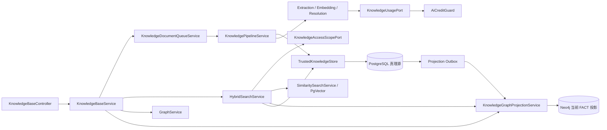

# NexusKB 可信知识技术设计

> 功能决策见[NexusKB 可信连接式知识引擎](nexus-knowledge.md)。本文只定义实现合同，避免重复产品语义。

## 当前实现状态与替换范围

v300 schema 与 v301 seed 已完成从旧 Neo4j 真理路径到可信知识基线的替换。当前运行时状态如下：

- `KnowledgePipelineService` 使用 run/generation 隔离新产物，READY 后在 PostgreSQL 单事务发布；失败继续服务旧 `active_run_id`。
- `EntityExtractionService` 将实体、事实、焦点证据和双时态断言写入 PostgreSQL，不再直接创建 Neo4j 真理数据。
- `IncrementalEntityResolver` 只处理新提及，按精确键和有界候选消歧，不执行整库两两比较或图内破坏性合并。
- `HybridSearchService` 接收授权多库查询，以稳定 chunk key 融合 VECTOR、KEYWORD、GRAPH，并在返回前重新授权和回 PostgreSQL 复核。
- 文档保留 uploader，run 创建时冻结 payer；`KnowledgeUsagePort` 统一预检、调用预留、供应商结果持久化和幂等结算。
- Neo4j 当前 `FACT` 由 outbox 投影，支持状态、重建、直接事实优先与有界相邻事实候选；不提供直接图 CRUD。

本版补齐 `mode=graph` 的 REST 与 WebUI 接线，复用现有可信图检索闭环。仍未实现且不得误标为当前合同的能力包括：知识专用 Reranker、通用路径/探索 API、外部 as-of API、历史 `FACT_ASSERTION` 图、Episode 投影和自动事实冲突裁决。

v300 schema 与 v301 seed 是直接替换，不保留旧 Neo4j 真理源、先删后建、逐条固定扣费或双写兼容分支。

## 架构不变量

1. 实体、事实、证据、来源和当前代际只从 PostgreSQL 读取与修改。
2. PgVector 和 Neo4j 只消费 PostgreSQL 数据；删除两个投影后系统仍能恢复。
3. 未经授权的知识库 ID 不得进入向量、全文或图查询。
4. 每个可检索事实至少存在一条当前代际的焦点证据。
5. 新代际发布是单个 PostgreSQL 事务；失败不得改变文档当前代际。
6. `ai_knowledge_ingest_run` 就是物理 generation，不创建平行 generation 表；`active_run_id` 是唯一线上可见性开关。
7. `PUBLISHED` 是 `active_run_id` 的受约束镜像：无 active pointer 时不得有 PUBLISHED run，有 pointer 时必须精确指向唯一 PUBLISHED run。
8. 费用承担者在代际创建时固化，异步执行身份不能改变承担者。
9. 所有跨存储 ID 使用 PostgreSQL 分配并持久化的 UUID，不使用 Neo4j elementId、向量行号或文本内容作为结果身份。

## 组件与依赖



包职责沿用现有边界：

| 位置 | 职责 |
|------|------|
| `aaf-framework/.../engine/knowledge` | `KnowledgePipelineService`、抽取/消歧、`HybridSearchService`、`TrustedKnowledgeStore`、图投影及窄端口定义 |
| `aaf-framework/.../engine/credit` | `AiCreditGuard` 统一 AI 用量幂等结算，不新增第二套账本 |
| `aaf-api/.../module/knowledge` | `KnowledgeBaseController/Service`、上传者解析、ACL adapter、文档任务入队与状态映射 |
| `TrustedKnowledgeStore` | PostgreSQL 真理读写、代际事务、FTS、PgVector 关联、outbox/checkpoint 与最终可信复核 |
| `KnowledgeGraphProjectionService` | 按 outbox 投影当前 FACT、返回稳定 factKey、执行幂等重建 |

`aaf-framework` 不依赖 `aaf-api`；知识库 owner、上传者和授权范围由 `aaf-api` 实现 framework 定义的端口。

## 实际接口与组件映射

当前**没有** `NexusKnowledgeEngine`、`startIngest`、`retryGeneration(UUID generationId)` 或 `ProjectionRebuildReceipt` 类型。它们是早期概念门面，未被实现或调用，因此不再作为实现合同。只有出现需要在多个业务调用方之间稳定隔离引擎编排的真实需求时，才评审统一 facade；不得先创建无调用方抽象。

### REST 入口

| REST | 业务方法 | 运行时落点 | 状态 |
|------|----------|------------|------|
| `POST /api/knowledge-bases/search` | `KnowledgeBaseService.search(KnowledgeSearchDTO)` | `HybridSearchService.search(AuthorizedQuery)` | 已实现；mode 支持 vector/keyword/graph/hybrid |
| `GET /api/knowledge-bases/maintenance` | `pageMaintenance(KnowledgeBaseMaintenancePageDTO)` | BaseCrud `ADMIN_MAINTENANCE` + tenant scope | 已实现；按 name/org/workspace/owner/visibility/status 分页筛选 |
| `GET /api/knowledge-bases/maintenance/{id}` | `getMaintenance(Long)` | BaseCrud `ADMIN_MAINTENANCE` | 已实现；显式返回 tenant/owner 运维视图 |
| maintenance stats/documents/retry | `getMaintenanceStats` / `listMaintenanceDocuments` / `retryMaintenanceDocument` | PostgreSQL 真理源与文档队列 | 已实现；失败重试不直接改 run 状态 |
| `GET /api/knowledge-bases/{id}/graph` | `KnowledgeBaseService.getGraph(Long)` | `GraphService.snapshot(UUID)` | 已实现；当前图展示快照，不是路径 API |
| `GET /api/knowledge-bases/{id}/graph-projection/status` | `getGraphProjectionStatus(Long)` | `TrustedKnowledgeStore` checkpoint | 已实现；仅管理员 |
| `POST /api/knowledge-bases/{id}/graph-projection/rebuild` | `rebuildGraphProjection(Long, String)` | `KnowledgeGraphProjectionService.rebuild(UUID, String)` | 已实现；仅管理员且要求幂等键 |
| 文档 batch/retry/delete/progress | `KnowledgeBaseService` 文档方法 | Queue → `KnowledgePipelineService` / revoke | 已实现；入库与撤销入口 |

### 管理路由与权限边界

- 普通用户唯一入口是 `/studio/knowledge` 与 `/studio/knowledge/{id}`，使用 BaseCrud `DEFAULT`，同时应用 tenant、record 和 `ownerId` personal scope。
- 管理员运维入口是 `/admin/knowledge` 与 `/admin/knowledge/{id}`，调用 maintenance API 并使用 `ADMIN_MAINTENANCE`；该模式只绕过 record/personal scope，始终保留 org/workspace tenant scope。
- `org_admin`、`admin`、`super_admin` 还必须持有 `system:knowledge-base:access-mode:admin-maintenance`；仅有角色菜单不能绕过服务层授权。
- 后台只执行分页查看、统计、失败文档重试和图投影 checkpoint/重建，不开放 fact/evidence/assertion、run、embedding、outbox 或 checkpoint 通用 CRUD。
- 后台详情仅在知识库 Owner 是当前用户时显示“前台查看”，避免跨个人范围跳转到 Studio 后被 `DEFAULT` 拒绝。
- 项目未发布，不保留 `/knowledge` 或 `/studio/knowledge/bases` 重定向、fallback 或双页面。

### Java 运行时入口

| 组件 | 当前签名或职责 | 合同状态 |
|------|----------------|----------|
| `KnowledgeDocumentQueueService` | `enqueue(KnowledgeDocument)`，TaskHandler 消费后调用管道 | 已实现；业务模块持有异步身份与组织上下文 |
| `KnowledgePipelineService` | `process(Long, Long, InputStream, String, Runnable)` | 已实现；代际 ECL/入库内部入口 |
| `HybridSearchService` | `Response search(AuthorizedQuery)` | 已实现；授权三路融合与最终复核 |
| `KnowledgeGraphProjectionService` | `searchFactKeys(String, Set<UUID>, SourceFilters, int)` / `rebuild(UUID, String)` | 已实现；只返回稳定 factKey |
| `GraphService` | `GraphSnapshot snapshot(UUID)` | 已实现；当前投影展示读取 |
| `TrustedKnowledgeStore` | run、chunk、事实/证据、发布/撤销、FTS、as-of、outbox/checkpoint | 已实现；PostgreSQL 真理边界 |

实际检索合同集中在 `KnowledgeSearchContracts`：

```java
public enum Channel { VECTOR, KEYWORD, GRAPH }

public record ChannelWeights(double vector, double keyword, double graph) {
    public static ChannelWeights defaults() {
        return new ChannelWeights(0.5, 0.3, 0.2);
    }
}

public record AuthorizedQuery(
        AuthorizationSubject subject,
        String query,
        Set<UUID> requestedKnowledgeBaseIds,
        boolean includePublic,
        Map<UUID, Double> knowledgeBaseWeights,
        ChannelWeights channelWeights,
        int topK,
        double vectorThreshold,
        Map<String, Object> sourceFilters) {}

public record Response(
        List<Hit> hits,
        Set<UUID> searchedKnowledgeBaseIds,
        Set<Channel> degradedChannels) {}
```

`KnowledgeSearchDTO.mode` 在 API 层映射为：vector=`1/0/0`、keyword=`0/1/0`、graph=`0/0/1`、hybrid=`0.5/0.3/0.2`。graph 模式仍经过授权范围、投影 READY、来源过滤、PostgreSQL 双时态/证据复核和二次授权，不是直接暴露 Neo4j 查询。

授权和计费是当前真实的反向依赖端口；抽取与消歧目前是 knowledge 引擎内部具体服务，不虚构 `FactExtractionPort` 或 resolver interface：

```java
public interface KnowledgeAccessScopePort {
    AuthorizedScope resolve(AuthorizedQuery query);
}

public interface KnowledgeUsagePort {
    void precheck(BillingContext billing, String capability, long estimatedCost);
    InvocationReservation reserve(
            BillingContext billing, String stage, String unitKey, String inputDigest);
    boolean start(InvocationReservation reservation);
    void persistProviderResult(
            InvocationReservation reservation, String providerResult, String providerRequestId);
    void markUnknown(InvocationReservation reservation, String errorMessage);
    Optional<StoredProviderResult> findProviderResult(
            BillingContext billing, String stage, String unitKey, String inputDigest);
    AiCreditGuard.IdempotentSettlementResult settle(UsageCall call);
}
```

| 能力 | 实际实现 | 边界 |
|------|----------|------|
| 授权范围 | framework 的 `KnowledgeAccessScopePort`，api 的 `KnowledgeAccessScopeAdapter` | 先授权再检索，返回前重新授权 |
| 事实抽取 | `EntityExtractionService.extractAndPersist(RunContext, FocusContext, Runnable)` | 固定 v2 输出契约，全响应校验后写 PostgreSQL |
| 实体消歧 | `IncrementalEntityResolver.resolve(RunContext, EntityMention)` | 精确匹配加最多 5 个候选，不在 Neo4j 合并真理 |
| AI 用量 | `KnowledgeUsagePort` / `DefaultKnowledgeUsageService` | 委托 `AiCreditGuard.settleIdempotently`，不得直接写积分流水或另建知识账本 |

未来如果抽取需要供应商可替换实现，可在 framework 内新增窄端口并由上层 adapter 实现；当前只有一个实现，不为对称性提前抽象。

## 来源链与稳定 ID

### 来源链

`ai_knowledge_document` 是外部来源的规范记录，不再额外创建含义重复的 source 表。所有下游表通过外键形成：

```text
base.stable_id
  → document.stable_id + source_type + source_key + uploader_id
    → ingest_run.id（generationId）+ run_no + payer_user_id
      → chunk.id
        → evidence.id
          ↔ fact.id
            → entity.id
```

`source_key` 是来源系统内稳定键：上传文件使用对象存储 key，URL 使用规范化 URL，业务对象使用 `{resource}:{objectId}`。`source_uri` 仅用于展示，可变且不参与唯一性。

### 稳定 ID

- 知识库、文档、代际、chunk、实体、事实和证据均使用 UUID 业务 ID；现有 BIGINT 可保留为数据库内部主键，但不得暴露给投影作为身份。
- UUID 在 PostgreSQL 写入占位行时生成，任务重试读取原值，不重新生成。
- 检索候选键固定为 `CHUNK:{chunkUuid}`。图分支先由 fact 找到当前 evidence，再映射到其焦点 chunk，因此可以与向量和全文分支融合。
- Neo4j 节点 `id` 使用 entity UUID，关系 `id` 使用 fact UUID；PgVector 行引用 chunk UUID。
- 规范化键使用 `SHA-256`，输入包含 `normalization_version`。规范化规则升级必须显式变更版本，禁止静默改变已有键。

## 入库代际

### 代际指纹

```text
ingestFingerprint = SHA-256(
    document.contentHash
    + parserVersion
    + chunkConfigDigest
    + extractionPromptDigest
    + extractionOutputContractVersion
    + extractionModelId
    + entityResolutionPromptDigest
    + entityResolutionOutputContractVersion
    + entityResolutionModelId
    + normalizationVersion
    + embeddingModelId
)
```

同一文档与相同指纹只允许一个代际。重试返回已有代际；内容或任一影响产物的配置变化才创建下一代。

### 知识 AI 配置快照

- 完整事实抽取和实体消歧系统 Prompt 分别存于系统参数 `knowledge.extraction.system_prompt`、`knowledge.entity_resolution.system_prompt`，值类型为多行字符串；管理员可以修改规则、格式说明与示例。
- 模型选择复用 `ai_model_preference`，新增系统级能力 `KNOWLEDGE_EXTRACTION` 和 `KNOWLEDGE_ENTITY_RESOLUTION`；知识入库不读取 USER 模型偏好。
- 创建代际前解析并校验两类 Prompt 与两类系统模型，将两类 Prompt 快照、各自 SHA-256、固定输出契约版本和两个 modelId 写入代际；恢复任务只读取数据库快照。
- 系统参数 Redis 缓存在数据库事务提交后淘汰。配置更新只影响后续新代际，不得让同一代际混用新旧 Prompt 或模型。
- 模型调用通过冻结的 modelId 获取动态 ChatClient；计量器必须使用同一 modelId 定价和结算，禁止按其他默认模型计费。
- 每个 AI 调用的 input digest 包含该阶段冻结的 Prompt 摘要、输出契约版本、modelId 与用户输入，避免配置变化后复用旧供应商结果。

### 固定输出契约

事实抽取 Prompt 中的格式说明允许配置，但后端事实契约固定并版本化。v2 要求基础字段集合完整，并只允许额外出现可选 `validAt / invalidAt / attributes`；解析时要求顶层为 JSON 数组、字段类型完整、枚举合法、业务时间区间正向、attributes 为受限标量对象且不超过 16 KiB、置信度为 `[0,1]` 有限数，且证据逐字命中焦点块。一次响应必须先全量验证，再持久化任何事实；任一元素不合法则代际失败，不截取 JSON、不移除代码围栏、不补业务时间、不跳过坏元素。

实体消歧 Prompt 同样允许配置，但后端契约固定为精确字段对象：`LINK` 返回 `{"action":"LINK","entityId":"<candidate-uuid>"}`，其他两种结果分别返回 `{"action":"CREATE","entityId":null}` 或 `{"action":"REVIEW","entityId":null}`。`LINK` 只接受当前候选集合中的 UUID；`CREATE` 和 `REVIEW` 要求 `entityId` 为 JSON null。顶层非对象、未知或缺失字段、错误类型、未知 action、候选外 UUID 均使代际失败，不得静默转为 CREATE。

### 状态机

```text
QUEUED → PROCESSING → READY → PUBLISHED → SUPERSEDED
                    ↘ FAILED
```

- `PROCESSING` 可按持久化单元检查点恢复。
- `READY` 是独立提交的可持久化检查点，表示规范数据与必需 PgVector 投影已完成；恢复到 READY 时直接重试发布，不重复外部 AI 调用。
- 发布事务锁定 document，校验 `ingest_fence + expected_active_run_id`，使用同一个 `transaction_timestamp()` 记录新断言、结束旧断言、将旧 run 置为 `SUPERSEDED`、CAS 切换 `active_run_id`、同步 document 完成状态、将新 run 置为 `PUBLISHED` 并写 outbox。
- 发布提交后不得再由状态 adapter 写 COMPLETED，也不得再次执行可能把成功路径转为失败的租约检查；失败处理只能由 fenced `failRun(run, error)` 修改仍处于 PROCESSING/READY 的代际。
- 并发代际通过文档行锁和 `run_no` 唯一键串行化；过期任务不得覆盖更新后的当前代际。

### 管道步骤

当前 `PipelineStep` 与运行时进度使用以下名称；实体消歧和事实/证据去重发生在 `EXTRACT_FACTS` 内部，READY 是 `markReady` 持久化状态而非独立进度枚举：

```text
IMPORT
  → CHUNK
  → STORE
  → EMBED
  → EXTRACT_FACTS
  → READY（持久化检查点）
  → PUBLISH
```

- IMPORT 解析来源并计算内容摘要；CHUNK 冻结策略和完整代际指纹。
- STORE 写入当前 run 的 chunk；EMBED 写入必需 PgVector 投影。
- EXTRACT_FACTS 对每个焦点块组装邻块、全量校验结构化响应，并在内部执行增量实体消歧及事实/证据持久化。
- `markReady(run)` 与 `publish(run)` 分离；恢复 READY/PUBLISHED run 时直接走发布幂等路径，不重复执行模型调用。

每个外部 AI 调用前创建 `ingest_unit`，其 `(generation, stage, unit_key)` 唯一。成功输出、模型用量和调用标识写入同一检查点；任务恢复时优先复用成功输出。

## 焦点邻块组装与证据校验

### 组装算法

1. 读取同一 generation、同一 document 的焦点块与相邻块。
2. 从模型上下文上限扣除系统提示、输出保留和焦点块 token，剩余部分作为邻块预算。
3. 按距离从近到远加入邻块；前邻块超限时保留后缀，后邻块超限时保留前缀。
4. 焦点块不得截断；若焦点块本身超预算，代际失败并要求调整 chunk 配置。
5. 传给模型的每块带 `chunkId` 和 `FOCUS / CONTEXT_ONLY` 标签。

### 抽取输出约束

每条抽取事实必须返回：主体提及、谓词、客体提及或字面量、`evidenceQuote`、`startOffset`、`endOffset` 和置信度。保存前执行：

- `evidenceQuote` 必须等于焦点内容的 `[startOffset, endOffset)`；
- offset 越界、仅命中邻块、空引句或规范化后事实为空均拒绝；
- 一次焦点抽取的所有事实只允许引用该焦点 chunk；
- 模型返回的实体 ID 不可信，只接受提及文本，由服务端消歧后绑定 PostgreSQL entity ID。

## 增量实体消歧

消歧输入仅为当前代际新增提及，处理顺序固定：

1. 规范化名称、类型及可用身份属性，计算 mention key。
2. 唯一精确别名命中时直接链接已有实体。
3. 否则在同一知识库按别名、名称和实体向量检索有限候选。
4. 无候选时创建实体；单个高置信候选可链接；歧义候选调用模型判定 `LINK / CREATE / REVIEW`。
5. `REVIEW` 不自动破坏性合并，保存独立实体和待审标记。

消歧不得读取或写入 Neo4j。已有实体合并在 PostgreSQL 事务中更新 alias 和 fact 引用，保留 `merged_into_id`，随后写 outbox。该流程消除当前整库 O(n²) 扫描。

## 时态事实与图能力分工

### 架构决策

NexusKB 采用“PostgreSQL 时态真理源 + Neo4j 可重建图查询投影”，而不是 Graphiti 的 graph-first 存储方式。该决策补充以下不变量：

- 实体、事实身份、事实断言、业务有效时间、系统认知时间、动态属性、来源与证据只允许在 PostgreSQL 修改。
- Neo4j 可以投影当前事实，也可以在明确需要历史多跳查询时投影时态断言，但任何图关系都不是事实历史的唯一记录。
- PostgreSQL 负责事务、唯一约束、JSONB、当前与时间点有效性、授权和最终证据复核；Neo4j 负责多跳邻域、路径、共同邻居、结构候选、中心性和社区等图优势能力。
- 图查询只返回 `factKey`、`assertionId` 或稳定实体 ID；服务端必须回到 PostgreSQL 复核授权、来源、双时态区间和有效证据。
- 普通检索默认只返回当前有效事实；历史事实必须通过显式 `validAt / knownAt` 查询，不允许因遗漏过滤条件意外返回已过期事实。
- JSONB 保存完整扩展属性；Neo4j 只投影参与图过滤或算法的白名单标量，不把任意嵌套 JSON 动态展开为图属性。

### Graphiti 能力取舍

Graphiti 的核心价值是把来源 episode、事实边和双时态失效结合起来，但其直接写图实现不符合本设计的单一真理源约束。NexusKB 按下表借鉴和裁剪：

| Graphiti 机制 | NexusKB 对应实现 | 决策 |
|---------------|------------------|------|
| `EpisodicNode.valid_at` | document/generation/evidence 的 `reference_time` | 保留来源参考时间，不默认创建 Neo4j episode 节点 |
| `EntityEdge.valid_at / invalid_at` | 事实断言业务有效区间 | 保留，存 PostgreSQL 正式时间列 |
| `EntityEdge.created_at / expired_at` | 断言 `recorded_at / expired_at` | 保留，发布时间而非抽取写入时间决定系统可见性 |
| `episodes[]` | fact 与 evidence 多对多关联 | 复用现有来源链，不复制 episode ID 数组作为真理 |
| `attributes` | 断言 `attributes JSONB` | 完整值存 PostgreSQL，图中只投影白名单标量 |
| 精确重复复用旧边 | `factKey` + fact/evidence 唯一键 | 使用数据库确定性去重，不再调用模型判断精确重复 |
| 全图向量搜索矛盾候选 | PostgreSQL 精确候选 + Neo4j 有界结构候选 | 不做无界全图语义候选；模型只裁决受限候选集合 |
| Neo4j 事务直接保存全部历史 | PostgreSQL 发布事务 + outbox | 不采用；Neo4j 始终可删除并重建 |
| saga/community | 按产品场景启用图投影与算法 | saga 顺序优先关系库；community/path 等图算法由 Neo4j 实现 |

### 存储与查询职责

| 能力 | PostgreSQL | Neo4j |
|------|------------|-------|
| 事实身份、断言和证据 | 唯一真理、外键与事务 | 当前或历史断言的可重建投影 |
| 双时态与时间点查询 | 权威判断并支持 `as-of` | 在历史图投影启用后执行时间约束的多跳候选查询 |
| 动态属性 | JSONB 完整保存、校验与索引 | 白名单标量预过滤或展示用 JSON 字符串 |
| 精确去重 | entity/fact/evidence 唯一键 | 不参与 |
| 结构性矛盾候选 | 同 subject/predicate 的索引候选 | 邻域、共同节点和有限跳候选 |
| 向量/全文检索 | PgVector + FTS | 不重复维护每条事实的图向量，除非基准证明必要 |
| 路径、中心性、社区 | 不用递归 SQL 模拟复杂图算法 | Neo4j/Cypher/GDS |
| ACL 与来源过滤 | 最终权威判断 | 使用同一授权知识库和来源范围做前置收敛 |

一跳等值过滤和时间范围判断通常由 PostgreSQL 更直接；当查询需要可变深度路径、多个关系组合或图算法时才使用 Neo4j。不得为了“使用图数据库”把普通关系查询强制改写为图查询，也不得因 PostgreSQL 可表达递归查询而放弃 Neo4j 的图遍历优势。

### 事实断言双时态

`ai_knowledge_fact` 继续表示规范三元组身份；`ai_knowledge_fact_evidence` 提升为一次有来源的事实断言。同一 fact 可由多个文档和代际以不同时间、属性和置信度独立支持。

事实断言至少包含：

```text
assertion_id       PostgreSQL 分配的稳定 UUID
fact_id            规范事实
evidence_id        来源证据
valid_at           现实世界中开始成立的时间，可空
invalid_at         现实世界中停止成立的时间，可空
recorded_at        系统正式发布该断言的时间，发布前为空
expired_at         系统停止采信该断言的时间，可空
expiration_reason  SOURCE_SUPERSEDED / SOURCE_REVOKED / CONTRADICTED
attributes         关系类型特有的 JSONB 扩展属性
```

其中 `valid_at / invalid_at` 是业务有效时间，`recorded_at / expired_at` 是系统认知时间。`reference_time` 保存在 evidence，用于解析“昨天、去年”等相对时间，并记录其来源精度；无法确定业务时间时保持 NULL，不得用摄取时间伪造。

新代际抽取时可以先保存断言、业务时间和属性，但 `recorded_at` 必须保持 NULL。发布事务使用同一个数据库时间完成：

1. 校验 fencing token 和预期前代。
2. 将新代际断言的 `recorded_at` 设为发布时间。
3. 将前代际断言的 `expired_at` 设为同一时间，原因记为 `SOURCE_SUPERSEDED`。
4. CAS 切换 document 当前代际并写投影 outbox。

删除来源时将当前代际断言设为 `SOURCE_REVOKED` 后再撤销 document 当前代际。新代际失败、任务失租约或发布 CAS 失败时，不得改变线上断言的系统时间区间。

默认当前事实条件为：

```sql
recorded_at IS NOT NULL
AND expired_at IS NULL
AND (valid_at IS NULL OR valid_at <= :now)
AND (invalid_at IS NULL OR invalid_at > :now)
```

显式双时态查询同时接收业务时间 `validAt` 和系统认知时间 `knownAt`：

```sql
(valid_at IS NULL OR valid_at <= :validAt)
AND (invalid_at IS NULL OR invalid_at > :validAt)
AND recorded_at <= :knownAt
AND (expired_at IS NULL OR expired_at > :knownAt)
```

历史查询仍执行当前调用者的 ACL 和来源授权。删除来源后的历史内容默认也不可绕过当前安全策略；如需合规审计读取，必须使用独立管理员访问模式和审计日志，不能复用普通搜索入口。

### 冲突与失效

第一阶段继续保留冲突事实，不因新客体不同而自动覆盖旧事实。精确重复由 `factKey` 复用并追加断言；显式 `invalid_at` 只结束当前断言的业务有效区间。

后续自动失效必须遵循：

- 候选先限定在同一知识库、同一 subject、规范化 predicate 和当前有效范围；只有需要间接结构时才补充 Neo4j 一至二跳候选。
- 单值谓词可由规则优先裁决；多值谓词默认不互相失效。
- 模型只能在有界候选中返回重复或矛盾 ID，不能生成任意数据库 ID。
- 失效决策先绑定新代际和新 evidence，只有新代际发布成功才设置旧断言 `expired_at`，避免失败任务提前改变线上知识。
- 所有被模型判定的矛盾保留旧断言、失效原因和新旧证据链，禁止物理覆盖。

### Neo4j 图投影层次

默认且必须维护当前事实投影：

```text
(:KnowledgeEntity)-[:FACT {
  id, factKey, predicate, confidence,
  evidenceIds, sourceTypes, sourceKeys, documentIds,
  projectionVersion
}]->(:KnowledgeEntity)
```

它服务当前图快照、授权有界多跳、结构候选、路径和图算法。投影器只从 PostgreSQL 当前有效断言聚合 FACT；断言失效、来源撤销或换代后通过 outbox 删除或更新边。

只有出现明确的“历史时间点多跳图”需求时，才增加独立历史投影：

```text
(:KnowledgeEntity)-[:FACT_ASSERTION {
  assertionId, factKey, predicate,
  validAt, invalidAt, recordedAt, expiredAt,
  confidence, projectionVersion
}]->(:KnowledgeEntity)
```

历史 Cypher 必须对路径上的每条断言同时应用 `validAt / knownAt` 条件，并返回 `assertionId / factKey` 供 PostgreSQL 复核。历史投影不替代当前 FACT，也不默认参与普通搜索；未启用时，历史 `as-of` 查询由 PostgreSQL 完成。

Episode 节点、事实向量、community 和 saga 均为按需投影或算法能力：

- 查询只是“来源产生哪些事实”时使用 PostgreSQL 来源链，不创建 Episode 节点。
- 需要跨 episode、实体和事实进行多跳导航时，才投影只读 Episode 节点。
- 事实语义候选优先复用 chunk/evidence 的 PgVector 结果；只有独立基准证明图边向量能显著改善召回时才新增事实向量投影。
- 最短路径、共同邻居、中心性和 community 应由 Neo4j 实现；无生产调用时不提前维护结果。

### 图查询可信闭环

所有图能力统一执行：

```text
授权知识库与来源范围
  → Neo4j 当前或历史图候选查询
  → 返回 factKey/assertionId 与稳定实体 ID
  → PostgreSQL 双时态、当前来源、证据和 ACL 复核
  → 映射焦点 chunk
  → 与向量/FTS 候选融合
```

Neo4j 可以因投影滞后产生假阳性，PostgreSQL 复核必须剔除；Neo4j 不得因过早 LIMIT 造成无法补齐的假阴性，因此图分支应在严格上限内过采样，再按复核结果截取 topK。投影未 READY 时继续按现有降级规则关闭图分支。

## PostgreSQL 真理模型

公共 BaseEntity 审计列不在下表重复展开。删除采用逻辑删除或代际失效，唯一索引按有效行建立。

| 表 | 关键字段 | 唯一键与约束 |
|----|----------|--------------|
| `ai_knowledge_base` | `id BIGINT`、`stable_id UUID`、`visibility`、`owner_id`、org/workspace、chunk/模型配置 | `UNIQUE(stable_id)`、`UNIQUE(stable_id, id)`；visibility 限 `PRIVATE/ORG/SYSTEM_PUBLIC`；SYSTEM_PUBLIC 仍走 ACL |
| `ai_knowledge_document` | `stable_id`、`knowledge_base_id`、`source_type`、`source_key`、`source_uri`、`content_hash`、`uploaded_by`、`active_run_id`、`ingest_fence` | `UNIQUE(stable_id)`；有效行 `UNIQUE(knowledge_base_id, source_type, source_key)`；延迟约束触发器保证 active pointer 与同文档唯一 PUBLISHED run 双向一致 |
| `ai_knowledge_ingest_run` | `id UUID`、document/base、`run_no`、`ingest_fingerprint`、`payer_user_id`、状态、两类 Prompt 快照/摘要、两类输出契约版本、抽取/消歧/Embedding 模型 ID、`expected_active_run_id`、`fencing_token`、时间 | `UNIQUE(document_id, run_no)`；v300 原生部分唯一索引对非 SUPERSEDED 行保持 `(document_id, ingest_fingerprint)` 唯一，旧代际回退必须创建新 run；每文档至多一个 PUBLISHED；延迟触发器保证 active pointer 与 PUBLISHED 双向一致 |
| `ai_knowledge_ingest_unit` | `id UUID`、run、stage、`unit_key`、`input_digest`、`output_json`、`invocation_id`、`usage_key`、状态、错误 | `UNIQUE(run_id, stage, unit_key)`；`UNIQUE(usage_key)` |
| `ai_knowledge_chunk` | `id BIGINT`、`stable_id UUID`、run/document/base、`chunk_index`、content、`content_hash`、token、offset、metadata | `UNIQUE(run_id, chunk_index)`；`UNIQUE(stable_id)`；chunk 必须属于同一来源链 |
| `ai_knowledge_entity` | `id UUID`、base、canonical name/type、`entity_key`、description、`merged_into_id` | `UNIQUE(knowledge_base_id, entity_key)`；merged_into 不得指向自身 |
| `ai_knowledge_entity_alias` | base、entity、`normalized_alias`、confidence、来源 generation | `UNIQUE(knowledge_base_id, normalized_alias, entity_id)` |
| `ai_knowledge_fact` | `id UUID`、base、subject entity、predicate、object kind/entity/literal、`fact_key`、confidence | `UNIQUE(knowledge_base_id, fact_key)`；ENTITY 与 LITERAL 客体二选一 |
| `ai_knowledge_evidence` | `id UUID`、run、`focus_chunk_id`、quote、quote hash、context chunk IDs、`reference_time` | `UNIQUE(run_id, focus_chunk_id, quote_hash)`；reference time 不得伪装为确定业务时间 |
| `ai_knowledge_evidence_span` | evidence、`start_offset`、`end_offset` | `UNIQUE(evidence_id, start_offset, end_offset)`；offset 必须满足 `0 <= start < end` |
| `ai_knowledge_fact_evidence` | `assertion_id UUID`、`fact_id`、`evidence_id`、extract confidence、`valid_at/invalid_at`、`recorded_at/expired_at`、`expiration_reason`、`attributes JSONB` | `PRIMARY KEY(fact_id, evidence_id)`；`UNIQUE(assertion_id)`；业务时间区间合法；发布前 recorded_at 为空；JSONB 受大小、键和值类型约束 |
| `ai_knowledge_embedding` | chunk、run/document、`knowledge_base_id UUID`、`knowledge_base_pk BIGINT`、model、embedding version、vector、content hash | `UNIQUE(chunk_id, model_id, embedding_version)`；UUID/PK 复合外键必须指向同一知识库；它是投影，不是内容真理 |
| `ai_knowledge_graph_outbox` | `event_id`、`event_key`、aggregate type/id、run、event type、状态、attempt、available time | `UNIQUE(event_key)`；状态限 `PENDING/PROCESSING/DONE/DEAD` |
| `ai_knowledge_projection_checkpoint` | base、projection kind、desired/applied watermark、状态、错误 | `PRIMARY KEY(knowledge_base_id, projection_kind)` |

### Fact 去重键

```text
factKey = SHA-256(
    normalizationVersion
    + subjectEntityId
    + normalizedPredicate
    + objectKind
    + (objectEntityId | normalizedLiteral)
)
```

相同事实复用一行并增加 evidence 关联；不同客体或冲突结论形成不同 fact，不覆盖。

### Evidence 去重键

Evidence 由 generation、焦点 chunk、原文摘要和字符区间共同确定。相同原文证据复用一行，可关联多个 fact。邻块 ID 只记录为抽取上下文，不进入证据正文，也不能替代 `focus_chunk_id`。

查询 fact 时必须联结：当前 document generation → evidence → fact。没有当前有效 evidence 的 fact 不参与检索、引用或投影。

## PgVector 投影

`ai_knowledge_embedding` 位于 PostgreSQL，但逻辑上是 chunk 的可重建投影：

- content、来源和 ACL 字段仍以 chunk/document/base 为准；embedding metadata 不作为授权事实。
- 写入前按 `chunk_id + model_id + embedding_version` 幂等 upsert。
- 检索必须联结当前代际和授权 base ID；禁止只依赖 metadata 字符串过滤。
- 重建时按 PostgreSQL 当前 chunk 批量生成；未完成的 base 在 checkpoint 标记 `REBUILDING`，向量分支可降级。
- 删除或换代只使旧投影失效，后台再物理清理；发布事务不等待旧向量删除。

## Neo4j outbox 投影

### 投影合同

投影形态采用[Neo4j 图投影层次](#neo4j-图投影层次)定义的两级合同：当前 `FACT` 是必需投影，历史 `FACT_ASSERTION` 仅在历史多跳需求批准后启用。字面量事实第一版不进入 Neo4j，仍可由 PostgreSQL FTS 和事实查询召回。

Neo4j 属性只用于图遍历、候选收敛、算法和展示，直接修改无效且会在下次增量投影或重建时被覆盖。当前 FACT 按 `factKey` 聚合有效 evidence/source；历史 FACT_ASSERTION 按 `assertionId` 幂等，不把 JSONB 任意展开为关系属性。

### 可靠投影

- 规范数据变更与 outbox 事件在同一 PostgreSQL 事务提交。
- worker 使用 `FOR UPDATE SKIP LOCKED` 领取事件，按 `event_key`、fact/entity/assertion UUID 幂等 `MERGE`。
- 事件仅携带 aggregate ID；projector 回查 PostgreSQL 当前或指定历史投影快照，避免把过期 payload 当真理。
- 失败指数退避；超过上限进入 `DEAD` 并告警，可人工 replay。
- `projection_checkpoint` 记录期望与已应用 generation。滞后时检索响应标记 graph degraded。
- 全量重建按知识库删除对应投影后扫描 PostgreSQL；当前投影核对当前实体/fact 集合，历史投影核对 assertion 集合，稳定 ID 必须全等。

Neo4j 查询返回 `factKey / assertionId` 后，服务端必须回到 PostgreSQL 校验 ACL、双时态、当前来源和 evidence，再生成候选 chunk。该校验既防投影滞后，也防越权数据泄漏。

## 统一计费与 usageKey

### 承担者解析

创建 generation 时在锁定的 document/base 快照上计算：

```java
Long payerUserId = document.uploaderId() != null
        ? document.uploaderId()
        : knowledgeBase.ownerId();
```

解析结果写入 `generation.payer_user_id` 后不可修改。历史来源没有可靠上传者时写 NULL uploader，按 owner 兜底，不推测历史操作者。

### 调用与结算

Embedding、事实抽取和增量消歧统一经过 `KnowledgeUsagePort`：

1. 用 generation payer 做余额预检；失败则不调用供应商。
2. 在 `ingest_unit` 中持久化 invocation ID 和 input digest。
3. 调用模型；优先传递供应商幂等键。
4. 保存响应、实际 `AiUsage` 和供应商 request ID。
5. 调用 `AiCreditGuard.settleIdempotently`，与现有 `ai_usage_record`、积分流水形成单一账务链。

`usageKey` 格式固定为：

```text
knowledge:ingest:{generationId}:{stage}:{unitKey}:{invocationId}
```

结算重试复用同一 key；同 key 不同 digest 由现有 credit guard 拒绝。Embedding 应按供应商批次聚合真实 usage 后结算，禁止每个小 chunk 触发最低 1 积分。

供应商调用结果为 UNKNOWN 且不支持幂等时，不自动复用 invocation 重发；单元暂停并告警。人工确认重试会创建新的 invocation ID，实际发生的新调用形成新的 usageKey。

## 多库 ACL 与 weighted RRF

### 授权范围

`KnowledgeAccessScopePort` 使用现有 `AuthorizationService` 批量解析 resource=`knowledge.knowledge-base`、action=`search`：

- `includePublic` 默认为 true；公共库加入候选后仍逐库授权。
- 授权 facts 至少包含 visibility、owner、org、workspace、source type 和启用状态。
- 无法确定的决策按拒绝处理。
- 跨组织读取 SYSTEM_PUBLIC 的专用 repository 只能接收已授权稳定 ID，不允许通用 `@OrgIgnore` 全表查询。
- 得到授权 ID 集合后才启动三路检索；不得先检索再过滤。

向量、FTS 与 Neo4j 查询都接收同一不可变授权集合。最终命中再联结 PostgreSQL 当前来源，防止 ACL 变更与长查询竞态；失去权限的命中丢弃且不补充其内容。

### 搜索模式映射

API 请求 `mode` 只决定 `ChannelWeights`，不切换到另一套检索实现：

| mode | vector | keyword | graph | 说明 |
|------|--------|---------|-------|------|
| vector | 1.0 | 0.0 | 0.0 | `vectorThreshold` 生效 |
| keyword | 0.0 | 1.0 | 0.0 | 阈值忽略 |
| graph | 0.0 | 0.0 | 1.0 | 复用当前 FACT 直接优先/有界二跳及 PostgreSQL 回源；投影非 READY 时结果为空并标记 GRAPH degraded |
| hybrid | 0.5 | 0.3 | 0.2 | 默认模式，单通道故障由剩余通道继续 |

`graph` 是检索模式，不等于 `GET /{id}/graph` 展示快照，也不提供调用方指定 hops、任意 Cypher 或历史关系。通用路径/探索必须另定义授权、深度、候选数、超时和 PostgreSQL 回查合同。

### 稳定候选与融合

三个分支都输出 `candidateKey = CHUNK:{chunkUuid}`：

- vector：embedding 直接映射 chunk UUID；
- FTS：chunk 表直接返回 UUID；
- graph：fact → 当前 evidence → focus chunk UUID。

融合公式采用 1-based rank：

```text
score(candidate) = baseWeight(candidate.baseId)
                 × Σ channelWeight(channel) / (60 + rank(channel, candidate))
```

约束：

- 权重必须非负，且至少一个 channel 权重大于零。
- request 显式权重优先，否则使用授权 scope 默认权重；未配置时为 1.0。
- 同一 chunk 在多个分支命中时累加；不同 chunk 即使文本相同也不合并。
- 同分按 `candidateKey` 字典序排序，保证分页和回归测试稳定。
- 每个分支过采样后再融合，最终只返回 topK；分支失败时记录 degraded channel，并用剩余分支计算。
- 返回 source marker 和各分支贡献，调用方不得从纯文本反推来源。

## 失败补偿与恢复

| 失败点 | 处理 |
|--------|------|
| 对象上传事务回滚 | 删除本次新上传对象，沿用现有 after-completion 清理 |
| 解析或 chunk 失败 | generation 置 FAILED；不写 current_generation |
| AI 调用前预检失败 | 不调用模型，单元置 FAILED，可充值后重试 |
| AI 调用成功、结算重试 | 复用持久化响应与 usageKey，只重试结算 |
| 规范数据事务失败 | 整单元回滚，检查点保持可重试 |
| PgVector 必需投影失败 | generation 不到 READY；修复后按 chunk 重建 |
| 发布后 Neo4j 失败 | outbox 重试，graph 降级；不回滚已发布 PostgreSQL 代际 |
| 删除/换代投影清理失败 | 旧投影因 PostgreSQL 当前代际校验不可见，后台继续清理 |
| worker 丢租约 | fencing/代际校验阻止过期 worker 发布，后继 worker 从检查点恢复 |

已成功消费的模型能力不因后续非 AI 步骤失败自动退款。只有现有计费系统确认扣费成功但业务调用被明确取消且符合退款规则时，才使用 `AiCreditGuard.refund`；投影失败不构成退款条件。

## 分阶段调整方案

调整遵循“先固化真理语义，再增加图能力，最后才引入历史图与模型裁决”。不得恢复已删除的 Neo4j 直写实体、关系 CRUD，也不得为过渡创建双写兼容层。

### 当前基线收口

保留并验证现有能力：

- PostgreSQL entity/fact/evidence/run 是唯一真理源。
- Neo4j 当前 FACT 投影支持状态查询、幂等重建、授权范围和来源过滤。
- 图通道直接事实优先，在剩余额度内执行有界二跳扩展，再回 PostgreSQL 复核。
- 文档删除使用代际撤销和 outbox，不恢复按 document 直接删除图节点的旧路径。

本阶段不新增人工图 CRUD、路径 API、community 或历史图投影。

### 时态断言基础版本（已实现）

时态断言已直接合并进尚未部署的 `v300__nexus_knowledge_trusted_schema.sql` 最终 schema，不存在 v301 schema follow-up migration；v301 版本号仅用于 `db/seed/v301__nexus_knowledge_seed.sql` 数据初始化：

- v300 原生创建 assertion/reference time 字段、时态与 JSONB 约束、查询索引和延迟一致性触发器，无需后续 ALTER、UPDATE 或历史 assertion 回填。
- v300 原生部分唯一索引只约束非 SUPERSEDED 的 `(document_id, ingest_fingerprint)`，支持 F1 → F2 → F1 回退语义。
- 旧 Neo4j facts/evidence 按可信基线策略不迁入 PostgreSQL 真理源，因此新建的 assertion 表初始为空，无需伪造 assertion 时间。
- fact/evidence 关联已增加 `assertion_id`、四个时态字段、失效原因和 `attributes JSONB`。
- evidence 已预留 `reference_time`、精度和来源，并为时间区间、JSON 大小、允许键和值类型增加数据库与应用双重校验。
- 事实抽取输出契约已升级为 v2，在同一次结构化模型调用中接受可选 `validAt / invalidAt / attributes`；契约版本进入 generation fingerprint。
- 发布事务使用同一个 `transaction_timestamp()` 设置新断言 `recorded_at`、结束前代断言、切换 active run 并写 outbox；撤销来源时设置 `SOURCE_REVOKED`。
- 当前 fact、graph candidate、source ref 和当前 FACT 投影查询均增加当前有效断言条件。
- PostgreSQL 已提供显式 `validAt / knownAt` 的内部 as-of 查询能力，但尚未暴露历史多跳图 API。
- 延迟数据库约束保证 `active_run_id` 与唯一 PUBLISHED run 双向一致，并阻止未发布或已结束代际携带错误系统时间。

本阶段不自动判定不同 fact 是否矛盾，继续遵守产品文档“冲突事实不静默覆盖”的规则。

### 基础版本实施后的能力增强

该基础版本使知识库从“当前代际事实快照”增强为“可证明、可回放的时态事实系统”：

- **现实时间表达**：事实可以表达何时开始成立、何时停止成立；未知时间保持 NULL，不再用摄取时间伪造业务时间。
- **系统认知历史**：系统能够区分事实何时存在于现实与平台何时正式知道、停止采信该事实。
- **发布前隔离**：PROCESSING/READY 代际的断言即使已经入库也不可检索，只有发布事务设置 `recorded_at` 后才可见。
- **原子换代与撤销**：新代际生效、旧代际失效、active pointer 切换和投影事件处于同一事务，不产生半发布窗口。
- **时间点回放基础**：内部查询可按 `validAt + knownAt` 重现某个业务时间、某个系统认知时间下的事实集合，为审计、版本比较和历史问答提供底座。
- **关系属性扩展**：任职角色、地区、数量、状态等关系特有属性可保存在受限 JSONB 中，不必为每种谓词扩表，也不会把任意嵌套 JSON 复制到 Neo4j。
- **多来源独立断言**：同一规范 fact 可由不同文档、证据和代际分别支持；撤销一个来源不会删除其他仍有效的支持。
- **图投影防陈旧**：Neo4j 返回的 `factKey` 必须回 PostgreSQL 检查当前代际、双时态、证据、来源和 ACL，旧图边不能绕过真理层进入结果。
- **后续能力底座**：历史事实比较、受控矛盾候选、时间感知问答和按需 `FACT_ASSERTION` 历史图均可在不更换真理模型的前提下演进。

当前边界保持克制：v2 只接受焦点证据明确给出的绝对时间；`reference_time` 三列暂时允许为空，尚不解析“去年、昨天”等相对时间；as-of 仅为 PostgreSQL 内部能力；不包含历史 Neo4j 投影、Episode、自动矛盾失效或无界语义去重。

### 当前图能力增强

在不改变 Neo4j 投影真理地位的前提下，逐项增加有明确调用方的图查询：

- 同 subject/predicate、共同邻居和一至二跳结构候选使用有界 Cypher；普通等值候选仍优先使用 PostgreSQL 索引。
- 路径查询必须限制授权知识库、最大深度、最大候选数和查询超时，返回稳定 ID 后回 PostgreSQL 复核。
- 图算法输入只包含已授权知识库的当前 FACT 投影；community、中心性等结果是可重建派生物，不写回事实表。
- 图查询过采样后再复核截断，投影不 READY 时关闭图分支并返回 degraded channel。

每项能力必须先有生产调用和验收场景；不得仅因 Neo4j 支持某算法就预先维护结果。

### 历史图投影

只有出现“指定业务时间与系统认知时间执行多跳图查询”的明确需求后，才启用 FACT_ASSERTION：

- outbox 增加 assertion upsert/expire 事件，checkpoint 将当前 FACT 与历史 assertion 投影分别核对。
- 历史 Cypher 对路径中的所有关系应用双时态条件，并同时限制授权知识库和来源范围。
- PostgreSQL 对返回 assertion ID 执行最终 as-of、ACL 和 evidence 复核。
- 重建必须能从 PostgreSQL assertion 集合全量恢复，Neo4j 历史边不得反向修改真理时间。

仅查询单条事实历史时继续使用 PostgreSQL，不启用历史图投影。

### 受控矛盾失效

自动失效属于独立后续能力：

- PostgreSQL 先按同库、同 subject、规范化 predicate 取得精确候选；需要间接结构时再由 Neo4j 补充有界邻域候选。
- 谓词声明 `SINGLE_VALUE / MULTI_VALUE / CUSTOM` 基数策略；只有单值或显式规则允许自动失效。
- 模型只返回候选集合内的 duplicate/contradicted ID，结果连同 prompt/model/version 写入 generation 检查点。
- 失效变更在发布事务生效并产生 outbox；失败或迟到任务不能改变旧断言。

全图事实向量和无界语义矛盾搜索不进入默认方案。若未来基准证明它们比 PgVector 证据召回加结构候选显著更优，再单独评审投影成本、误判率和恢复策略。

### 实施顺序与完成门槛

推荐顺序为：当前基线收口 → 已落地的时态断言基础版本 → 有调用方的当前图能力 → 按需历史图 → 按需矛盾失效。前一阶段必须满足以下门槛后才能进入下一阶段：

- PostgreSQL 当前/历史查询结果有确定的时态和授权语义。
- 发布、换代、撤销和失败恢复不会产生时间区间空洞或提前失效。
- Neo4j 删除后可重建，稳定 ID 集合和 checkpoint 收敛。
- 图查询注入过期、越权或伪造属性时，PostgreSQL 最终复核能够阻断。
- 新增模型调用具备固定输出契约、幂等用量记录和有界候选输入。

## v300 schema 与 v301 seed 已实现

知识模块使用 v300-v399 号段。`db/migration/v300__nexus_knowledge_trusted_schema.sql` 只包含最终 DDL：直接创建知识库、文档、代际、chunk/embedding、事实证据、投影和延迟一致性约束，不包含 `ALTER TABLE` 或数据写入。`db/seed/v301__nexus_knowledge_seed.sql` 只包含生产必需数据：知识库 CRUD/`ADMIN_MAINTENANCE` 权限与角色授权、抽取/消歧 Prompt、模型偏好、平台向导知识库及其首个 PUBLISHED run、chunk 和投影 checkpoint，不包含 DDL。原 v301 时态 schema 迁移已删除，其结构语义全部属于 v300。

由于这组脚本尚未部署，`v2__ai_schema.sql` 不再创建临时知识表，`v3__doc_schema.sql` 直接定义 `source_file_id`。本基线不提供旧知识表的原地升级或 legacy 回填路径；已经执行过旧开发版脚本的本地数据库必须重建或重新建立 Flyway baseline。本任务未执行数据库迁移。

### 初始化步骤

1. 在空数据库按 Flyway 全局版本顺序执行既有 schema/seed。
2. v2 跳过过渡知识表，v3 原生创建 `doc_document.source_file_id`。
3. v300 一次性创建最终可信知识 schema；`active_run_id` 与唯一 PUBLISHED run 的循环一致性由延迟约束触发器保证，无需建表后 ALTER。
4. v301 seed 先注册知识库普通 CRUD 和 `ADMIN_MAINTENANCE` 权限并按角色授权，再写入 Prompt 和 SYSTEM 模型偏好，最后创建平台向导知识库、文档、首个 PUBLISHED run 与三个 chunk。
5. v301 seed 使用稳定 UUID、按 admin 业务键解析 uploader/payer，并同步 identity sequence 与投影 checkpoint。
6. 不从旧 Neo4j facts/evidence 构造 PostgreSQL 真理；Neo4j 始终由 PostgreSQL 当前事实投影重建。
7. 若环境存在旧开发版知识表或已执行旧 v300，不做兼容迁移，直接重建数据库或重新建立受控 baseline。

### 发布门槛

- 所有有效文档都有 current generation，或明确标记无法重建及原因。
- PostgreSQL 中每个可检索 fact 至少有一条当前 evidence。
- PgVector chunk ID 集合是当前可向量化 chunk 集合的子集，缺失项有可重试记录。
- Neo4j entity/fact 稳定 ID 与 PostgreSQL 当前投影集合一致。
- 任一公共知识库经拒绝策略测试时不可被检索。
- 平台向导 seed 的 uploader/payer 通过 admin 业务键解析，不能依赖固定用户主键或得到 NULL。
- `user`/`guest` 只获得 read/export/reference；`member` 与管理员获得普通维护权限；`ADMIN_MAINTENANCE` 仅授予 org_admin/admin/super_admin，且跨 Owner 查询仍不能越过当前 org/workspace tenant scope。

## 测试要点

### 单元测试

- 焦点块永不截断；前邻保留后缀、后邻保留前缀；预算和距离顺序稳定。
- 引句或 offset 不在焦点块时拒绝事实，邻块独有陈述不得入库。
- entity、fact、evidence 规范化键在字段顺序和大小写变化下稳定。
- `valid_at / invalid_at` 允许未知但拒绝反向区间；相对时间必须携带 reference time 和精度来源。
- JSONB 属性拒绝未知保留键、超限大小、实体对象和不受支持的嵌套值。
- 当前与 as-of 条件分别覆盖业务时间和系统认知时间边界，统一采用左闭右开区间。
- 新 mention 和矛盾事实只与有限候选比较，不触发整库两两扫描或无界图查询。
- weighted RRF 使用稳定 chunk ID，验证通道权重、库权重、同分排序和同文不同源。
- `mode=graph` 精确映射为 `0/0/1`，不调用 vector/keyword；模式请求 wire contract 前后端一致。
- payer 优先 uploader、缺失时 owner；generation 创建后 owner 变化不改变 payer。
- usageKey 结算重试只扣一次，同 key 不同内容失败。

### PostgreSQL 集成测试

- 同 source、同 ingest fingerprint 并发提交只产生一个 generation。
- 新代际失败时 current generation、旧断言时间区间和旧检索结果不变。
- 发布事务以同一数据库时间设置新断言 `recorded_at`、旧断言 `expired_at` 并切换代际；过期 worker 无法覆盖。
- 撤销来源设置 `SOURCE_REVOKED`；其他文档对同一 fact 的当前断言仍可支持该事实。
- 相同 fact 复用一行并追加独立 assertion/evidence；相同 evidence 不重复关联。
- 当前查询排除未发布、已 expired 或业务时间无效的断言；as-of 查询能重现指定 `validAt / knownAt` 结果。
- 无当前 evidence 的 fact 不可检索。
- outbox 与规范变更同事务提交，回滚时两者都不存在。
- PgVector 查询只接受授权 base UUID 并联结当前 generation。

### 授权与检索验收

- 未显式选库时，允许的 SYSTEM_PUBLIC 库默认参与结果。
- SYSTEM_PUBLIC 库被 ACL deny 后，三个分支和最终引用均无该库内容。
- 私有、组织、公共库混合检索时来源标记完整且权重可解释。
- 查询期间撤权时，最终 PostgreSQL 复核剔除失权结果。
- 普通搜索无法通过时间参数或历史 ID 绕过当前 ACL；管理员历史审计使用独立访问模式并记录日志。
- Neo4j 注入越权、过期、时间区间不符或伪造属性时，服务端复核阻断返回。

### 投影与恢复测试

- 删除指定知识库的 PgVector/Neo4j 数据后可从 PostgreSQL 重建。
- 重复消费 outbox 不产生重复节点或关系。
- 当前 FACT 只聚合当前有效断言；撤销、换代和失效事件最终删除或更新对应边。
- 直接事实优先，二跳扩展只使用剩余额度，并同时限制知识库、来源和查询上限。
- 路径或结构候选超过最大深度、候选数或超时时失败关闭，不执行无界 Cypher。
- 启用历史投影时，FACT_ASSERTION 的 assertion ID 集合与 PostgreSQL 全等，路径中每条边都应用双时态条件。
- Neo4j 停机时发布成功、graph 标记降级；恢复后 replay 收敛。
- DEAD 事件可 replay，checkpoint 从滞后恢复为 READY。
- 图事实返回的 fact/assertion/evidence/chunk 稳定 ID 与 PostgreSQL 一致。

### 迁移验收

- 首次部署前在空 PostgreSQL 实例按全局版本顺序执行完整 Flyway，确认 v300 schema 后执行 v301 seed。
- 通过 PostgreSQL catalog 核对关键表、复合外键、部分唯一索引和延迟约束触发器，而不是依赖 SQL 字符串匹配。
- 验证平台向导 base/document/PUBLISHED run/chunk、active pointer、checkpoint 与 identity sequence 的最终状态一致。
- 验证仓库不存在旧 `db/migration/v301__nexus_knowledge_temporal_assertion.sql`，旧 Neo4j facts/evidence 未被构造为 PostgreSQL 真理。
- 已执行旧开发版迁移的数据库只允许重建或受控 rebaseline，不依赖双写、legacy 表或兼容路径。
