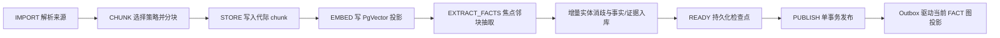

# NexusKB 可信连接式知识引擎

> NexusKB 是引擎层的通用知识执行能力，支撑 Cognition.Knowledge。本文定义产品行为与已批准决策；接口、表结构和迁移方案见[技术设计](nexus-knowledge-tech.md)。

## 定位

“Nexus”表示知识不是孤立文本，而是由**来源、证据、事实与实体连接**形成的可追溯网络。引擎负责入库、索引、检索和投影；上层负责知识库配置、授权策略与用户交互。

| 层 | 职责 |
|----|------|
| Cognition.Knowledge | 选择知识来源、组织有效上下文、应用业务规则 |
| NexusKB | 保存可信知识、生成可重建索引、执行授权检索 |
| PostgreSQL | 保存实体、事实、证据及来源链的唯一真理 |
| PgVector / Neo4j | 加速向量与图检索的可重建投影 |

## 核心能力总览

状态标签统一解释如下：**✅ 已实现**表示当前代码与对外入口已闭环；**🟡 部分实现**表示底层能力存在但外部合同或完整语义尚未开放；**⏳ 按需规划**表示已有架构边界、尚无必要调用方；**🚫 非基线目标**表示当前明确不实现。

| 能力 | 状态 | 当前行为与边界 |
|------|------|----------------|
| 多格式导入、分块与向量化 | ✅ 已实现 | 通过 importer/chunker 策略处理文档，产物归属独立入库代际 |
| generation 隔离、READY 检查点与原子发布 | ✅ 已实现 | `ai_knowledge_ingest_run` 即 generation；失败不切换 `active_run_id`，READY 重试不重复调用 AI |
| 实体、事实、证据与稳定来源链 | ✅ 已实现 | PostgreSQL 保存规范实体、事实、焦点证据、断言及稳定 UUID |
| 双时态事实断言 | ✅ 已实现 | 支持现实有效期与系统采信期；当前查询、发布、换代和撤销均应用时态规则 |
| PostgreSQL 内部 as-of 查询 | 🟡 部分实现 | 内部可按 `validAt + knownAt` 查询；尚无外部历史查询 API 和历史图遍历 |
| 向量检索 | ✅ 已实现 | PgVector 在授权库、当前代际与来源过滤范围内返回 chunk 候选 |
| 关键词检索 | ✅ 已实现 | PostgreSQL FTS 使用 `simple` 配置；当前没有专用中文分词器 |
| 当前事实图检索 | ✅ 已实现 | Neo4j 当前 `FACT` 投影直接事实优先，有剩余额度时扩展相邻事实，最多形成有界二跳候选 |
| 纯图检索模式 | ✅ 已实现 | 公共搜索入口支持 `mode=graph`，只启用图通道；投影不可用时显式返回 GRAPH 降级 |
| 三路混合检索 | ✅ 已实现 | vector + keyword + graph 使用库权重和通道权重执行 weighted RRF，最终回 PostgreSQL 复核 |
| 知识专用 Reranker | ⏳ 按需规划 | 当前知识结果不做模型精排；现有 Rerank 位于 intelligent 层，不能由 engine 反向依赖 |
| 通用路径查询与图探索 API | ⏳ 按需规划 | 当前只有检索内部的直接事实与有界邻接扩展；待真实调用方明确深度、超时和授权语义后实现 |
| 历史 Neo4j `FACT_ASSERTION` 投影 | ⏳ 按需规划 | 单事实历史继续由 PostgreSQL 查询；只有历史多跳需求批准后才建立历史图 |
| 自动事实冲突裁决 | 🚫 非基线目标 | 冲突事实保留各自证据，不自动覆盖或失效；后续仅在谓词基数与审计规则明确时评审 |
| Neo4j 直接实体/关系 CRUD | 🚫 非基线目标 | 不提供 `addNode`、`addRelation` 或图内真理修改；投影始终可由 PostgreSQL 重建 |

## 代际 ECL 与入库管道

当前管道以 document + ingest run 为隔离单元。这里的 ECL 表示“抽取与规范化、连接可信实体/事实、加载真理与投影”的整体过程，不是对 Neo4j 节点做可变 CRUD。



| 阶段 | 主要产物 | 失败语义 |
|------|----------|----------|
| IMPORT / CHUNK | 规范文本、内容摘要、分块策略与代际指纹 | 当前 run 失败，线上旧代际不变 |
| STORE | 仅属于当前 run 的稳定 chunk | 不覆盖 active run 的 chunk |
| EMBED | 可重建 PgVector chunk 投影 | 未完成时不得进入 READY |
| EXTRACT_FACTS / Resolve | 实体、事实、焦点证据和未发布断言 | 全响应校验后才持久化；邻块不能单独作证 |
| READY | 已完成外部 AI 工作的可恢复检查点 | 重试直接尝试发布，不重复消费模型 |
| PUBLISH | `recorded_at`、旧断言 `expired_at`、`active_run_id`、run 状态与 outbox | 同一 PostgreSQL 事务；CAS/fencing 失败不产生半发布状态 |
| Projection | PgVector/Neo4j 当前投影与 checkpoint | 发布不因 Neo4j 故障回滚，图通道降级并由 outbox 重放 |

## 检索策略矩阵

所有模式先解析授权知识库集合，再执行来源过滤；所有最终命中都重新解析授权并通过 PostgreSQL 校验当前代际、双时态、来源与证据。`threshold` 只影响向量通道。

| `mode` | 启用通道 | 适用场景 | 当前限制与降级 |
|--------|----------|----------|----------------|
| `vector` | VECTOR | 语义近似、同义表达 | 依赖 embedding 投影；失败时标记 VECTOR 降级 |
| `keyword` | KEYWORD | 标识符、专名、原文关键词 | 使用 PostgreSQL `simple` FTS；不承诺中文分词增强 |
| `graph` | GRAPH | 实体名、谓词和相邻事实的结构召回 | 仅当前 FACT、直接优先和有界二跳；Neo4j/checkpoint 非 READY 时标记 GRAPH 降级并返回空图结果 |
| `hybrid` | VECTOR + KEYWORD + GRAPH | 默认知识问答与多来源检索 | 默认权重 `0.5 / 0.3 / 0.2`；单分支故障时由剩余分支继续融合 |

图通道只把 `factKey` 等稳定标识作为候选带回应用层，再由 PostgreSQL 映射到当前有效 evidence 和 focus chunk。Neo4j 的 element ID、属性内容或投影可见性都不能直接成为对外结果。

## 存储职责矩阵

| 存储 | 负责 | 不负责 | 恢复与一致性 |
|------|------|--------|--------------|
| 对象存储 | 原始文件与大对象内容 | 事实、ACL、当前代际判断 | PostgreSQL 保存引用和摘要；对象生命周期由文档业务管理 |
| PostgreSQL | 知识库、文档、run、chunk、实体、事实、证据、双时态断言、ACL 关联、outbox/checkpoint | 无界图遍历 | 唯一真理源；发布、换代、撤销与 outbox 同事务 |
| PgVector | chunk embedding 相似度候选 | 来源真理、授权结论、事实裁决 | 物理上位于 PostgreSQL，逻辑上是可重建投影；结果必须联结真理表 |
| Neo4j | 当前 FACT 的有界遍历、共同邻域和结构候选 | CRUD 真理、授权、历史事实默认查询 | 由 outbox 增量投影或全量重建；返回稳定 ID 后回 PostgreSQL 复核 |
| Redis | 通用任务通知、锁或平台缓存能力 | NexusKB 专用结果真理与基线检索缓存 | 当前没有 NexusKB 专用结果缓存，避免引入额外一致性面 |

## 实际对外与运行时入口

当前没有名为 `NexusKnowledgeEngine` 的统一 facade。对外合同由 knowledge 业务模块提供，运行时由已有组件协作完成；不存在的概念接口不得被当成可调用 API。

| 入口 | 状态 | 实际职责 |
|------|------|----------|
| `POST /api/knowledge-bases/search` | ✅ 已实现 | 授权多库检索，支持 `vector / keyword / graph / hybrid`、库权重和来源过滤 |
| `GET /api/knowledge-bases/{id}/graph` | ✅ 已实现 | 返回单库当前图快照，用于展示，不是通用路径探索 |
| `GET /api/knowledge-bases/{id}/graph-projection/status` | ✅ 已实现 | 管理员查看 Neo4j 投影 checkpoint 状态 |
| `POST /api/knowledge-bases/{id}/graph-projection/rebuild` | ✅ 已实现 | 管理员携带幂等键触发当前 FACT 投影重建 |
| 文档 batch/detail/delete/retry/progress REST | ✅ 已实现 | 上传入队、状态查询、代际重试与来源撤销 |
| `KnowledgePipelineService.process(...)` | ✅ 内部运行时 | 队列 worker 调用的代际入库管道，不直接暴露为公共 facade |
| `HybridSearchService.search(AuthorizedQuery)` | ✅ 内部运行时 | 授权范围内三通道查询、weighted RRF、二次授权和来源复核 |
| `KnowledgeGraphProjectionService.searchFactKeys(...)` | ✅ 内部运行时 | 当前图稳定 factKey 候选；不返回 Neo4j element ID |
| `TrustedKnowledgeStore` as-of 查询 | 🟡 内部能力 | 支持双时态回放，尚未定义外部审计授权与 API |

## 引擎协作边界

| 协作方 | 当前状态 | NexusKB 边界 |
|--------|----------|------------|
| Cognition Retrieval | ✅ 已实现 | `UnifiedRetrievalService` 可并行检索 Memory 与 Knowledge 并融合；知识分支仍执行自己的授权和来源复核 |
| AtomMemory | 🟡 部分协作 | 共享统一检索上层，但 memory rerank 只作用于 Memory 候选；没有“记忆自动晋升知识”或 NexusKB Bundle Search |
| SemanticCalc | 🟡 目标边界已定义 | 语义计算应提供通用 embedding、NER、关系抽取与相似度能力；当前 NexusKB 实际使用 knowledge 包内的 `EmbeddingService`、`EntityExtractionService` 和增量 resolver，尚无 SemanticCalcEngine 编排调用 |
| ValueRule | ⏳ 按需规划 | 价值过滤属于 Cognition/业务编排层，不在 NexusKB 存储与召回内部隐式执行；当前无 NexusKB 直连 ValueRuleEngine |
| Document Engine / knowledge 业务模块 | ✅ 已实现 | 业务模块负责上传、来源、ACL 和队列；NexusKB 只消费可信输入并管理代际，不拥有上游文档编辑语义 |

协作原则是“上层编排、下层提供窄能力”：NexusKB 不反向依赖 intelligent 层，不把 Memory、价值规则或回答策略嵌入真理存储，也不因未来统一 facade 而复制现有调用链。

## 业界框架对照

下表用于说明设计取舍，不代表性能基准或完整功能等价。

| 参考框架 | 可借鉴能力 | NexusKB 当前选择 | 明确差异 |
|----------|------------|------------------|----------|
| Cognee | 数据管道、图与向量协同、可组合认知处理 | 采用分阶段代际管道和多投影检索 | 更强调 PostgreSQL 来源/证据真理、ACL 与原子发布，不引入 Python 运行时 |
| LightRAG | 向量、关键词与图结构互补召回 | 采用 vector + FTS + graph weighted RRF | 当前图召回严格有界并回 PostgreSQL 复核，不复制其存储模型或把图作为真理 |
| Graphiti | 双时态事实、来源 episode、历史关系查询 | 已吸收 `valid/invalid` 与 `recorded/expired`、追加式证据和显式失效原因 | PostgreSQL 是真理源；Episode、历史 `FACT_ASSERTION` 图和自动矛盾失效按需延期 |
| M-FLOW | 记忆流、图路由与 bundle 化上下文 | 借鉴结构候选和上层多源融合思路 | NexusKB 是共享知识而非用户记忆；Bundle Search 留在 AtomMemory，不在知识引擎复制 |

## 已批准决策

以下决策于 2026-08-02 经人类批准，后续实现不得以兼容旧行为为由弱化：

| 决策 | 约束 |
|------|------|
| PostgreSQL 是唯一真理源 | 实体、事实、证据、来源链和当前入库代际只以 PostgreSQL 为准 |
| Neo4j 与 PgVector 是投影 | 投影可丢弃、重放和重建，不得反向覆盖 PostgreSQL |
| 公共知识库默认参与检索 | 默认检索范围包含所有经授权的公共知识库；公共不等于绕过 ACL |
| 检索结果必须标记来源 | 每条结果携带知识库、可见性、文档、代际、焦点块和证据标识 |
| AI 入库费用归上传者 | 有上传者时由上传者承担；无上传者时由知识库拥有者承担，归属在代际创建时固定 |
| 入库按代际发布 | 现有 `ai_knowledge_ingest_run` 就是代际；`active_run_id` 是唯一线上可见性开关，PUBLISHED 仅是受约束镜像 |
| 事实断言使用双时态 | `valid_at/invalid_at` 表示现实有效期，`recorded_at/expired_at` 表示系统采信期，均采用左闭右开区间 |
| READY 可恢复 | READY 独立持久化；恢复时直接发布，不重复执行外部 AI 调用 |
| 事实必须有焦点证据 | 邻块只能帮助理解，不能单独作为事实证据 |
| 实体只做增量消歧 | 新代际只解析新增或变化的实体提及，不再每次扫描整库 |

## 可信知识模型

### 统一来源链

所有知识产物共享同一条来源链：

```text
KnowledgeBase
  → Document（外部来源及上传者）
    → IngestGeneration（本次内容与管道配置快照）
      → FocusChunk（事实抽取焦点）
        → Evidence（焦点块内可定位原文）
          → Fact（规范化事实）
            → Entity（消歧后的实体）
```

来源链必须能回答：知识来自哪个库、哪个外部来源、哪次入库、哪个焦点块、哪段原文，以及由谁上传。对象存储保存原始文件；PostgreSQL 保存文件引用、内容摘要和上述来源链。

### 入库代际

同一文档每次内容或管道配置变化都会形成新的入库代际。代际先在隔离状态下完成分块、向量化、事实抽取、消歧和索引准备，全部达到发布条件后一次性切换为当前代际。

- 重试继续同一代际和已有检查点，不重复创建知识。
- 相同内容与相同管道指纹重复提交时，只复用尚未 `SUPERSEDED` 的已有代际。
- 已被换代的相同指纹历史保持不可变；内容从 F1→F2→F1 回退时创建新的代际和断言，不复活旧 F1。
- 新代际失败时标记失败并保留诊断，线上检索继续使用旧代际。
- 删除来源时先撤销 PostgreSQL 中的有效来源，再异步清理投影。

## 焦点邻块抽取

事实抽取以单个焦点 chunk 为单位，并按需附带同文档、同代际的相邻块作为上下文。

```text
前邻块后缀（可截断）
焦点块全文（不可截断）
后邻块前缀（可截断）
```

约束如下：

- 先为焦点块保留完整预算，再从近到远加入邻块。
- 超出模型上下文时只截断邻块：前邻块保留靠近焦点的后缀，后邻块保留靠近焦点的前缀。
- 提示词明确标记 `FOCUS` 与 `CONTEXT_ONLY`，防止模型混淆。
- 抽取结果必须给出焦点块内的原文引句和字符位置；无法在焦点块复核的事实直接拒绝。
- 邻块可用于补全指代、时间和语境，但不能成为该焦点任务的证据。

## 事实与证据

实体、事实和证据是不同概念：

| 概念 | 含义 | 去重边界 |
|------|------|----------|
| Entity | 消歧后的对象，如人物、组织、概念 | 同一知识库内按规范化身份键去重 |
| Fact | 主体—谓词—客体或字面量组成的规范化陈述 | 同一知识库内按规范化事实键去重 |
| Evidence | 支撑事实的焦点块原文及定位 | 同一代际、焦点块和原文位置内去重 |

同一事实可以被多个来源证据支持，同一证据也可以支持多个事实。fact/evidence 关联是一条独立断言：发布时才写入 `recorded_at`，来源换代或撤销时才写入 `expired_at`；抽取失败、任务失租约和发布 CAS 失败均不得提前改变系统采信区间。

默认检索只接受当前有效断言：系统采信区间和现实业务区间都必须命中当前数据库时间。显式历史查询同时指定业务时间 `validAt` 与系统认知时间 `knownAt`，两个区间均为左闭右开。同一 fact 只要仍有其他文档的一条当前有效断言，就继续参与检索与图投影。

事实没有有效证据时不得参与检索或图投影。冲突陈述作为不同事实保留，由证据数量、来源和置信度供上层判断，不静默覆盖。

## 增量实体消歧

新代际只处理本代际产生的新实体提及：

- 先用规范化别名和稳定身份键匹配已有实体。
- 再从同一知识库检索少量名称或语义候选，必要时由模型判定“链接已有实体”或“创建新实体”。
- 无法高置信判定时保留为新实体或待审，不强行合并。
- 不因一次新入库重新向量化并两两比较整库实体。
- 已有实体的破坏性合并必须在 PostgreSQL 完成并产生投影事件，不能只改 Neo4j。

## 授权多库检索

### 默认范围

未显式关闭公共来源时，候选范围由以下集合组成：

1. 调用方显式选择且有权读取的知识库；
2. 助理或工作区配置且有权读取的知识库；
3. 所有启用且经授权的公共知识库。

公共知识库只是默认候选，不是免授权资源。ACL 拒绝、租户策略拒绝、来源禁用或代际未发布时均不得进入任何检索分支。

### 混合排序

向量、全文和图检索只在授权知识库集合内执行，再使用带“检索通道权重”和“知识库权重”的 weighted RRF 融合。融合按稳定候选 ID 去重，不再按文本内容去重；相同文本来自不同知识库时保留各自来源。

每条返回结果必须包含可展示的来源标记，至少包括：

- 知识库稳定 ID、名称与 `PRIVATE / ORG / SYSTEM_PUBLIC` 可见性；
- 文档稳定 ID、来源类型与来源地址或文件标识；
- 入库代际、焦点 chunk 稳定 ID；
- 事实与证据稳定 ID（若结果由图事实召回）；
- 融合分数及命中的检索通道。

## AI 入库计费

费用承担者在代际创建时解析并写入代际快照：

```text
payerUserId = document.uploaderId != null
    ? document.uploaderId
    : knowledgeBase.ownerId
```

- 上传者是触发该来源进入知识库的用户，不等同于异步任务执行身份。
- 系统同步、历史迁移等没有上传者的来源由知识库拥有者承担。
- Embedding、事实抽取和本代际触发的增量消歧均使用同一承担者。
- 检索阶段的模型费用仍归检索调用方，不属于本决策范围。
- 每次实际模型调用以稳定 `usageKey` 幂等结算；任务重试不得重复扣费。
- 余额预检失败时不发起模型调用，代际保持失败或待重试状态。

## 失败与降级行为

| 故障 | 对外行为 |
|------|----------|
| 解析、模型调用或 PostgreSQL 写入失败 | 当前代际不切换，旧代际继续服务 |
| PgVector 投影失败 | 向量分支暂不可用，全文与可用图分支继续工作 |
| Neo4j 不可用或滞后 | 图分支降级，不影响 PostgreSQL 事实与其他检索分支 |
| 投影数据损坏 | 从 PostgreSQL 当前有效事实和证据重建 |
| 授权范围无法确定 | 失败关闭，不返回任何不确定来源 |
| 计费结算状态不确定 | 暂停对应入库单元，不以新调用掩盖未知结算 |

已实际发生的模型调用不因后续投影失败自动退款；系统通过检查点与幂等结算避免重复调用和重复扣费。

## 抽取配置与输出契约

- 实体事实抽取和实体消歧系统 Prompt 分别由系统参数 `knowledge.extraction.system_prompt`、`knowledge.entity_resolution.system_prompt` 管理；管理员保存的新版本只影响后续新建代际。
- 抽取模型与实体消歧模型分别使用系统级 `KNOWLEDGE_EXTRACTION`、`KNOWLEDGE_ENTITY_RESOLUTION` 模型偏好，普通用户偏好不得改变共享知识入库结果。
- 代际创建时分别冻结两类 Prompt 内容及摘要、两类输出契约版本和两类模型 ID；执行中的代际不因管理员修改配置而热切换。
- 后端固定并版本化事实抽取 JSON 数组契约。基础字段缺失、基础字段或可选 `validAt / invalidAt / attributes` 类型错误、未知字段、枚举错误、时间区间反向、attributes 越界、置信度越界或焦点证据不一致时，整个抽取单元失败；业务时间未知时保持 NULL，不使用摄取时间补值。
- 后端固定并版本化实体消歧 JSON 对象契约。`LINK` 必须引用当前候选内 UUID，`CREATE / REVIEW` 的 `entityId` 必须是 JSON null；未知 action、候选外 ID、缺失或额外字段均使当前代际失败，不静默创建实体。
- 两类 Prompt 摘要、输出契约版本及模型 ID 进入代际指纹；每次 AI 调用的幂等摘要包含该阶段冻结的 Prompt 摘要、契约版本、模型 ID 和输入，任一配置变化都会创建新代际。

## 边界

- NexusKB 不定义业务价值观、回答生成策略或 UI。
- 公共知识库不做跨库实体合并；实体与事实去重边界默认是单个知识库。
- Neo4j 不承担实体编辑、事实合并、证据修改或授权判断。
- PgVector 不保存唯一来源信息，引用失效时必须回到 PostgreSQL 判定。
- 本次不保留旧图谱写路径或双写兼容层。

## 相关文档

- [NexusKB 技术设计](nexus-knowledge-tech.md)
- [Cognition 认知层设计](../../intelligent/bak/cognition/cognition.md)
- [AtomMemory 原子记忆引擎](atom-memory.md)
- [文档引擎](../content/document-engine.md)
