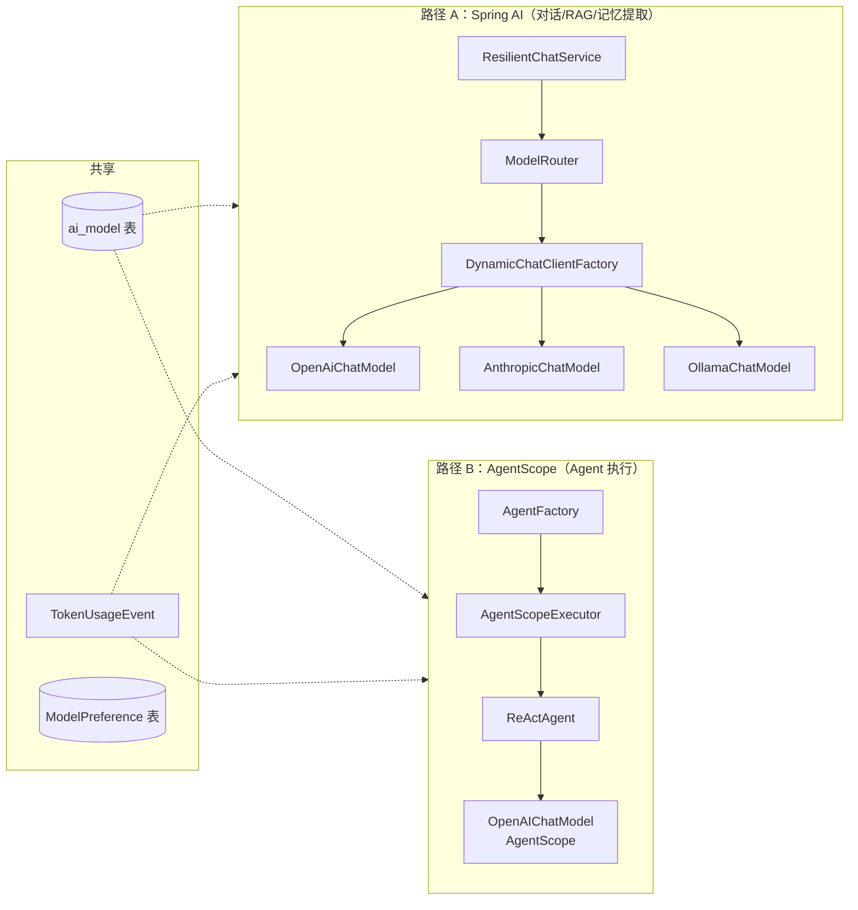
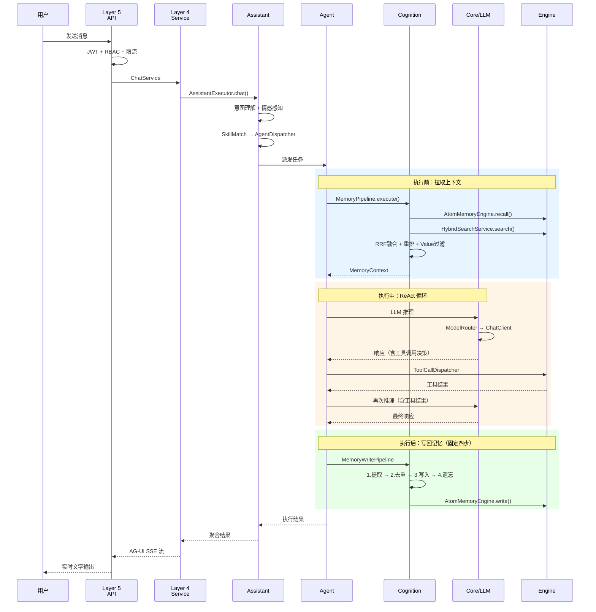
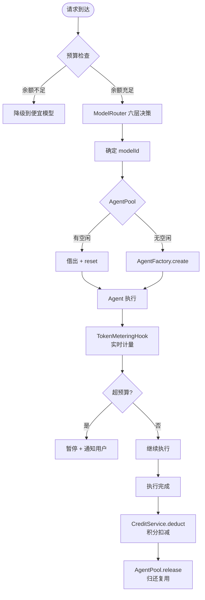
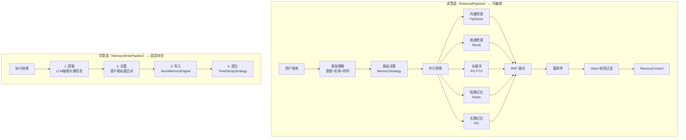
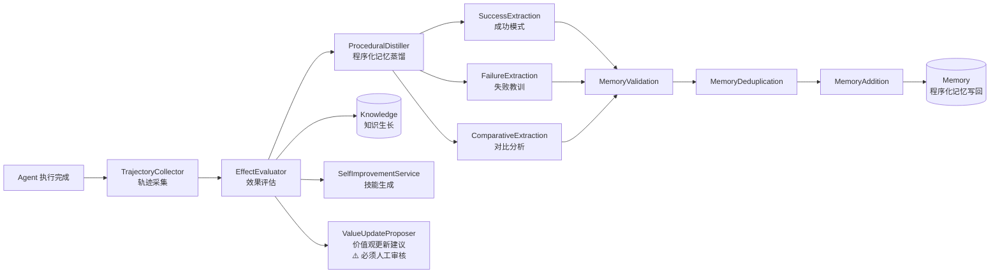
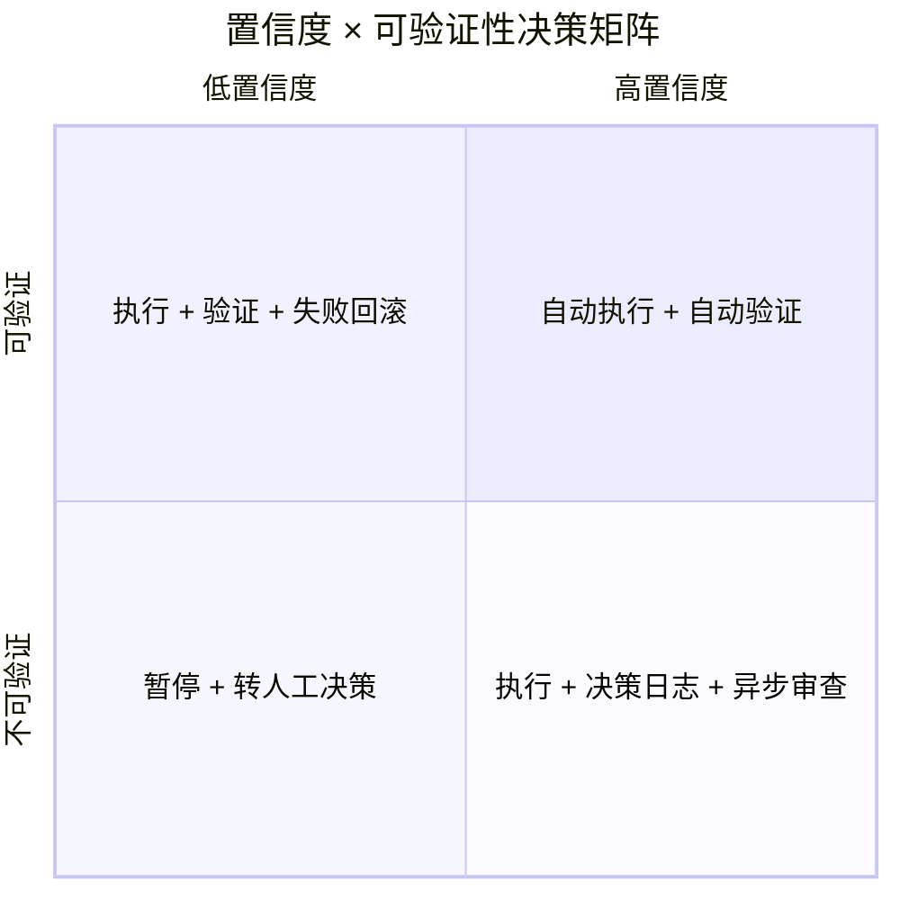
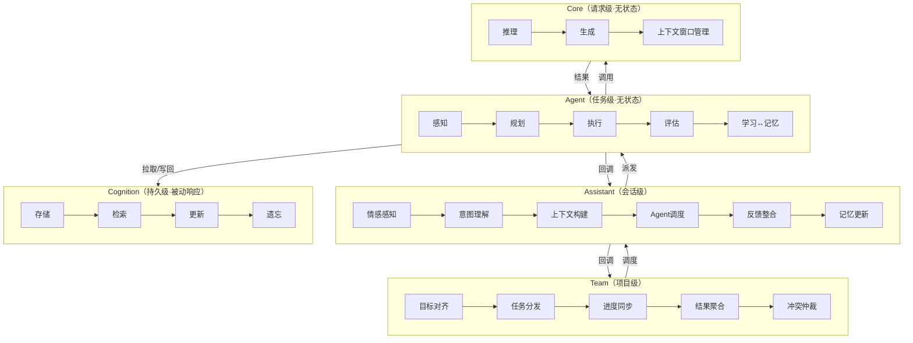

# 五层智能架构执行逻辑图

> 本文档是 [execution-flow.md](execution-flow.md) 的可视化补充。

## 整体架构分层

```mermaid
graph TB
    subgraph L5["Layer 5 对话与交互层（aaf-api）"]
        REST[REST API]
        GQL[GraphQL]
        WS[WebSocket]
        AGUI[AG-UI SSE]
        GW[安全网关<br/>JWT + RBAC + 限流]
        CTRL[Controller]
        REST & GQL & WS & AGUI --> GW --> CTRL
    end

    subgraph L4["Layer 4 服务层（aaf-api/module）"]
        ChatSvc[ChatService]
        AsstMgmt[AssistantManagementService]
        AgentMgmt[AgentManagementService]
        KnowMgmt[KnowledgeManagementService]
        ModelMgmt[ModelManagementService]
    end

    subgraph L3["Layer 3 智能层（aaf-framework/intelligent）"]
        subgraph Team["Team 层"]
            TO[TeamOrchestrator]
            TD[TaskDistributor]
            PS[ProgressSyncService]
            CA[ConflictArbitrator]
            A2A[A2AProtocolService]
        end

        subgraph Asst["Assistant 层"]
            IU[IntentUnderstandingService]
            EP[EmotionPerceptionService]
            SM[SessionManager]
            SKM[SkillMatchService]
            AD[AgentDispatcher]
            RA[ResultAggregator]
        end

        subgraph Agent["Agent 层"]
            AP[AgentPool]
            AS[AgentSandbox]
            CCE[CognitiveCycleExecutor<br/>感知→规划→执行→评估]
            ASE[AgentScopeExecutor<br/>ReActAgent]
            TCD[ToolCallDispatcher]
            ACS[AgentCheckpointService]
        end

        subgraph Cognition["Cognition 层"]
            MP[MemoryPipeline]
            STM[ShortTermMemoryService]
            LTM[LongTermMemoryService]
            URS[UnifiedRetrievalService]
            VS[ValueService]
        end

        subgraph Core["Core 层"]
            MR[ModelRouter<br/>六层决策链]
            DCF[DynamicChatClientFactory]
            RCS[ResilientChatService]
            TMS[TokenMeteringService]
        end
    end

    subgraph L2["Layer 2 引擎层（aaf-framework/engine）"]
        KE[knowledge/<br/>NexusKB]
        ME[memory/<br/>AtomMemoryEngine]
        VRE[value-rule/<br/>ValueRuleEngine]
        TE[tool/<br/>ToolRegistry + MCP]
        SKE[skill/<br/>SkillMatchEngine]
        WFE[workflow/<br/>Flowable]
        DPE[data-process/<br/>DataProcessEngine]
        SCE[semantic-calc/<br/>SemanticCalcEngine]
    end

    subgraph L1["Layer 1 基础设施层"]
        PG[(PostgreSQL<br/>+ PgVector)]
        Redis[(Redis)]
        Neo4j[(Neo4j)]
        Sandbox[JVM Sandbox]
    end

    CTRL --> L4
    L4 --> Team
    L4 --> Asst
    Team --> Asst
    Asst --> Agent
    Agent -->|执行前拉取| Cognition
    Agent -->|执行后写回| Cognition
    Cognition --> Core
    Agent --> L2
    Cognition --> L2
    Core --> L2
    L2 --> L1
```

## 两条 LLM 调用路径

> 是否优先使用 AgentScope 路径，还是说我们自己可控的流程尽量使用 SpringAI

## 一次对话请求的完整调用链

混合检索（是否应=记忆+知识库）、用户感知没有明显体现

## Agent 池化 × 模型选择 × 积分预算

## 记忆管道（读管道 + 写管道）

## Learning 横切反哺通道

> 何时在哪如何集成

## 置信度 × 可验证性 二维门控

> 在哪集成？

## 五层认知循环

