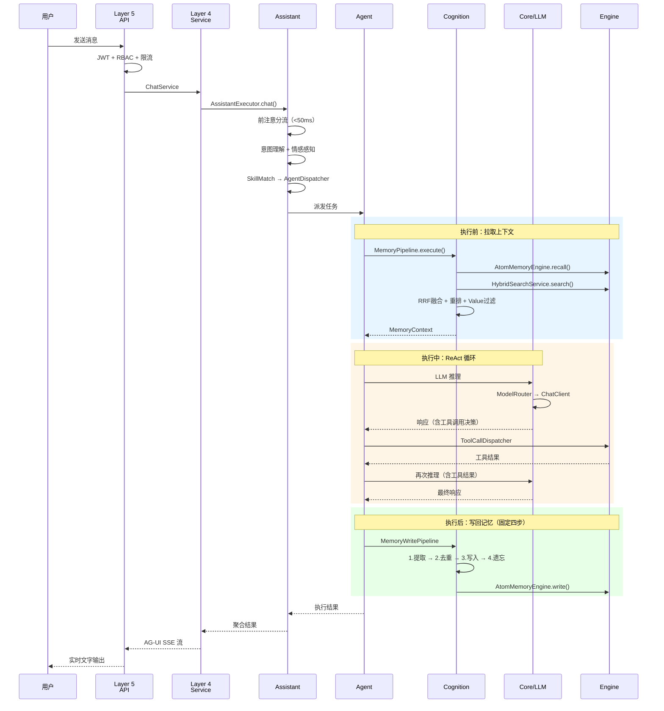
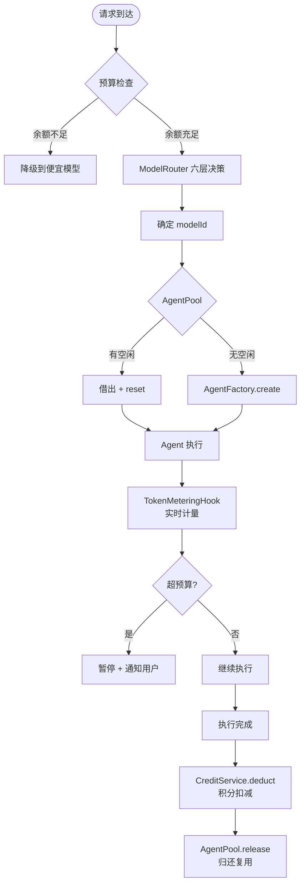
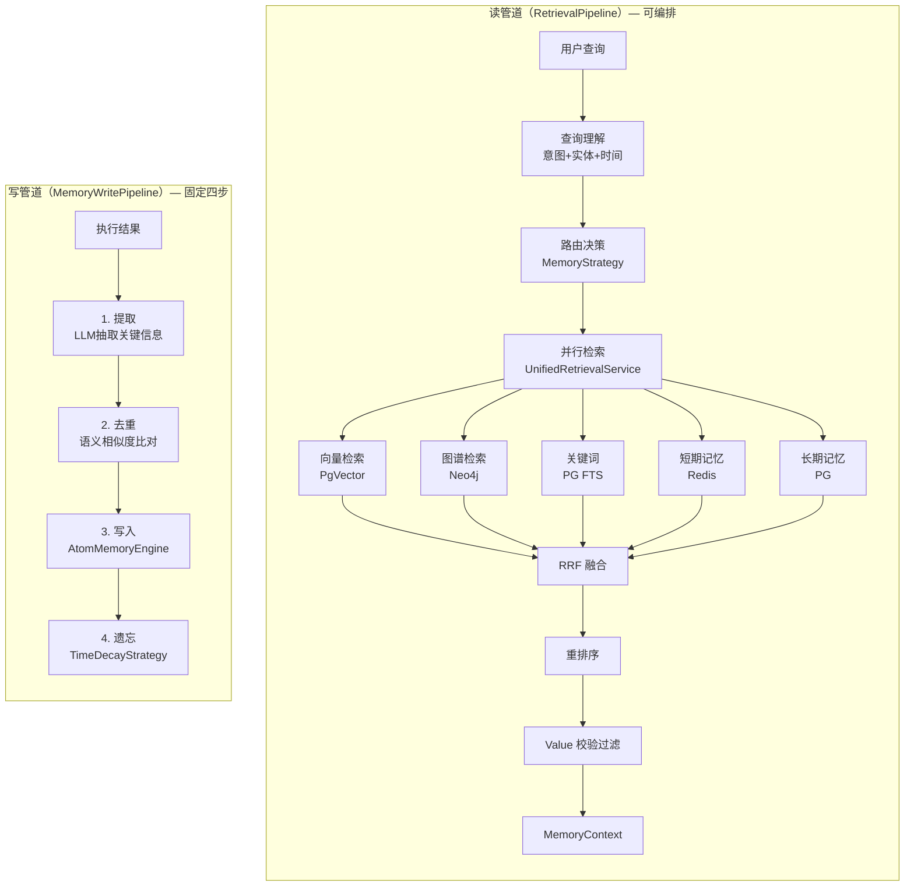
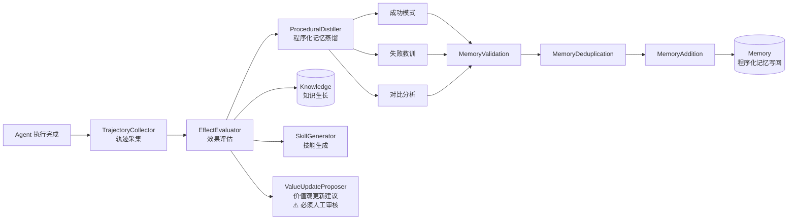
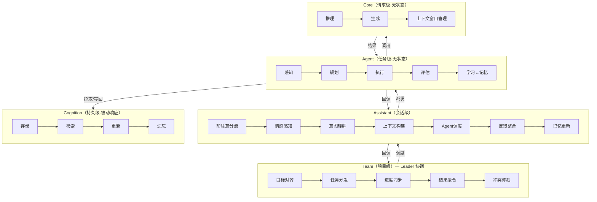

# 执行流程全景

> 跨层视图：一次请求从入口到 LLM 的完整调用链。各组件详细设计见独立文档。

## 组件逻辑图

```text
┌─────────────────────────────────────────────────────────────────────────────────┐
│  Layer 5  交互层（aaf-api）  多模态聊天 + UI操作 + 组件生成 + 语义组件              │
│                                                                                  │
│  HTTP/REST ──┐                                                                   │
│  GraphQL ────┤──→ 安全网关（JWT + RBAC + 限流）──→ Controller                    │
│  WebSocket ──┤                                        │                          │
│  AG-UI SSE ──┘                                        │                          │
└───────────────────────────────────────────────────────┼──────────────────────────┘
                                                        │ 调用
┌───────────────────────────────────────────────────────▼──────────────────────────┐
│  Layer 4  服务层（aaf-api/module）                                                │
│                                     │ 调用 framework 接口                        │
└─────────────────────────────────────┼────────────────────────────────────────────┘
                                      │
┌─────────────────────────────────────▼────────────────────────────────────────────┐
│  Layer 3  智能层（aaf-framework/intelligent）                                     │
│                                                                                  │
│  ┌──────────────────────────────────────────────────────────────────────────┐   │
│  │  Team 层（team/）                                                         │   │
│  │  Leader Assistant 协调多个 Worker Assistant（内部直接调用）                │   │
│  │  TeamOrchestrator ──→ TaskDistributor ──→ AgentDispatcher × N            │   │
│  │  ConflictArbitrator ←── ProgressSyncService                              │   │
│  │  A2AProtocolService（仅跨系统协作时使用）                                  │   │
│  │                                                                           │   │
│  │  【AgentScope 结合点】Pipeline / MsgHub / Supervisor 模式                 │   │
│  └──────────────────────────────────┬───────────────────────────────────────┘   │
│                                 │ 调度                                            │
│  ┌──────────────────────────────▼───────────────────────────────────────────┐   │
│  │  Assistant 层（assistant/）                                               │   │
│  │  前注意分流（<50ms）──→ EmotionPerceptionService                         │   │
│  │  ──→ IntentUnderstandingService ──→ SkillMatchService                    │   │
│  │  SessionManager ──→ AgentDispatcher                                      │   │
│  │  ResultAggregator ←── LearningFeedbackService                            │   │
│  │                                                                           │   │
│  │  【AgentScope 结合点】主 ReActAgent 作为 Assistant 执行体                 │   │
│  │  Hook: PreReasoningEvent 注入记忆/知识/用户画像                           │   │
│  └──────────────────────────────┬───────────────────────────────────────────┘   │
│                                 │ 派发任务                                        │
│  ┌──────────────────────────────▼───────────────────────────────────────────┐   │
│  │  Agent 层（agent/）                                                       │   │
│  │  AgentPool.borrow() ──→ AgentSandbox.execute()                           │   │
│  │       │                        │                                          │   │
│  │       ▼                        ▼                                          │   │
│  │  AgentFactory.create()   CognitiveCycleExecutor（感知→规划→执行→评估）    │   │
│  │       │                        │                                          │   │
│  │       ▼                        ├──→ ToolCallDispatcher（工具调用）        │   │
│  │  AgentScopeExecutor            ├──→ SkillMatchEngine（技能匹配）          │   │
│  │  └─ ReActAgent（AgentScope）   └──→ LlmClient.call()（LLM 推理）         │   │
│  │       └─ OpenAIChatModel                                                  │   │
│  │           └─ apiKey/baseUrl 来自 ai_model 表                              │   │
│  │                                                                           │   │
│  │  AgentCheckpointService（断点续跑）                                       │   │
│  │  AgentPool.release()（归还，reset 清空历史）                              │   │
│  │                                                                           │   │
│  │  【AgentScope 结合点】ReActAgent 是 Agent 执行体                          │   │
│  │  AgentScope 负责：ReAct 循环 / 工具调用 / Session / Tracing               │   │
│  └──────────────────────────────┬───────────────────────────────────────────┘   │
│          执行前拉取 ◄────────────┤────────────► 执行后写回                       │
│  ┌──────────────────────────────▼───────────────────────────────────────────┐   │
│  │  Cognition 层（cognition/）                                               │   │
│  │  Memory + Knowledge + Value 三核心组件 + Retrieval 服务组件               │   │
│  │                                                                           │   │
│  │  MemoryPipeline（查询理解→路由→并行检索→RRF融合→重排→MemoryContext）      │   │
│  │       ├── ShortTermMemoryService ──→ engine/memory（AtomMemoryEngine）   │   │
│  │       ├── LongTermMemoryService  ──→ engine/memory（AtomMemoryEngine）   │   │
│  │       └── UnifiedRetrievalService ─→ engine/knowledge（HybridSearch）    │   │
│  │            （独立组件，被 MemoryPipeline 编排调用）                        │   │
│  │                                                                           │   │
│  │  ValueService（价值观系统）──→ engine/value-rule（ValueRuleEngine）       │   │
│  │       伦理边界 / 优先级规则 / 交互规范 / 降级边界 / 合规约束              │   │
│  │       → Agent 决策前校验 / Retrieval 出库过滤 / Knowledge 写入拦截        │   │
│  │                                                                           │   │
│  │  【AgentScope 结合点】AafLongTermMemory 实现 AgentScope LongTermMemory   │   │
│  │  AgentScope STATIC_CONTROL 模式自动触发 retrieve/record                  │   │
│  └──────────────────────────────────────────────────────────────────────────┘   │
│                                                                                  │
│  ┌──────────────────────────────────────────────────────────────────────────┐   │
│  │  Core 层（ai/）                                                           │   │
│  │                                                                           │   │
│  │  ModelRouter（六层决策链）                                                │   │
│  │    1. 显式指定 explicitModelId                                            │   │
│  │    2. 编排引擎配置 orchestrationModelId（工作流节点/AgentDefinition）     │   │
│  │    3. AI 辅助决策 AiModelSelector（任务特征：图片/推理/长文本/成本）      │   │
│  │    4. 用户偏好 ModelPreference（USER scope）                              │   │
│  │    5. 系统默认 ModelPreference（SYSTEM scope）                            │   │
│  │    6. yaml 兜底 AiProperties.defaultModel                                │   │
│  │         │                                                                 │   │
│  │         ▼                                                                 │   │
│  │  DynamicChatClientFactory.get(modelId)                                   │   │
│  │    ├── OPENAI_COMPAT → OpenAiChatModel（Spring AI M6，OpenAiSetup）      │   │
│  │    ├── ANTHROPIC     → AnthropicChatModel（Spring AI，从容器取 Bean）    │   │
│  │    └── OLLAMA        → OllamaChatModel（Spring AI，从容器取 Bean）       │   │
│  │         │                                                                 │   │
│  │         ▼                                                                 │   │
│  │  ResilientChatService（降级 + Token 计量）                               │   │
│  │    主模型失败 → fallback_model_id（ai_model 表配置）                     │   │
│  │    每次调用后 → TokenUsageEvent → TokenMeteringService                   │   │
│  │                                                                           │   │
│  │  TokenMeteringService → 积分扣减（CreditService，待实现）                │   │
│  └──────────────────────────────────────────────────────────────────────────┘   │
└──────────────────────────────────────────────────────────────────────────────────┘
                                      │
┌─────────────────────────────────────▼────────────────────────────────────────────┐
│  Layer 2  引擎层（aaf-framework/engine）                                          │
│                                                                                  │
│  knowledge/  ──→ PgVector（向量检索）+ Neo4j（图谱检索）+ PG FTS（关键词）       │
│  memory/     ──→ AtomMemoryEngine → Redis（短期）+ PostgreSQL（长期）            │
│  value-rule/ ──→ ValueRuleEngine（规则解析 + 优先级仲裁 + 行为校验）             │
│  tool/       ──→ ToolRegistry（Spring Bean + MCP）+ ScriptSandbox               │
│  skill/      ──→ SkillMatchEngine + BuiltinSkills                               │
│  workflow/   ──→ Flowable（BPMN 工作流执行，节点可嵌入 Agent 任务）              │
│  data-process/ → DataProcessEngine（批/流处理 + 统计分析 + 聚合计算）            │
│  scheduler/  ──→ 异步任务队列 + 定时触发                                         │
└──────────────────────────────────────────────────────────────────────────────────┘
                                      │
┌─────────────────────────────────────▼────────────────────────────────────────────┐
│  Layer 1  基础设施层                                                              │
│  PostgreSQL + PgVector   Redis   Neo4j   JVM Sandbox                             │
└──────────────────────────────────────────────────────────────────────────────────┘

┌──────────────────────────────────────────────────────────────────────────────────┐
│  横切关注点（贯穿所有层）                                                         │
│  ai_model 表 ──→ 所有 LLM 调用的 apiKey/baseUrl/capabilities 唯一来源           │
│  ModelPreference 表 ──→ 用户/系统级模型偏好                                      │
│  TokenUsageEvent ──→ 两条路径（Spring AI + AgentScope）统一计量                  │
│  AG-UI 协议 ──→ 流式输出标准（RUN_STARTED/TEXT_MESSAGE/TOOL_CALL/RUN_FINISHED）  │
│  Learning 反哺通道 ──→ Agent 执行结果→评估→更新 Memory/Knowledge/Value（异步）   │
│  Value 价值观 ──→ Agent 决策校验 + Retrieval 出库过滤 + Knowledge 写入拦截       │
└──────────────────────────────────────────────────────────────────────────────────┘
```


## 两条 LLM 调用路径

```text
路径 A：Spring AI 路径（对话/RAG/记忆提取等非 Agent 场景）
  ResilientChatService → ModelRouter → DynamicChatClientFactory → Spring AI ChatClient → 各厂商 API

路径 B：AgentScope 路径（Agent 执行场景）
  AgentFactory → AgentScopeExecutor → ReActAgent → OpenAIChatModel → 各厂商 API

两条路径共享：ai_model 表（唯一来源）+ TokenUsageEvent（统一计量）+ ModelPreference（用户偏好）
```

> 详细技术方案见 [模型管理与路由技术方案](intelligent/core/model-router-tech.md)。

## 场景时序视图

### 场景一：用户 AI 对话（文字输入，Spring AI 路径）

```
用户       前端          Layer5 API    Layer4 Service  Layer3 智能层      Layer2 引擎    LLM
 │          │               │               │               │               │             │
 │─输入────→│               │               │               │               │             │
 │          │─POST /chat───→│               │               │               │             │
 │          │               │─JWT+限流──────→│               │               │             │
 │          │               │               │─ChatService───→│              │             │
 │          │               │               │               │─SessionManager│             │
 │          │               │               │               │─MemoryPipeline→│            │
 │          │               │               │               │               │─AtomMemory  │
 │          │               │               │               │               │─HybridSearch│
 │          │               │               │               │←─MemoryContext─│            │
 │          │               │               │               │─ModelRouter    │             │
 │          │               │               │               │  六层决策→modelId            │
 │          │               │               │               │─DynamicChatClientFactory    │
 │          │               │               │               │─────────────────────────────→│
 │          │←─AG-UI SSE───│←──────────────│←──────────────│←──流式 token────────────────│
 │←─实时文字─│ TEXT_MESSAGE  │               │               │─TokenUsageEvent             │
 │          │               │               │               │─MemoryPipeline 写回→AtomMemory
 │          │←─RUN_FINISHED─│               │               │               │             │
```

### 场景二：用户 AI 对话（含工具调用，AgentScope 路径）

```
用户       前端          Layer5 API    Layer4 Service  Layer3 Agent层     Layer2 引擎    LLM
 │          │               │               │               │               │             │
 │─"查订单"→│               │               │               │               │             │
 │          │─POST /chat───→│               │               │               │             │
 │          │               │               │─AssistantSvc──→│              │             │
 │          │               │               │               │─SkillMatch     │             │
 │          │               │               │               │─AgentPool.borrow()          │
 │          │               │               │               │─AgentSandbox   │             │
 │          │               │               │               │  └─ReActAgent  │             │
 │          │←─TOOL_CALL────│←──────────────│←──────────────│─────────────────────────────→│
 │          │               │               │               │               │  LLM决策工具 │
 │          │               │               │               │←─────────────────────────────│
 │          │               │               │               │─ToolCallDispatcher           │
 │          │               │               │               │───────────────→ToolRegistry  │
 │          │               │               │               │               │─业务API      │
 │          │               │               │               │←──工具结果─────│             │
 │          │               │               │               │─────────────────────────────→│
 │          │←─TEXT_MESSAGE─│←──────────────│←──流式 token──│←─────────────────────────────│
 │←─实时展示─│               │               │               │─AgentPool.release()         │
 │          │←─RUN_FINISHED─│               │               │               │             │
```

### 场景三：操作界面时 AI 自动感知（事件驱动，无需用户主动输入）

```
用户       前端          Layer5 API    Layer4 Service  AI 感知层          Layer2 引擎
 │          │               │               │               │               │
 │─上传文档─→│               │               │               │               │
 │          │─POST /docs───→│               │               │               │
 │          │               │               │─DocumentService│              │
 │          │               │               │  存储文件       │               │
 │          │               │               │               │               │
 │          │               │               │  DocumentUploadedEvent（Spring ApplicationEvent）
 │          │               │               │───────────────→│              │
 │          │               │               │               │─KnowledgePipelineService
 │          │               │               │               │  分块→向量化→图谱抽取
 │          │               │               │               │───────────────→PgVector
 │          │               │               │               │───────────────→Neo4j
 │          │               │               │               │               │
 │          │               │               │  入库完成通知   │               │
 │          │←─WebSocket推送─│←──────────────│←──────────────│               │
 │←─"已入库"─│  系统通知      │               │               │               │
 │          │               │               │               │               │
 │─"总结文档"→│               │               │               │               │
 │          │─POST /chat───→│               │               │               │
 │          │               │               │  ← 知识库已有该文档，RAG 直接命中 →
```

### 场景四：多 Assistant 协作（Team 层，Leader-Worker 模式）

```
用户       前端          Layer5 API    Layer4 Service  Team 层            Assistant×N
 │          │               │               │               │               │
 │─"完成需求"→│              │               │               │               │
 │          │─POST /team───→│               │               │               │
 │          │               │               │─TeamService───→│              │
 │          │               │               │               │─TaskDistributor│
 │          │               │               │               │  拆分子任务    │
 │          │               │               │               │─Leader Assistant│
 │          │               │               │               │  直接调用 Worker│
 │          │               │               │               │─AgentDispatcher→│ product
 │          │               │               │               │─AgentDispatcher→│ architect
 │          │               │               │               │─AgentDispatcher→│ developer
 │          │               │               │               │  （并发执行）   │
 │          │←─进度推送──────│←──────────────│←─ProgressSync─│←──────────────│
 │←─实时进度─│               │               │               │               │
 │          │               │               │               │─ConflictArbitrator
 │          │               │               │               │  结果仲裁聚合  │
 │          │←─最终结果──────│←──────────────│←──────────────│               │
```

> Team 内部 Leader Assistant 直接调用 Worker Assistant，仅跨系统协作时才走 A2A 协议。

### 场景五：业务操作触发 AI 辅助决策（置信度门控）

```
用户       前端          业务系统        AI 决策层       置信度门控         人工审核
 │          │               │               │               │               │
 │─业务操作─→│               │               │               │               │
 │          │─POST /action─→│               │               │               │
 │          │               │─AssistantSvc──→│              │               │
 │          │               │               │─LLM 推理       │               │
 │          │               │               │─置信度评估──────→│             │
 │          │               │               │               │               │
 │          │               │               │  置信度 > 0.9  │               │
 │          │               │               │               │─自动执行，暂存  │
 │          │               │               │               │─异步通知用户    │
 │          │               │               │               │               │
 │          │               │               │  置信度 0.7-0.9│               │
 │          │←─展示执行计划──│←──────────────│←──────────────│               │
 │─确认/拒绝→│               │               │               │               │
 │          │               │               │               │               │
 │          │               │               │  置信度 < 0.7  │               │
 │          │               │               │               │─转人工──────────→│
 │          │               │               │               │  附状态快照+建议  │
 │←─等待审核─│               │               │               │               │─审核决策
```


## 接口与实现来源

> 图例：`[接口]` = AAF 自定义接口，`[AS]` = AgentScope 实现，`[SAI]` = Spring AI 实现，`[AAF]` = AAF 自研实现

### Core 层

| 组件 | 类型 | 来源 | 说明 |
|------|------|------|------|
| `ModelRouter` | `[接口]` AAF | `DefaultModelRouter` `[AAF]` | 六层决策链，AAF 自研 |
| `ModelRoutingContext` | Record | `[AAF]` | 路由上下文，AAF 自研 |
| `AiModelSelector` | `[AAF]` | `[AAF]` | 任务特征→模型选择，AAF 自研 |
| `DynamicChatClientFactory` | `[AAF]` | `[AAF]` + `[SAI]` | 工厂 AAF 自研，构建 Spring AI ChatClient |
| `ChatClient` | `[SAI]` | `[SAI]` | Spring AI 核心，AAF 不自研 |
| `OpenAiChatModel` | `[SAI]` | `[SAI]` | Spring AI 2.0 M6，用 OpenAiSetup 构建 |
| `AnthropicChatModel` | `[SAI]` | `[SAI]` | Spring AI，从容器取 Bean |
| `OllamaChatModel` | `[SAI]` | `[SAI]` | Spring AI，从容器取 Bean |
| `ResilientChatService` | `[AAF]` | `[AAF]` | 降级+计量，AAF 自研，内部用 Spring AI |
| `TokenMeteringService` | `[AAF]` | `[AAF]` | Token 计量，AAF 自研 |
| `TokenUsageEvent` | Record | `[AAF]` | 两条路径统一计量事件 |
| `ModelPreferenceRepository` | `[AAF]` | `[AAF]` + JPA | 用户/系统偏好，AAF 自研 |

### Agent 层

| 组件 | 类型 | 来源 | 说明 |
|------|------|------|------|
| `AgentExecutor` | `[接口]` AAF | — | AAF 定义，屏蔽 AgentScope 细节 |
| `AgentScopeExecutor` | `[AAF]` | `[AAF]` 适配 `[AS]` | 实现 AgentExecutor，包装 ReActAgent |
| `ReActAgent` | `[AS]` | `[AS]` | AgentScope 核心，ReAct 循环 |
| `OpenAIChatModel`（AS） | `[AS]` | `[AS]` | AgentScope 内置，支持多厂商 |
| `AgentFactory` | `[AAF]` | `[AAF]` | 从 ai_model 表读配置，构建 AgentExecutor |
| `AgentPool` | `[AAF]` | `[AAF]` | 池化复用，AAF 自研 |
| `AgentSandbox` | `[AAF]` | `[AAF]` | 虚拟线程隔离，AAF 自研 |
| `AgentCheckpointService` | `[AAF]` | `[AAF]` | 断点续跑，AAF 自研 |
| `CognitiveCycleExecutor` | `[AAF]` | `[AAF]` | 感知→规划→执行→评估，AAF 自研（薄门面） |
| `WorkingMemory` | `[接口]` AAF | `WorkingMemoryImpl` `[AAF]` | 执行期临时状态 |
| `McpToolService` | `[AAF]` | `[AAF]` + `[AS]` MCP | MCP 工具发现，AAF 封装 AgentScope MCP |
| `ToolRegistry` | `[AAF]` | `[AAF]` | 工具注册表，AAF 自研 |
| `ToolCallDispatcher` | `[AAF]` | `[AAF]` | 工具调用分发，AAF 自研 |
| `SessionManager`（待） | `[接口]` AAF | `AgentScopeSessionAdapter` `[AAF]` 适配 `[AS]` | 待引入 agentscope-extensions-session-redis |


### Cognition 层

| 组件 | 类型 | 来源 | 说明 |
|------|------|------|------|
| `MemoryPipeline` | `[接口]` AAF | `DefaultMemoryPipeline` `[AAF]` | 记忆管道，AAF 自研 |
| `AtomMemoryEngine` | `[接口]` AAF | `AtomMemoryEngineImpl` `[AAF]` | 原子记忆，AAF 自研（参考 Mem0/Graphiti） |
| `HybridSearchService` | `[AAF]` | `[AAF]` | 向量+图谱+关键词+RRF，AAF 自研 |
| `UnifiedRetrievalService` | `[AAF]` | `[AAF]` | 统一检索入口（独立组件，被 MemoryPipeline 编排调用），AAF 自研 |
| `ValueService` | `[接口]` AAF | `DefaultValueService` `[AAF]` | 价值观校验/冲突仲裁，AAF 自研 |
| `ValueRuleEngine` | `[接口]` AAF | `ValueRuleEngineImpl` `[AAF]` | 规则解析+优先级仲裁+行为校验，引擎层 |
| `EmbeddingModel` | `[SAI]` | `[SAI]` | Spring AI，向量化 |
| `VectorStore`（PgVector） | `[SAI]` | `[SAI]` | Spring AI PgVector |
| `AafLongTermMemory`（待） | `[AAF]` 实现 `[AS]` 接口 | `[AAF]` | 对接 AtomMemoryEngine，待实现 |

### Assistant 层

| 组件 | 类型 | 来源 | 说明 |
|------|------|------|------|
| `AssistantExecutor` | `[接口]` AAF | `DefaultAssistantExecutor` `[AAF]` | AAF 定义接口 |
| `IntentUnderstandingService` | `[AAF]` | `[AAF]` | 意图理解，AAF 自研（内部调 LLM） |
| `EmotionPerceptionService` | `[AAF]` | `[AAF]` | 情感感知，AAF 自研 |
| `SessionManager` | `[接口]` AAF | `[AAF]` / `[AS]` 可替换 | 会话管理 |
| `AgentDispatcher` | `[AAF]` | `[AAF]` | Agent 调度，AAF 自研 |
| `SkillMatchService` | `[AAF]` | `[AAF]` | 技能匹配，AAF 自研 |
| `ResultAggregator` | `[AAF]` | `[AAF]` | 结果聚合，AAF 自研 |

### Team 层

| 组件 | 类型 | 来源 | 说明 |
|------|------|------|------|
| `TeamOrchestrator` | `[接口]` AAF | `DefaultTeamOrchestrator` `[AAF]` | 团队编排，AAF 薄门面 |
| `TaskDistributor` | `[AAF]` | `[AAF]` | 任务分发，AAF 自研 |
| `ConflictArbitrator` | `[AAF]` | `[AAF]` | 冲突仲裁，AAF 自研 |
| `ProgressSyncService` | `[AAF]` | `[AAF]` | 进度同步，AAF 自研 |
| `Pipeline` / `MsgHub` | `[AS]` | `[AS]` | AgentScope 编排原语，直接使用 |
| `A2AProtocolService` | `[AAF]` 适配 `[AS]` | `[AAF]` + agentscope-a2a-starter | A2A 协议（仅跨系统），AAF 封装 AgentScope |
| `AgUiStreamHandler` | `[AAF]` 适配 `[AS]` | `[AAF]` + agentscope-agui-starter | AG-UI 协议，AAF 封装 AgentScope |


## 与业务系统的交互

```text
业务系统（aaf-api/module/）
    │
    ├── 读取 AI 能力（单向依赖 framework 接口）
    │     module/chat → AssistantExecutor.chat()
    │     module/knowledge → KnowledgePipelineService.ingest()
    │     module/agent → AgentFactory.create() + AgentPool
    │
    ├── 发布领域事件（解耦，AI 被动感知）
    │     业务操作完成 → ApplicationEvent → AI 感知层订阅
    │     例：文档上传完成 → DocumentUploadedEvent → 知识库自动入库
    │         用户行为变化 → UserBehaviorEvent → 记忆管道写回
    │
    └── 接收 AI 产出（回调/SSE）
          AG-UI SSE 流 → 前端实时展示
          WebSocket 推送 → 系统通知
          REST 响应 → 同步调用结果
```

## AgentScope 结合点汇总

| 层 | AgentScope 组件 | AAF 接入方式 | 状态 |
|----|----------------|-------------|------|
| Core | OpenAIChatModel / AnthropicChatModel / DashScopeChatModel | AgentFactory 从 ai_model 表读配置构建 | ✅ |
| Agent | ReActAgent（ReAct 循环） | AgentScopeExecutor 适配 AgentExecutor 接口 | ✅ |
| Agent | Session（Redis/MySQL 后端） | AgentScopeSessionAdapter | ⚠️ 待引入 starter |
| Agent | autocontext-memory（Token 预算截断） | AgentScopeMemoryAdapter | ⚠️ 待引入扩展 |
| Agent | Toolkit / ToolRegistry | AgentScopeToolAdapter | ⚠️ 待迁移 |
| Cognition | LongTermMemory 接口 | AafLongTermMemory 对接 AtomMemoryEngine | ⚠️ 待实现 |
| Assistant | Hook（PreReasoningEvent） | 注入记忆/知识/用户画像到 LLM 上下文 | ⚠️ 待实现 |
| Team | Pipeline / MsgHub / Supervisor | AgentScope 编排模式直接使用 | ✅ AgentScope 原生 |
| Team | A2A 协议 | agentscope-a2a-spring-boot-starter | ✅ 已引入 |
| Layer 5 | AG-UI 协议（SSE 事件流） | agentscope-agui-spring-boot-starter | ✅ 已引入 |

**一句话总结**：

```
AgentScope 负责：ReAct 执行循环 / 多模态消息格式 / Session 持久化 / Pipeline 编排 / A2A + AG-UI 协议
Spring AI 负责：ChatClient 抽象 / 各厂商 ChatModel / EmbeddingModel / VectorStore
AAF 自研：五层接口定义 / 模型路由决策链 / 记忆管道 / 知识引擎 / 工具引擎 / 技能引擎 / Token 计量 / 积分结算
```

## 各层涌现能力（状态追踪）

### Layer 0 Core — LLM 基础设施

| 能力 | 实现 | 状态 |
|------|------|------|
| 多厂商模型动态切换 | DynamicChatClientFactory + ai_model 表 | ✅ |
| 六层模型路由决策 | ModelRouter（显式→编排→AI辅助→用户偏好→系统默认→yaml） | ✅ |
| 主模型降级 | ResilientChatService fallback | ✅ |
| Token 计量 | TokenMeteringService + TokenUsageEvent | ✅ |
| 积分结算 | TokenMeteringService → CreditService | ⚠️ 待实现 |

### Layer 1 Cognition — 认知基础

| 能力 | 实现 | 状态 |
|------|------|------|
| 短期记忆 | AtomMemoryEngine → Redis | ✅ |
| 长期记忆 | AtomMemoryEngine → PostgreSQL | ✅ |
| 知识库检索 | HybridSearchService（向量+图谱+关键词+RRF） | ✅ |
| 记忆管道 | MemoryPipeline（可编排步骤） | ✅ |
| 混合检索 | UnifiedRetrievalService（独立组件，被 MemoryPipeline 编排调用） | ✅ |
| 价值观校验 | ValueService → ValueRuleEngine（伦理边界+优先级+合规） | ⚠️ 待实现 |
| AgentScope 记忆适配 | AafLongTermMemory implements LongTermMemory | ⚠️ 待实现 |

### Layer 2 Agent — 无状态任务执行

| 能力 | 实现 | 状态 |
|------|------|------|
| ReAct 认知循环 | AgentScopeExecutor → ReActAgent | ✅ |
| 工具调用 | ToolCallDispatcher + McpToolService | ✅ |
| 技能匹配 | SkillMatchEngine | ✅ |
| Agent 池化复用 | AgentPool（借出重置/归还清空） | ✅ |
| 断点续跑 | AgentCheckpointService | ✅ |
| 沙箱隔离 | AgentSandbox（虚拟线程） | ✅ |
| 注意力预算 | AttentionBudget（Token 分配上限，超限压缩/丢弃低优先级上下文） | ⚠️ 待实现 |
| 多模态输入 | AgentScope ImageBlock/AudioBlock（直接使用） | ✅ AgentScope 原生 |

### Layer 3 Assistant — 有状态会话

| 能力 | 实现 | 状态 |
|------|------|------|
| 前注意分流 | PreAttentionRouter（<50ms 快速路由） | ✅ 骨架 |
| 情感感知 | EmotionPerceptionService | ✅ 骨架 |
| 意图理解 | IntentUnderstandingService | ✅ 骨架 |
| 会话管理 | SessionManager | ✅ 骨架 |
| Agent 调度 | AgentDispatcher | ✅ |
| 结果聚合 | ResultAggregator | ✅ 骨架 |
| 技能路由 | SkillMatchService | ✅ |
| 能力护栏 | 根据任务类型动态限定 Agent 操作范围（工具白名单+权限边界） | ⚠️ 待实现 |
| 内置技能（4个） | self-awareness / user-understanding / self-learning / skill-creation | ✅ |

### Layer 4 Team — 多 Assistant 协作

| 能力 | 实现 | 状态 |
|------|------|------|
| Leader-Worker 协调 | Leader Assistant 直接调用 Worker Assistant | ✅ 骨架 |
| 任务分发 | TaskDistributor | ✅ 骨架 |
| 进度同步 | ProgressSyncService | ✅ 骨架 |
| 冲突仲裁 | ConflictArbitrator | ✅ 骨架 |
| A2A 跨系统协作 | A2AProtocolService（仅跨系统时使用） | ✅ AgentScope starter |
| Pipeline/Supervisor 编排 | AgentScope Pipeline/MsgHub | ✅ AgentScope 原生 |

## 相关文档

| 文档 | 内容 |
|------|------|
| [AgentScope 整合](intelligent/agentscope-integration.md) | AgentScope 整合策略、编排模式映射、适配器清单 |
| [intelligent/agent.md](intelligent/architecture.md) | 五层智能架构详细设计 |
| [intelligent/cognition.md](intelligent/cognition/cognition.md) | Cognition 层详细设计（含分层 Agentic 策略） |
| [personalization.md](intelligent/cognition/personalization.md) | 用户感知与个性化 |
| [model-router-tech.md](intelligent/core/model-router-tech.md) | 模型管理与路由技术方案（两条 LLM 调用路径详细） |
| [meta-engine.md](engine/meta/meta-engine.md) | 元引擎核心设计（调度/状态/门控/自进化） |
| [execution-dispatcher.md](engine/meta/execution-dispatcher.md) | 执行调度器详细设计 |
| [state-manager.md](engine/meta/state-manager.md) | 状态管理器四层状态 |
| [confidence-gate.md](intelligent/core/confidence-gate.md) | 置信度门控器二维模型 |
| [metadata-manager.md](engine/meta/metadata-manager.md) | 元数据管理器与语义漂移检测 |
| [evolution.md](engine/meta/evolution.md) | 自进化机制 |
| [runtime-capability.md](engine/meta/runtime-capability.md) | 运行时能力（工作流/智能体/降级/沙箱） |
| [dev-capability.md](intelligent/core/dev-capability.md) | 开发时能力（自开发/四层无代码运行时） |
| [complexity-encapsulation.md](intelligent/core/complexity-encapsulation.md) | 复杂性封装策略 |
| [human-computation.md](intelligent/core/human-computation.md) | 人类计算支撑 |
| [budget-control.md](engine/governance/budget-control.md) | 预算控制引擎 |
| [credit-settlement.md](engine/governance/credit-settlement.md) | 积分与结算引擎 |
| [monitor.md](engine/governance/monitor.md) | 监控引擎 |
| [orchestration.md](engine/meta/orchestration.md) | 编排引擎 |
| [security.md](security/security.md) | 安全架构 |
| [access-control.md](security/access-control.md) | 访问控制 |
| [memory-pipeline.md](intelligent/cognition/memory-pipeline.md) | 记忆管道详细设计 |
| [retrieval.md](intelligent/cognition/retrieval.md) | 混合检索详细设计 |
| [module-structure.md](../apps/service/module-structure.md) | Maven 模块结构 |


## Mermaid 可视化

### 一次对话请求的完整调用链



### Agent 池化 × 模型选择 × 积分预算



### 记忆管道（读管道 + 写管道）



### Learning 横切反哺通道



### 五层认知循环


