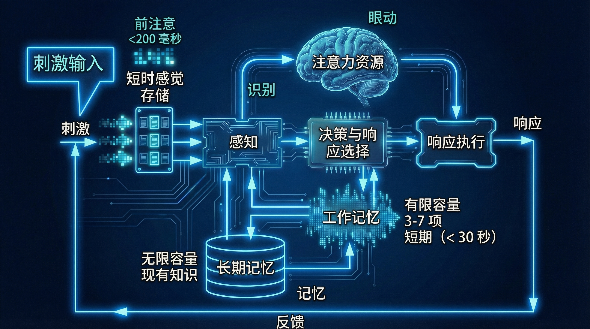

# 五层智能架构

AAF 五层智能架构以 Assistant 为面向用户的认知主体，由 Team 组织协作、Agent 执行任务、Cognition 提供持久认知、Core 提供模型推理，并按各自生命周期明确状态与责任归属。

> 本文定义**静态结构与责任**：分层职责、责任节点归属、功能模块清单。
> 一次运行**如何进行**（入口、身份、意图、画像冻结、终态）由 [runtime.md](runtime.md) 定义，两者不得互相越界。
> 以智能助理为认知主体，借鉴人类认知心理模型

## 定位与边界

以助理为核心的五层认知架构，借鉴人类认知心理模型：感知与注意、长期记忆与世界知识、行动执行、自我协调、社会协作。每层对应认知过程的一个真实环节，使职责清晰、状态归属明确，通过分层协作与渐进决策完成复杂任务。

**不是什么**：不是技术调用链，层间关系是领域意义上的调用与归属；不是十个模块的固定串行流水线；不是渠道接入设计——渠道适配与多端接入属于智能架构外的交互层，不使用 L 编号，本文从"消息到达助理"起建模。

## 设计立场

- **以助理为认知主体**：Assistant 类似一个具有人格、能力和责任边界的"人"。对外是用户理解和使用智能能力的统一入口，对内组织感知、记忆、推理、执行与协作，并对任务过程和最终结果负责。
- **借鉴人类认知心理模型**：每一层对应人类认知的一个真实环节，而非对人脑结构作一一映射。

## 设计原则

| 原则 | 内容 |
|---|---|
| 分工协作 | 大模型负责理解推理生成，确定性系统负责计算校验与可靠执行，人类负责目标设定与高风险决策 |
| 群体智能 | 能力来自分层组合而非单点全能：简单请求就地处理，明确任务委派 Agent，跨领域目标升级 Team |
| 形态随复杂度 | 拆不拆、拆几个、要不要多智能体由目标复杂度判定，不由交互模式绑定；交互模式只决定澄清方式与呈现方式 |
| 渐进决策 | 先形成假设、计划与暂存结果，验证或确认后提交；决策权随置信度与风险流动 |
| 可验证性优先 | 规划阶段明确完成条件，执行阶段持续校验；**模型停止输出不等于任务完成** |
| 能力护栏 | 按控制模式、Role、任务授权与动作风险动态限定 Skill、Tool、数据与资源；只暴露完成当前任务所必需的能力 |
| 分级降级 | 模型、检索、工具或自主决策不可用时按层级回退；必须保留任务状态、说明原因并限制副作用，不得静默失效或越权 |
| 量入为出 | 按任务复杂度、风险与价值匹配模型能力、上下文规模、Token、时间、并发与调用预算 |
| 执行反哺 | 执行结果、反馈与工具轨迹先成为学习候选，经隐私、可信度、去重与冲突检测后才写入 L1 |
| 知识与能力一体 | Knowledge 定义知道什么，Skill 与 Tool 定义能做什么；三者在范围、版本、权限与证据上一致，但各保留独立真理源 |
| 三层上下文分离 | 可共享的 Knowledge、按主体隔离的 Memory、面向当前会话或任务的执行上下文分别存储治理，可引用组装但不复制为多份真理源 |
| 瓶颈在规划与审查 | 执行趋于廉价后，目标澄清、方案规划、结果验证与风险审查成为新瓶颈 |

## 五层总览

| 层级 | 组件 | 核心定位 | 主要职责 | 状态特点 |
|---|---|---|---|---|
| L4 | **群体 Team** | 多助理协作组织 | 目标对齐、任务分工、进度协调、结果汇总、冲突仲裁 | 项目级；保存目标、分工、进度与仲裁结果 |
| L3 | **助理 Assistant** | 面向用户的认知主体 | 有人格，可扮演角色并组织技能、工具、记忆与知识；理解意图、规划任务、调度执行、验证结果，对最终交付负责 | 会话级；保存当前焦点、任务进展与交互上下文 |
| L2 | **智能体 Agent** | 具体任务的执行者 | 接收指派的明确任务，拆成可验证步骤，调用获准工具执行并反馈过程 | 任务级；只保留执行期工作状态，无人格无长期记忆 |
| L1 | **认知基础 Cognition** | 记忆与世界观的持久积淀 | 管理记忆、知识、价值观与决策依据，提供回忆、检索、上下文组织与学习沉淀 | 持久级；区分个人私有、组织共享与审计留存 |
| L0 | **内核 Core** | 通用思考与生成能力 | 模型选择、理解、推理、生成，并控制上下文与资源消耗 | 请求级；无人格无记忆，不感知具体用户与业务身份 |

```text
                          ┌───────────┐
                          │   用户     │   外界刺激
                          └─────┬─────┘
                                │ 唯一交互入口（1 用户 : N 助理）
      ════════════════════ 会话级 ════════════════════
                                ▼
                ┌───────────────────────────────┐  加入协作   ┌──────────────┐
                │         助理 Assistant         │ ────────▶ │  群体 Team    │
                │   感知意图情绪 → 决策 → 调度      │ ◀──────── │  社会 · 协作   │ 项目级
                └──┬────────────────────────┬───┘  由助理组成 │  牵头 / 仲裁   │
          回忆/沉淀 │               指派/结果  │               └──────────────┘
   ═══ 持久级 ══════▼══              ══ 任务级 ▼══
   ┌────────────────┐    取用/写回     ┌───────────────┐
   │ 认知基础        │ ◀─────────────▶ │ 智能体 Agent   │
   │ Cognition      │    水平协作      │ 手脚 · 执行    │
   │ 记忆/知识/价值观 │                 │ 感知-规划-     │
   │（共享积淀）      │                 │ 执行-评估-学习 │
   └───────┬────────┘                 └──────┬───────┘
           │ 提供素材                         │ 借助思考
           │            ═══ 请求级 ═══        │
           │         ┌──────────────────┐    │
           └────────▶│    内核 Core      │◀───┘
            共享底座   │ 推理机能 · 思考    │
                      └──────────────────┘
```

### 层间关系与状态归属

| 关系 | 领域含义 |
|---|---|
| 用户 → 助理 | 唯一交互入口；一个用户可拥有多个助理（1:N） |
| 助理 → 认知基础 | 回忆与沉淀：感知时回忆相关记忆与知识，事后把新所得沉淀回去 |
| 助理 → 智能体 | 指派任务：按技能匹配委派给行动机能执行（1:N） |
| 助理 → 群体 | 加入协作：面对超出自身的目标时参与或牵头共事 |
| 智能体 → 内核 | 借助思考：执行过程中调用纯推理能力 |
| 智能体 ↔ 认知基础 | **水平协作而非上下级**：智能体无长期记忆，执行前取用、执行后写回，只借不持 |
| 群体 → 助理 | 群体由多个助理组成（1:N），协作的执行仍归各助理调度 |
| 学习反哺（横切） | 各层所得经评估后异步沉淀回认知基础，不专属某一层 |

三条状态硬约束：

- **私有与共享分离**：会话焦点私有；记忆、知识、价值观下沉到 L1 供多主体共享
- **状态归属分明**：数据级状态归 L1，会话级状态归 L3，L0 与 L2 不持有长期状态——无自我者不持久
- **每层有且只有一个认知循环，且不跨层直接触发**：上层通过指派驱动下层，下层通过反馈回到上层

## 运行时节点责任映射

本文只标识节点与责任归属，不定义执行顺序、字段或模式分支；完整动态合同见 [runtime.md](runtime.md)。

| 责任节点 | 责任层 | 静态职责 |
|---|---|---|
| 接入与身份校验 | 交互层 → L3 | 建立可信主体与运行边界 |
| 输入与意图 | L3 | 持有用户目标与已解析执行意图 |
| 理解与规划 | L3（可调用 L0） | 形成路由、阻塞项与计划建议 |
| 受控上下文 | L1 | 按授权和预算提供记忆、知识与材料引用 |
| 执行画像 | L3 | 持有不可变运行决策引用 |
| 调度与编排 | L3；Team 场景含 L4 | 持有 TaskBoard 与跨节点责任 |
| 节点执行 | L2（调用 L0） | 在冻结边界内运行 Harness 与工具观察 |
| 聚合与验证 | L3 | 对结果收敛和最终交付负责 |
| 事件与学习 | 横向机制 / L1 | 记录事实、形成安全投影与学习候选 |

### 横向机制

以下机制贯穿主流程，不单独构成某个顺序阶段：

| 机制 | 内容 | 定义文档 |
|---|---|---|
| 模型推理与路由 | 模型调用、Prompt 与消息处理、流式与结构化输出、Token 计量；可被多节点调用但不持有任务责任 | [core/](core/Readme.md) |
| HITL 与动作授权 | ToolGateway、控制模式、任务 grant、参数策略与风险门禁作用于每次业务动作 | [action-governance.md](action-governance.md) |
| 可靠执行控制 | TaskTransition、TaskBoard、租约与 fencing、幂等 receipt、预算、超时、重试、取消、接管与恢复 | [task-durability.md](task-durability.md) |
| 上下文与资源治理 | 知识、记忆、执行上下文、Token、并发、沙箱与工具可见性按最小必要装配并在子任务间隔离 | [cognition/](cognition/Readme.md) |
| 事件、审计与可观测 | 状态转换、计划、画像、工具、授权、产物、验证与终态统一留痕；正文、凭证、系统提示与思维链不得进入公共任务事件 | [runtime-event.md](runtime-event.md) |
| 自学习与反哺 | 知识抽取、记忆沉淀、Skill 与编排优化只生成版本化候选，经门禁后才进入权威真理源 | [cognition/learning.md](cognition/learning.md) |

### 动态契约引用

`CHAT`、`EXECUTION`、`TEAM` 的入口校验、澄清、路由、调度、授权、聚合、终态与呈现差异只在 [runtime.md](runtime.md) 定义。本文不复制模式流程或字段级时序，避免静态责任图成为第二份运行时真理源。

## 功能模块清单

| 模块 | 所属层 | 职责一句话 | 定义文档 |
|---|---|---|---|
| Persona / Role / MemoryStrategy | L3 | 助理的身份装配：我是谁、我会做什么、我如何记事 | [assistant/assistant.md](assistant/assistant.md) |
| 路由与 Skill 激活 | L3 | 选择或校验 Role，分层激活 Skill | [assistant/assistant.md](assistant/assistant.md) · [skill/](skill/Readme.md) |
| 输入缓冲与执行期干预 | L3 | 执行期接住追加输入，分类为取消、修改、补充、无关 | [assistant/assistant.md](assistant/assistant.md) |
| 协调编排与聚合 | L3 | TaskBoard、`CoordinationPlan`、1..N Executor、聚合契约、产物时序 | [assistant/coordination.md](assistant/coordination.md) |
| 任务生命周期与完成门禁 | L3 | 任务状态与完成条件独立于聊天回合，支持暂停、接管、恢复与修复 | [runtime.md](runtime.md) |
| 有效上下文透明度 | L3 · L1 | 用户可知本次实际使用了哪些规则、资料、知识与记忆，并纠正可管理来源 | [cognition/cognition.md](cognition/cognition.md) |
| 执行身份与任务循环 | L2 | PRIMARY / COORDINATOR / EXECUTOR / AGGREGATOR 的职责与有界循环 | [agent/agent.md](agent/agent.md) |
| 可复用执行与执行隔离 | L2 | 同一定义可并发借用、用完即收；工具与代码在隔离环境执行 | [agent/agent.md](agent/agent.md) |
| 记忆 · 知识 · 价值观 · 决策依据 | L1 | 持久积淀与分区存储：个人私有、全局共享、执行工作区、审计留存 | [cognition/](cognition/Readme.md) |
| 编排式回忆与混合检索 | L1 | 理解所需 → 多源检索 → 融合排序 → 按需组装，避免噪声与过载 | [cognition/retrieval.md](cognition/retrieval.md) |
| 用户理解与个性化 | L1 | 被动接收事件后异步提炼画像、偏好与情绪模式 | [cognition/cognition.md](cognition/cognition.md) |
| 学习反哺 | L1 | 执行所得经评估形成版本化候选后才入库 | [cognition/learning.md](cognition/learning.md) |
| 模型推理与上下文窗口 | L0 | 把调用方组装好的上下文转化为推理与生成结果 | [core/core.md](core/core.md) |
| 模型路由与择选 | L0 | 统一模型管理与决策链，按能力标签与偏好择选 | [core/model-router.md](core/model-router.md) |
| Prompt 装配 | L0 | `PromptEnvelope` 与分层信任边界 | [core/prompt.md](core/prompt.md) |
| 群体协作与仲裁 | L4 | 目标对齐、分工、进度同步、结果聚合、冲突仲裁 | [team/team.md](team/team.md) |
| 工具治理与风险分级 | 横向 | 有效工具交集、动作授权、预算、置信度门控 | [action-governance.md](action-governance.md) |
| 执行轨迹与事件投影 | 横向 | 可追溯事件流支撑实时呈现与事后审查 | [runtime-event.md](runtime-event.md) |
| 可恢复与回退 | 横向 | 步骤级、会话级、目标级三层断点续跑与回滚 | [task-durability.md](task-durability.md) |

## 智能层级与 Prompt 优先级

L0–L4 智能层级与 P0–P8 Prompt 优先级是两个正交维度，**禁止把 Prompt 序号当作智能层级延伸**。

| 维度 | 回答的问题 | 取值 |
|---|---|---|
| 智能层级 | 谁持有状态和责任 | L0 Core、L1 Cognition、L2 Agent、L3 Assistant、L4 Team |
| 调用形态 | 本次模型调用是否持有自主任务循环 | `AUTONOMOUS_HARNESS`、`NON_AUTONOMOUS_L0` |
| Prompt 优先级 | 自主调用的约束与数据如何排序 | P0 代码硬治理，P1–P7 System 片段，P8 上下文与消息数据 |

两种调用形态的装配差异与 `PromptEnvelope` 字段见 [core/prompt.md](core/prompt.md)。核心区别：

- `AUTONOMOUS_HARNESS` 装配 Constitution、执行身份与任务循环、Role、冻结任务合同、ActivatedSkill、可选 Persona 与 P8 数据；每个 ReAct 回合与模型尝试各生成独立 Envelope
- `NON_AUTONOMOUS_L0` 只装配版本化 Function Contract、严格 Output Contract 与最小数据，不注入 Constitution、Persona、Role、Skill 或自主循环
- P0 权限、HITL、预算、状态机、工具可见性与 Schema 校验**不渲染为授权文本**，只在 Envelope 中保存治理决策引用与摘要

Role/Skill 选择、意图与情绪分类、上下文摘要、参数提取、记忆抽取去重、LLM-as-Judge 都属于非自主 L0：它们是可单独计量与追踪的模型 invocation，默认是当前流程中的 child invocation，**不创建 Assistant、Agent、Harness Loop 或持久 Task**。只有需要异步调度、租约、独立状态、耐久恢复或业务级重试时才提升为显式系统节点；只有需要自主多轮推理与工具观察时才升级为 Harness Agent。

## 双层循环

AAF 外层循环（L3/L4）持有跨节点 TaskBoard、状态迁移、租约、预算、授权、恢复、聚合与完成责任；L2 内层循环只通过 `AgentExecutionPort` 复用 AgentScope Harness 的 ReAct、工具观察、工作态与流式事件。TaskBoard 类型、字段与拓扑只在 [coordination.md](assistant/coordination.md) 定义，一次运行的推进与终态只在 [runtime.md](runtime.md) 定义。

基础设施适配器关闭 AgentScope 内建的长期记忆、工作区、原生子智能体、动态 Skill、文件与 Shell 等旁路能力。领域与应用层只依赖 `AgentExecutionPort`，因此替换内层引擎不改变外层任务合同。

## 有界任务分解预算

“五度空间”不是机械执行 `5^5` 递归。现行 `DecompositionBudget` 强制四个可执行维度，分解深度是尚未入模的第五个目标维度；字段合同只在本节定义。

```java
public record DecompositionBudget(
    int maxChildrenPerPlan,
    int maxParallelAgents,
    int maxOuterIterations,
    int maxTotalExecutorRuns
) {}
```

默认策略为单计划最多 5 个子节点、最多 5 个并行 Agent、外层迭代最多 5、累计 Executor 运行最多 10。前三项硬上限为 8，累计运行硬上限为 24，超限一律拒绝且禁止静默 clamp。固定 Team 的 children/parallel 生效上限可提升到冻结 roster，但 roster 仍不得超过 8；普通动态任务不得借 Team 规则扩容。

| 维度 | 执行点 | 实现态 |
|---|---|---|
| `maxChildrenPerPlan` | 单次 `CoordinationPlan` 执行节点数 | ✅ 已实现 · `DecompositionBudget.java:12-63`、`DelegatedTaskCoordinator.java:1019-1036` |
| `maxParallelAgents` | `TaskBoard.maxParallelism` 的计划上限 | ✅ 已实现 · `DecompositionBudget.java:12-63`、`TaskBoard.java:49-97` |
| `maxOuterIterations` | `CoordinationPlan.IterationGroup` | ✅ 已实现 · `DecompositionBudget.java:12-63`、`CoordinationPlan.java:183-207` |
| `maxTotalExecutorRuns` | 跨计划与迭代累计 Executor 运行数 | ✅ 已实现 · `DecompositionBudget.java:55-69`、`DelegatedTaskCoordinator.java:1027-1036` |
| `maxDecompositionDepth` | 父子节点深度进入冻结执行合同 | 🎯 目标态，当前不得声称已执行 |

Harness ReAct 迭代与模型重试**不属于** `DecompositionBudget`，由每个 Agent 的 `ExecutionPolicy.maxIterations` 与 `maxModelRetries` 管理，避免两个预算真理源。

## 认知心理映射

| 认知过程 | AAF 对应 | 映射含义 |
|---|---|---|
| 刺激输入与前注意 | 交互层 → L3 前注意分流 | 快速判断直接回应、继续理解还是进入复杂任务 |
| 感知与识别 | L3 意图与情绪理解 + L1 回忆 | 理解当前输入并从既有积淀中识别相关内容 |
| 注意力资源 | L3 注意焦点与资源分配 | 按重要性与复杂度分配模型、上下文、时间与工具 |
| 信息加工与推理 | L0 模型推理 | 把已组织的上下文转化为结果，但不拥有最终决策责任 |
| 工作记忆 | L2 执行期工作状态 + L3 任务焦点 | 临时保存目标、步骤、中间结果与依赖，容量有限 |
| 长期记忆 | L1 记忆与知识 | 持久积淀，区分私有体验与共享常识 |
| 社会协作 | L4 群体 | 超出单主体能力时的组织与仲裁 |



## 实现态

结构性约束的当前状态。契约细节的实现态在各自文档中标注。

| 约束 | 实现态 |
|---|---|
| Assistant 统一入口与三种运行模式 | ⚠️ 部分实现 · `/api/agui/run` 已统一 `CHAT/EXECUTION/TEAM`（`AssistantAguiController.java:63-106`）；工作流仍保留独立正文入口（`WorkflowAgUiController.java:31-48`） |
| 任务身份固定为 `threadId` 与 `runId` 两组等价关系 | ✅ 已实现 · `AssistantExecutionService.java:1221-1243` |
| 编排形态由 `TaskAnalysis` 三维（owner / process / coordination）显式冻结并驱动调度，交互模式不绑定调度 | 🎯 目标态，当前不得声称已执行 · 现状按 `interactionMode` 硬绑定 `CHAT → single`、`EXECUTION → coordinated`、`TEAM → teamCoordinated`（`AssistantExecutionService.java:267-284`、`TaskBoard.java:49-166`），判定决策未落成审计事实 |
| `EXECUTION` 当前仅支持 copywriting 能力族 | ⚠️ 分期约束 · `AssistantExecutionService.java:172`；通用任务式为目标态 |
| L1 提供受控上下文 | ⚠️ 部分实现 · 长期记忆已接入；本会话短期上下文缺失，`MemoryRecallPort.java:9-25` 无会话维度 |
| 关闭 AgentScope 原生子智能体与旁路能力 | ✅ 已实现 · `AgentScopeSpecCompiler.java:108-184` |
| `PREDEFINED_WORKFLOW` 作为过程形态归入统一运行时 | 🎯 目标态，当前不得声称已执行 · 工作流仍为独立入口 `WorkflowAgUiController.java:36` |

## 验收基线

- 任一职责与状态能唯一归属到某一层，不出现两层同时持有同类状态
- 九类运行时责任节点均能定位唯一责任层或横向机制，不在本文复制动态字段与模式分支
- 任一功能模块能在清单中找到唯一定义文档，本文不展开其内部细节
- 模式差异只出现在 `runtime.md` 的差异表，本文不按交互模式分叙流程
- 分解预算的五个维度各自标明执行点与实现态，目标态维度不被声称已生效
- 非自主 L0 调用不创建 Assistant、Agent、Harness Loop 或持久 Task
