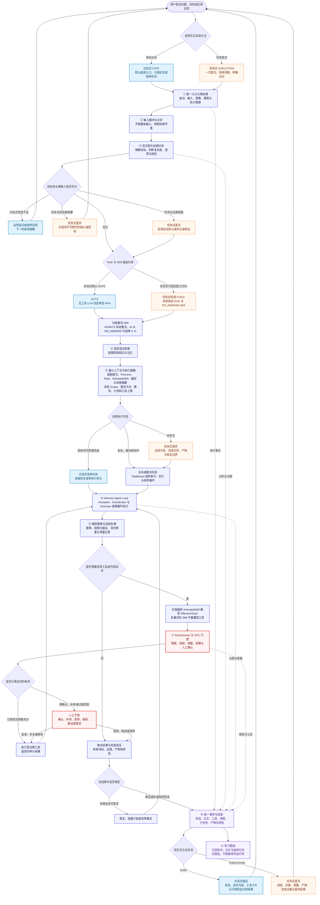

# 通用智能助理一体化交互流程

> 对话式是通用智能助理的默认交互表面，普通问答、内容生成、计算、检索和复杂协作任务都从同一会话进入。任务式不是另一套 Assistant 或运行时，而是在同一主链上采用更固定的路由、更少的非阻塞追问、更明确的执行计划、完成合同和产物呈现。

本文是整体场景流程视图，不重复定义底层合同。运行时、身份、事件及权限细节以[五层智能架构](../../architecture.md#统一智能任务运行流程)和[任务式 Assistant 统一执行路径设计](task-oriented-assistant-execution-design.md)为准。

## 图例

- **蓝色节点**：对话式常用路径或对话式交互特征。
- **橙色虚线节点**：任务式在该节点的差异，不代表独立运行时。
- **红色节点**：授权、人工介入或执行控制点。
- **紫色节点**：贯穿流程的事件与学习能力。
- ①–⑩ 对应 Assistant 的十项核心运行能力。

## 一体化交互与处理流程

## 任务式差异落点

| 关键节点 | 通用对话 | 任务式差异 |
|---|---|---|
| 入口与身份 | 在既有会话中持续接收消息，每轮形成独立执行 | 同一入口提交明确任务；以本轮任务身份持续跟踪，不创建第二套运行时 |
| 澄清 | 信息不足时可自然追问，并在后续轮次继续理解 | 只在关键输入、凭证或授权不可替代时阻塞；其他情况采用安全默认值 |
| Role 与 Skill | 默认动态单选 Role，再自动激活 ALWAYS 并从 ON_DEMAND 中选择 0..N | 常用固定 Role 与目标 ON_DEMAND Skill；越界组合直接拒绝，但 ALWAYS 仍自动激活 |
| 计划与协调 | 简单任务可直接完成，复杂任务再进入委派和 TaskBoard | 开始时冻结执行策略、完成合同、产物与恢复边界，过程更可预测、可审计 |
| 工具与动作 | 根据当前 ActivatedSkill 暴露最小工具集，敏感动作按需询问 | 同样经过 ToolGateway；可使用任务级窄授权，但不能扩大 Assistant、Role 或用户权限 |
| 完成判断 | 一轮有效回复即可完成当前轮次，用户可继续追问 | 必须验证结果、产物和完成证据，形成明确成功、失败、暂停或待处理终态 |
| 结果呈现 | 以消息和流式正文为主，可穿插工具及交互卡片 | 以状态、步骤、阻塞、产物和最终结果为主；正文仍使用统一投影 |

## 十项能力在现行流程中的映射

| 编号 | 核心能力 | 在统一流程中的职责 |
|---|---|---|
| ① | 预处理 | 将对话或任务输入转换为受约束的执行意图，完成身份、授权上限和策略准备 |
| ② | 输入缓冲 | 合并连续输入、避免阻塞并控制处理节奏，为可中断交互提供稳定入口 |
| ③ | 前注意与协调 | 理解目标、评估复杂度、澄清、选择 Role/Skill 并形成协调计划 |
| ④ | 混合检索 | 通过 Cognition 按授权获取知识库和记忆摘要，不把数据源直接暴露为开放工具 |
| ⑤ | 上下文管理 | 按任务最小化装配上下文，冻结 ActivatedSkill 的 Scope 与激活方式，并由最终激活结果计算工具 |
| ⑥ | Harness Agent Loop | 让协调者和执行者在各自边界内进行规划、执行、检查和有界循环 |
| ⑦ | HITL | 在授权、关键参数或过程控制处切换给人，并支持确认、暂停、继续、重试和取消 |
| ⑧ | 自学习 | 从完成过程提取知识、记忆和优化建议，只形成可审核、可版本化候选 |
| ⑨ | 模型推理 | 为理解、规划、生成和结构化输出提供横切推理能力，并记录流式消息与资源使用 |
| ⑩ | 事件消息 | 将对话与非对话任务投影为统一、可重放、可恢复和可演进的执行事实 |

## 设计边界

- **统一主链**：`CHAT` 与 `EXECUTION` 共享 Assistant、Cognition、Agent、TaskBoard、ToolGateway、HITL、完成验证和事件事实源。
- **对话承载任务**：用户不必先判断任务类型；普通对话可以逐步演化为计算、创作、检索、产物生成或多智能体协作任务。
- **模式不授予权限**：选择任务式只改变交互和约束，不自动获得更多工具、写权限或外部动作权限。
- **能力按激活结果可见**：SYSTEM、ASSISTANT 和当前 Role 的 ALWAYS 自动激活；AI 只筛选 ON_DEMAND，且允许选择 0..N。工具仅从最终 ActivatedSkill 解析。
- **系统机制优先**：路由校验、Schema、权限交集、授权、预算、状态迁移、事件和完成验证由系统保证；模型只在这些边界内推理和选择。
- **学习不直改生产定义**：学习结果必须经过版本化、审核和发布后才能影响后续执行。
