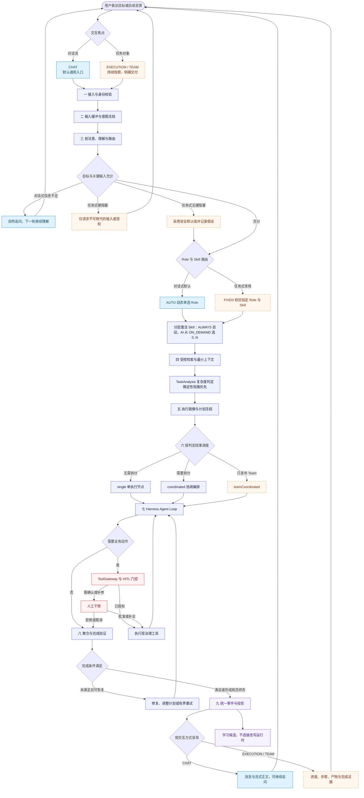

# 统一运行时

> `CHAT`、`EXECUTION`、`TEAM` 共用同一运行时、执行画像、工具治理、完成验证与事件事实源。
> **任务式不是另一套运行时，只是受约束的执行策略**：路由更固定、澄清更少、产物与完成证据要求更强。
> 三种模式都有完成条件且都经同一完成门禁，差异只在所需证据强度，不在有无。

本文定义**动态契约**——一次运行如何进行；静态结构与责任见 [architecture.md](architecture.md)。

## 对外契约

| 契约项 | 内容 | 实现态 |
|---|---|---|
| Assistant 正文入口 | `POST /api/agui/run`，认证后调用；Assistant 三模式共用 | ✅ 已实现 · `AssistantAguiController.java:63-106` |
| 会话前置 | 必须使用当前用户拥有的既有 AI `Conversation.threadId` | ✅ 已实现 · `AssistantAguiController.java:68-78` |
| 运行模式 | `forwardedProps.mode` 仅允许 `CHAT`、`EXECUTION`、`TEAM`；模式只决定请求组装，执行链唯一 | ✅ 已实现 · `AssistantAguiController.Mode.plan`（每种模式各自组装 `AssistantExecutionRequest` + 可选 Team 目标）→ `AssistantExecutionService.start` |
| 会话身份 | `threadId = ConversationId = SessionId` | ✅ 已实现 · `AssistantExecutionService.java:1221-1243` |
| 运行身份 | 每轮独立 `runId = TaskId = ExecutionId = RunId` | ✅ 已实现 · `AssistantExecutionService.java:1221-1243` |
| 正文投影 | Assistant 主链以 AG-UI SSE 投影正文；公共任务事件与 Snapshot 不返回正文 | ✅ 已实现 · 主入口统一见 `AssistantAguiController.java:63-78`；`POST /api/workflow/run` 已收窄为编排调试通道（仅 `debug=true`、仅创建者，`WorkflowAgUiService.requireRunnableFlow`），是独立契约而非第二正文通路 |
| TEAM 约束 | 只能引用已发布 Team version；请求不得覆盖冻结 Assistant、Role、Skill 或成员目标 | ✅ 已实现 · `AssistantExecutionService.java:83-93,115-137,806-870` |

Assistant 主链不存在同步 REST 正文接口，也不保留旧 Assistant 双协议。

**两个通道的契约区分**：`/api/workflow/**` 是**编排调试通道**，不是用户对话正文通道。

| 维度 | 用户对话正文通道 | 编排调试通道 |
|---|---|---|
| 入口 | Assistant 主入口 AG-UI SSE | `POST /api/workflow/run`、`GET /api/workflow/run/{runId}/events`、`POST /api/workflow/run/{runId}/input` |
| 调用方 | 终端用户会话 | 仅 flow-editor 画布试跑 |
| 准入 | 已发布 Assistant / Team | 仅 `debug=true` 且仅工作流创建者 |
| 正文语义 | 经完成门禁认可的最终产物 | 最后一条已完成节点的执行日志 output，仅供试跑展示 |
| 事件与状态 | 统一事件流 + 租约 fencing，可跨实例恢复 | 进程内 `SseEmitter` + Flowable 轮询，不保证多副本恢复 |
| 人工节点 | 统一 HITL 链 | 独立 `submitInput` 入口 |

已发布工作流被终端用户触发的**生产运行**属于统一运行时的 `processMode = PREDEFINED_WORKFLOW` 分支。该分支当前**未实现**——`TaskAnalysis.processMode` 仅有判定产出（`DefaultTaskComplexityAnalyzer.java:26`）与日志消费（`AssistantExecutionService.java:910`），无执行分支；调试通道不为其兜底，原先 `requireRunnableFlow` 中的非 debug 生产分支已删除（零调用方）。

### 请求外壳

| 字段 | 模式 | 契约 |
|---|---|---|
| `threadId` | 全部 | 必填非空，≤128 字符；必须属于当前认证用户的 AI 会话 |
| `runId` | 全部 | 必填非空，≤128 字符；本轮稳定幂等与运行身份 |
| `parentRunId` | 全部 | 可选；当前入口接收但不参与领域身份或执行谱系，调用方不得依赖 |
| `messages` | 全部 | 必填数组；从尾到头取最后一条 `role=user` 的非空文本作为本轮正文 |
| `messages[].id` | 全部 | 可选协议标识；当前不参与服务端幂等 |
| `messages[].role` | 全部 | 必填非空；正文只取大小写不敏感的 `user` |
| `messages[].content` | 全部 | 字符串，或 `[{"type":"text","text":"..."}]`；其他 part 不进入正文 |
| `forwardedProps.mode` | 全部 | 必填：`CHAT` / `EXECUTION` / `TEAM` |
| `forwardedProps.assistantId` | `CHAT` | 可选；省略时解析当前用户默认 Assistant |
| `forwardedProps.taskModelSelection` | `CHAT` | 必填对象；见下表。`EXECUTION/TEAM` 使用 `forwardedProps.request.model`，不得依赖本字段 |
| `forwardedProps.request` | `EXECUTION/TEAM` | 必填且可反序列化为 `AssistantExecutionRequest`；`input.text` 必须与最后一条 user 正文完全一致 |
| `forwardedProps.teamId` | `TEAM` | 必填非空，引用当前租户 Team |
| `forwardedProps.teamVersion` | `TEAM` | 必填正整数，且该版本必须已发布 |
| `state` | 全部 | 可选；协议语义是线程级共享状态（可被 `STATE_SNAPSHOT` 回吐），只放页面感知上下文。服务端当前不消费，**禁止**放调用参数 |
| `tools` / `context` | 全部 | 可选协议字段；标准客户端会发，AAF 不接受前端提供的工具与上下文，接收后丢弃 |

> **为什么调用参数走 `forwardedProps` 而不是 `state`**：协议里 `state` 是双向共享状态，`forwardedProps` 是本次 run 的一次性单向透传参数；官方 starter 自身也用 `forwardedProps.agentId` 做路由。放在 `state` 会让一次性参数具备"可被回写/回放"的语义，客户端持久化 thread state 后可能把上一轮参数带进下一轮。

实现态：✅ 已实现 · `AssistantAguiController.RunRequest`（字段形状对齐协议 `RunAgentInput`，不复用官方 Jackson 2 类）、`AssistantAguiController.Mode.plan`。`parentRunId` 当前未消费是已知契约限制，不表示恢复谱系已建立。

### `forwardedProps.taskModelSelection`

| 字段 | 契约 | 校验 |
|---|---|---|
| `mode` | 必填：`AUTO` / `EXPLICIT` | 未知值拒绝 |
| `modelId` | `EXPLICIT` 必填非空；`AUTO` 必须省略 | 转为 `TaskModelSelection` 后再次 fail-closed 校验 |

实现态：✅ 已实现 · `AssistantAguiController.modelSelection`、`TaskModelSelection.java:6-32`。

### `state.request`

| 对象 | 字段 | 契约 |
|---|---|---|
| `assistant` | `id` | 可选；省略时解析默认 Assistant；TEAM 必须省略 |
| `execution` | `interactionMode` | 必填：`TASK` / `CONVERSATIONAL` |
|  | `routeConstraint` | 必填：`FIXED` / `AUTO` |
|  | `clarificationPolicy` | 必填：`MINIMAL` / `FAIL_ON_BLOCKER` / `INTERACTIVE` |
|  | `actionAuthorizationPolicy` | 必填：`REQUEST_ON_DEMAND` / `PREAUTHORIZED_ONLY` / `DENY_AUTHORIZED_ACTIONS` |
|  | `artifactPersistence` | 必填：`AUTO_SAVE_DRAFT` / `RETURN_ONLY` |
| `input` | `text` | 必填非空，且等于外壳最后一条 user 正文 |
|  | `variables` | 必填对象，≤100 项，键非空且整体可 JSON 序列化；作为不可信任务数据 |
|  | `attachments` | 必填数组；元素不可为 null |
| `attachments[]` | `type` | 必填：`TEXT` / `IMAGE` |
|  | `name` | 可选显示名 |
|  | `content` | `TEXT` 必填非空，`IMAGE` 禁止 |
|  | `resourceId` | `IMAGE` 必填非空，`TEXT` 禁止 |
| `role` | `key` | 可选待校验 Role；`TASK/FIXED` 必须与 Skill 同时提供；TEAM 必须省略 |
| `skill` | `code` | 可选待校验 Skill；只可收窄到当前 Scope 的可用 `ON_DEMAND` Skill；TEAM 必须省略 |
| `knowledge` | `mode` | 必填：`DEFAULT` / `EXPLICIT` / `DISABLED` |
|  | `knowledgeBaseIds` | 必填集合，≤20；`EXPLICIT` 时非空，其余模式必须为空；元素不可为 null |
|  | `topK` | 必填整数，1..20 |
|  | `similarityThreshold` | 必填有限小数，0..1 |
| `model` | `mode` | 必填：`AUTO` / `EXPLICIT` |
|  | `modelId` | `EXPLICIT` 必填非空；`AUTO` 必须省略 |
| `memory` | `mode` | 必填：`DEFAULT` / `DISABLED` |
| `output` | `maxCharLen` | 可选，1..32000；仅为篇幅提示 |
|  | `locale` | 可选：`EN` / `JA` / `KO` / `FR` / `ES` |
|  | `format` | 可选；当前仅接受 `JSON`，且 `TASK/FIXED copywriting` 禁止 JSON、规范正文固定 `text/markdown` |

字段结构实现态：✅ 已实现 · `AssistantExecutionRequest.java:13-114`。组合与范围校验实现态：✅ 已实现 · `AssistantExecutionService.java:95-206,598-700,958-1065`。

### 校验错误契约

| 范围 | 稳定错误码 | 条件 |
|---|---|---|
| 身份 | `7003064`–`7003067` | `threadId/runId` 缺失或超过 128 字符 |
| 知识 | `7003000`、`7003001`、`7003035`–`7003037`、`7003052` | EXPLICIT/ID 组合、数量、topK、阈值或 null ID 非法 |
| 模型与记忆 | `7003038`、`7003039`、`7003048`–`7003051` | model/mode 缺失、AUTO 带 ID、EXPLICIT 缺 ID、memory mode 缺失 |
| 输入与附件 | `7003006`、`7003040`–`7003047` | 正文、变量或 TEXT/IMAGE 互斥字段非法 |
| 模式、路由与产物 | `7003002`–`7003005`、`7003009`–`7003016`、`7003030`、`7003031` | TEAM 覆盖、模式组合、Route、输出长度或格式非法 |
| TEAM 发布目标 | `7003021`–`7003029` | Team 版本、成员 revision、Role、Skill 或工具范围非法 |

完整编号与稳定消息见 `AssistantErrorCode.java:6-122`。外壳结构错误、`messages` 缺 user 文本、`state.request.input.text` 不一致及 Bean Validation 当前返回 HTTP 400 固定消息或约束详情，尚无 Assistant 模块稳定错误码（`AssistantAguiController.java:108-136,203-261`）：⚠️ 部分实现，客户端不得用自然语言消息做业务分支。

## 执行意图

`ExecutionIntent` 是单次执行的不可变意图，随执行画像冻结。`AssistantDefinition` 是能力上限与稳定配置，两者不可互换。

| 字段 | 取值 | 作用 |
|---|---|---|
| `interactionMode` | `CONVERSATIONAL` / `TASK` | 用户如何参与和查看过程 |
| `routeConstraint` | `AUTO` / `FIXED` | 是否固定 Role 与 Skill |
| `resolvedRoute` | `roleKey` + `skillKey` + `assistantRevision` | FIXED 时的已解析路由 |
| `clarificationPolicy` | `INTERACTIVE` / `MINIMAL` / `FAIL_ON_BLOCKER` | 信息不足时提问、取默认值还是失败 |
| `artifactPolicy` | `outputKind` + `canonicalMediaType` + `persistenceMode` + `saveTool` + `publishPolicy` | 产物形态与持久化策略 |
| `actionAuthorizationPolicy` | `REQUEST_ON_DEMAND` / `PREAUTHORIZED_ONLY` / `DENY_AUTHORIZED_ACTIONS` + 动作集合 | 缺少动作授权时的行为 |
| `workspaceId` | 可信工作区标识 | 资源归属 |

实现态：✅ 已实现 · `ExecutionIntent.java:7-40`。

两条不可混淆的边界：

- **澄清策略与动作授权策略完全独立**，不能互相替代。
- **控制模式不是独立枚举**：副作用上限由 `artifactPolicy` 与 `actionAuthorizationPolicy` 共同表达；展示用粗粒度模式只能派生，不能成为第二真理源。

### 构造不变量

- `TASK` 必须使用 `FIXED` Route；`AUTO` 不允许预置已解析路由
- `AUTO_SAVE_DRAFT` 必须指定 `saveTool`，且该动作不得为 `DENY`，必须声明动作授权
- `RETURN_ONLY` 不允许指定 `saveTool`
- `CONVERSATIONAL` 当前强制 `RETURN_ONLY`

实现态：✅ 已实现 · `ExecutionIntent.java:17-40`、`AssistantExecutionService.java:598-700`。

### 策略解析优先级

```text
平台与租户硬策略
→ 用户本次显式要求（含“不保存、仅返回内容”）
→ TaskProfile 或已发布工作流策略
→ SkillVersion 产物策略
→ Role 默认产物策略
→ RETURN_ONLY 安全兜底
```

调用方**可以请求**任务意图，但服务端必须按 Assistant 支持模式、入口策略、主体权限与风险策略解析最终结果；客户端不能直接获得任意提权。

> 🎯 目标态 · 统一优先级解析器当前不得声称已执行；`CHAT` 的澄清与授权策略仍由入口硬编码（`AssistantAguiController.java:138-152`）。

## 统一执行链

九步主流程节点的定义见 [architecture.md](architecture.md)。下表只定义一次运行的字段级动态合同。

| 步 | 输入字段 | 输出字段 | 实现态 |
|---|---|---|---|
| 一 接入与身份校验 | `threadId`、`runId`、`forwardedProps.mode`、认证 `userId`、`tenantId/workspaceId` | `ConversationId/SessionId`、`TaskId/ExecutionId/RunId`、已验证所有权 | ✅ 已实现 · `AssistantAguiController.run/executionStream`、`AssistantExecutionService.RunIdentity` |
| 二 输入接收与意图冻结 | 最后一条 user `text`、`variables`、`attachments`、`state.request` | `ExecutionIntent`、规范化材料、输入幂等事实 | ⚠️ 部分实现 · 请求与意图已冻结（`AssistantExecutionService.java:95-191`）；运行中自然语言追加输入尚未合并 |
| 三 前注意、理解与路由 | Assistant revision、候选 Role/Skill、`routeConstraint`、模型选择 | `resolvedRoute`、ActivatedSkill、任务策略建议 | ✅ 已实现 · `AssistantExecutionService.java:598-700` |
| 四 受控检索与最小上下文 | 主体/租户、知识 IDs、`topK`、阈值、MemoryMode、任务材料、预算 | `EffectiveContextManifest`、SourceReference、受控消息/压缩候选 | ⚠️ 部分实现 · 长期记忆与知识已接入；`MemoryRecallPort.java:9-25` 缺本会话短期上下文维度 |
| 五 执行画像与计划冻结 | 身份、Route、上下文、模型、Skill、工具规则、调用策略 | `ExecutionProfileSnapshot`、TaskBoard 版本 | ⚠️ 部分实现 · 画像持久冻结已实现（`ExecutionProfileSnapshot.java:24-99`）；工具空集语义仍有歧义（`DefaultEffectiveToolResolver.java:27-38,62-66`） |
| 六 按判定结果调度 | `TaskAnalysis.coordinationMode`、Team roster、协调计划、并行/重试预算 | `TaskBoard.single/coordinated/teamCoordinated`、节点 DAG | ⚠️ 部分实现 · 三种看板类型齐备（`TaskBoard.java:49-166`）；输入仍是 `interactionMode` 而非 `TaskAnalysis`（`AssistantExecutionService.java:267-284`） |
| 七 Harness Loop 执行 | 节点 `executionId/sessionId`、冻结画像、局部上下文、授权规则、预算 | 节点结果、工具 Observation、receipt、执行事件 | ✅ 已实现 · `DefaultToolGateway.java:67-171` |
| 八 聚合、验证与终态 | TaskBoard 节点状态、聚合合同、输出/产物/工具证据 | `CompletionDecision`、父终态、`RecoveryPoint` | ⚠️ 部分实现 · 通用验证器已存在（`DefaultCompletionValidator.java:15-84`），父委派任务仍可绕过验证器（`DelegatedTaskCoordinator.java:554-613`） |
| 九 事件投影与学习候选 | 内部 `ExecutionEvent`、持久 `eventOffset`、安全映射规则 | `AafAiTaskEvent`、AG-UI frame、版本化学习候选 | ⚠️ 部分实现 · 安全 mapper 已统一（`ExecutionEventPublicMapper.java:20-163`），产物/计划/决策事件未齐备 |

### `ExecutionProfileSnapshot` 冻结项

| 字段 | 冻结内容 |
|---|---|
| `tenantId` | 租户边界 |
| `taskId` | 稳定业务任务 |
| `executionId` | 当前不可变执行节点；快照唯一键 |
| `assistantId` | 责任 Assistant |
| `assistantRevision` | Assistant 发布 revision |
| `executionIntent` | 交互、Route、澄清、产物、动作授权与 workspace 意图 |
| `contextDisclosurePolicy` | 上下文披露边界 |
| `executionSpec` | 动态 Agent 规格与执行身份 |
| `roleAssignment` | 冻结 Role |
| `executionMode` | Agent 执行模式 |
| `executionModel` | 已解析模型；可为空仅限不需模型的节点 |
| `skillExecutionProfile` | ActivatedSkill、有效工具与 Skill 执行合同 |
| `invocationPolicy` | 调用、迭代与重试策略 |
| `compiledSystemPrompt` | 编译后的内部系统 Prompt；不得进入公共事件 |
| `longTermMemoryEnabled` | 本 execution 的长期记忆开关 |
| `userAttachments` | 规范化用户附件引用/内容 |
| `toolAuthorizationRules` | 工具级可见性与缺失 grant 行为 |
| `contextCompression` | 上下文压缩结果；首次可补冻，已存在不同值时拒绝 |
| `frozenAt` | 冻结时间 |

实现态：✅ 已实现 · 字段与不变量见 `ExecutionProfileSnapshot.java:24-99`；按 `(tenantId, executionId)` 幂等冻结且不同值拒绝见 `JpaExecutionProfileSnapshotAdapter.java:22-45`。恢复必须复用该 execution 快照；新节点或重试节点使用新 `executionId` 独立冻结，不复用父节点画像。

## 三种运行模式的差异

差异只在以下落点，其余完全共用。三条边界：

- **模式不授予权限**：模式只改变交互与约束，不自动获得更多工具、写权限或外部动作权限。
- **模式不决定编排形态**：拆不拆、拆几个由 `TaskAnalysis` 按目标复杂度判定，不由 `interactionMode` 绑定。任务式是"预先指定 Role/Skill + 以任务对象为交互焦点"的特化输入，不是独立的调度分支。
- **模式不决定轮次**：三种模式都可多轮推进。任务是持久对象，生命周期独立于聊天回合——提交目标后可追加输入、补充授权、暂停、接管与恢复，不存在"提交一次即终结"的模式。执行期追加输入的分类与处置见 [task-durability.md](task-durability.md#取消暂停与接管)。

| 落点 | `CHAT` | `EXECUTION` | `TEAM` |
|---|---|---|---|
| 交互焦点 | 对话流；每轮都可改变或追加目标 | 具名任务对象；提交目标后以观察与按需干预为主 | 具名任务对象 + 成员进度视图 |
| 路由 | 默认 `AUTO` 动态单选 Role，可随新消息重新路由 | `FIXED`，非法组合直接拒绝 | 使用已发布 Team version 的冻结成员目标；请求不得覆盖成员 Route |
| 澄清 | 可自然追问，后续轮次继续理解 | 仅关键输入、凭证或不可替代授权缺失时阻塞；其余取安全默认值并记录假设 | Leader/Worker 各自按冻结合同阻塞；不得借澄清改变 roster |
| 复杂度判断 | 新目标时判定；追加输入按执行期干预分类处理，不无条件重判 | 任务开始时判定并冻结初始策略，调整需可审计 | 不判定，roster 已冻结 |
| 调度 | 按 `TaskAnalysis` 取 `single` 或 `coordinated` | 按 `TaskAnalysis` 取 `single` 或 `coordinated` | 固定 `teamCoordinated` |
| 产物 | `RETURN_ONLY` | 按 `artifactPolicy` 解析，可 `AUTO_SAVE_DRAFT` | 使用已发布 Team 与根任务冻结的产物、聚合合同 |
| 完成所需证据 | 输出契约满足即可；无产物与工具证据要求 | 结果、产物与完成证据齐备 | 全部冻结 Worker 证据齐备并通过聚合 |
| 呈现 | 消息、流式正文、工具卡片 | 状态、步骤、阻塞、产物、最终结果；输入框可隐藏 | 同一任务事件流展示成员进度、阻塞、聚合与终态 |

**完成判定本身不分模式**：三种模式一律经 `CompletionValidator` 得出终态，差异只在上表"完成所需证据"一行的证据强度。模型停止输出在任何模式下都不构成完成。

Team version、roster 与成员冻结的领域合同见 [team/team.md](team/team.md)；TaskBoard 字段与拓扑只在 [coordination.md](assistant/coordination.md) 定义。

### 任务复杂度判定

`TaskAnalysis` 是第三步的产出，随执行画像冻结，是选择 TaskBoard 类型的唯一依据。

| 字段 | 取值 | 约束 |
|---|---|---|
| `ownerMode` | `DIRECT` / `DELEGATE` | `DIRECT` 只允许在无业务副作用时使用 |
| `processMode` | `AUTONOMOUS` / `PREDEFINED_WORKFLOW` | 工作流形态仍必须保留 `ownerMode` |
| `coordinationMode` | `NONE` / `SINGLE_AGENT` / `TASKBOARD` | 决定 `single` 还是 `coordinated` |
| `rationale` | 判定依据摘要 | 进入决策事件，供事后审查 |
| `analyzedBy` | `DETERMINISTIC` / `MODEL` | 确定性短路时不产生模型调用 |

判定顺序遵循量入为出：**先确定性短路，再模型判定**。

- 无附件、无多目标信号、无跨领域动作的单句请求直接判 `SINGLE_AGENT`，不调模型
- `TEAM` 与已发布工作流直接由冻结定义决定，不判定
- 其余情况走 `NON_AUTONOMOUS_L0` 判定，属 child invocation，不创建 Assistant、Agent、Harness Loop 或持久 Task
- 判定结果落成决策事实并可审计；模型输出非法时 fail-closed 退回 `SINGLE_AGENT`，不猜测修复

实现态：⚠️ 部分实现 · 确定性判定已落地并驱动调度：`TaskAnalysis.java:14-89` 冻结三维结果，`DefaultTaskComplexityAnalyzer.java:22-70` 先确定性短路（短单句、无附件材料直判 `SINGLE_AGENT`，不调模型），`AssistantExecutionService.analyzedBoard` 按判定结果选 `single`/`coordinated`，已不再按 `interactionMode` 硬绑定。`CHAT` 的 AUTO 路由同样可进 `coordinated`：协调者以本 Assistant `defaultRoleKey` 装配且不预置业务技能。缺口：模型判定分支与决策审计事实尚未落地。

### 差异全景

下图是上表与执行链的可视化视图，**契约以上方表格为准**；橙色虚线节点是任务式在该节点的差异，不代表独立运行时。



## 完成门禁与终态

任务完成不等于模型停止输出。`CompletionValidator` 至少检查：

- 执行计划与实际 owner / process / coordination 模式、Role、Skill 是否一致
- 输出契约是否满足，最终文本或媒体是否形成
- required 工具与子任务是否完成
- 默认或显式要求的草稿、素材是否已保存
- 引用、安全检查、授权与版本一致性是否通过

| 终态 | 含义 |
|---|---|
| 完成 | 满足全部门禁 |
| 继续修复 | 未满足但可在预算内自行修复 |
| 需要用户 | 缺少不可替代输入或授权 |
| 失败 | 不可恢复 |
| 转人工 | 超出自主边界，交人类接管 |

实现态：⚠️ 部分实现 · 终态枚举完整（`CompletionDecision.java:19-25`）；五项门禁中仅覆盖 DAG 状态与通用事件（`DefaultCompletionValidator.java:15-84`）；父委派任务未经验证器即可提交终态（`DelegatedTaskCoordinator.java:554-613`）。

## 实现态

| 契约 | 实现态 |
|---|---|
| 唯一入口、身份等价、模式受理 | ✅ 已实现 · `AssistantAguiController.java:63-106`、`AssistantExecutionService.java:1221-1243` |
| `ExecutionIntent` 七字段与构造不变量 | ✅ 已实现 · `ExecutionIntent.java:7-40` |
| 控制模式由动作策略派生而非独立枚举 | ✅ 已实现 · `AssistantExecutionService.java:598-700`（实现优于历史文档） |
| 澄清与授权策略分离 | ⚠️ 部分实现 · 模型分离见 `ExecutionIntent.java:7-40`；澄清策略缺确定性门控 |
| 策略解析优先级由服务端统一解析 | 🎯 目标态 · 当前不得声称已执行；`CHAT` 仍由 `AssistantAguiController.java:138-152` 硬编码 |
| 唯一正文通道 | ✅ 已实现 · 用户对话正文只经 `AssistantAguiController.java:63-78`；工作流调试通道不承载用户对话正文 |
| `EXECUTION` 支持通用任务式 | ✅ 已实现 · copywriting 能力族硬限制已移除，任务式接受任意已发布 Skill · `AssistantExecutionService.java:166-170` |
| 完成门禁五项全覆盖并作用于父任务 | 🎯 目标态 · 当前不得声称已执行 |
| `TaskAnalysis` 三维显式冻结并驱动调度 | ⚠️ 部分实现 · 确定性判定已驱动调度（`TaskAnalysis.java:14-89`、`DefaultTaskComplexityAnalyzer.java:22-77`）；模型判定与决策审计事实未落地 |
| `CHAT` 可按判定进入 `coordinated` | ✅ 已实现 · 判定链对三模式统一生效；AUTO 路由以 `defaultRoleKey` 装配协调者（`AssistantExecutionService.analyzedBoard`），`TaskBoard.java:754-757` 只强制协调者 Role、技能可空 |
| 计划授权衰减：executor 不得放大到委派方之外 | ✅ 已实现 · 衰减基准为协调者自身已冻结 Role/Skill（`DelegatedTaskCoordinator.java:945-976`），越界 fail-closed；边界用例见 `DelegatedTaskCoordinatorAuthorizationTest` |

## 验收基线

- 任何正文输出都经 AG-UI SSE，任务事件与 Snapshot 不含正文
- 同一 `threadId` 内多轮运行各有独立 `runId`，恢复与 fencing 只在持久任务模型内进行
- 客户端请求的意图经服务端解析后才生效，不能凭请求提权
- 三种运行模式共用同一执行链，差异只出现在本文差异表
- 编排形态只由 `TaskAnalysis` 决定；任一 TaskBoard 类型的选择都能回溯到判定依据与判定方式
- 简单单句请求不产生复杂度判定的模型调用
- 每次运行都能定位其不可变画像，重试节点不复用父节点画像
- 终态只取五个枚举之一，且必然伴随恢复点或完成证据
