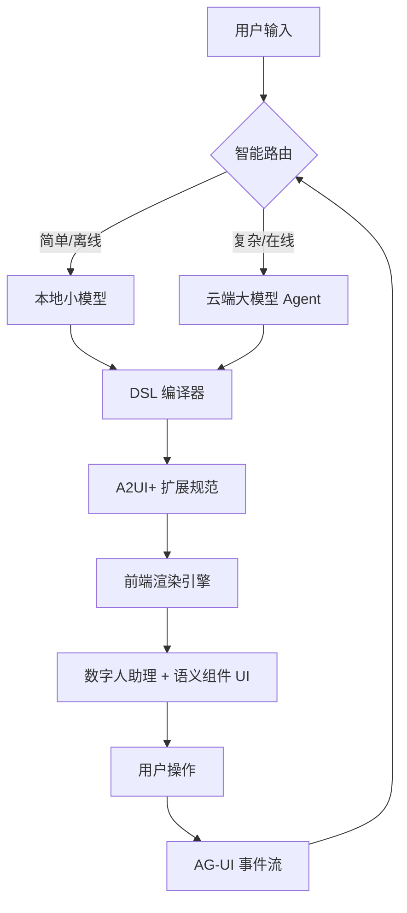

# 基于语义组件的对话式交互 UI 库 - SenseUI

多模态融合、任务导向、智能代理化、安全可控、对话生成、个性化

## 设计原则

| 短板 | 你的突破口 |
|-----------|----------|
| ❌ 仅聊天界面 → 无法高效完成任务 | ✅ A2UI+ 语义组件 实现“所想即所得” |
| ❌ 数据上云 → 企业不敢用 | ✅ 全本地化 满足安全刚需 |
| ❌ 无文档深度理解 | ✅ 跨文档认知引擎 构建知识图谱 |
| ❌ 无离线能力 | ✅ 小模型兜底 保障可用性 |
| ❌ 助理无个性 | ✅ 数字人 + 个性化记忆 提升粘性 |

### 任务导向

- 动态卡片聚合：AI 将多步骤操作整合为一张可交互卡片
（如“订机票+酒店+接送” → 一个复合卡片）
- 状态驱动界面：界面随任务阶段自动切换（查询 → 比较 → 确认 → 支付）
- 撤销/重做语义化：支持“把刚才的预算改成5000”而非仅撤回消息

### 多模态融合

- 图文混合生成：用户上传截图 + “圈出问题区域”，AI 返回带标注的修复建议
- 语音+界面联动：说“放大这张图” → 界面自动聚焦图像并提供编辑工具
- AR 叠加交互：通过手机摄像头识别设备 → 弹出操作指南浮层（如“点击此处重启”）

技术支撑：

    Qwen-VL / LLaVA-1.6 等多模态大模型
    A2UI v2 新增 ImageRegion、AudioSegment 组件类型
    Apple Vision Pro 的空间计算界面

    🌐 未来：界面将感知物理世界，并在数字与现实之间无缝桥接。

### 智能体协作界面（Multi-Agent UI）

核心思想：一个任务由多个专业 AI 协同完成，界面需反映“谁在做什么”。

    角色化气泡：不同颜色/头像代表不同 Agent（法律专家、财务顾问、客服）
    子任务分解视图：显示“正在调用天气服务… 已获取航班信息…”
    冲突协商提示：当两个 Agent 建议矛盾时，提供对比面板让用户决策

### 安全与可控界面（Secure & Controllable UI）

核心思想：用户必须对 AI 行为有完全知情权和控制权。

操作预览沙盒：执行前显示“我将发送邮件给张三，内容如下…”
权限显式授权：首次访问日历时弹出“是否允许读取？”
溯源追踪：每条信息标注来源（“根据您2025年合同第3条…”）
幻觉抑制开关：用户可选择“只回答确定的事实

### 跨端自适应界面（Cross-Device Adaptive UI）

核心思想：同一任务在不同设备上呈现最优交互形式。

典型表现：

    手机：语音优先 + 大按钮 + 流式滚动
    桌面：多面板布局 + 键盘快捷键 + 拖拽
    车机：语音主导 + 极简选项 + 防误触
    手表：摘要通知 + 快捷回复

### 面向 Agent 的文本界面（AOTUI — Agent-Oriented TUI）

    核心思想：当用户是另一个 AI（LLM Agent），界面应为“机器可读”而非“人类可视”。

典型表现：

    语义化 Markdown：用 Contact:contacts 代替头像点击
    函数调用即操作：send_email(to=selected, body="...")
    无视觉依赖：颜色、布局、动画全部移除
    离散快照交互：每次交互是完整状态快照（非流式）

## 交互系统设计

扩展 A2UI + AG-UI，结合自定义 DSL、语义组件与数字人助理

用户通过自然语言与 具身数字人助理 交互，系统动态生成 基于语义组件的结构化界面，实现 高效、可信、沉浸式任务完成。

核心特性：

    ✅ A2UI/AG-UI 兼容：无缝接入现有生态
    ✅ 自定义 DSL：支持业务专属 UI 描述
    ✅ 语义组件：非像素级，而是“意图驱动”的 UI 单元
    ✅ 数字人渲染：3D 虚拟形象 + 语音 + 表情同步
    ✅ 本地小模型兜底：保障离线可用性与低延迟

交互流程：



### 典型交互流程（企业报销场景）

    用户输入：
    “报销上周去上海的差旅费”
    系统响应：
        数字人微笑：“好的！请确认以下信息”
        渲染 TaskCard：
            出差城市：上海（可编辑）
            时间范围：2026-03-10 至 2026-03-14
            发票上传区（FileUploader 语义组件）
    用户操作：
    上传发票 → 点击“提交”
    后台处理：
        调用 OCR 工具 → 提取金额
        生成审批流 → 推送 ApprovalFlow 组件
    最终状态：
        数字人：“已提交至财务王经理，预计2个工作日内到账”
        界面显示审批进度条

## 语义组件

个性化：样式、机构

## 富文本交互

- 点击文字链接进行动作

## 组件交互

- 点击按钮

## 技术栈

结合在线大模型（LLM）与本地小模型（SLM）实现 A2UI 风格的 DSL 界面生成系统

| 能力         | 在线大模型（如 Qwen-Max / GPT-4o） | 本地小模型（如 Qwen-1.5B） |
| ------------ | ---------------------------------- | -------------------------- |
| 语义理解深度 | ✅ 复杂意图、多跳推理、模糊指代消解 | ⚠️ 仅处理结构化/模板化指令  |
| DSL 生成能力 | ✅ 生成完整 A2UI JSON 草稿          | ✅ 校验、修复、增量更新     |
| 响应速度     | ❌ 300–1000ms（依赖网络）           | ✅ <50ms（本地 CPU）        |
| 数据隐私     | ❌ 敏感数据需脱敏                   | ✅ 完全本地，无外传         |
| 离线能力     | ❌ 不可用                           | ✅ 全功能可用               |

| 模块            | 推荐方案                                                             |
| --------------- | -------------------------------------------------------------------- |
| 在线大模型      | 阿里云百炼（Qwen-Max）、OpenRouter（GPT-4o）                         |
| 本地小模型      | Qwen-1.5B-Instruct + MNN（INT4）<br>（中文强、体积小、MNN 官方支持） |
| A2UI 渲染客户端 | Google A2UI Lit Shell / 自研 Flutter 渲染器                          |
| 通信协议        | WebSocket（流式） + Protobuf（高效序列化）                           |
| 脱敏机制        | 正则替换（手机号/身份证） + LLM 自脱敏提示                           |

## 训练本地小模型的数据建议

合成数据生成流程：

    用大模型生成 5k 条 “自然语言 → A2UI JSON”
    加入噪声：随机删除字段、打乱顺序、替换组件名
    让大模型标注“正确 A2UI”
    微调 Qwen-1.5B 学习 纠错 + 生成

```text
你是一个 A2UI 修复专家。以下 JSON 有错误，请修正：
{"components": [{"TextInut": {"labl": "姓名"}}]}
修正后：
{"components": [{"TextInput": {"label": "姓名"}}]}
```

## 前端渲染引擎（A2UI+ Client）

流式响应 AG-UI 分块传输片段，前端渐进渲染

支持平台：

    Web（ React）
    移动端（Uniapp）
    桌面（Tauri + Electron / WinUI）

核心能力：

    语义组件注册表：预加载可信组件（禁止任意 HTML）
    数字人集成：接入 Ready Player Me 或 自研 3D avatar
    AG-UI 事件监听：处理 onUserAction, onToolResponse
    多模态输出：
        文本 → TTS（如 Azure Neural TTS）
        表情/手势 → 动画控制器
        界面 → 响应式布局

好的！我们将从 **MVP 功能清单**、**6 个月技术路线图** 和 **投资人 pitch deck 中的竞品分析页** 这三个方面详细设计，确保你的智能文档+智能助理通用应用产品能够快速落地并吸引投资。

---

## 📝 **一、MVP 功能清单**

### 1. **核心功能模块**

#### 1.1 文档处理与理解
- **PDF/Word 文档解析**
  - 支持 PDF、Word 文档上传与本地加载
  - OCR（光学字符识别）支持扫描版 PDF
  - 自动提取标题、段落、表格等结构化信息

- **文档问答**
  - 基于自然语言查询文档内容（如“合同第3条说了什么？”）
  - 提供高亮显示相关段落的功能
  - 支持跨文档语义关联（如“合同 vs 邮件中的承诺”）

- **知识图谱构建**
  - 自动生成文档中实体关系网络（人物-项目-时间线）
  - 支持用户手动标注关键节点

#### 1./XMLSchema: 
```json
{
  "document": {
    "title": "合同范本",
    "sections": [
      {
        "section_title": "条款",
        "content": "本合同由甲方和乙方共同签订...",
        "entities": [
          { "type": "Person", "name": "张三" },
          { "type": "Date", "value": "2026-03-21" }
        ]
      }
    ]
  }
}
```

#### 1.2 智能助理交互
- **多模态界面**
  - 使用 A2UI+ 渲染引擎生成动态卡片（如任务卡、审批流）
  - 数字人助理提供语音反馈与表情同步

- **任务执行**
  - 用户通过自然语言指令完成任务（如“把这份合同发给法务并催办”）
  - 自动生成待办事项卡片，支持点击操作（如发送邮件、设置提醒）

- **上下文记忆**
  - 记录用户历史对话与操作，提供主动提醒（如“上周您说要跟进此事”）
  - 支持个性化设置（如偏好邮件/钉钉通知）

#### 1.3 数据安全与隐私
- **本地处理优先**
  - 所有敏感数据在本地处理，不上传云端
  - 支持完全离线模式下的基本功能

- **数据加密与审计**
  - 对所有操作进行日志记录
  - 提供数据加密存储与传输功能

### 2. **辅助功能模块**

#### 2.1 用户管理
- **账户注册与登录**
  - 支持邮箱、手机号注册
  - 支持第三方登录（Google, Microsoft）

- **权限控制**
  - 不同角色（管理员、普通用户）拥有不同权限
  - 支持团队协作与共享文档

#### 2.2 离线模式
- **本地小模型兜底**
  - 在无网络环境下使用基础功能（如文档问答、任务执行）
  - 小模型支持 INT4 量化，保证性能

#### 2.3 扩展性
- **插件 SDK**
  - 提供开放 DSL + 插件 SDK，允许第三方开发者扩展功能
  - 支持自定义组件开发

---

## 🛠️ **二、6 个月技术路线图**

### **阶段 1：第 1-2 月 —— 核心功能原型开发**

#### 1. **文档处理模块**
- 完成 PDF/Word 文档解析器
- 实现 OCR 功能，支持扫描版 PDF
- 开始构建知识图谱模块

#### 2. **智能助理交互**
- 设计并实现基于 A2UI+ 的多模态界面渲染引擎
- 开发数字人助理的基础功能（语音反馈、表情同步）
- 实现任务执行模块，支持简单的自然语言指令

#### 3. **数据安全**
- 实现本地数据处理与加密存储
- 设计离线模式下的基本功能

### **阶段 2：第 3-4 月 —— MVP 功能完善与测试**

#### 1. **文档处理模块**
- 完善知识图谱构建功能，支持用户手动标注
- 测试 OCR 准确率，优化识别算法

#### 2. **智能助理交互**
- 完善任务执行模块，支持更多复杂指令（如“将合同发给法务并设置提醒”）
- 优化数字人助理的表现力（表情、手势、语音同步）

#### 3. **数据安全**
- 实现完整的本地处理与加密传输功能
- 开始测试离线模式下的用户体验

#### 4. **用户管理**
- 完成账户注册与登录功能
- 实现权限控制与团队协作功能

### **阶段 3：第 5-6 月 —— MVP 发布与反馈迭代**

#### 1. **文档处理模块**
- 进行全面的文档解析与问答功能测试
- 收集用户反馈，优化 OCR 和知识图谱功能

#### 2. **智能助理交互**
- 发布 MVP 版本，收集用户反馈
- 根据反馈优化任务执行与数字人助理的表现

#### 3. **数据安全**
- 完成所有安全功能的最终测试
- 确保产品符合 GDPR、等保等合规要求

#### 4. **扩展性**
- 发布插件 SDK，允许第三方开发者扩展功能
- 提供示例插件与开发文档

---

## 📊 **三、投资人 pitch deck 中的竞品分析页**

### **竞品分析页设计**

#### **幻灯片标题：市场定位与竞品对比**

---

#### **1. Coze 平台**
- **定位**：AI Bot 开发平台，帮助开发者快速搭建聊天机器人
- **优势**：
  - 丰富的插件市场，支持多种行业场景
  - 强大的社区支持与模板库
- **劣势**：
  - 仅限于聊天窗口交互，缺乏多模态界面
  - 数据需上传至云端，存在隐私风险
  - 主要面向开发者而非直接用户

---

#### **2. Notion AI**
- **定位**：集成 AI 功能的知识管理工具
- **优势**：
  - 强大的文档编辑与协作功能
  - 内置 AI 辅助写作与总结
- **劣势**：
  - 缺乏深度文档理解能力
  - 无任务执行与流程自动化功能
  - 依赖云端服务，无法完全离线使用

---

#### **3. Microsoft Copilot for Microsoft 365**
- **定位**：办公软件中的智能助手，提升工作效率
- **优势**：
  - 深度集成 Office 生态系统
  - 提供强大的文档处理与任务自动化功能
- **劣势**：
  - 仅限于 Microsoft 365 生态，跨平台支持有限
  - 需要订阅高级版本，成本较高
  - 缺乏个性化的长期记忆功能

---

#### **4. 我们的产品**
- **定位**：智能文档 + 智能助理通用应用，满足企业与个人高效工作需求
- **优势**：
  - **多模态界面**：A2UI+ 渲染引擎支持动态卡片与数字人助理
  - **深度文档理解**：支持跨文档语义关联与知识图谱构建
  - **数据安全**：全本地化处理，保障隐私与合规
  - **任务执行**：端到端完成任务，提升效率
  - **离线可用**：支持完全离线模式下的基本功能
- **劣势**：
  - 初期用户群体较小，需逐步建立品牌认知
  - 需持续投入技术研发，保持竞争力

---

### **幻灯片底部备注**
- **市场机会**：瞄准金融、法律、制造等行业，提供高度定制化的解决方案
- **竞争优势**：全栈自研，深度理解客户需求，提供端到端解决方案
