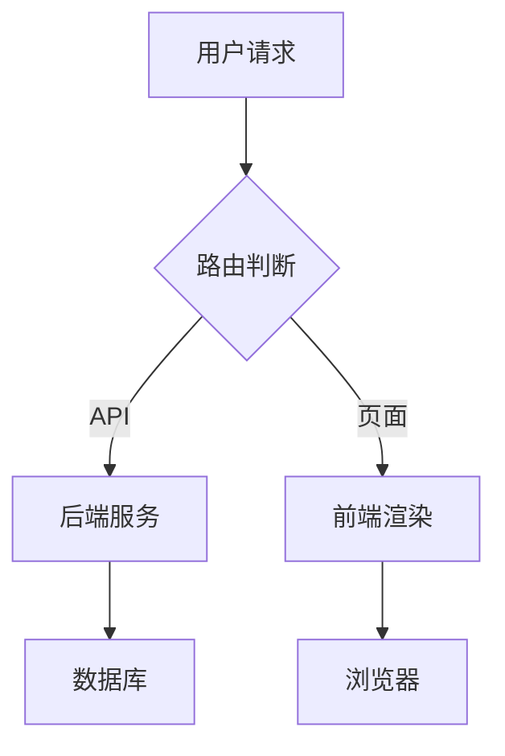

# 组件测试页

## Mermaid 图表



## 代码块

```java
@RestController
@RequestMapping("/api/chat")
public class ChatController {
    @PostMapping
    public Flux<String> chat(@RequestBody ChatRequest request) {
        return chatService.stream(request.message());
    }
}
```

## Callout

<Callout type="info">这是一个信息提示框。</Callout>

<Callout type="warn">这是一个警告提示框。</Callout>

## Tabs

<Tabs items={['Java', 'TypeScript']}>
  <Tab value="Java">

```java
System.out.println("Hello AAF");
```

  </Tab>
  <Tab value="TypeScript">

```ts
console.log('Hello AAF');
```

  </Tab>
</Tabs>

## Steps

<Steps>
  <Step>安装依赖</Step>
  <Step>配置数据库连接</Step>
  <Step>启动服务</Step>
</Steps>
