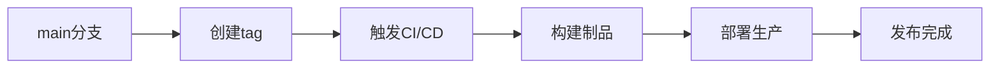
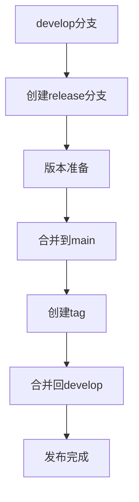
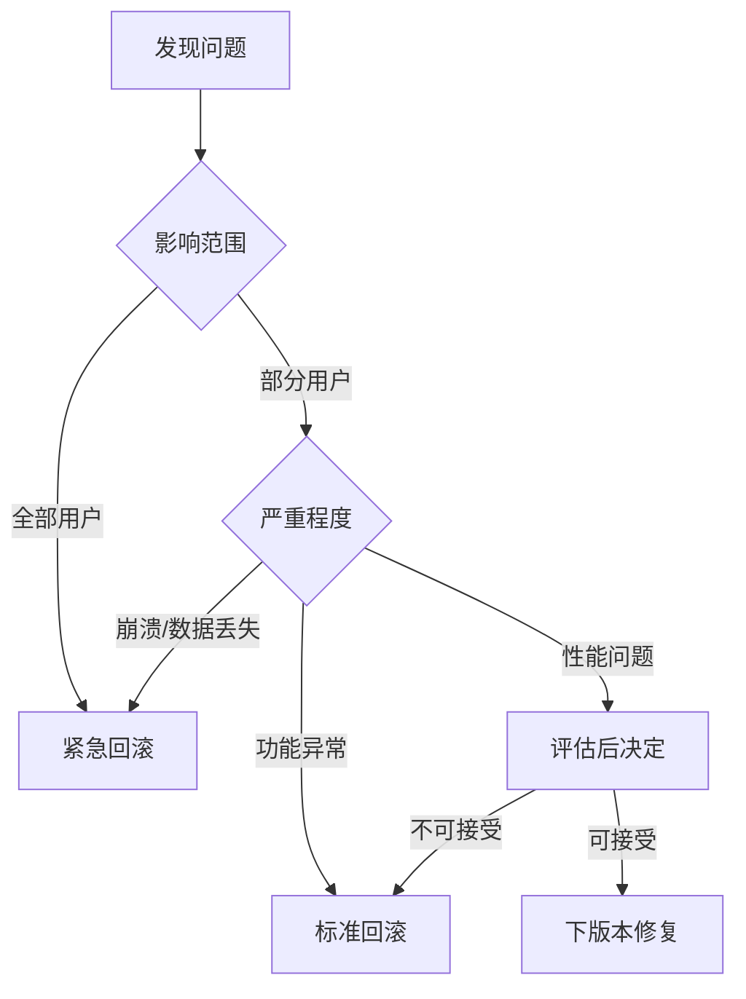

# 版本发布

参考 [SemVer 2.0.0](https://semver.org/lang/zh-CN/)，保留项目所需的核心规则。
本章定义版本管理和发布流程，包括版本号规范、发布流程、回滚策略等。

## 语义化版本

### 版本号格式

遵循语义化版本规范（Semantic Versioning）：

```text
MAJOR.MINOR.PATCH[-PRERELEASE]
```

- **MAJOR**: 主版本号，破坏性变更
- **MINOR**: 次版本号，新功能（向后兼容）
- **PATCH**: 修订号，问题修复（向后兼容）
- **PRERELEASE**: 预发布版本

## 递增规则

- 主版本号为零（`0.y.z`）处于初始开发阶段，API 不视为稳定
- `1.0.0` 用于界定公共 API 的形成，此后版本号更新基于 API 变更
- 已发行版本的内容禁止改变，任何修改必须以新版本发行
- 先行版本号可标注在修订号之后，用连接号分隔（如 `1.0.0-alpha`、`1.0.0-rc.1`），表示非稳定版本


| 变更类型           | 递增              | 说明                         |
| ------------------ | ----------------- | ---------------------------- |
| 不兼容的 API 修改  | **MAJOR**（主版本号） | MINOR 和 PATCH 归零                  |
| 向下兼容的新功能   | **MINOR**（次版本号） | PATCH 归零；API 标记弃用时也递增 |
| 向下兼容的问题修正 | **PATCH**（修订号）   | 仅内部修正，不影响 API       |

### 版本号示例

```yaml
# 正式版本
1.0.0   # 首个稳定版本
1.1.0   # 添加新功能
1.1.1   # 修复问题
2.0.0   # 破坏性变更

# 预发布版本
1.0.0-beta    # 公测版本
1.0.0-rc.1    # 候选版本

```

### 版本升级规则

基于提交类型自动确定版本升级：

| 提交类型 | 版本升级 | 示例 |
|---------|---------|------|
| fix | Patch | 1.0.0 → 1.0.1 |
| feat | Minor | 1.0.1 → 1.1.0 |
| feat! / BREAKING CHANGE | Major | 1.1.0 → 2.0.0 |
| docs, style, refactor, test, chore | 不升级 | 1.0.0 → 1.0.0 |
| perf | Patch | 1.0.0 → 1.0.1 |

## 发布流程

### GitHub Flow 发布

适用于持续部署的应用：



**发布步骤**：

```bash
# 1. 确保 main 分支最新
git checkout main
git pull origin main

# 2. 创建标签
git tag -a v1.2.0 -m "Release version 1.2.0"

# 3. 推送标签
git push origin v1.2.0

# 4. CI/CD 自动部署
```

### Git Flow 发布

适用于需要版本管理的库：



**发布步骤**：

```bash
# 1. 创建 release 分支
git checkout -b release/1.2.0 develop

# 2. 版本准备
# - 更新版本号
# - 更新 CHANGELOG
# - 最终测试

# 3. 完成 release
git checkout main
git merge --no-ff release/1.2.0
git tag -a v1.2.0 -m "Release version 1.2.0"

# 4. 合并回 develop
git checkout develop
git merge --no-ff release/1.2.0

# 5. 删除 release 分支
git branch -d release/1.2.0

# 6. 推送
git push origin main develop --tags
```

## 发布清单

### 发布前检查

```markdown
## 发布前检查清单
- [ ] 所有测试通过
- [ ] 代码审查完成
- [ ] 文档已更新
- [ ] CHANGELOG 已更新
- [ ] 版本号已更新
- [ ] 依赖已更新
- [ ] 安全扫描通过
- [ ] 性能测试通过
- [ ] 兼容性测试通过
- [ ] 发布说明已准备
```

### CHANGELOG 维护

`CHANGELOG.md` 格式：

```markdown
# Changelog

本文件记录项目所有重要变更。

格式基于 [Keep a Changelog](https://keepachangelog.com/en/1.0.0/)，版本号遵循 [语义化版本](https://semver.org/spec/v2.0.0.html)。

## [Unreleased]

## [1.2.0] - 2024-01-15

### Added
- New OAuth2 authentication support
- User profile management API

### Changed
- Improved error handling in API responses
- Updated dependencies to latest versions

### Fixed
- Fixed memory leak in data processor
- Resolved login timeout issue

### Security
- Patched XSS vulnerability in user input

## [1.1.0] - 2024-01-01

### Added
- Email notification system
- Dark mode support

### Deprecated
- Legacy authentication API (will be removed in 2.0.0)

### Removed
- Support for Node.js 12
```

### 自动生成 CHANGELOG

使用 conventional-changelog：

```bash
# 安装工具
npm install -D conventional-changelog-cli

# 生成 CHANGELOG
npx conventional-changelog -p angular -i CHANGELOG.md -s

# 配置 package.json
{
  "scripts": {
    "version": "conventional-changelog -p angular -i CHANGELOG.md -s && git add CHANGELOG.md"
  }
}
```

## 标签管理

### 标签命名规范

```bash
# 生产版本
v1.0.0
v2.1.3

# 预发布版本
v1.0.0-beta.1
v1.0.0-rc.1

# 不推荐的命名
1.0.0          # 缺少 v 前缀
version-1.0.0  # 格式不标准
release-1.0.0  # 应该用 tag 而不是分支名
```

### 标签创建

```bash
# 创建带注释的标签（推荐）
git tag -a v1.2.0 -m "Release version 1.2.0

Features:
- Add OAuth2 authentication
- Implement user profile API

Fixes:
- Fix memory leak
- Resolve timeout issues"

# 签名标签（需要 GPG 密钥）
git tag -s v1.2.0 -m "Release version 1.2.0"

# 查看标签信息
git show v1.2.0
```

### 标签推送

```bash
# 推送单个标签
git push origin v1.2.0

# 推送所有标签
git push origin --tags

# 删除远程标签（慎用）
git push origin --delete v1.2.0
```

## 版本维护策略

### 长期支持版本（LTS）

根据项目决定维护策略：

```yaml
maintenance_policy:
  current:
    version: 3.x
    support: active
    security: yes
    features: yes
    
  lts:
    version: 2.x
    support: maintenance
    security: yes
    features: no
    
  deprecated:
    version: 1.x
    support: security-only
    security: critical-only
    features: no
    
  eol:
    version: 0.x
    support: none
    security: no
    features: no
```

### 补丁策略

```bash
# 当前版本补丁
git checkout main
git cherry-pick <commit-hash>
git tag v3.1.1

# LTS 版本补丁
git checkout v2-lts
git cherry-pick <commit-hash>
git tag v2.5.8

# 安全补丁
git checkout security/v1.x
git cherry-pick <security-fix>
git tag v1.9.15
```

## 回滚策略

### 快速回滚

生产问题的分级处理：

```bash
# 级别 1：紧急回滚（跳过审查）
# 立即回滚到上一个稳定版本
git revert <problem-commit>
git push origin main

# 级别 2：标准回滚（需要审查）
# 创建回滚 PR
git checkout -b revert/problem-fix
git revert <problem-commit>
git push origin revert/problem-fix
# 创建 PR 并快速审查

# 级别 3：通过部署回滚
# 不改代码，重新部署之前的版本
kubectl rollout undo deployment/app
```

### 回滚决策树



### 回滚后处理

```markdown
## 回滚后必需步骤
1. **通知**
   - [ ] 通知团队回滚完成
   - [ ] 更新状态页面
   - [ ] 通知受影响用户

2. **分析**
   - [ ] 根因分析（RCA）
   - [ ] 编写事故报告
   - [ ] 制定改进措施

3. **修复**
   - [ ] 创建修复分支
   - [ ] 添加测试用例
   - [ ] 充分测试后重新发布

4. **复盘**
   - [ ] 团队复盘会议
   - [ ] 更新发布流程
   - [ ] 更新监控告警
```

## 自动化发布

### GitHub Release

`.github/workflows/release.yml`：

```yaml
name: Release

on:
  push:
    tags:
      - 'v*'

jobs:
  release:
    runs-on: ubuntu-latest
    steps:
      - uses: actions/checkout@v3
      
      - name: Build
        run: |
          npm ci
          npm run build
      
      - name: Create Release
        uses: actions/create-release@v1
        env:
          GITHUB_TOKEN: ${{ secrets.GITHUB_TOKEN }}
        with:
          tag_name: ${{ github.ref }}
          release_name: Release ${{ github.ref }}
          body: |
            Changes in this Release
            - Feature 1
            - Fix 1
          draft: false
          prerelease: false
      
      - name: Upload Assets
        uses: actions/upload-release-asset@v1
        with:
          upload_url: ${{ steps.create_release.outputs.upload_url }}
          asset_path: ./dist/app.zip
          asset_name: app.zip
          asset_content_type: application/zip
```

### Semantic Release

配置自动化版本管理：

```json
// package.json
{
  "scripts": {
    "semantic-release": "semantic-release"
  },
  "release": {
    "branches": ["main"],
    "plugins": [
      "@semantic-release/commit-analyzer",
      "@semantic-release/release-notes-generator",
      "@semantic-release/changelog",
      "@semantic-release/npm",
      "@semantic-release/github",
      "@semantic-release/git"
    ]
  }
}
```

`.releaserc.js`：

```javascript
module.exports = {
  branches: ['main'],
  plugins: [
    ['@semantic-release/commit-analyzer', {
      preset: 'angular',
      releaseRules: [
        {type: 'feat', release: 'minor'},
        {type: 'fix', release: 'patch'},
        {type: 'perf', release: 'patch'},
        {breaking: true, release: 'major'}
      ]
    }],
    '@semantic-release/release-notes-generator',
    ['@semantic-release/changelog', {
      changelogFile: 'CHANGELOG.md'
    }],
    ['@semantic-release/git', {
      assets: ['CHANGELOG.md', 'package.json'],
      message: 'chore(release): ${nextRelease.version} [skip ci]\n\n${nextRelease.notes}'
    }],
    '@semantic-release/github'
  ]
};
```

## 发布通知

### 发布说明模板

```markdown
# Release v1.2.0

## 🎉 亮点
- 支持 OAuth2 认证
- 性能提升 30%
- 全新用户仪表盘

## ✨ 新功能
- **认证**：支持 Google 和 GitHub OAuth2 登录
- **仪表盘**：实时数据分析看板
- **API**：新增用户管理 REST 接口

## 🐛 问题修复
- 修复数据处理器内存泄漏 (#123)
- 解决登录超时问题 (#456)
- 修正时区处理错误 (#789)

## 💔 破坏性变更
- 移除对 Node.js 12 的支持
- API 路径 `/users` 重命名为 `/api/users`
- 认证 Token 格式变更

## 📦 依赖更新
- React 升级至 v18.2.0
- Express 升级至 v4.18.0
- 各依赖包安全更新

## 📝 迁移指南
从 v1.x 升级到 v2.0：
1. 升级 Node.js 至 16 或以上版本
2. 更新 API 路径调用
3. 重新生成认证 Token

完整迁移指南：[链接]

## 🙏 贡献者
感谢所有为本次发布做出贡献的开发者！

## 📊 统计
- 42 次提交
- 15 个文件变更
- 5 位贡献者
```

## 版本命名传统

### 代号命名（可选）

为主要版本使用代号：

```yaml
versions:
  v1.0.0: "创世"
  v2.0.0: "凤凰"
  v3.0.0: "量子"
```

## 最佳实践

### DO ✅

- 遵循语义化版本规范
- 维护详细的 CHANGELOG
- 创建带注释的标签
- 测试发布流程
- 准备回滚方案

### DON'T ❌

- 不要跳过版本号
- 避免频繁的破坏性变更
- 不要删除已发布的版本
- 避免手动修改版本号
- 不要忽视预发布测试

## 下一步

掌握版本发布后，请参考：

- [工具配置](./tool-guide.md) - 配置自动化发布工具
- [分支管理](./branch-manage-standard.md) - 了解发布分支策略
